# Azure portal を使用して Data Box を管理する (プレビュー)

この記事のチュートリアルは、プレビュー段階の Microsoft Azure Data Box Disk について記載しています。 この記事では、Data Box Disk で実行できる一部の複雑なワークフローと管理タスクについて説明します。 

Data Box Disk の管理は、Azure portal から行うことができます。 この記事では、Azure portal を使用して実行できるタスクについて説明します。 Azure portal を使用して、注文を管理したり、ディスクを管理したり、最終ステージまで注文の状態を追跡したりします。

> [!IMPORTANT]
> Data Box Disk はプレビュー段階にあります。 このソリューションを展開する前に、[プレビューに関する Azure のサービス利用規約](https://azure.microsoft.com/support/legal/preview-supplemental-terms/)を確認してください。

## 注文のキャンセル

発注後、さまざまな理由から注文をキャンセルしなければならないことがあります。 キャンセルできるのは、ディスクの準備が開始される前の注文だけです。 ディスクが準備されて注文が処理された後は、注文をキャンセルできません。 

注文をキャンセルするには、次の手順を実行します。

1.  **[概要] > [キャンセル]** に移動します。 

    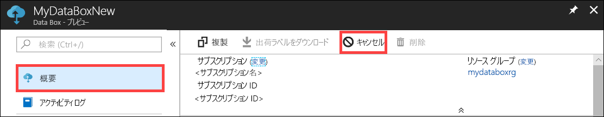

2.  注文のキャンセル理由を入力します。  

    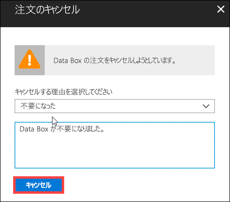

3.  注文のキャンセル後、ポータルで注文の状態が更新され、**取り消し済み**として表示されます。

    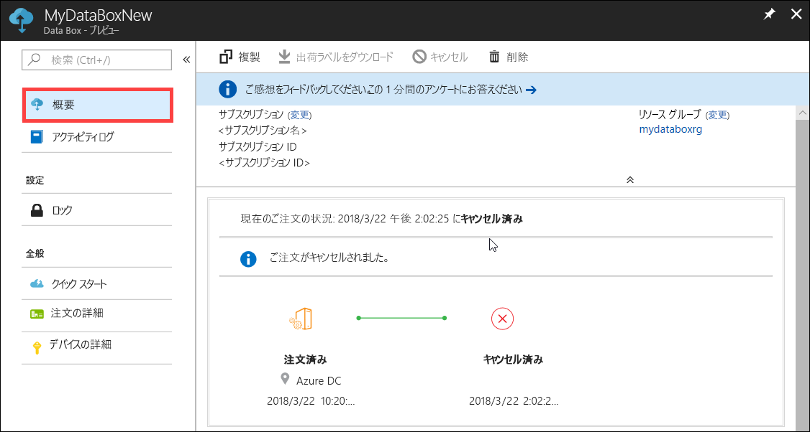

注文がキャンセルされたときにメール通知は送信されません。

## 注文の複製

特定の状況では複製機能が役立ちます。 たとえば、ユーザーが Data Box Disk を使って何らかのデータを転送済みだとします。 その後、生成されるデータが増えていくと、それを Azure に転送するために、さらに多くのディスクが必要になります。 このようなケースでは、同じ注文をそのまま複製することができます。

注文を複製するには、次の手順を実行します。

1.  **[概要] > [複製]** に移動します。 

    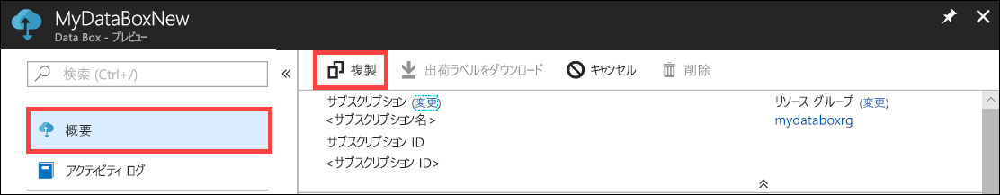

2.  注文の詳細はすべてそのままの状態で維持されます。 複製された注文は、元の名前の最後に "*-Clone*" を追加した名前になります。 プライバシー情報を確認済みであることへの同意として、チェック ボックスをオンにします。 **Create** をクリックしてください。    

複製は数分で作成され、ポータルに新しい注文が反映されます。

[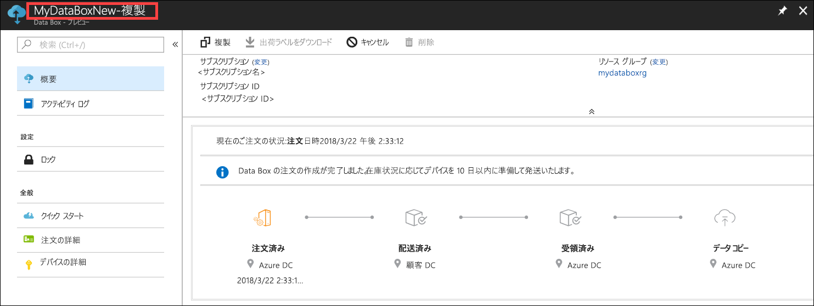](media/data-box-portal-ui-admin/clone-order3.png#lightbox) 

## 注文の削除

注文が完了した時点で、その注文を削除したい場合があります。 注文には、お客様の名前、住所、連絡先情報など、個人情報が含まれています。 この個人情報は、注文が削除されると削除されます。

削除できるのは、完了済みまたはキャンセル済みの注文だけです。 注文を削除するには次の手順を実行します。

1. **[すべてのリソース]** に移動します。 目的の注文を検索します。

    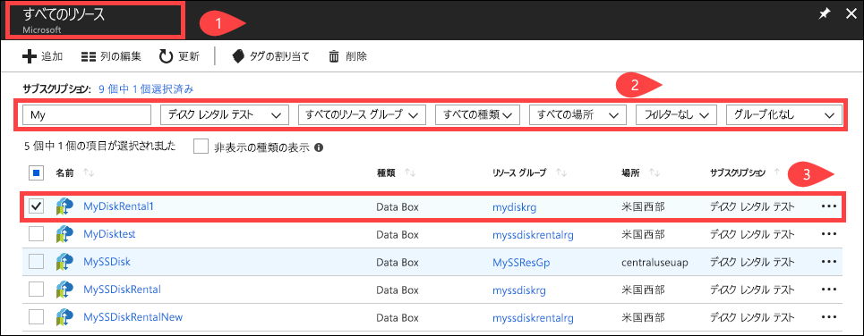

2. 削除する注文をクリックし、**[概要]** に移動します。 コマンド バーの **[削除]** をクリックします。

    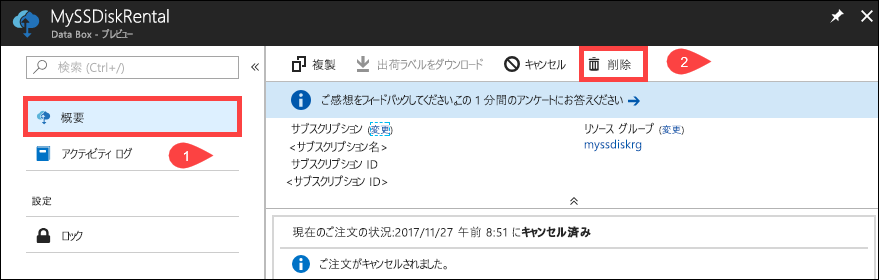

3. 注文の削除を確認するメッセージが表示されたら注文の名前を入力します。 **[削除]** をクリックします。

     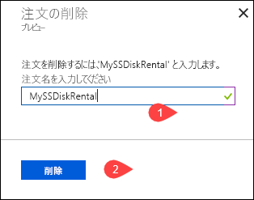

## 配送先住所ラベルのダウンロード

ディスクに同梱されていた返送ラベルをどこかに置き忘れたり紛失したりした場合、配送先住所ラベルをダウンロードする必要があります。 

配送先住所ラベルをダウンロードするには、次の手順を実行します。
1.  **[概要] > [出荷ラベルをダウンロード]** に移動します。 このオプションは、ディスクの発送後にのみ選択できます。 

    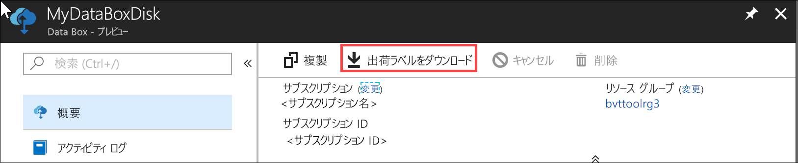

2.  次の返送ラベルがダウンロードされます。 このラベルを保存して印刷し、返送する荷物に貼り付けます。

    

## 配送先住所の編集

発注後に配送先住所の編集が必要になることも考えられます。 編集できるのは、ディスクが発送されるまでとなります。 ディスクの発送後は、このオプションは使用できなくなります。

注文を編集するには、次の手順を実行します。

1. **[注文の詳細] > [配送先住所の編集]** に移動します。

    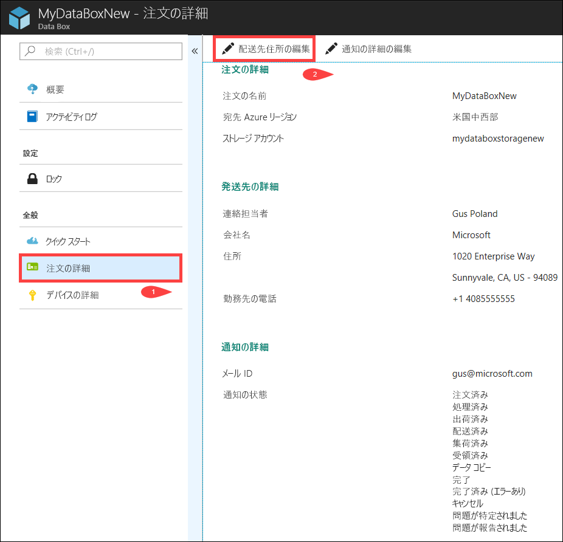

2. 配送先住所を編集し、変更を保存できるようになります。

    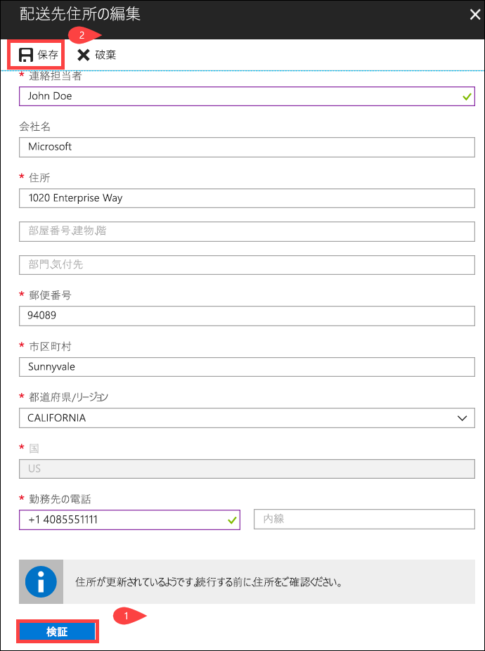

## 通知の詳細の編集

注文の状態を知らせるメールの宛先となるユーザーを変更しなければならないことがあります。 たとえばディスクが発送または集荷されたときに、あるユーザーに連絡する必要があるとしましょう。 一方、データのコピーが完了したときの連絡先は、別のユーザーにする必要があります。Azure Storage アカウントにデータが存在することを別のユーザーが確認したうえで、コピー元からデータを削除するためです。 このような場合は、通知の詳細を編集することができます。

通知の詳細を編集するには、次の手順を実行します。

1. **[注文の詳細] > [通知の詳細の編集]** に移動します。

    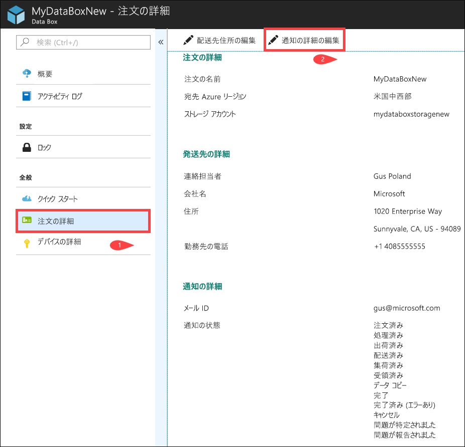

2. これで通知の詳細を編集し、変更を保存できるようになります。
 
    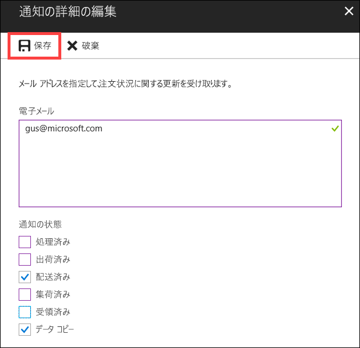

## 注文の状態の確認

|注文の状態 |説明 |
|---------|---------|
|注文済み     | 正常に発注されました。   ディスクが使用できない場合は通知されます。  ディスクが使用可能な場合、Microsoft は出荷用のディスクを特定し、ディスク パッケージを準備します。        |
|処理済み     | 注文処理は完了しています。   注文処理中は、次の処理が実行されます。<li>BitLocker の AES-128 方式でディスクが暗号化されます。 </li> <li>許可なくアクセスできないよう Data Box Disk がロックされます。</li><li>このプロセス中に、ディスクのロックを解除するパスキーが生成されます。</li>        |
|出荷しました     | 注文は発送済みです。 注文は 1 日から 2 日で到着します。        |
|配信済み     | 注文は、指定された住所に配達済みです。        |
|集荷されました     |返送する荷物が集荷されました。   その荷物が Azure データセンターに到着すると、データが Azure に自動的にアップロードされます。         |
|受取済み     | ディスクは Azure データセンターにて受け取り済みです。 間もなくデータのコピーが開始されます。        |
|データがコピーされました     |データのコピーが進行中です。  データのコピーが完了するまでお待ちください。         |
|完了       |注文が正常に完了しました。  オンプレミスのデータをサーバーから削除する前に、データが Azure に存在することを確認してください。         |
|完了 (エラーあり)| データのコピーは完了しましたが、エラーが発生しました。   **[概要]** に示されているパスを使用してコピー ログを確認してください。 詳細については、「[Download diagnostic logs (診断ログのダウンロード)](data-box-disk-troubleshoot.md#download-diagnostic-logs)」を参照してください。   |
|Canceled            |注文はキャンセルされました。   お客様によって注文がキャンセルされたか、またはエラーが発生したために、サービスによって注文がキャンセルされました。     |

## 次の手順

- [Data Box Disk の問題のトラブルシューティング](data-box-disk-troubleshoot.md)に関するページを参照してください。
