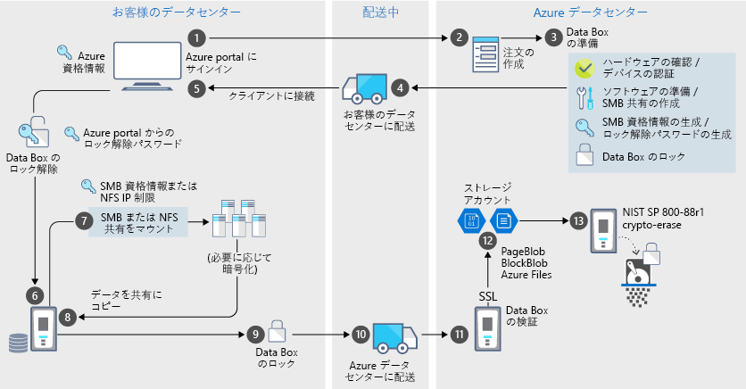

# Azure Data Box のセキュリティとデータ保護

Data Box は、承認済みのエンティティ以外データの閲覧、変更、削除ができないよう徹底することによって、データ保護のための安全なソリューションを実現しています。 この記事では、Azure Data Box のセキュリティに注目し、Azure Data Box ソリューションの各コンポーネントとそこに格納されるデータを保護する働きを持った機能について説明します。 

[!INCLUDE [GDPR-related guidance](../../includes/gdpr-intro-sentence.md)]

## 各コンポーネントを通るデータのフロー

Microsoft Azure Data Box ソリューションは、互いに連携し合う 4 つのメイン コンポーネントで構成されています。

- **Azure でホストされる Azure Data Box サービス** - デバイスを発注して構成し、その注文を最後まで追跡するための管理サービス。
- **Data Box デバイス** - オンプレミスのデータを Azure にインポートするためにお客様に発送される転送デバイス。 
- **デバイスに接続されるクライアント/ホスト** – お客様のインフラストラクチャにおいて保護の対象となるデータを格納しているクライアント。Data Box デバイスに接続されます。
- **クラウド ストレージ** – Azure クラウド内のデータの保存先となる場所。 通常は、お客様が作成した Azure Data Box リソースにリンクされたストレージ アカウントです。

次の図は、Azure Data Box ソリューションを通じてオンプレミスから Azure に向かうデータのフローを示します。

データがこのソリューションを通過すると、イベントがログに記録され、ログが生成されます。 詳細については、[Azure Data Box の追跡とイベントのログ記録](data-box-logs.md)に関する記事を参照してください。

## セキュリティ機能

Data Box は、承認済みのエンティティ以外データの閲覧、変更、削除ができないよう徹底することによって、データ保護のための安全なソリューションを実現しています。 このソリューションのセキュリティ機能は、ディスクおよび関連するサービスを対象としたものであり、そこに格納されるデータのセキュリティを確保するものです。 

### Data Box デバイスの保護

Data Box デバイスは、次の機能によって保護されます。

- 衝撃や、劣悪な輸送および環境条件に耐える頑丈なデバイス梱包。 
- 輸送中のデバイス不正開封を示す不正開封証拠シール。
- ハードウェアおよびソフトウェアの不正開封を検出し、デバイスに対するそれ以上の操作を防ぎます。
- Data Box 固有のソフトウェアのみを実行します。
- ロック状態で起動します。
- デバイスのロック解除パスワードによってデバイスへのアクセスを制御します。
- デバイスとの間でデータをコピーするためのアクセス資格情報。 Azure portal の **[デバイスの資格情報]** ページへのすべてのアクセスは[アクティビティ ログ](data-box-logs.md#query-activity-logs-during-setup)に記録されます。

### Data Box のデータ保護

Data Box に対する入出力データは、次の機能によって保護されます。

- 保存データの AES 256 ビット暗号化。
- 輸送中データのための暗号化プロトコルを使用できます。
- Azure へのアップロードが完了したデータは、デバイスから確実に消去されます。 データ消去は、[NIST 800-88r1 標準の ATA ハード ディスク ドライブに関する付録 A](https://nvlpubs.nist.gov/nistpubs/SpecialPublications/NIST.SP.800-88r1.pdf) のガイドラインに従っています。 データ消去イベントは[注文履歴](data-box-logs.md#download-order-history)に記録されます。

### Data Box サービスの保護

Data Box サービスは、次の機能によって保護されます。

- Data Box サービスにアクセスするには、Data Box を含む Azure サブスクリプションを会社が保有している必要があります。 Azure ポータルから利用できる機能は、保有するサブスクリプションによって決まります。
- Data Box サービスは Azure でホストされるため、Azure のセキュリティ機能によって保護されます。 Microsoft Azure のセキュリティ機能の詳細については、「 [Microsoft Azure セキュリティ センター](https://www.microsoft.com/TrustCenter/Security/default.aspx)」をご覧ください。
- Data Box の注文へのアクセスは、ロールベースのアクセス制御 (RBAC) ロールを使用して制御できます。 詳細については、[Data Box の注文のアクセス制御の設定](data-box-logs.md#set-up-access-control-on-the-order)に関する記事を参照してください
- Data Box サービスでは、サービスでデバイスのロックを解除するために使用されるロック解除パスワードを保存します。
- Data Box サービスは、その注文の詳細と状態を格納します。 この情報は、注文が削除されると削除されます。

## 個人データの管理

Azure Data Box は、同サービスにおける次の主要なインスタンスに個人情報を収集して表示します。

- **通知設定** - お客様は、発注の際、ユーザーのメール アドレスを通知設定で構成することになります。 この情報は管理者が閲覧できます。 この情報は、ジョブが最終状態に達するか、お客様が注文を削除すると、サービスによって削除されます。

- **注文の詳細** - 発注後、ユーザーの配送先住所、メール、連絡先情報が Azure portal に格納されます。 たとえば、次の情報が保存の対象となります。

  - 連絡先の名前
  - 電話番号
  - Email
  - 番地
  - City
  - 郵便番号
  - State
  - 国/地方/地域
  - 運送業者のアカウント番号
  - 配送追跡番号

    注文の詳細は、ジョブが完了するか、お客様が注文を削除すると、Data Box サービスによって削除されます。

- **配送先住所** - Data Box サービスは、注文を受けると、サード パーティの運送業者 (UPS、DHL など) に配送先住所を提供します。 

詳細については、[セキュリティ センター](https://www.microsoft.com/trustcenter)にある Microsoft のプライバシー ポリシーを確認してください。

## セキュリティ ガイドラインのリファレンス

Data Box では、次のセキュリティ ガイドラインが実装されています。 

|ガイドライン   |説明   |
|---------|---------|
|[IEC 60529 IP52](https://www.iec.ch/)    | 水やほこりからの保護のため         |
|[ISTA 2A](https://ista.org/docs/2Aoverview.pdf)     | 劣悪な輸送条件に対する耐久性のため          |
|[NIST SP 800-147](https://nvlpubs.nist.gov/nistpubs/Legacy/SP/nistspecialpublication800-147.pdf)      | 安全なファームウェア更新のため         |
|[FIPS 140-2 Level 2](https://csrc.nist.gov/csrc/media/publications/fips/140/2/final/documents/fips1402.pdf)      | データ保護のため         |
|[NIST SP 800-88r1](https://nvlpubs.nist.gov/nistpubs/SpecialPublications/NIST.SP.800-88r1.pdf) の ATA ハード ディスク ドライブに関する付録 A      | データのサニタイズのため         |

## 次のステップ

- [Data Box の要件](data-box-system-requirements.md)を確認する。
- [Data Box の制限事項](data-box-limits.md)を理解する。
- Azure portal で [Azure Data Box](data-box-quickstart-portal.md) をすばやく展開する。
