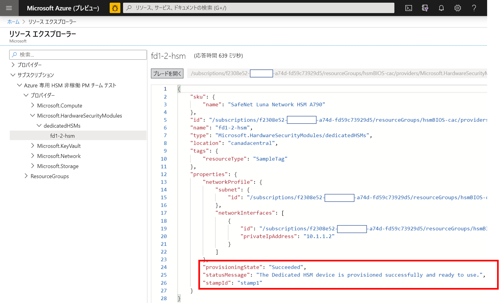
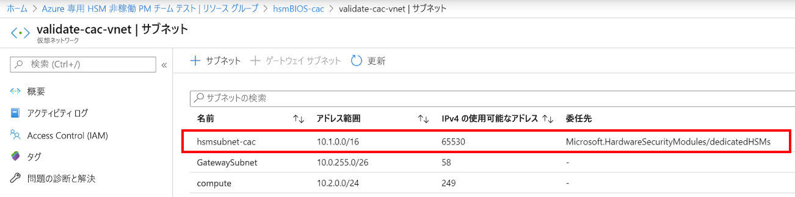
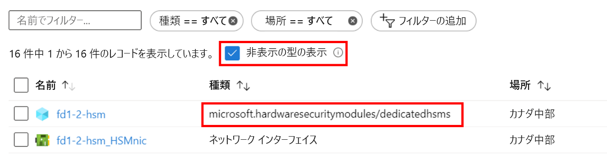

# <a name="troubleshooting"></a>トラブルシューティング

Azure Dedicated HSM サービスには、明確に区別される 2 つの側面があります。 1 つは、HSM デバイスとその基になるネットワーク コンポーネントの Azure への登録とデプロイです。 もう 1 つは、特定のワークロードやアプリケーションでの使用またはそれらとの統合に備えた HSM デバイスの構成です。 Azure で使用される Thales Luna Network の HSM デバイスは、Thales から直接購入できる製品と同じですが、Azure ではリソースという位置付けになるため、独自の考慮事項がいくつか発生します。 ここでは、重要な情報への注目度を高め、周知徹底するために、それらの考慮事項とそれに伴うトラブルシューティングのための分析情報やベスト プラクティスについて取り上げています。 サービスの使用開始後は、Microsoft へのサポート リクエストか Thales への直接の問い合わせを通じて、信頼性の高い情報を入手できます。 

> [!NOTE]
> 新たにデプロイした HSM デバイスに対してなんらかの構成を行う際は、あらかじめ適切なパッチを使用して更新しておくようにしてください。 具体的に必要なパッチは、Thales サポート ポータルにある [KB0019789](https://supportportal.gemalto.com/csm?id=kb_article_view&sys_kb_id=19a81c8bdb9a1fc8d298728dae96197d&sysparm_article=KB0019789) で、再起動時に発生する異常停止の問題が解決されます。

## <a name="hsm-registration"></a>HSM の登録

Dedicated HSM は無償提供されません。ハードウェア リソースをクラウドで提供するものである以上、保護を必要とする貴重なリソースであるためです。 そのため Microsoft では、メール (HSMrequest@microsoft.com) を用いたホワイトリスト登録プロセスを採用しています。 

### <a name="getting-access-to-dedicated-hsm"></a>Dedicated HSM へのアクセス

Dedicated HSM がキー ストレージ要件を満たしていると確信したら、アクセスを要求するメールを HSMrequest@microsoft.com 宛てに送信してください。 お使いのアプリケーション、HSM を希望するリージョン、必要な HSM のボリュームの概要を記述してください。 Microsoft 担当者 (アカウント エグゼクティブ、クラウド ソリューション アーキテクトなど) がいる場合は、それらの担当者もリクエストに含めてください。

## <a name="hsm-provisioning"></a>HSM のプロビジョニング

Azure への HSM デバイスのプロビジョニングは、CLI または PowerShell を使用して行うことができます。 サービスに登録すると、サンプル ARM テンプレートが支給され、初回カスタマイズについてはサポートが提供されます。 

### <a name="hsm-deployment-failure-information"></a>HSM デプロイ エラー情報

Dedicated HSM ではデプロイ用に CLI と PowerShell がサポートされているため、ポータル ベースのエラー情報は限られており、あまり詳しくありません。 リソース エクスプローラーを使用すると、より詳しい情報を確認できます。 ポータルのホーム ページには、このためのアイコンが用意されていて、より詳しいエラー情報を入手できます。 デプロイの問題に関連したサポート リクエストを作成する際は、この情報を貼り付けると非常に役立ちます。



### <a name="hsm-subnet-delegation"></a>HSM サブネットの委任
デプロイ エラーの最大の原因は、HSM のプロビジョニング先としてお客様が定義したサブネットに適切な委任を設定し忘れていることです。 この委任設定は、デプロイの対象となる VNet とサブネットの前提条件に含まれており、各種チュートリアルでも詳しく取り上げられています。



### <a name="hsm-deployment-race-condition"></a>HSM デプロイの競合状態

デプロイ用に支給される標準の ARM テンプレートには、HSM と ExpressRoute ゲートウェイに関連したリソースが含まれています。 ネットワーク リソースは HSM を正しくデプロイするための依存関係であり、タイミングがきわめて重要になる場合があります。  場合によっては、依存関係の問題に関連したデプロイ エラーが発生することもありますが、デプロイを再実行することで問題が解決することがよくあります。 そうでない場合でも、リソースを削除してから再デプロイすると、ほとんどの場合は成功します。 これを試しても問題が解決しない場合は、Azure portal からサポート リクエストを上げてください。その際、問題の種類には "Issues configuring the Azure setup (Azure セットアップの構成の問題)" を選択します。

### <a name="hsm-deployment-using-terraform"></a>Terraform を使用した HSM のデプロイ

オートメーション環境として、一部のお客様は、このサービスへの登録時に支給される ARM テンプレートではなく Terraform を使用してきました。 この方法で HSM はデプロイできませんが、依存ネットワーク リソースをデプロイすることはできます。 Terraform には、HSM のデプロイだけを担う最小限の ARM テンプレートを呼び出すためのモジュールがあります。  この場合、HSM をデプロイする前に、ネットワーク リソース (必要な ExpressRoute ゲートウェイなど) が完全にデプロイされるよう注意を払う必要があります。 デプロイが完了し、必要に応じて統合されているかどうかは、次の CLI コマンドを使用してテストできます。 山かっこのプレースホルダーは、実際の名前に置き換えてください。 "provisioningState が成功した" という結果を確認します。

```azurecli
az resource show --ids /subscriptions/<subid>/resourceGroups/<myresourcegroup>/providers/Microsoft.Network/virtualNetworkGateways/<myergateway>
```

### <a name="deployment-failure-based-on-quota"></a>クォータに起因するデプロイ エラー
HSM がスタンプあたり 2 つ、またリージョンあたり 4 つを超えた場合、デプロイに失敗する可能性があります。 この状況を避けるには、以前に失敗したデプロイのリソースを削除してから、再度デプロイするようにしてください。 リソースの確認については、以下の HSM の表示方法に関する項目を参照してください。 このクォータは本来予防措置として存在するものですが、どうしても超えてしまう場合は、詳細を記載したメールを HSMrequest@microsoft.com 宛てにお送りください。

### <a name="deployment-failure-based-on-capacity"></a>容量に起因するデプロイ エラー
特定のスタンプまたはリージョンがいっぱいになると (つまり、空いている HSM がほぼすべてプロビジョニングされると)、デプロイに失敗する可能性があります。 お客様が利用できる HSM は各スタンプにつき 11 個、つまりリージョンあたり 22 個となります。 また、各スタンプには、スペアが 3 つ、テスト デバイスが 1 つ存在します。 上限に達したと思われる場合、個別のスタンプの容量については、HSMrequest@microsoft.com にメールでお問い合わせください。

###  <a name="how-do-i-see-hsms-when-provisioned"></a>プロビジョニング時に HSM を表示する方法
Dedicated HSM はホワイトリストに登録されたサービスであるため、Azure portal では "非表示の型" と見なされます。 HSM リソースを表示するには、下に示すように [非表示の型の表示] チェック ボックスをオンにする必要があります。 HSM の後ろには常に NIC リソースが表示されるため、SSH を使用して HSM に接続する際は、あらかじめここで IP アドレスを調べることができます。



## <a name="networking-resources"></a>ネットワーク リソース

Dedicated HSM のデプロイには、ネットワーク リソースへの依存関係と、それに伴って注意すべきいくつかの制限事項があります。

### <a name="provisioning-expressroute"></a>ExpressRoute のプロビジョニング

Dedicated HSM では、ユーザーのプライベート IP アドレス空間と Azure データセンターにある物理 HSM の間の通信のための "トンネル" として ExpressRoute ゲートウェイが使用されます。  VNet ごとにゲートウェイは 1 つという制限があるため、ExpressRoute 経由でオンプレミス リソースへの接続を必要とするお客様は、その接続には別の VNet を使用する必要があります。  

### <a name="hsm-private-ip-address"></a>HSM のプライベート IP アドレス

Dedicated HSM 用に支給されるサンプル テンプレートでは、HSM の IP が特定のサブネット範囲から自動的に取得されることを想定しています。 HSM の IP アドレスを明示的に指定する場合は、ARM テンプレートの "NetworkInterfaces" 属性を使用してください。 


## <a name="hsm-initialization"></a>HSM の初期化

新たに使用する HSM または再利用する既存の HSM の準備は、初期化によって行います。 オブジェクトの生成または保存、クライアントへの接続許可、暗号化操作の実行を行う前に、HSM の初期化を完了しておく必要があります。

### <a name="lost-credentials"></a>資格情報の紛失

シェルの管理者パスワードを紛失すると、HSM キー マテリアルが失われます。 HSM をリセットするには、サポート リクエストを作成する必要があります。
HSM を初期化する際に、資格情報を安全に保管してください。 シェルと HSM の資格情報は、自社のポリシーに従って保管する必要があります。

### <a name="failed-logins"></a>ログインの失敗

HSM に間違った資格情報を入力すると、破壊的な結果を招くことがあります。 HSM のロールに対する既定の動作は以下のとおりです。

| Role | しきい値 (試行回数) | 何度もログインに失敗した場合の結果 | Recovery |
|--|--|--|--|
| HSM SO | 3 |  HSM はゼロで埋められます (すべての HSM オブジェクト ID およびすべてのパーティションが失われます)。  |  HSM を再初期化する必要があります。 内容はバックアップから復元できます。 | 
| Partition SO | 10 |  パーティションはゼロで埋められます。 |  パーティションを再初期化する必要があります。 内容はバックアップから復元できます。 |  
| Audit | 10 | ロックアウト | 10 分後に自動的にロック解除されます。 |  
| Crypto Officer | 10 (低減可能) | [HSM policy 15: Enable SO reset of partition PIN]\(HSM ポリシー 15: パーティション PIN の SO リセットを有効にする\) が 1 (有効) に設定された場合、CO および CU ロールがロックアウトされます。<br>[HSM policy 15: Enable SO reset of partition PIN]\(HSM ポリシー 15: パーティション PIN の SO リセットを有効にする\) が 0 (無効) に設定された場合、CO および CU ロールが恒久的にロックアウトされ、パーティションの内容にはアクセスできなくなります。 これが既定の設定です。 | Partition SO が `role resetpw -name co` を使用して、CO ロールのロックを解除し、資格情報をリセットする必要があります。<br>パーティションを再初期化し、キー マテリアルをバックアップ デバイスから復元する必要があります。 |  

## <a name="hsm-configuration"></a>HSM の構成 

以下は、一般的な構成エラーや注意すべき結果を招く状況を箇条書きでまとめたものです。

### <a name="hsm-documentation-and-software"></a>HSM のドキュメントとソフトウェア
Thales SafeNet Luna 7 HSM デバイスのソフトウェアとドキュメントは、Microsoft からは入手できません。Thales から直接ダウンロードする必要があります。 その際、登録プロセス時に提供される Thales Customer ID を使用した登録が必要となります。 Microsoft から提供されるデバイスのソフトウェア バージョンは 7.2 で、ファームウェア バージョンは 7.0.3 です。 2020 年の初めに Thales が公開したドキュメントは、[こちら](https://thalesdocs.com/gphsm/luna/7.2/docs/network/Content/Home_network.htm)にあります。  

### <a name="hsm-networking-configuration"></a>HSM のネットワーク構成

HSM 内のネットワークを構成する際は注意が必要です。  HSM では、ExpressRoute ゲートウェイを介した、お客様のプライベート IP アドレス空間から HSM への直接接続が使用されます。  この通信チャネルはお客様の通信専用であり、Microsoft にはアクセス権がありません。 このネットワーク パスに影響が及ぶようなやり方で HSM を構成すると、その HSM との通信がすべて遮断されます。  この場合、Azure portal を通じて Microsoft にサポート リクエストを送信し、デバイスをリセットしてもらう以外に方法はありません。 このリセット手順では、HSM が初期状態に戻されるため、すべての構成とキー マテリアルが失われます。  構成をやり直して、デバイスを HA グループに参加させれば、キー マテリアルがレプリケートされます。  

### <a name="hsm-device-reboot"></a>HSM デバイスの再起動

一部の構成変更では、HSM の電源を入れ直すか、再起動する必要があります。 Microsoft が Azure で HSM をテストしたところ、まれに再起動が異常停止することが確認されました。 その場合、ハード リブートを要求するサポート リクエストを Azure portal からご送信いただく必要があります。この作業は Azure データセンターにて手動で実施されるため、完了までに最大 48 時間かかります。  この状況を避けるために、Thales から直接入手できる再起動のパッチを必ずデプロイしておいてください。 再起動が異常停止する問題に推奨されるパッチについては、Thales Luna Network HSM 7.2 ダウンロード ページの [KB0019789](https://supportportal.gemalto.com/csm?sys_kb_id=d66911e2db4ffbc0d298728dae9619b0&id=kb_article_view&sysparm_rank=1&sysparm_tsqueryId=d568c35bdb9a4850d6b31f3b4b96199e&sysparm_article=KB0019789) を参照してください (注: ダウンロードするには Thales サポート ポータルへの登録が必要です)。

### <a name="ntls-certificates-out-of-sync"></a>NTLS 証明書の非同期
証明書が有効期限切れになったり、構成の更新によって上書きされたりすると、クライアントでは HSM への接続が失われることがあります。 各 HSM に対して、証明書の交換のクライアント構成を再適用する必要があります。
無効な証明書に関する NTLS ログの例を次に示します。

> NTLS[8508]: info :0 :Incoming connection request... :192.168.50.2/59415 NTLS[8508]:Error message from SSLAccept is : error:14094418:SSL routines:ssl3_read_bytes:tlsv1 alert unknown ca NTLS[8508]:Error during SSL accept ( RC_SSL_ERROR ) NTLS[8508]: info :0xc0000711 :Fail to establish a secure channel with client :192.168.50.2/59415 :RC_SSL_FAILED_HANDSHAKE NTLS[8508]: info :0 :NTLS Client "Unknown host name" Connection instance removed :192.168.50.2/59415 (NTLS[8508]: 情報: 0 : 受信接続要求... : 192.168.50.2/59415 NTLS[8508]: SSLAccept からのエラー メッセージ: エラー:14094418:SSL routines:ssl3_read_bytes:tlsv1 alert unknown ca NTLS[8508]: SSL Accept 時にエラーが発生しました ( RC_SSL_ERROR ) NTLS[8508]: 情報: 0xc0000711: クライアントと安全なチャネルを確立できません: 192.168.50.2/59415 : RC_SSL_FAILED_HANDSHAKE NTLS[8508]: 情報: 0 : NTLS クライアント "不明なホスト名" 接続インスタンスを削除しました: 192.168.50.2/59415)

### <a name="failed-tcp-communication"></a>TCP 通信の失敗

インストールした Luna クライアントから HSM への通信には、最低限 TCP ポート 1792 が必要となります。 環境内のネットワーク構成が変更されたときは、この点に注意してください。

### <a name="failed-ha-group-member-doesnt-recover"></a>障害が発生した HA グループ メンバーが復旧しない

障害が発生した HA グループ メンバーが復旧しない場合は、Luna クライアントから hagroup recover コマンドを使用して手動で復旧する必要があります。
HA グループの自動復旧を有効にする場合は、再試行回数を構成する必要があります。 既定では、HA メンバーが復旧しても、HA グループへの HA メンバーの復旧は試行されません。

### <a name="ha-group-doesnt-sync"></a>HA グループが同期されない

メンバー パーティションが同じ複製ドメインを持たない場合、ha synchronize コマンドによって次のように表示されます: 警告:Synchronize may fail (同期できません)。  スロット 0 とスロット 1 のメンバー間で、秘密キーの複製に関する設定が競合しています。
適切な複製ドメインを持つ新しいパーティションを HA グループに追加した後、構成に誤りのあるパーティションを削除してください。

## <a name="hsm-deprovisioning"></a>HSM のプロビジョニング解除 

HSM をプロビジョニング解除できるのは、その使用を完全に停止する場合だけです。その場合、Microsoft は HSM をリセットして空きプールに戻します。 

### <a name="how-to-delete-an-hsm-resource"></a>HSM リソースを削除する方法

HSM 用の Azure リソースは、HSM が "ゼロで埋められた" 状態になっていないと削除できません。  したがって、それをリソースとして削除する前に、すべてのキー マテリアルを削除しておく必要があります。 ゼロで埋めるための最も簡単な方法は、HSM 管理者のパスワードを 3 回間違えることです (注: これはアプライアンス レベルの管理者ではなく HSM 管理者を指します)。 Luna シェルには、ゼロで埋める `hsm -factoryreset` コマンドがありますが、このコマンドはシリアル ポートでコンソールを介してしか実行できず、また、ユーザーはここにアクセスすることはできません。

## <a name="next-steps"></a>次のステップ

この記事では、HSM のデプロイ ライフサイクル全体で、問題やトラブルシューティングに発展したり、注意を要したりする点を詳しく取り上げました。 不要な遅延や失敗を避けるうえで、この記事が役立てばさいわいです。記事に関して追加や変更点があれば、サポート リクエストで Microsoft にお寄せください。 
