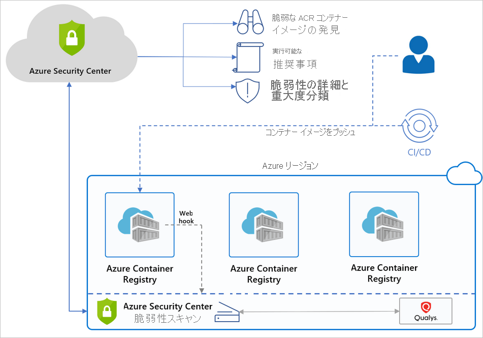

# Microsoft Defender for container registries の概要

[!INCLUDE [Banner for top of topics](./includes/banner.md)]

Azure Container Registry (ACR) は、Azure デプロイ用のコンテナー イメージを中央のレジストリに格納して管理する、プライベートなマネージド Docker レジストリ サービスです。 これは、オープンソースの Docker Registry 2.0 を基にしています。

サブスクリプション内の Azure Resource Manager ベースのレジストリを保護するために、サブスクリプション レベルで **Microsoft Defender for container registries** を有効にします。 その後、Defender for Cloud では、レジストリにプッシュされたか、レジストリにインポートされた、または過去 30 日以内にプルされたすべてのイメージがスキャンされます。 スキャンされたすべてのイメージについて、イメージごとに 1 回の料金が発生します。

## 可用性

|側面|詳細|
|----|:----|
|リリース状態:|一般提供 (GA)|
|価格:|**Microsoft Defender for container registries** の課金については、[価格に関するページ](https://azure.microsoft.com/pricing/details/security-center/)をご覧ください。|
|サポートされているレジストリとイメージ:|シェル アクセスによってパブリック インターネットからアクセス可能な ACR レジストリ内の Linux イメージ [Azure Private Link で保護された ACR レジストリ](../container-registry/container-registry-private-link.md)|
|サポートされていないレジストリとイメージ:|Windows イメージ "プライベート" レジストリ ([信頼できるサービス](../container-registry/allow-access-trusted-services.md#trusted-services)にアクセスが許可されている場合を除く) [Docker スクラッチ](https://hub.docker.com/_/scratch/)のようなスーパー ミニマリスト イメージ、またはアプリケーションとそのランタイム依存関係のみが含まれ、パッケージ マネージャー、シェル、または OS は含まれない "ディストリビューションレス" イメージ。 [Open Container Initiative (OCI) のイメージ形式の仕様](https://github.com/opencontainers/image-spec/blob/master/spec.md)のイメージ|
|必要なロールとアクセス許可:|**セキュリティ閲覧者** および [Azure Container Registry のロールとアクセス許可](../container-registry/container-registry-roles.md)|
|クラウド:|:::image type="icon" source="./media/icons/yes-icon.png" border="false"::: 商用クラウド :::image type="icon" source="./media/icons/yes-icon.png" border="false"::: 各国 (Azure Government、Azure China 21Vianet)|
|||

## Microsoft Defender for container registries の利点

Defender for Cloud では、サブスクリプション内の Azure Resource Manager ベースの ACR レジストリが識別され、レジストリのイメージに対する Azure ネイティブの脆弱性の評価と管理がシームレスに提供されます。

**Microsoft Defender for container registries** には、Azure Resource Manager ベースの Azure Container Registry レジストリ内のイメージをスキャンし、画像の脆弱性をより詳細に把握するための脆弱性スキャナーが含まれています。 統合されたスキャナーは、業界トップレベルの脆弱性スキャン ベンダーである Qualys を使用しています。

Qualys または Defender for Cloud で問題が見つかった場合は、ワークロード保護ダッシュボードで通知されます。 Defender for Cloud では、すべての脆弱性について、実行可能な推奨事項、重大度の分類、問題の修正方法に関するガイダンスが提供されます。 Defender for Cloud のコンテナーに関する推奨事項の詳細については、[推奨事項の参照リスト](recommendations-reference.md#recs-container)を参照してください。

スキャナーによる検出結果が、Defender for Cloud によってフィルター処理され、分類されます。 イメージが正常な場合は、Defender for Cloud によってそのようにマークされます。 Defender for Cloud では、解決の必要な問題があるイメージに対してのみ、セキュリティに関する推奨事項が生成されます。 Defender for Cloud では、報告された各脆弱性の詳細と、重要度の分類が提供されます。 また、各イメージで検出された特定の脆弱性を修復する方法についてのガイダンスも提供されます。

問題があるときにだけ通知することにより、Defender for Cloud での不要な情報アラートの可能性が減ります。

> [!TIP]
> Microsoft Defender for Cloud のコンテナーのセキュリティ機能の詳細については、次のページを参照してください。
>
> - [Microsoft Defender for Cloud とコンテナーのセキュリティ](container-security.md)
> - [Microsoft Defender for Kubernetes の概要](defender-for-kubernetes-introduction.md)

## イメージはどのような場合にスキャンされますか。

イメージ スキャンには、次の 3 つのトリガーがあります。

- **プッシュ時** - イメージがレジストリにプッシュされるたびに、Defender for container registries でそのイメージが自動的にスキャンされます。 イメージのスキャンをトリガーするには、イメージをリポジトリにプッシュしてください。

- **最近プルされたもの** - 新しい脆弱性は日々検出されるため、**Microsoft Defender for container registries** では、過去 30 日以内にプルされたすべてのイメージも週 1 回の頻度でスキャンされます。 これらのスキャンに対する追加料金は発生しません。前述のように、イメージごとに 1 回の課金となります。

- **インポート時** - Azure Container Registry には、Docker Hub、Microsoft Container Registry、またはその他の Azure コンテナー レジストリからレジストリにイメージを取り込むためのインポート ツールが用意されています。 **Microsoft Defender for container registries** では、インポートした、サポートされているすべてのイメージがスキャンされます。 詳細については、「[コンテナー レジストリにコンテナー イメージをインポートする](../container-registry/container-registry-import-images.md)」を参照してください。
 
通常、スキャンは 2 分以内に完了しますが、最大で 40 分かかる場合もあります。 結果は、セキュリティに関する推奨事項として、このように表示されます。

## Defender for Cloud で Azure Container Registry を使用する方法

コンポーネントの概要図と Defender for Cloud でレジストリを保護する利点を下に示します。

## FAQ - Azure Container Registry のイメージ スキャン

### Defender for Cloud でイメージをスキャンする方法
Defender for Cloud は、レジストリからイメージをプルし、Qualys スキャナーを使用してそれを分離されたサンドボックス内で実行します。 スキャナーにより、既知の脆弱性の一覧が抽出されます。

スキャナーによる検出結果が、Defender for Cloud によってフィルター処理され、分類されます。 イメージが正常な場合は、Defender for Cloud によってそのようにマークされます。 Defender for Cloud では、解決の必要な問題があるイメージに対してのみ、セキュリティに関する推奨事項が生成されます。 問題があるときにだけ通知することにより、Defender for Cloud での不要な情報アラートの可能性が減ります。

### REST API 経由でスキャン結果を取得できますか。
はい。 結果は [Sub-Assessments Rest API](/rest/api/securitycenter/subassessments/list/) の下にあります。 また、Azure Resource Graph (ARG) を利用できます。これはすべてのリソースを対象とする Kusto のような API であり、1 つのクエリで特定のスキャンをフェッチできます。

### どのようなレジストリの種類がスキャンされますか。 どのような種類が課金されますか。
Microsoft Defender for container registries によってサポートされているコンテナー レジストリの種類の一覧については、「[可用性](#availability)」を参照してください。

サポートされていないレジストリを Azure サブスクリプションに接続した場合、Defender for Cloud はそれらをスキャンしないため、課金は発生しません。

### 脆弱性スキャナーの結果をカスタマイズすることはできますか。
はい。 組織のニーズとして、検出結果を修復するのではなく無視する必要がある場合は、必要に応じて検出結果を無効にできます。 無効化された検出結果は、セキュリティ スコアに影響を与えたり、不要なノイズを生成したりすることはありません。

[統合された脆弱性評価ツールからの結果を無効にするルールを作成する方法について確認してください](defender-for-container-registries-usage.md#disable-specific-findings-preview)。

### レジストリに含まれていないイメージに関する脆弱性に対して、Defender for Cloud のアラートが表示されるのはなぜですか。
Defender for Cloud では、レジストリにプッシュまたはプルされたすべてのイメージに対して脆弱性評価が提供されています。 イメージの中には、既にスキャンされたイメージのタグを再利用しているものもあります。 たとえば、ダイジェストにイメージを追加するたびに "Latest" (最新) タグを再割り当てする場合があります。 このような場合は、"古い" イメージは引き続きレジストリに存在し、そのダイジェストによってプルされる可能性があります。 イメージにセキュリティの調査結果があり、プルされた場合は、セキュリティの脆弱性が明らかになります。

## 次のステップ

> [!div class="nextstepaction"]
> [イメージの脆弱性をスキャンする](defender-for-container-registries-usage.md)
