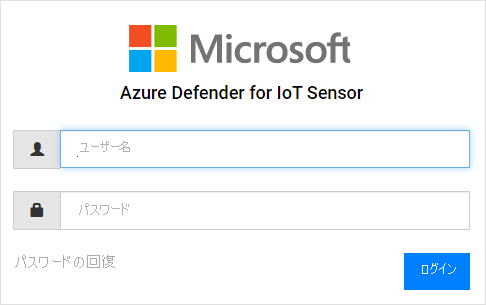

# クイックスタート: センサーをデプロイしてオンボードする

この記事では、センサーのデプロイ プロセスについて概説します。 センサーは、Azure Defender for IoT ポータルにオンボードする必要があります。

このプロセスでは、事前構成済みのセンサー (または認定済みのセンサー アプライアンス) を入手し、センサー ソフトウェアをご自身でインストールする必要があります。

認定済みのセンサー アプライアンスを使用する場合は、作業を開始する前に [Azure Defender for IoT ハードウェア仕様ガイド](https://aka.ms/AzureDefenderforIoTBareMetalAppliance)をご覧になることをお勧めします。

> [!NOTE]
> Azure Defender for IoT のオンプレミス管理コンソールをオンボードする必要はありません。

センサーをオンボードすると、次のことができます。

|||
|------ | ----------- |
| **センサー名を定義する** | オンボードするセンサーに名前を付けて、IoT ハブまたはサブスクリプションに関連付けます。  詳細については、 **センサーのオンボード** に関するセクションを参照してください。|
|**コミットするデバイスの数とサブスクリプションを選択する**|サブスクリプションを選択し、さらに、そのサブスクリプションでカバーするデバイスの数を選択します。 1,000 単位の数値を入力してください。|
| **センサーの管理モードを定義する** | センサーによって検出された情報 (資産、アラートなど) がどこに表示されるかを定義します。 これは、自分が定義する **センサーの管理モード** によって決まります。  **ローカル管理モード** : センサーによって検出された情報は、センサーのコンソールに表示されます。 センサーがオンプレミスの管理コンソールに接続されている場合は、そこにも検出情報が共有されます。  **クラウド管理モード** : センサーによって検出された情報は、センサーのコンソールに表示されます。 加えて、アラート情報は IoT ハブを通じて配信され、他の Azure サービス (Azure Sentinel など) と共有することができます。 詳細については、 **センサーのオンボード** に関するセクションを参照してください。 |
| **センサーのアクティブ化ファイルを入手する** | **ローカル管理** のセンサーでは、承認されたセンサーのアクティブ化期間を管理するために、アクティブ化ファイルが使用されます。  **クラウド管理** のセンサーでは、センサーと IoT ハブとの間の接続としてアクティブ化ファイルが使用されます。 詳細については、 **センサーのオンボード** に関するセクションを参照してください。 |
| **アクティブ化ファイルをセンサーにアップロードする** | アクティブ化ファイルは、エンタープライズ センサーにアップロードする必要があります。 ネットワークの監視とセンサーのコンソール機能へのアクセスは、アクティブ化ファイルがアップロードされて初めて利用できます。 詳細については、 **センサーのアクティブ化ファイルのアップロード** に関するセクションを参照してください。 |
| **アクティブ化する前にセンサーのネットワーク パラメーターを更新する** | センサーのインストール時に定義したパラメーターを更新します。 詳細については、 **参照元が見つからないというエラー** に関するページを参照してください。|

**センサーをデプロイするには:**

1. Azure portal から Azure Defender for IoT に移動します。

2. **[Get started]\(使用開始\)** を選択します。

3. **[Discover Your Network]\(ネットワークの検出\)** セクションの **[Set up]\(セットアップ\)** を選択します。

   ![Azure Defender for IoT の [Discover Your Network]\(ネットワークの検出\) ビュー](media/updates/image5.png)

4. センサーの入手オプションを選択します。

   ![Azure Defender for IoT の [network sector]\(ネットワーク セクター\) ビュー](media/updates/image6.png)

  - **事前構成済みのセンサーを購入する** 。Microsoft と Arrow は提携して、事前構成済みのセンサーを提供しています。 事前構成済みのセンサーを購入するには、Arrow (<hardware.sales@arrow.com>) にお問い合わせください。 センサーがお手元に届きます。 最新のバージョンがインストールされています。

  - **独自のアプライアンスを導入する (ISO インストール)** 。ソリューションは認定済みのアプライアンス上で動作します。 認定済みのアプライアンスを購入する際は、[Azure Defender for IoT ハードウェア仕様ガイド](https://aka.ms/AzureDefenderforIoTBareMetalAppliance)を参考にしてください。

    - **[Select version]\(バージョンの選択\)** メニューからバージョンを選択します。

    - **[Download]\(ダウンロード\)** を選択してファイルを保存します。 ISO イメージのダウンロードとセンサー ソフトウェアのインストールについては、 **Azure Defender for IoT のインストール ガイド** を参照してください。

5. お使いのセンサーにソフトウェアをインストールするか、事前構成済みのセンサーを入手したら、ネットワーク セットアップ タスクを実行します。 詳細については、[ネットワーク セットアップ ガイド](https://aka.ms/AzureDefenderForIoTNetworkSetup)を参照してください。

## センサーをオンボードする

センサーは、Azure Defender for IoT ポータルにオンボードする必要があります。 オンボードは 2 つのフェーズで実施します。

1. Azure Defender for IoT ポータルにセンサーを登録します。

2. センサーのアクティブ化ファイルをダウンロードします。 後でこのファイルをご自分のセンサーにアップロードすることになります。

**オンボード ページにアクセスするには:**

1. Microsoft Azure Defender for IoT の **[Get started]\(使用開始\)** ページに移動します。

2. Azure Defender for IoT から、 **2) の [Onboard]\(オンボード\)** を選択します。

   ![[Overboard]\(オーバーボード\) ページ ビューのスクリーンショット](media/updates/image7.png)

3. **[Onboard sensor]\(センサーのオンボード\)** ページが表示されます。 センサーを登録したりアクティブ化ファイルをダウンロードしたりするためのオプションが用意されています。

   ![[Overboard sensor]\(センサーのオーバーボード\) ページ ビューのスクリーンショット](media/quickstart/onboard-sensors.png)

**センサーを登録するには:**

1. センサー名を選択します。 クラウド管理のセンサーの場合、ここで定義した名前が、センサーのコンソールに表示される名前として適用されます。この名前をコンソールから変更することはできません。 ローカル管理のセンサーの場合、ここで指定された名前は Azure に保存されますが、センサーのコンソールで更新することができます。 インストールしたセンサーの IP アドレスを名前に含めるか、識別しやすい名前を使用することをお勧めします。 そうすることで追跡が容易になるほか、Azure Defender for IoT ポータルにおける登録名と、センサーのコンソールに表示されるデプロイ済みセンサーの IP との間で名前の一貫性が確保されます。

2. サブスクリプション ドロップダウンからサブスクリプションを選択します。
3. **[Committed devices]\(コミットするデバイス\)** フィールドに、このサブスクリプションでカバーされるデバイスの数を入力します。 同じサブスクリプションに関連付けられたセンサーをオンボードするたびに、この数値を再入力する必要があります。  たとえば、サブスクリプション "A" に 6,000 台のデバイスが関連付けられている場合、サブスクリプション "A" に関連付けられている個々のセンサーで「6000」を入力します。   
4. **[Cloud connect]\(クラウド接続\)** トグルを使用してセンサーの管理モードを選択します。 このトグルがオンの場合、センサーは **クラウド管理** になります。 このトグルがオフの場合、センサーは **ローカル管理** になります。

| センサーの管理モード | [説明]                                                |
| ---------------------- | ---------------------------------------------------------  |
| **クラウド管理**          | センサーによって検出された情報は、センサーのコンソールに表示されます。 加えて、アラート情報は IoT ハブを通じて配信され、他の Azure サービス (Azure Sentinel など) と共有することができます。  このセンサーに関連付ける IoT ハブを選択してください。  クラウド管理のセンサーには、クラウド管理のアクティブ化ファイルをアップロードする必要があります。  詳細については、 **センサーのアクティブ化ファイルのアップロード** に関するセクションを参照してください。 |
| **ローカル管理**        | ローカル管理のセンサーによって検出された情報は、センサーのコンソールに表示されます。 エアギャップ ネットワークで作業していて、複数のローカル管理センサーによって検出されるすべての情報を一元的に表示したい場合は、オンプレミスの管理コンソールを使用します。  " *ローカル管理* " のセンサーは Azure サブスクリプションに関連付けられており、センサーのアクティブ化の有効期間に関する命令を保持しています。  このセンサーに関連付けるサブスクリプションを選択してください。  各センサーには、ローカル管理のアクティブ化ファイルをアップロードする必要があります。詳細については、 **センサーのアクティブ化ファイルのアップロード** に関するセクションを参照してください。 |

5. **[登録]** を選択します。

6. [Download activation file]\(アクティブ化ファイルのダウンロード\) ページで **[Download activation file]\(アクティブ化ファイルのダウンロード\)** を選択します。

   ![[Onboard Sensor]\(センサーのオンボード\) ビューのスクリーンショット](media/updates/image9.png)

7. ファイルを保存します。 ファイル名の形式は `<hub_name>_<sensor_name>` です。 センサー名は、先ほど定義した名前です。

8. **[完了]** を選択します。

9. センサーのオンボード プロセスは完了するには、Azure Defender for IoT コンソールから自分のセンサーにこのファイルをアップロードします。
 
## センサーのアクティブ化ファイルをアップロードする

この記事では、アクティブ化ファイルをセンサーにアップロードする方法について説明します。 ファイルは、センサーのオンボード時に入手していることと思います。

**ローカル管理のアクティブ化ファイル**

ローカル管理のセンサーは、Azure サブスクリプションに関連付けられます。  ローカル管理のセンサー用のアクティブ化ファイルには、有効期限が含まれています。 この日付の 1 か月前になると、センサーのコンソールの一番上に警告メッセージが表示されます。 アクティブ化ファイルの更新が済むまで、警告は表示されたままになります。

アクティブ化ファイルの有効期限が切れた後も、Azure Defender for IoT の機能を使用することは可能です。

**クラウド管理のアクティブ化ファイル**

クラウド管理のセンサーは、Azure IoT ハブに関連付けられます。 これらのセンサーに、アクティブ化ファイルの期間による制限はありません。 クラウド管理のセンサー用のアクティブ化ファイルは、IoT ハブとの接続を確保する目的で使用されます。

IoT ハブの詳細については、[IoT Hub の概要](../iot-hub/about-iot-hub.md)に関するページを参照してください。

**アクティブ化ファイルをアップロードするには:**

1. 以下を用意できていることを確認します。

   - センサーの IP アドレス (インストール時に定義したもの)

   - センサーに必要なユーザー ログイン資格情報

2. このセンサーの IP アドレスを使用して、ブラウザーから Azure Defender for IoT コンソールにアクセスします。

3. Azure Defender for IoT Sensor コンソールにログインします。

   

4. ログインに成功すると、[Activation]\(アクティブ化\) 画面が表示されます。 [Upload]\(アップロード\) を選択し、保存したアクティブ化ファイルを選択します。

   ![Azure Defender for IoT の [Activation]\(アクティブ化\) ビュー](media/updates/image12.png)

5. 使用条件に同意します。

6. **[アクティブ化]** を選びます。 センサーのネットワーク構成パラメーターは、ソフトウェアのインストール時または事前構成済みのセンサーの購入時に定義されています。 定義されているパラメーターは、次のとおりです。
   - IP アドレス
   - DNS  
   - デフォルト ゲートウェイ
   - サブネット マスク
   - ホスト名
 
   センサーをアクティブ化する前に、以下のような理由から、この情報を更新したい場合があります。
   - 事前構成済みのパラメーターの定義を変更する必要がある。  
   - インストール後にネットワーク パラメーターの再構成が必要になった。センサーをアクティブ化する前にプロキシの設定を定義することもできます。

7. [Activation]\(アクティブ化\) ダイアログ ボックスの **[Sensor Network Configuration]\(センサー ネットワークの構成\)** リンクを選択します。  

   ![[Edit Network Configuration]\(ネットワーク構成の編集\) ビューのスクリーンショット](media/updates/image13.png)

8. インストール時に定義したパラメーターが表示されます。 プロキシを定義するためのオプションも用意されています。 必要に応じて更新し、 **[Save]\(保存\)** を選択します。
 
 
## 次の手順

この記事では、センサーをデプロイしてオンボードする方法について説明しました。 最初に行う作業について詳しくは、次の記事を参照してください。

- [はじめに](getting-started.md)