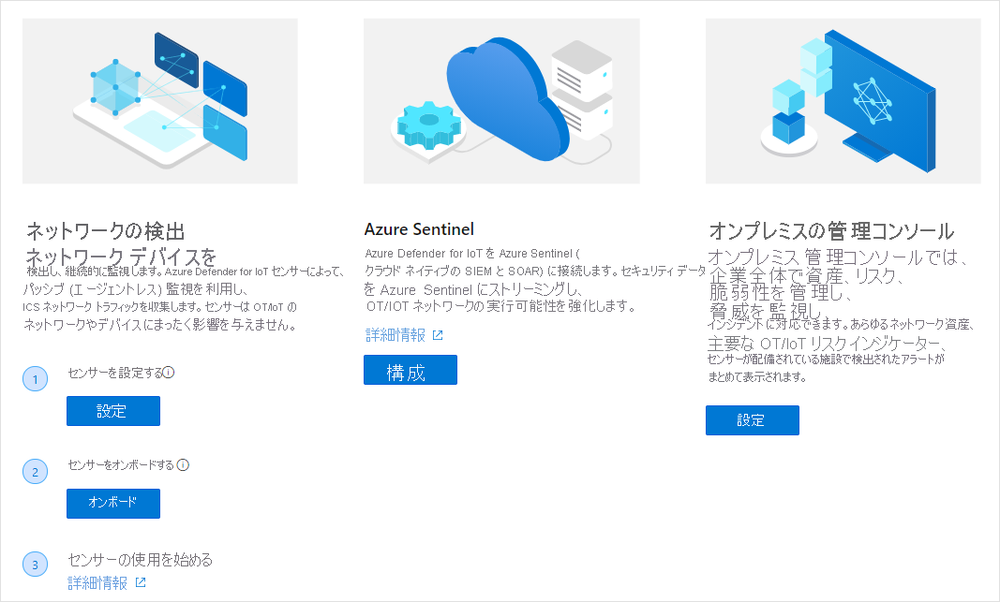

# クイックスタート: Azure Defender for IoT デプロイ用のネットワークを準備する

## ハードウェアを選択する
Azure Defender for IoT は、以下のようなさまざまな認定アプライアンスをサポートしています。
- 事前構成済みの認定アプライアンス (ソフトウェアがあらかじめインストールされているもの)
- 未構成の認定アプライアンス (センサー ソフトウェアをユーザーがダウンロードしてインストール可能)
- オンプレミス管理コンソール アプライアンスの仕様。 オンプレミス管理コンソールは、事前構成済みのアプライアンスとしては提供されていません。 

詳細については、[ハードウェア仕様ガイド](https://aka.ms/AzureDefenderforIoTBareMetalAppliance)を参照してください。

## コンポーネントをインストールする
ハードウェア コンポーネントを入手してソフトウェア パッケージを Azure Defender for IoT ポータルからダウンロードしたら、コンポーネント ソフトウェアをインストールできます。 詳細については、[インストール ガイド](https://aka.ms/AzureDefenderforIoTInstallSensorISO)を参照してください。

## Azure Defender for IoT ポータルにセンサーをオンボードする 
 この記事では、Azure Defender for IoT のセンサーおよびオンプレミス管理コンソールのデプロイ、オンボード、更新プロセスについて概説します。 このプロセスは、Azure Defender for IoT のウェルカム ページとその後続のページに記載された手順に従って行います。

ウェルカム ページを開くには:

1. ご自分の Azure アカウントにログインして Azure Defender for IoT を検索します。

1. **センサーをデプロイ** するには、事前構成済みのハードウェアを Arrow から購入するか、独自のデバイスを購入してセンサー ソフトウェアをインストールする必要があります。
1. **オンプレミス管理コンソールをデプロイ** するには、独自のデバイスを購入して、そこにオンプレミス管理コンソール ソフトウェアをインストールする必要があります。 詳しくは、

## ネットワークのセットアップ
Defender for IoT システムのコンポーネントをインストールしたら、ネットワーク監視に最適な構成をネットワーク機器に対して実施できます。 詳細については、[ネットワーク セットアップ ガイド](https://aka.ms/AzureDefenderForIoTNetworkSetup)を参照してください。   

## 次の手順

この記事では、Defender for IoT を使用するための準備を行う方法について説明しました。 最初に行う作業について詳しくは、次の記事を参照してください。

- [はじめに](getting-started.md)