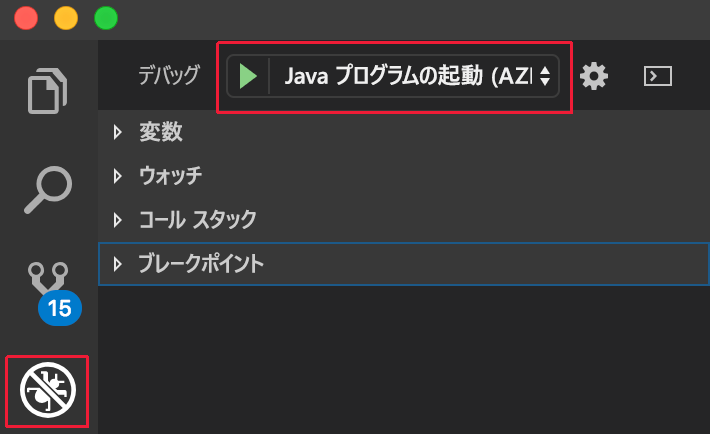

# <a name="get-started-on-azure-dev-spaces-with-java"></a>Azure Dev Spaces での Java の使用

このガイドでは、以下の方法について説明します。

- 開発用に最適化された Kubernetes ベースの環境 (_開発空間_) を Azure に作成する。
- VS Code とコマンド ラインを使用して、コンテナー内のコードを繰り返し開発する。
- チーム環境でコードを生産的に開発してテストする。

> [!Note]
> **問題が発生した場合は**いつでも、「[トラブルシューティング](troubleshooting.md)」セクションを参照するか、このページでコメントを投稿してください。

これで、Azure に Kubernetes ベースの開発空間を作成する準備ができます。

## <a name="install-the-azure-cli"></a>Azure CLI のインストール
Azure Dev Spaces には、ローカル マシンの最小限のセットアップが必要です。 開発空間の構成の大半はクラウドに保存され、他のユーザーと共有できます。 まず、[Azure CLI](/cli/azure/install-azure-cli?view=azure-cli-latest) をダウンロードして実行します。

> [!IMPORTANT]
> Azure CLI が既にインストールされている場合は、バージョン 2.0.43 以降を使用していることを確認してください。

### <a name="sign-in-to-azure-cli"></a>Azure CLI へのサインイン
Azure にサインインします。 ターミナル ウィンドウで次のコマンドを入力します。

```cmd
az login
```

> [!Note]
> Azure サブスクリプションをお持ちでない場合は、[無料のアカウント](https://azure.microsoft.com/free)を作成できます。

#### <a name="if-you-have-multiple-azure-subscriptions"></a>複数の Azure サブスクリプションがある場合:
以下を実行して、サブスクリプションを表示できます。 

```cmd
az account list
```
JSON 出力に `isDefault: true` が含まれているサブスクリプションを見つけます。
それが使用したいサブスクリプションでない場合は、既定のサブスクリプションを変更できます。

```cmd
az account set --subscription <subscription ID>
```

## <a name="create-a-kubernetes-cluster-enabled-for-azure-dev-spaces"></a>Azure Dev Spaces 対応の Kubernetes クラスターを作成する

コマンド プロンプトで、リソース グループを作成します。 現在サポートされているリージョン (EastUS、EastUS2、CentralUS、WestUS2、WestEurope、SoutheastAsia、CanadaCentral、または CanadaEast) のいずれかを使用します。

```cmd
az group create --name MyResourceGroup --location <region>
```

以下のコマンドを使用して Kubernetes クラスターを作成します。

```cmd
az aks create -g MyResourceGroup -n MyAKS --location <region> --kubernetes-version 1.10.9 --enable-addons http_application_routing --generate-ssh-keys
```

クラスターの作成には数分かかります。

### <a name="configure-your-aks-cluster-to-use-azure-dev-spaces"></a>Azure Dev Spaces を使用するように AKS クラスターを構成する

次の Azure CLI コマンドを入力します。このとき、AKS クラスターを含む含むリソース グループと、AKS クラスター名を使用します。 このコマンドでは、Azure Dev Spaces のサポートを使用してクラスターが構成されます。

   ```cmd
   az aks use-dev-spaces -g MyResourceGroup -n MyAKS
   ```

> [!IMPORTANT]
> Azure Dev Spaces 構成プロセスでは、クラスター内に `azds` 名前空間が存在する場合はこれを削除します。

## <a name="get-kubernetes-debugging-for-vs-code"></a>VS Code 用の Kubernetes デバッグを入手する
VS Code を使用する .NET Core および Node.js の開発者は、Kubernetes デバッグなどのリッチな機能を利用できます。

1. [VS Code](https://code.visualstudio.com/Download) をインストールしていない場合は、インストールします。
1. [VS Azure Dev Spaces 拡張機能](https://marketplace.visualstudio.com/items?itemName=azuredevspaces.azds)をダウンロードしてインストールします。 拡張機能の Marketplace ページで [インストール] を 1 回クリックし、VS Code でもう一度クリックします。 

Azure Dev Spaces で Java アプリケーションをデバッグするには、VS Code 用の [Java Debugger for Azure Dev Spaces](https://marketplace.visualstudio.com/items?itemName=vscjava.vscode-java-debugger-azds) 拡張機能をダウンロードしてインストールします。 拡張機能の Marketplace ページで [インストール] を 1 回クリックし、VS Code でもう一度クリックします。

## <a name="create-a-web-app-running-in-a-container"></a>コンテナーで実行される Web アプリを作成する

このセクションでは、Java Web アプリケーションを作成し、Kubernetes のコンテナーで実行します。

### <a name="create-a-java-web-app"></a>Java Web アプリを作成する
https://github.com/Azure/dev-spaces に移動して GitHub からコードをダウンロードし、**[Clone or download]** クリックして GitHub リポジトリをローカル環境にダウンロードします。 このガイドのコードは、 `samples/java/getting-started/webfrontend` にあります。

## <a name="preparing-code-for-docker-and-kubernetes-development"></a>Docker および Kubernetes 開発用コードの準備
ここまでで、ローカルで実行できる基本的な Web アプリを用意しました。 ここで、アプリのコンテナーと、それを Kubernetes にデプロイする方法を定義するアセットを作成して、それをコンテナー化します。 このタスクは Azure Dev Spaces で行うのが容易です。 

1. VS Code を起動し、`webfrontend` フォルダーを開きます。 (デバッグ アセットの追加やプロジェクトの復元を行うための既定のプロンプトはすべて無視できます。)
1. VS Code で統合ターミナルを開きます (**[表示]、[統合ターミナル]** メニューを使用)。
1. このコマンドを実行します (**webfrontend** が現在のフォルダーであることを確認します)。

    ```cmd
    azds prep --public
    ```

Azure CLI の `azds prep` コマンドにより、既定の設定で Docker と Kubernetes のアセットが生成されます。
* `./Dockerfile` は、アプリのコンテナー イメージと、ソース コードがどのようにコンテナー内でビルドされ、実行されるかを記述しています。
* `./charts/webfrontend` の下の [Helm チャート](https://docs.helm.sh)は、Kubernetes にコンテナーを展開する方法を記述しています。

ここでは、これらのファイルの内容をすべて理解する必要はありません。 ただし、開発から運用まで、**コードとしての構成である同じ Kubernetes および Docker アセットを使用できるため、異なる環境にわたってより高い一貫性が提供されることに注意してください。**
 
`./azds.yaml` という名前のファイルが `prep` コマンドによって生成されます。これが Azure Dev Spaces の構成ファイルです。 これは、Azure で反復開発エクスペリエンスを実現する追加の構成によって、Docker と Kubernetes の成果物を補完するものです。

## <a name="build-and-run-code-in-kubernetes"></a>Kubernetes でコードをビルドして実行する
コードを実行してみましょう。 ターミナル ウィンドウで、**ルート コード フォルダー**の webfrontend から次のコマンドを実行します。

```cmd
azds up
```

コマンドの出力に注目してください。進行するにつれて、次のようなことに気付きます。
- ソース コードが、Azure の開発空間と同期します。
- コード フォルダーで Docker 資産によって指定されているように、コンテナー イメージが Azure でビルドされます。
- コード フォルダーで Helm チャートによって指定されているように、コンテナー イメージを活用する Kubernetes オブジェクトが作成されます。
- コンテナーのエンドポイントに関する情報が表示されます。 ここでは、パブリック HTTP URL が表示されるはずです。
- 上記の段階が正常に完了していれば、コンテナーの起動時に`stdout` (および `stderr`) 出力の表示が開始されるはずです。

> [!Note]
> `up` コマンドを初めて実行する場合、以下の手順には時間がかかりますが、それ以降はもっと早く実行できます。

### <a name="test-the-web-app"></a>Web アプリをテストする
コンソールの出力をスキャンして、`up` コマンドで作成されたパブリック URL に関する情報を探します。 形式は次のようになります。 

```
(pending registration) Service 'webfrontend' port 'http' will be available at <url>
Service 'webfrontend' port 80 (TCP) is available at http://localhost:<port>
```

ブラウザー ウィンドウでこの URL を開くと、Web アプリ ロードが表示されるはずです。 コンテナーが実行されると、`stdout` と `stderr` の出力がターミナル ウィンドウにストリーミングされます。

> [!Note]
> 最初の実行では、パブリック DNS が準備されるまでに数分かかることがあります。 公開 URL が解決されない場合は、コンソール出力に表示される代替 http://localhost:<portnumber> URL を使用することができます。 localhost URL を使用する場合、コンテナーはローカルで実行されているように見えるかもしれませんが、実際には AKS で実行されています。 利便性を考慮し、また、ローカル コンピューターからのサービスとの対話を容易にするために、Azure Dev Spaces では、Azure で実行されているコンテナーへの一時的な SSH トンネルが作成されます。 後で DNS レコードが準備できたら、戻って公開 URL を試してみることができます。
### <a name="update-a-content-file"></a>コンテンツ ファイルを更新する
Azure Dev Spaces は、Kubernetes でコードを実行するだけのものではありません。Azure Dev Spaces を使用すると、クラウドの Kubernetes 環境でコードの変更が有効になっていることをすぐに繰り返し確認できるようになります。

1. ターミナル ウィンドウで、`Ctrl+C` キーを押して `azds up` を停止します。
1. `src/main/java/com/ms/sample/webfrontend/Application.java` という名前のコード ファイルを開き、あいさつメッセージ (`return "Hello from webfrontend in Azure!";`) を編集します。
1. ファイルを保存します。
1. ターミナル ウィンドウで `azds up` を実行します。

このコマンドにより、コンテナー イメージが再ビルドされ、Helm チャートが再デプロイされます。 コードの変更が実行中のアプリケーションに反映されるようすを確認するには、単純にブラウザーを最新の情報に更新します。

コードを開発するさらに "*迅速な方法*" があります。これについては、次のセクションで説明します。 

## <a name="debug-a-container-in-kubernetes"></a>Kubernetes でコンテナーをデバッグする

このセクションでは、VS Code を使用して、Azure で実行されるコンテナーを直接デバッグします。 編集、実行、テストを高速で繰り返す方法についても説明します。


> [!Note]
> **問題が発生した場合は**いつでも、「[トラブルシューティング](troubleshooting.md)」セクションを参照するか、このページでコメントを投稿してください。

### <a name="initialize-debug-assets-with-the-vs-code-extension"></a>VS Code 拡張機能によるデバッグ アセットの初期化
まず、VS Code が Azure 内の開発空間と通信するように、コード プロジェクトを構成する必要があります。 Azure Dev Spaces 用の VS Code 拡張機能は、デバッグ構成をセットアップするためのヘルパー コマンドを提供します。 

(**[表示 | コマンド パレット]** メニューを使用して) **コマンド パレット**を開き、オート コンプリートを使用して次のコマンドを入力および選択します: `Azure Dev Spaces: Prepare configuration files for Azure Dev Spaces`。 

Azure Dev Spaces 用のデバッグ構成が `.vscode` フォルダー下に追加されます。 このコマンドと、デプロイ用にプロジェクトを構成する `azds prep` コマンドを混同しないでください。


### <a name="select-the-azds-debug-configuration"></a>AZDS デバッグ構成を選択する
1. VS Code の左側の**アクティビティ バー**で、[デバッグ] アイコンをクリックしてデバッグ ビューを開きます。
1. アクティブなデバッグ構成として、**[Launch Java Program (AZDS)]\(Java プログラムの起動 (AZDS)\)** を選択します。



> [!Note]
> コマンド パレットに Azure Dev Spaces コマンドが表示されない場合は、Azure Dev Spaces 用 VS Code 拡張機能がインストールされていることを確認してください。 VS Code で開いているワークスペースが、azds.yaml が含まれているフォルダーであることを確認します。

### <a name="debug-the-container-in-kubernetes"></a>Kubernetes でコンテナーをデバッグする
**F5** キーを押して、Kubernetes でコードをデバッグします。

`up` コマンドと同様に、コードが開発空間に同期され、コンテナーがビルドされて Kubernetes にデプロイされます。 今回は、デバッガーがリモート コンテナーにアタッチされます。

> [!Tip]
> VS Code のステータス バーに、クリック可能な URL が表示されます。


サーバー側のコード ファイル (たとえば、`src/main/java/com/ms/sample/webfrontend/Application.java` ソース ファイルの `greeting()` 関数内) にブレークポイントを設定します。 ブラウザーのページを更新すると、ブレークポイントに到達します。

コードがローカルで実行されている場合と同様に、デバッグ情報 (呼び出し履歴、ローカル変数、例外情報など) にフル アクセスできます。

### <a name="edit-code-and-refresh"></a>コードを編集して更新する
デバッガーをアクティブにしてコードを編集します。 たとえば、`src/main/java/com/ms/sample/webfrontend/Application.java` であいさつ文に変更を加えます。 

```java
public String greeting()
{
    return "I'm debugging Java code in Azure!";
}
```

ファイルを保存し、**デバッグ操作ウィンドウ**で **[最新の情報に更新]** ボタンをクリックします。


コードを編集するたびに新しいコンテナー イメージを再構築して再展開すると、多くの場合、かなりの時間がかかります。Azure Dev Spaces では、代わりに既存のコンテナー内でコードの増分再コンパイルを実行することで、編集/デバッグ ループを高速化します。

ブラウザーで Web アプリを更新します。 UI にカスタム メッセージが表示されます。

**これで、コードを迅速に反復処理し、Kubernetes で直接デバッグできるようになりました。** 次に、2 つ目のコンテナーを作成して呼び出す方法を説明します。

## <a name="next-steps"></a>次の手順

> [!div class="nextstepaction"]
> [チーム開発について学ぶ](team-development-java.md)
