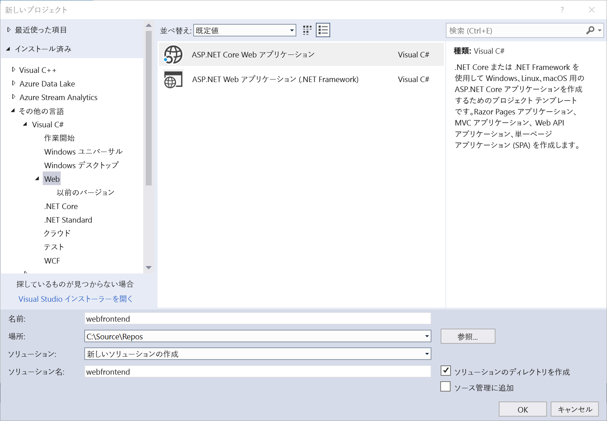
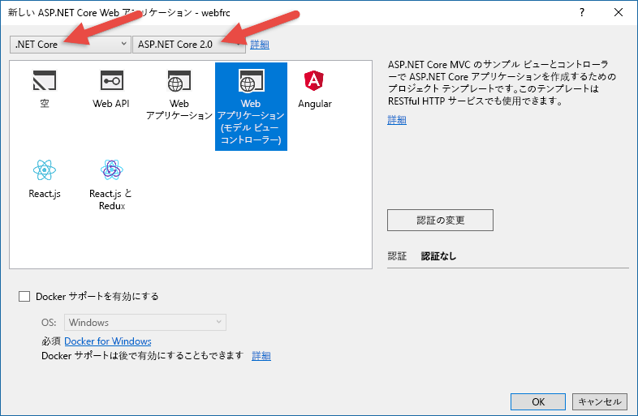
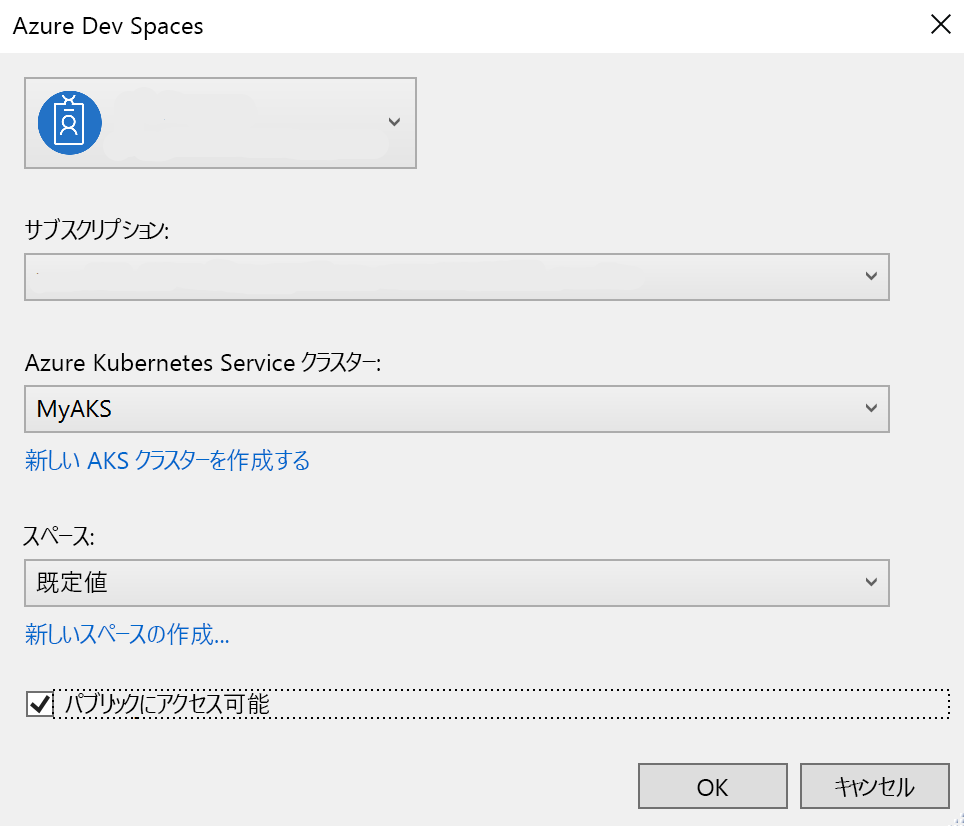

# <a name="create-a-kubernetes-dev-space-visual-studio-and-net-core-with-azure-dev-spaces"></a>Kubernetes 開発空間を作成する: Azure Dev Spaces での Visual Studio と .NET Core

このガイドでは、以下の方法について説明します。

- Azure でマネージド Kubernetes クラスターを使用して Azure Dev Spaces をセットアップする。
- Visual Studio を使用して、コンテナー内のコードを繰り返し開発する。
- 2 つのサービスを個別に開発し、Kubernetes の DNS サービス検索を使用して別のサービスを呼び出す。
- チーム環境でコードを生産的に開発してテストする。

> [!Note]
> いつでも**問題が発生した場合**は「[トラブルシューティング](troubleshooting.md)」セクションを参照してください。


## <a name="create-a-kubernetes-cluster-enabled-for-azure-dev-spaces"></a>Azure Dev Spaces 対応の Kubernetes クラスターを作成する

1. Azure Portal ( https://portal.azure.com ) にサインインします。
1. **[Create a resource]\(リソースの作成\)** を選択し、 **[Kubernetes]** を検索して、 **[Azure Kubernetes Service]**  >  **[作成]** を選択します。

   *[Kubernetes クラスターを作成]* フォームの各見出しで次の手順を完了し、選択した[リージョンで Azure Dev Spaces がサポートされている][supported-regions]ことを確認します。

   - **[プロジェクトの詳細]** : Azure サブスクリプションと、新規または既存の Azure リソース グループを選択します。
   - **CLUSTER DETAILS (クラスターの詳細)** : AKS クラスターの名前、リージョン、バージョン、および DNS 名プレフィックスを入力します。
   - **[SCALE]\(スケール\)** : AKS エージェント ノードの VM サイズとノード数を選択します。 Azure Dev Spaces を初めてお使いになる場合、ノード数は 1 つあれば十分にさまざまな機能を試すことができます。 ノード数は、クラスターのデプロイ後、いつでも簡単に調整できます。 AKS クラスターの作成後に VM サイズを変更することはできないので注意してください。 ただし、AKS クラスターのデプロイ後にスケールアップする必要が生じた場合は、より大きな VM を使って新しい AKS クラスターを簡単に作成できます。Dev Spaces を使用して、その大きい方のクラスターに再デプロイすることができます。

   


   **[次へ:認証]** を選択します。

1. ロールベースのアクセス制御 (RBAC) に必要な設定を選択します。 Azure Dev Spaces では、RBAC が有効なクラスターと無効なクラスターのどちらでもサポートされます。

    

1. 完了したら、 **[Review + create] (レビュー + 作成)** 、 **[作成]** の順に選択します。

## <a name="get-the-visual-studio-tools"></a>Visual Studio ツールを入手する
最新バージョンの [Visual Studio](https://www.visualstudio.com/vs/) をインストールします。 Windows 上の Visual Studio 2019 の場合は、Azure 開発ワークロードをインストールする必要があります。 Windows 上の Visual Studio 2017 の場合は、ASP.NET と Web 開発ワークロード、および [Visual Studio Tools for Kubernetes](https://aka.ms/get-azds-visualstudio) をインストールする必要があります。

## <a name="create-a-web-app-running-in-a-container"></a>コンテナーで実行される Web アプリを作成する

このセクションでは、ASP.NET Core Web アプリを作成し、Kubernetes のコンテナーで実行します。

### <a name="create-an-aspnet-web-app"></a>ASP.NET Web アプリを作成する

Visual Studio 内から、新しいプロジェクトを作成します。 現時点では、このプロジェクトは **ASP.NET Core Web アプリケーション**である必要があります。 プロジェクトに "**webfrontend**" という名前を付けます。



**[Web アプリケーション (モデル ビュー コントローラー)]** テンプレートを選択し、ダイアログの上部にある 2 つのドロップダウンで **.NET Core** と **ASP.NET Core 2.0** が対象になっていることを確認します。 **[OK]** をクリックしてプロジェクトを作成します。



### <a name="enable-dev-spaces-for-an-aks-cluster"></a>AKS クラスターの開発空間を有効にする

先ほど作成したプロジェクトに対し、次の図のように、起動設定のドロップダウンから **[Azure Dev Spaces]** を選択します。


次に表示されるダイアログで、適切なアカウントでサインインしていることを確認し、既存の Kubernetes クラスターを選択します。



現時点では、 **[スペース]** ドロップダウンは既定の `default` のままにしておきます。 このオプションについては、後で詳しく説明します。 パブリック エンドポイント経由で Web アプリにアクセスできるように、 **[Publicly Accessible]\(パブリックにアクセス可能\)** チェック ボックスをオンにします。 この設定は必須ではありませんが、このチュートリアルの後の方でいくつかの概念を示す際に役立ちます。 いずれにせよ、Visual Studio を使用して Web サイトをデバッグできるので心配はありません。


**[OK]** をクリックして、クラスターを選択または作成します。

Azure Dev Spaces を使用できないクラスターを選択すると、クラスターを構成するかどうかをたずねるメッセージが表示されます。


**[OK]** を選択します。

> [!IMPORTANT]
> Azure Dev Spaces 構成プロセスでは、クラスター内に `azds` 名前空間が存在する場合はこれを削除します。

 処理を完了するために、バックグラウンド タスクが開始されます。 完了するまでに、数分かかります。 まだ作成中かどうかを確認するには、次の画像に示すように、ステータス バーの左下隅にある **[バックグラウンド タスク]** アイコンをポイントします。


> [!Note]
> 開発空間が正常に作成されるまで、アプリケーションをデバッグすることはできません。

### <a name="look-at-the-files-added-to-project"></a>プロジェクトに追加されたファイルを確認する
開発空間が作成されるのを待っている間に、開発空間を使用することを選択したときにプロジェクトに追加されたファイルを確認しておきましょう。

まず、`charts` という名前のフォルダーが追加されており、このフォルダー内にアプリケーションの [Helm チャート](https://docs.helm.sh)がスキャフォールディングされていることがわかります。 これらのファイルは、アプリケーションを開発空間に展開するために使用されます。

`Dockerfile` という名前のファイルが追加されています。 このファイルには、標準の Docker 形式でアプリケーションをパッケージ化するために必要な情報が含まれています。

最後に、`azds.yaml` という名前のファイルがあります。このファイルには、開発空間で必要となる開発時の構成が含まれています。


## <a name="debug-a-container-in-kubernetes"></a>Kubernetes でコンテナーをデバッグする
開発空間が正常に作成されたら、アプリケーションをデバッグすることができます。 コードにブレークポイントを設定します。たとえば、`HomeController.cs` ファイルの 20 行目 (`Message` 変数が設定されている行) に設定します。 **F5** キーを押してデバッグを開始します。 

Visual Studio は開発空間と通信してアプリケーションをビルドして展開した後、ブラウザーを開いて Web アプリを実行します。 コンテナーはローカルで実行されているように見えますが、実際には Azure の開発空間で実行されています。 localhost アドレスであるのは、Azure Dev Spaces では AKS で実行されているコンテナーへの一時的な SSH トンネルが作成されるためです。

ページの上部にある **[About]\(バージョン情報\)** リンクをクリックすると、ブレークポイントがトリガーされます。 コードがローカルで実行されている場合と同様に、デバッグ情報 (呼び出し履歴、ローカル変数、例外情報など) にフル アクセスできます。

## <a name="iteratively-develop-code"></a>反復的にコードを開発する

Azure Dev Spaces は、Kubernetes でコードを実行するだけのものではありません。Azure Dev Spaces を使用すると、クラウドの Kubernetes 環境でコードの変更が有効になっていることをすぐに繰り返し確認できるようになります。

### <a name="update-a-content-file"></a>コンテンツ ファイルを更新する


1. `./Views/Home/Index.cshtml` ファイルを見つけ、HTML を編集します。 たとえば、[73 行目の `<h2>Application uses</h2>`](https://github.com/Azure/dev-spaces/blob/master/samples/dotnetcore/getting-started/webfrontend/Views/Home/Index.cshtml#L73) を次のように変更します。 
  
    ```html
    <h2>Hello k8s in Azure!</h2>`
    ```

2. ファイルを保存します。
3. ブラウザーに移動し、ページを更新します。 Web ページに更新された HTML が表示されます。

なぜでしょうか? HTML や CSS などのコンテンツ ファイルを編集しても、.NET Core Web アプリで再コンパイルする必要はありません。アクティブな F5 セッションによって、変更されたコンテンツ ファイルが AKS で実行中のコンテナーに自動的に同期されるので、編集後のコンテンツをすぐに確認できます。

### <a name="update-a-code-file"></a>コード ファイルを更新する
コード ファイルを更新するには、.NET Core アプリを再ビルドし、更新されたアプリケーション バイナリを生成する必要があるため、もう少し作業が必要です。

1. Visual Studio のデバッガーを停止します。
1. `Controllers/HomeController.cs` という名前のコード ファイルを開き、About ページに表示されるメッセージ (`ViewData["Message"] = "Your application description page.";`) を編集します。
1. ファイルを保存します。
1. **F5** キーを押して再度デバッグを開始します。 

コードを編集するたびに新しいコンテナー イメージを再構築して再展開すると、多くの場合、かなりの時間がかかります。Azure Dev Spaces では、代わりに既存のコンテナー内でコードの増分再コンパイルを実行することで、編集/デバッグ ループを高速化します。

ブラウザーで Web アプリを更新し、About ページに移動します。 UI にカスタム メッセージが表示されます。

## <a name="next-steps"></a>次の手順

> [!div class="nextstepaction"]
> [マルチサービス開発について学習する](multi-service-netcore-visualstudio.md)


[supported-regions]: about.md#supported-regions-and-configurations