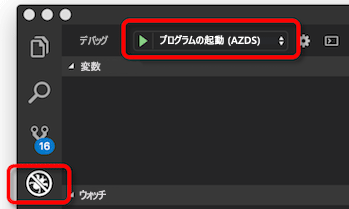
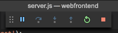

# <a name="get-started-on-azure-dev-spaces-with-nodejs"></a>Azure Dev Spaces での Node.js の使用

[!INCLUDE[](includes/learning-objectives.md)]

[!INCLUDE[](includes/see-troubleshooting.md)]

これで、Azure に Kubernetes ベースの開発環境を作成する準備ができました。

[!INCLUDE[](includes/portal-aks-cluster.md)]

## <a name="install-the-azure-cli"></a>Azure CLI のインストール
Azure Dev Spaces には、ローカル マシンの最小限のセットアップが必要です。 開発空間の構成の大半はクラウドに保存され、他のユーザーと共有できます。 ローカル コンピューターで実行されているオペレーティング システムは、Windows、Mac、Linux のいずれでもかまいません。 Linux では、Ubuntu (18.04、16.04、14.04)、Debian 8、Debian 9、RHEL 7、Fedora 26+、CentOS 7、openSUSE 42.2、SLES 12 の各ディストリビューションがサポートされます。

まず、[Azure CLI](/cli/azure/install-azure-cli?view=azure-cli-latest) をダウンロードして実行します。 

> [!IMPORTANT]
> Azure CLI が既にインストールされている場合は、バージョン 2.0.38 以降を使用していることを確認してください。

[!INCLUDE[](includes/sign-into-azure.md)]

[!INCLUDE[](includes/use-dev-spaces.md)]

[!INCLUDE[](includes/install-vscode-extension.md)]

クラスターが作成されるのを待っている間に、コードの記述を開始できます。

## <a name="create-a-nodejs-container-in-kubernetes"></a>Kubernetes に Node.js コンテナーを作成する

このセクションでは、Node.js Web アプリを作成し、Kubernetes のコンテナーで実行します。

### <a name="create-a-nodejs-web-app"></a>Node.js Web アプリを作成する
https://github.com/Azure/dev-spaces に移動して GitHub からコードをダウンロードし、**[Clone or download]** クリックして GitHub リポジトリをローカル環境にダウンロードします。 このガイドのコードは、`samples/nodejs/getting-started/webfrontend` にあります。

[!INCLUDE[](includes/azds-prep.md)]

[!INCLUDE[](includes/build-run-k8s-cli.md)]

### <a name="update-a-content-file"></a>コンテンツ ファイルを更新する
Azure Dev Spaces は、Kubernetes でコードを実行するだけのものではありません。Azure Dev Spaces を使用すると、クラウドの Kubernetes 環境でコードの変更が有効になっていることをすぐに繰り返し確認できるようになります。

1. `./public/index.html` ファイルを見つけ、HTML を編集します。 たとえば、ページの背景色を青の網掛けに変更します。

    ```html
    <body style="background-color: #95B9C7; margin-left:10px; margin-right:10px;">
    ```

2. ファイルを保存します。 しばらくすると、ターミナル ウィンドウに、実行中のコンテナー内のファイルが更新されたことを示すメッセージが表示されます。
1. ブラウザーに移動し、ページを更新します。 色が更新されていることがわかります。

なぜでしょうか? HTML や CSS などのコンテンツ ファイルの編集では、Node.js プロセスを再開する必要はありません。アクティブな `azds up` コマンドによって、変更されたコンテンツ ファイルが Azure で実行中のコンテナーに自動的に直接同期されるので、編集後のコンテンツをすばやく確認できます。

### <a name="test-from-a-mobile-device"></a>モバイル デバイスからテストする
webfrontend の公開 URL を使用して、モバイル デバイスで Web アプリを開きます。 長いアドレスを入力しなくて済むように、デスクトップからデバイスに URL をコピーして送信することができます。 モバイル デバイスで Web アプリが読み込まれると、小さなデバイスでは UI が正しく表示されないことがわかります。

これを修正するには、`viewport` メタ タグを追加します。
1. `./public/index.html` ファイルを開きます。
1. 既存の `head` 要素に `viewport` メタ タグを追加します。

    ```html
    <head>
        <!-- Add this line -->
        <meta name="viewport" content="width=device-width, initial-scale=1">
    </head>
    ```

1. ファイルを保存します。
1. デバイスのブラウザーを更新します。 正しくレンダリングされた Web アプリが表示されます。 

この例は、アプリが使用されるデバイスでテストするまで見つからない問題があることを示しています。 Azure Dev Spaces を使用すると、コードを迅速に反復処理し、ターゲット デバイスで変更を検証できます。

### <a name="update-a-code-file"></a>コード ファイルを更新する
Node.js アプリを再起動する必要があるため、サーバー側のコード ファイルを更新するにはもう少し作業が必要です。

1. ターミナル ウィンドウで、`Ctrl+C` キーを押して `azds up` を停止します。
1. `server.js` という名前のコード ファイルを開き、サービスの hello メッセージを編集します。 

    ```javascript
    res.send('Hello from webfrontend running in Azure!');
    ```

3. ファイルを保存します。
1. ターミナル ウィンドウで `azds up` を実行します。 

これにより、コンテナー イメージが再構築され、Helm チャートが再展開されます。 ブラウザー ページを再度読み込んで、コードの変更が有効になっていることを確認します。

コードを開発するさらに "*迅速な方法*" があります。これについては、次のセクションで説明します。 

## <a name="debug-a-container-in-kubernetes"></a>Kubernetes でコンテナーをデバッグする

[!INCLUDE[](includes/debug-intro.md)]

[!INCLUDE[](includes/init-debug-assets-vscode.md)]

### <a name="select-the-azds-debug-configuration"></a>AZDS デバッグ構成を選択する
1. VS Code の左側の**アクティビティ バー**で、[デバッグ] アイコンをクリックしてデバッグ ビューを開きます。
1. アクティブなデバッグ構成として、**[Launch Program (AZDS)]\(プログラムの起動 (AZDS)\)** を選択します。



> [!Note]
> コマンド パレットに Azure Dev Spaces コマンドが表示されない場合は、[Azure Dev Spaces 用 VS Code 拡張機能がインストール](get-started-nodejs.md#get-kubernetes-debugging-for-vs-code)されていることを確認してください。

### <a name="debug-the-container-in-kubernetes"></a>Kubernetes でコンテナーをデバッグする
**F5** キーを押して、Kubernetes でコードをデバッグします。

`up` コマンドと同様に、デバッグを開始するとコードが開発環境に同期され、コンテナーがビルドされて Kubernetes にデプロイされます。 今回は、デバッガーがリモート コンテナーにアタッチされます。

[!INCLUDE[](includes/tip-vscode-status-bar-url.md)]

サーバー側のコード ファイル (たとえば、`server.js` の `app.get('/api'...` 内) にブレークポイントを設定します。 ブラウザー ページを更新するか、[Say It Again]\(繰り返してください\) ボタンをクリックすると、ブレークポイントに到達し、コードをステップ実行できます。

コードがローカルで実行されている場合と同様に、デバッグ情報 (呼び出し履歴、ローカル変数、例外情報など) にフル アクセスできます。

### <a name="edit-code-and-refresh-the-debug-session"></a>コードを編集し、デバッグ セッションを更新する
デバッガーをアクティブにしてコードを編集します。たとえば、hello メッセージをもう一度変更します。

```javascript
app.get('/api', function (req, res) {
    res.send('**** Hello from webfrontend running in Azure! ****');
});
```

ファイルを保存し、**デバッグ操作ウィンドウ**で **[最新の情報に更新]** ボタンをクリックします。 



コードを編集するたびに新しいコンテナー イメージを再構築して再展開すると、多くの場合、かなりの時間がかかります。Azure Dev Spaces では、代わりに、デバッグ セッション間に Node.js プロセスを再開することで、編集/デバッグ ループを高速化します。

ブラウザーで Web アプリを更新するか、*[Say It Again]\(繰り返してください\)* ボタンをクリックします。 UI にカスタム メッセージが表示されます。

### <a name="use-nodemon-to-develop-even-faster"></a>NodeMon を使用して開発をさらに迅速化する
*nodemon* は、Node.js 開発者が開発を迅速に行うために使用する一般的なツールです。 開発者は、サーバー側のコードを編集するたびに Node プロセスを手動で再開するのではなく、多くの場合、*nodemon* でファイルの変更を監視し、サーバー プロセスを自動的に再開するように Node プロジェクトを構成します。 このスタイルの作業では、開発者はコードの編集後にブラウザーを更新するだけです。

Azure Dev Spaces を使用すると、ローカルでの開発時と同じ開発ワークフローの多くを使用することができます。 これを示すために、サンプル `webfrontend` プロジェクトは *nodemon* を使用するように構成されています (`package.json` で開発依存関係として構成されています)。

次の手順を試してみてください。
1. VS Code デバッガーを停止します。
1. VS Code の左側の**アクティビティ バー**で [デバッグ] アイコンをクリックします。 
1. アクティブなデバッグ構成として、**[Attach (AZDS)]\(アタッチ (AZDS)\)** を選択します。
1. F5 キーを押します。

この構成では、コンテナーは *nodemon* を起動するように構成されています。 サーバー コードが編集されると、ローカルで開発する場合と同様に、*nodemon* によって Node プロセスが自動的に再開されます。 
1. `server.js` で hello メッセージをもう一度編集し、ファイルを保存します。
1. ブラウザーを更新するか、*[Say It Again]\(繰り返してください\)* ボタンをクリックして、変更が有効になっていることを確認します。

**これで、コードを迅速に反復処理し、Kubernetes で直接デバッグできるようになりました。** 次に、2 つ目のコンテナーを作成して呼び出す方法を説明します。

## <a name="next-steps"></a>次の手順

> [!div class="nextstepaction"]
> [チーム開発について学ぶ](team-development-nodejs.md)

