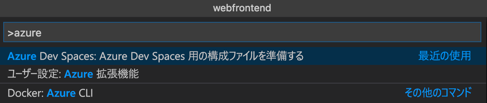

### VS Code 拡張機能によるデバッグ アセットの初期化
まず、VS Code が Azure 内の開発空間と通信するように、コード プロジェクトを構成する必要があります。 Azure Dev Spaces 用の VS Code 拡張機能は、デバッグ構成をセットアップするためのヘルパー コマンドを提供します。 

(**[表示 | コマンド パレット]** メニューを使用して) **コマンド パレット**を開き、オート コンプリートを使用して次のコマンドを入力および選択します: `Azure Dev Spaces: Prepare configuration files for Azure Dev Spaces`。 

Azure Dev Spaces 用のデバッグ構成が `.vscode` フォルダー下に追加されます。

