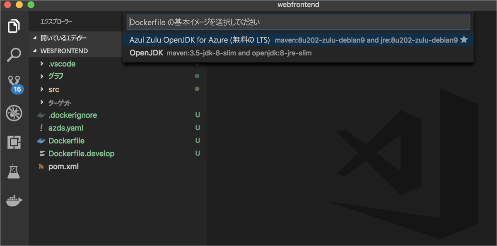
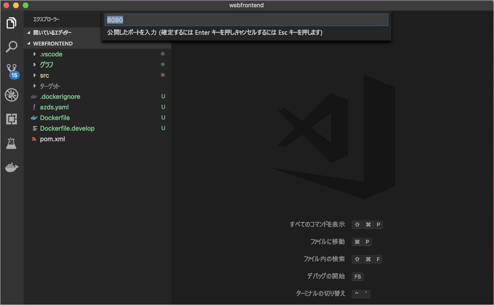
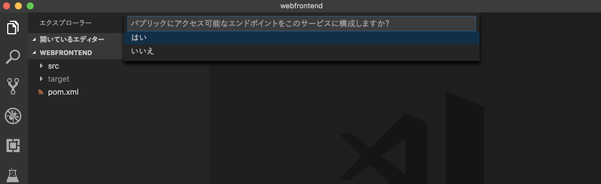
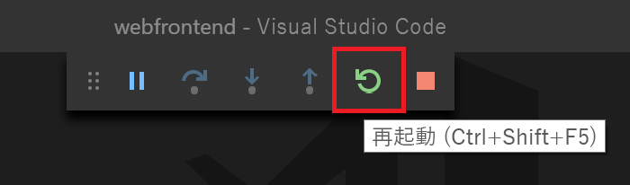

# <a name="quickstart-debug-and-iterate-on-kubernetes-with-visual-studio-code-and-java---azure-dev-spaces"></a>クイック スタート:Visual Studio Code と Java を使用して Kubernetes 上でデバッグと反復処理を行う - Azure Dev Spaces

このクイックスタートでは、マネージド Kubernetes クラスターを使用して Azure Dev Spaces を設定し、Visual Studio Code で Java アプリを使用して、コンテナー内のコードを反復的に開発およびデバッグします。 Azure Dev Spaces を使用すると、最小限の開発用マシンのセットアップで Azure Kubernetes Service (AKS) 内のアプリケーションのすべてのコンポーネントをデバッグしてテストできます。 

## <a name="prerequisites"></a>前提条件

- アクティブなサブスクリプションが含まれる Azure アカウント。 [無料でアカウントを作成できます](https://azure.microsoft.com/free/?ref=microsoft.com&utm_source=microsoft.com&utm_medium=docs&utm_campaign=visualstudio)。 
- [Java Development Kit (JDK) 1.8.0 以降](https://aka.ms/azure-jdks)。
- [Maven 3.5.0 以降](https://maven.apache.org/download.cgi)。
- [Visual Studio Code](https://code.visualstudio.com/download)。
- Visual Studio Code 用の [Azure Dev Spaces](https://marketplace.visualstudio.com/items?itemName=azuredevspaces.azds) 拡張機能と [Java Debugger for Azure Dev Spaces](https://marketplace.visualstudio.com/items?itemName=vscjava.vscode-java-debugger-azds) 拡張機能。
- [Azure CLI](/cli/azure/install-azure-cli?view=azure-cli-latest)。
- [Git](https://www.git-scm.com/downloads).

## <a name="create-an-azure-kubernetes-service-cluster"></a>Azure Kubernetes Service クラスターを作成する

[サポートされているリージョン][supported-regions]で AKS クラスターを作成する必要があります。 次のコマンドを使用すると、*MyResourceGroup* というリソース グループと *MyAKS* という AKS クラスターが作成されます。

```cmd
az group create --name MyResourceGroup --location eastus
az aks create -g MyResourceGroup -n MyAKS --location eastus --generate-ssh-keys
```

## <a name="enable-azure-dev-spaces-on-your-aks-cluster"></a>AKS クラスターで Azure Dev Spaces を有効にする

`use-dev-spaces` コマンドを使用して AKS クラスターで Dev Spaces を有効にし、プロンプトに従います。 次のコマンドを使用すると、*MyResourceGroup* グループ内の *MyAKS* クラスターで Dev Spaces が有効になり、*default* 開発空間が作成されます。

> [!NOTE]
> この `use-dev-spaces` コマンドでは、Azure Dev Spaces CLI がまだインストールされていない場合にはこれもインストールされます。 Azure Dev Spaces CLI を Azure Cloud Shell にインストールすることはできません。

```cmd
$ az aks use-dev-spaces -g MyResourceGroup -n MyAKS


'An Azure Dev Spaces Controller' will be created that targets resource 'MyAKS' in resource group 'MyResourceGroup'. Continue? (y/N): y

Creating and selecting Azure Dev Spaces Controller 'MyAKS' in resource group 'MyResourceGroup' that targets resource 'MyAKS' in resource group 'MyResourceGroup'...2m 24s

Select a dev space or Kubernetes namespace to use as a dev space.
 [1] default
Type a number or a new name: 1

Kubernetes namespace 'default' will be configured as a dev space. This will enable Azure Dev Spaces instrumentation for new workloads in the namespace. Continue? (Y/n): Y

Configuring and selecting dev space 'default'...3s

Managed Kubernetes cluster 'MyAKS' in resource group 'MyResourceGroup' is ready for development in dev space 'default'. Type `azds prep` to prepare a source directory for use with Azure Dev Spaces and `azds up` to run.
```

## <a name="get-sample-application-code"></a>サンプル アプリケーション コードを取得する

この記事では、[Azure Dev Spaces サンプル アプリケーション](https://github.com/Azure/dev-spaces)を使用して、Azure Dev Spaces の使い方のデモを行います。

GitHub からアプリケーションを複製します。

```cmd
git clone https://github.com/Azure/dev-spaces
```

## <a name="prepare-the-sample-application-in-visual-studio-code"></a>Visual Studio Code でサンプル アプリケーションを準備する

Visual Studio Code を開き、 **[ファイル]** 、 **[開く]** の順に選択し、*dev-spaces/samples/java/getting-started/webfrontend* ディレクトリに移動して、 **[開く]** を選択します。

これで、*webfrontend* プロジェクトが Visual Studio Code で開かれました。 アプリケーションをご利用の開発スペースで実行するには、コマンド パレット内の Azure Dev Spaces 拡張機能を使用して Docker および Helm チャート資産を作成します。

Visual Studio Code でコマンド パレットを開くには、 **[表示]** 、 **[コマンド パレット]** の順に選択します。 `Azure Dev Spaces` の入力を開始し、 **[Azure Dev Spaces: Prepare configuration files for Azure Dev Spaces]\(Azure Dev Spaces: Azure Dev Spaces の構成ファイルを準備する\)** を選択します。


また、Visual Studio Code で基本イメージ、公開ポート、およびパブリック エンドポイントの構成を求められたら、基本イメージに `Azul Zulu OpenJDK for Azure (Free LTS)`、公開ポートに `8080`、パブリック エンドポイントに `Yes` を選択します。







このコマンドでは、Dockerfile および Helm チャートを生成することで、ご利用のプロジェクトを Azure Dev Spaces で実行するための準備が行われます。 また、デバッグ構成が含まれた *.vscode* ディレクトリが、お客様のプロジェクトのルートに生成されます。

> [!TIP]
> プロジェクトの [Dockerfile と Helm チャート](how-dev-spaces-works.md#prepare-your-code)は、対象のコードをビルドして実行するために Azure Dev Spaces によって使用されますが、プロジェクトのビルドおよび実行方法を変更する場合は、これらのファイルを変更することができます。

## <a name="build-and-run-code-in-kubernetes-from-visual-studio-code"></a>Visual Studio Code で Kubernetes のコードをビルドして実行する

左側の **[デバッグ]** アイコンを選択し、上部の **[Launch Java Program (AZDS)]\(Java プログラムの起動 (AZDS)\)** を選択します。


このコマンドによって、Azure Dev Spaces のサービスがビルドされ、稼働します。 下部にある **[ターミナル]** ウィンドウに、Azure Dev Spaces が動作しているサービスのビルド出力と URL が表示されます。 "**デバッグ コンソール**" にログの出力が表示されます。

> [!Note]
> "**コマンド パレット**" に Azure Dev Spaces コマンドが表示されない場合は、[Azure Dev Spaces 用 Visual Studio Code 拡張機能](https://marketplace.visualstudio.com/items?itemName=azuredevspaces.azds)がインストールされていることを確認してください。 また、Visual Studio Code で *dev-spaces/samples/java/getting-started/webfrontend* ディレクトリを開いたことを確認してください。

パブリック URL を開くと、実行中のサービスを確認できます。

**[デバッグ]** 、 **[デバッグの停止]** の順に選択して、デバッガーを停止します。

## <a name="update-code"></a>コードの更新

サービスの更新バージョンをデプロイするには、ご自分のプロジェクトにある任意のファイルを更新して、 **[Launch Java Program (AZDS)]\(Java プログラムの起動 (AZDS)\)** を再実行します。 次に例を示します。

1. ご利用のアプリケーションがまだ実行されている場合は、 **[デバッグ]** 、 **[デバッグの停止]** の順に選択してそれを停止します。
1. [`src/main/java/com/ms/sample/webfrontend/Application.java` の 19 行目](https://github.com/Azure/dev-spaces/blob/master/samples/java/getting-started/webfrontend/src/main/java/com/ms/sample/webfrontend/Application.java#L19)を以下に更新します。
    
    ```java
    return "Hello from webfrontend in Azure!";
    ```

1. 変更を保存します。
1. **[Launch Java Program (AZDS)]\(Java プログラムの起動 (AZDS)\)** を再実行します。
1. 稼働中のご自分のサービスに移動して、変更を確認します。
1. **[デバッグ]** 、 **[デバッグの停止]** の順に選択して、ご自分のアプリケーションを停止します。

## <a name="setting-and-using-breakpoints-for-debugging"></a>デバッグ用のブレークポイントを設定して使用する

**[Launch Java Program (AZDS)]\(Java プログラムの起動 (AZDS)\)** を使用して、サービスを開始します。 また、これによりサービスがデバッグ モードで実行されます。

**[表示]** 、 **[エクスプローラー]** の順に選択して、 **[エクスプローラー]** ビューに戻ります。 *src/main/java/com/ms/sample/webfrontend/Application.java* を開き、19 行目のどこかをクリックして、カーソルをそこに置きます。 ブレークポイントを設定するには、**F9** キーを押すか、 **[デバッグ]** 、 **[ブレークポイントの設定/解除]** の順に選択します。

ブラウザーでサービスを開き、メッセージが表示されないことに注目します。 Visual Studio Code に戻って、19 行目が強調表示されていることを確認します。 設定したブレークポイントによって、19 行目でサービスが一時停止されました。 サービスを再開するには、**F5** キーを押すか、 **[デバッグ]** 、 **[続行]** の順に選択します。 ブラウザーに戻って、メッセージが表示されたことに注目します。

デバッガーがアタッチされた状態で Kubernetes でサービスを稼働している間、デバッグ情報 (呼び出し履歴、ローカル変数、例外情報など) にフル アクセスできます。

*src/main/java/com/ms/sample/webfrontend/Application.java* の 19 行目にカーソルを置き、**F9** キーを押すことで、ブレークポイントを削除します。

## <a name="update-code-from-visual-studio-code"></a>Visual Studio Code でコードを更新する

デバッグ モードでサービスが稼働している間に、*src/main/java/com/ms/sample/webfrontend/Application.java* の 19 行目を更新します。 次に例を示します。
```java
return "Hello from webfrontend in Azure while debugging!";
```

ファイルを保存します。 **[デバッグ]** 、 **[デバッグの再起動]** の順に選択します。または、 **[デバッグ] ツール バー**で、 **[デバッグの再起動]** ボタンを選択します。



ブラウザーでサービスを開き、更新されたメッセージが表示されることに注目します。

Azure Dev Spaces では、コードが編集されるたびに新しいコンテナー イメージをリビルドして再デプロイするのではなく、既存のコンテナー内でコードの増分再コンパイルを実行して、編集とデバッグのループを高速化します。

## <a name="clean-up-your-azure-resources"></a>Azure リソースをクリーンアップする

```cmd
az group delete --name MyResourceGroup --yes --no-wait
```

## <a name="next-steps"></a>次のステップ

Azure Dev Spaces を使用して複数のコンテナーにまたがるより複雑なアプリケーションを開発する方法と、別の空間で別のバージョンまたは分岐を使用して作業することによって共同開発を簡略化する方法について学習します。

> [!div class="nextstepaction"]
> [複数のコンテナーの操作とチーム開発](multi-service-java.md)


[supported-regions]: https://azure.microsoft.com/global-infrastructure/services/?products=kubernetes-service
