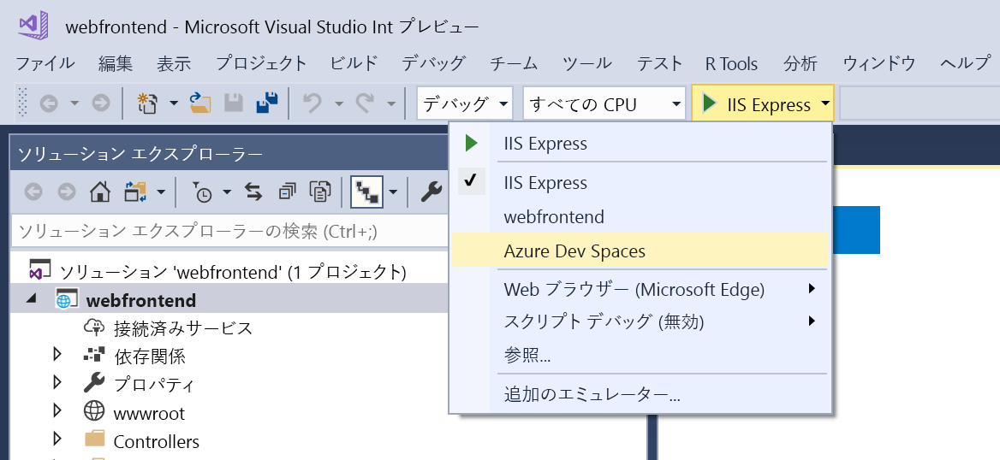
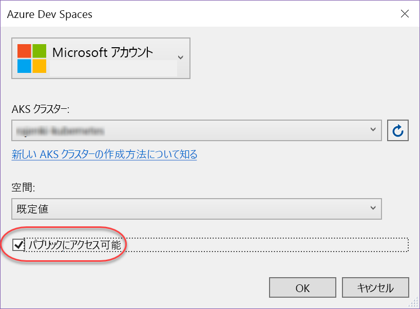
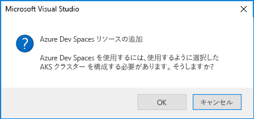
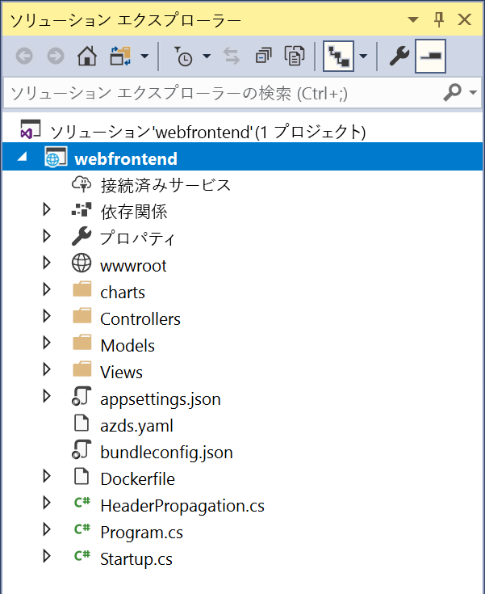

# クイック スタート: Azure Dev Spaces を使用して Kubernetes 開発環境を作成する (.NET Core および Visual Studio)

このガイドでは、以下の方法について説明します。

- Azure でマネージド Kubernetes クラスターを使用して Azure Dev Spaces をセットアップする。
- Visual Studio を使用して、コンテナー内のコードを繰り返し開発する。
- クラスターで実行されるコードをデバッグする。

> [!Note]
> **問題が発生した場合は**いつでも、「[トラブルシューティング](troubleshooting.md)」セクションを参照するか、このページでコメントを投稿してください。 より詳細な[チュートリアル](get-started-netcore-visualstudio.md)を試すこともできます。

## 前提条件

- 米国東部、米国中部、米国西部 2、西ヨーロッパ、カナダ中部、カナダ東部のいずれかのリージョンに存在し、[HTTP アプリケーションのルーティング] が有効になっていて、Kubernetes 1.10.3 を実行する Kubernetes クラスター。

  ![[Http アプリケーションのルーティング] が有効であることを確認してください。](media/common/Kubernetes-Create-Cluster-3.PNG)

- Web 開発ワークロードがインストールされている Visual Studio 2017。 インストールしていない場合は、[ここから](https://aka.ms/vsdownload?utm_source=mscom&utm_campaign=msdocs)ダウンロードします。

## Azure Dev Spaces をセットアップする

[Visual Studio Tools for Kubernetes](https://aka.ms/get-azds-visualstudio) をインストールします。

## クラスターへの接続

次に、Azure Dev Spaces 用のプロジェクトを作成して構成します。

### ASP.NET Web アプリを作成する

Visual Studio 2017 で、新しいプロジェクトを作成します。 現時点では、このプロジェクトは **ASP.NET Core Web アプリケーション**である必要があります。 プロジェクトに **webfrontend** という名前を付けます。

**[Web アプリケーション (モデル ビュー コントローラー)]** テンプレートを選択し、**.NET Core** と **ASP.NET Core 2.0** が対象になっていることを確認します。

### AKS クラスターの開発空間を有効にする

先ほど作成したプロジェクトに対し、次の図のように、起動設定のドロップダウンから **[Azure Dev Spaces]** を選択します。

次に表示されるダイアログで、適切なアカウントでサインインしていることを確認し、既存のクラスターを選択します。

現時点では、**[スペース]** ドロップダウンは `default` のままにしておきます。 パブリック エンドポイント経由で Web アプリにアクセスできるように、**[Publicly Accessible]\(パブリックにアクセス可能\)** チェック ボックスをオンにします。

**[OK]** をクリックして、クラスターを選択または作成します。

Azure Dev Spaces と共に動作するように構成されていないクラスターを選択すると、クラスターを構成するかどうかをたずねるメッセージが表示されます。

**[OK]** を選択します。 

### プロジェクトに追加されたファイルを確認する
開発空間が作成されるのを待っている間に、Azure Dev Spaces を使用することを選択したときにプロジェクトに追加されたファイルを確認しておきましょう。

- `charts` という名前のフォルダーが追加されています。このフォルダー内にアプリケーションの [Helm チャート](https://docs.helm.sh)がスキャフォールディングされています。 これらのファイルは、アプリケーションを開発空間に展開するために使用されます。
- `Dockerfile` には、標準の Docker 形式でアプリケーションをパッケージ化するために必要な情報が含まれています。
- `azds.yaml` には、開発空間で必要となる開発時の構成が含まれています。

## Kubernetes でコンテナーをデバッグする
開発空間が正常に作成されたら、アプリケーションをデバッグすることができます。 コードにブレークポイントを設定します。たとえば、`HomeController.cs` ファイルの 20 行目 (`Message` 変数が設定されている行) に設定します。 **F5** キーを押してデバッグを開始します。 

Visual Studio は開発空間と通信してアプリケーションをビルドして展開した後、ブラウザーを開いて Web アプリを実行します。 コンテナーはローカルで実行されているように見えますが、実際には Azure の開発空間で実行されています。 localhost アドレスであるのは、Azure Dev Spaces では AKS で実行されているコンテナーへの一時的な SSH トンネルが作成されるためです。

ページの上部にある **[About]\(バージョン情報\)** リンクをクリックすると、ブレークポイントがトリガーされます。 コードがローカルで実行されている場合と同様に、デバッグ情報 (呼び出し履歴、ローカル変数、例外情報など) にフル アクセスできます。

## 反復的にコードを開発する

Azure Dev Spaces は、Kubernetes でコードを実行するだけのものではありません。Azure Dev Spaces を使用すると、クラウドの Kubernetes 環境でコードの変更が有効になっていることをすぐに繰り返し確認できるようになります。

### コンテンツ ファイルを更新する
1. `./Views/Home/Index.cshtml` ファイルを見つけ、HTML を編集します。 たとえば、70 行目の `<h2>Application uses</h2>` を `<h2>Hello k8s in Azure!</h2>` のように変更します。
1. ファイルを保存します。
1. ブラウザーに移動し、ページを更新します。 Web ページに更新された HTML が表示されます。

なぜでしょうか? HTML や CSS などのコンテンツ ファイルを編集しても、.NET Core Web アプリで再コンパイルする必要はありません。アクティブな F5 セッションによって、変更されたコンテンツ ファイルが AKS で実行中のコンテナーに自動的に同期されるので、編集後のコンテンツをすぐに確認できます。

### コード ファイルを更新する
コード ファイルを更新するには、.NET Core アプリを再ビルドし、更新されたアプリケーション バイナリを生成する必要があるため、もう少し作業が必要です。

1. Visual Studio のデバッガーを停止します。
1. `Controllers/HomeController.cs` という名前のコード ファイルを開き、About ページに表示されるメッセージ (`ViewData["Message"] = "Your application description page.";`) を編集します。
1. ファイルを保存します。
1. **F5** キーを押して再度デバッグを開始します。 

コードを編集するたびに新しいコンテナー イメージを再構築して再展開すると、多くの場合、かなりの時間がかかります。Azure Dev Spaces では、代わりに既存のコンテナー内でコードの増分再コンパイルを実行することで、編集/デバッグ ループを高速化します。

ブラウザーで Web アプリを更新し、About ページに移動します。 UI にカスタム メッセージが表示されます。

## 次の手順

> [!div class="nextstepaction"]
> [複数のコンテナーの操作とチーム開発](team-development-netcore-visualstudio.md)