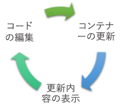
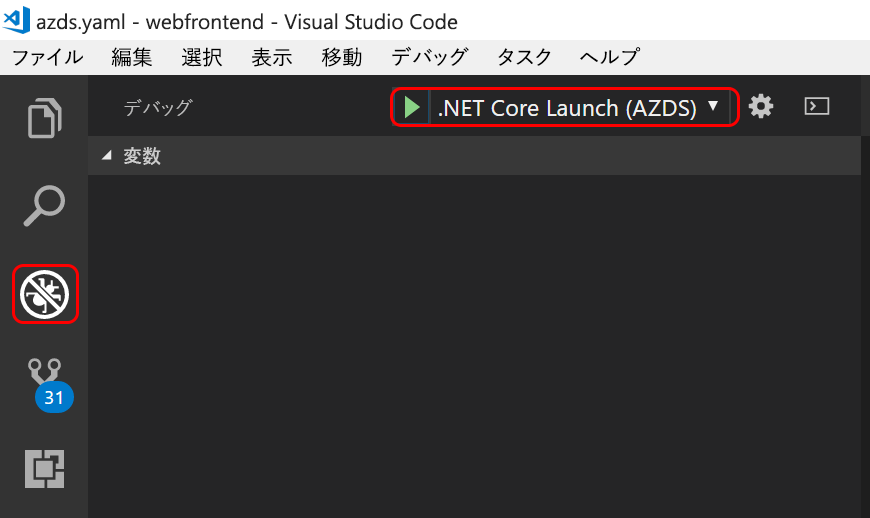

# <a name="quickstart-create-a-kubernetes-dev-space-with-azure-dev-spaces-net-core-and-vs-code"></a>クイック スタート: Azure Dev Spaces を使用して Kubernetes 開発環境を作成する (.NET Core および VS Code)

このガイドでは、以下の方法について説明します。

- Azure でマネージド Kubernetes クラスターを使用して Azure Dev Spaces をセットアップする。
- VS Code とコマンド ラインを使用して、コンテナー内のコードを繰り返し開発する。
- VS Code から開発空間のコードをデバッグする。

> [!Note]
> **問題が発生した場合は**いつでも、「[トラブルシューティング](troubleshooting.md)」セクションを参照するか、このページでコメントを投稿してください。 より詳細な[チュートリアル](get-started-netcore.md)を試すこともできます。

## <a name="prerequisites"></a>前提条件

- Azure サブスクリプション。 アカウントがない場合は、[無料アカウントを作成する](https://azure.microsoft.com/free)ことができます。
- 米国東部、米国中部、米国西部 2、西ヨーロッパ、カナダ中部、カナダ東部のいずれかのリージョンに存在し、[[HTTP アプリケーションのルーティング]](https://ms.portal.azure.com/#create/microsoft.aks) が有効になっていて、Kubernetes 1.10.3 を実行する **Kubernetes クラスター**。

  ![[Http アプリケーションのルーティング] が有効であることを確認してください。](media/common/Kubernetes-Create-Cluster-3.PNG)

- [Visual Studio Code](https://code.visualstudio.com/download)。

## <a name="set-up-azure-dev-spaces"></a>Azure Dev Spaces をセットアップする

Azure CLI と Azure Dev Spaces 拡張機能は、Windows、Mac、Linux のいずれかのマシンにインストールして実行できます。 Linux では、Ubuntu (18.04、16.04、14.04)、Debian 8、Debian 9、RHEL 7、Fedora 26+、CentOS 7、openSUSE 42.2、SLES 12 の各ディストリビューションがサポートされます。

Azure Dev Spaces を設定するには、次の手順に従います。

1. [Azure CLI](/cli/azure/install-azure-cli?view=azure-cli-latest) (バージョン 2.0.38 以降) をインストールします。
1. AKS クラスターに Dev Spaces をセットアップします。`az aks use-dev-spaces -g MyResourceGroup -n MyAKS`
1. VS Code 用の[Azure Dev Spaces 拡張機能](https://marketplace.visualstudio.com/items?itemName=azuredevspaces.azds)をダウンロードします。 拡張機能の Marketplace ページで [インストール] を 1 回クリックし、VS Code でもう一度クリックします。

## <a name="build-and-run-code-in-kubernetes"></a>Kubernetes でコードをビルドして実行する

1. GitHub からサンプル コードをダウンロードします。[https://github.com/Azure/dev-spaces](https://github.com/Azure/dev-spaces) 
1. ディレクトリを webfrontend フォルダーに変更します。`cd dev-spaces/samples/dotnetcore/getting-started/webfrontend`
1. Docker と Helm チャート資産を生成します。`azds prep --public`
1. AKS でコードをビルドして実行します。 ターミナル ウィンドウで、**Webfrontend フォルダー**から `azds up` コマンドを実行します。
1. コンソールの出力をスキャンして、`up` コマンドによって作成された URL に関する情報を探します。 形式は次のようになります。 

   `Service 'webfrontend' port 'http' is available at <url>` 

   ブラウザー ウィンドウでこの URL を開くと、Web アプリ ロードが表示されるはずです。 
   
   > [!Note]
   > 最初の実行では、パブリック DNS が準備されるまでに数分かかることがあります。 公開 URL が解決されない場合は、コンソール出力に表示される代替 http://localhost:<portnumber> URL を使用することができます。 localhost URL を使用する場合、コンテナーはローカルで実行されているように見えるかもしれませんが、実際には AKS で実行されています。 利便性を考慮し、また、ローカル コンピューターからのサービスとの対話を容易にするために、Azure Dev Spaces では、Azure で実行されているコンテナーへの一時的な SSH トンネルが作成されます。 後で DNS レコードが準備できたら、戻って公開 URL を試してみることができます。

### <a name="update-a-content-file"></a>コンテンツ ファイルを更新する

1. `./Views/Home/Index.cshtml` などのファイルを見つけ、HTML を編集します。 たとえば、70 行目の `<h2>Application uses</h2>` を `<h2>Hello k8s in Azure!</h2>` のように変更します。
1. ファイルを保存します。 しばらくすると、ターミナル ウィンドウに、実行中のコンテナー内のファイルが更新されたことを示すメッセージが表示されます。
1. ブラウザーに移動し、ページを更新します。 Web ページに更新された HTML が表示されます。

なぜでしょうか? HTML や CSS などのコンテンツ ファイルを編集しても、.NET Core Web アプリで再コンパイルする必要はありません。アクティブな `azds up` コマンドによって、変更されたコンテンツ ファイルが Azure で実行中のコンテナーに自動的に同期されるので、編集後のコンテンツをすぐに確認できます。

### <a name="update-a-code-file"></a>コード ファイルを更新する
コード ファイルを更新するには、.NET Core アプリを再ビルドし、更新されたアプリケーション バイナリを生成する必要があるため、もう少し作業が必要です。

1. ターミナル ウィンドウで `Ctrl+C` キーを押します (`azds up`を停止します)。
1. `Controllers/HomeController.cs` という名前のコード ファイルを開き、About ページに表示されるメッセージ (`ViewData["Message"] = "Your application description page.";`) を編集します。
1. ファイルを保存します。
1. ターミナル ウィンドウで `azds up` を実行します。 

このコマンドにより、コンテナー イメージが再ビルドされ、Helm チャートが再デプロイされます。 コードの変更が実行中のアプリケーションに反映されていることを確認するには、Web アプリの [About]\(バージョン情報\) メニューに移動します。

コードを開発するさらに "*迅速な方法*" があります。これについては、次のセクションで説明します。 

## <a name="debug-a-container-in-kubernetes"></a>Kubernetes でコンテナーをデバッグする

このセクションでは、VS Code を使用して、Azure で実行されるコンテナーを直接デバッグします。 編集、実行、テストを高速で繰り返す方法についても説明します。



### <a name="initialize-debug-assets-with-the-vs-code-extension"></a>VS Code 拡張機能によるデバッグ アセットの初期化
まず、VS Code が Azure 内の開発空間と通信するように、コード プロジェクトを構成する必要があります。 Azure Dev Spaces 用の VS Code 拡張機能は、デバッグ構成をセットアップするためのヘルパー コマンドを提供します。 

(**[表示 | コマンド パレット]** メニューを使用して) **コマンド パレット**を開き、オート コンプリートを使用して次のコマンドを入力および選択します: `Azure Dev Spaces: Prepare configuration files for Azure Dev Spaces`。 

Azure Dev Spaces 用のデバッグ構成が `.vscode` フォルダー下に追加されます。


### <a name="select-the-azds-debug-configuration"></a>AZDS デバッグ構成を選択する
1. VS Code の左側の**アクティビティ バー**で、[デバッグ] アイコンをクリックしてデバッグ ビューを開きます。
1. アクティブなデバッグ構成として、**[.NET Core Launch (AZDS)]\(.NET Core の起動 (AZDS)\)** を選択します。



> [!Note]
> コマンド パレットに Azure Dev Spaces コマンドが表示されない場合は、Azure Dev Spaces 用 VS Code 拡張機能がインストールされていることを確認してください。 VS Code で開いているワークスペースが、azds.yaml が含まれているフォルダーであることを確認します。


### <a name="debug-the-container-in-kubernetes"></a>Kubernetes でコンテナーをデバッグする
**F5** キーを押して、Kubernetes でコードをデバッグします。

`up` コマンドと同様に、コードが開発空間に同期され、コンテナーがビルドされて Kubernetes にデプロイされます。 今回は、デバッガーがリモート コンテナーにアタッチされます。

> [!Tip]
> VS Code のステータス バーに、クリック可能な URL が表示されます。

サーバー側のコード ファイル (たとえば、`Controllers/HomeController.cs` ソース ファイルの `Index()` 関数内) にブレークポイントを設定します。 ブラウザーのページを更新すると、ブレークポイントに到達します。

コードがローカルで実行されている場合と同様に、デバッグ情報 (呼び出し履歴、ローカル変数、例外情報など) にフル アクセスできます。

### <a name="edit-code-and-refresh"></a>コードを編集して更新する
デバッガーをアクティブにしてコードを編集します。 たとえば、`Controllers/HomeController.cs` で About ページのメッセージを変更します。 

```csharp
public IActionResult About()
{
    ViewData["Message"] = "My custom message in the About page.";
    return View();
}
```

ファイルを保存し、**デバッグ操作ウィンドウ**で **[最新の情報に更新]** ボタンをクリックします。 


コードを編集するたびに新しいコンテナー イメージを再構築して再展開すると、多くの場合、かなりの時間がかかります。Azure Dev Spaces では、代わりに既存のコンテナー内でコードの増分再コンパイルを実行することで、編集/デバッグ ループを高速化します。

ブラウザーで Web アプリを更新し、About ページに移動します。 UI にカスタム メッセージが表示されます。

**これで、コードを迅速に反復処理し、Kubernetes で直接デバッグできるようになりました。**

## <a name="next-steps"></a>次の手順

Azure Dev Spaces を使用して複数のコンテナーにまたがるより複雑なアプリを開発する方法と、別の空間で別のバージョンまたは分岐を使用して作業することによって共同開発を簡略化する方法について学習します。 

> [!div class="nextstepaction"]
> [複数のコンテナーの操作とチーム開発](team-development-netcore.md)
