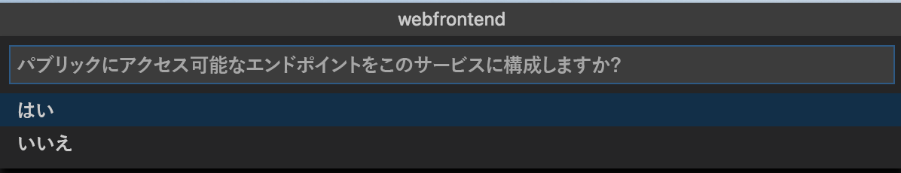
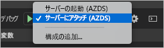

# <a name="quickstart-develop-with-nodejs-on-kubernetes-using-azure-dev-spaces"></a>クイック スタート:Azure Dev Spaces を使用して Kubernetes 上で Node.js の開発を行う

このガイドでは、以下の方法について説明します。

- Azure でマネージド Kubernetes クラスターを使用して Azure Dev Spaces をセットアップする。
- Visual Studio Code を使用して、コンテナー内のコードを繰り返し開発する。
- Visual Studio Code で開発空間のコードをデバッグする。

## <a name="prerequisites"></a>前提条件

- Azure サブスクリプション。 Azure サブスクリプションをお持ちでない場合は、[無料のアカウント](https://azure.microsoft.com/free)を作成できます。
- [Visual Studio Code がインストールされていること](https://code.visualstudio.com/download)。
- Visual Studio Code 用の [Azure Dev Spaces](https://marketplace.visualstudio.com/items?itemName=azuredevspaces.azds) 拡張機能がインストールされていること。
- [Azure CLI がインストールされていること](/cli/azure/install-azure-cli?view=azure-cli-latest)。

## <a name="create-an-azure-kubernetes-service-cluster"></a>Azure Kubernetes Service クラスターを作成する

[サポートされているリージョン][supported-regions]で AKS クラスターを作成する必要があります。 下記のコマンドを使用すると、*MyResourceGroup* というリソース グループと *MyAKS* という AKS クラスターが作成されます。

```cmd
az group create --name MyResourceGroup --location eastus
az aks create -g MyResourceGroup -n MyAKS --location eastus --node-vm-size Standard_DS2_v2 --node-count 1 --disable-rbac --generate-ssh-keys
```

## <a name="enable-azure-dev-spaces-on-your-aks-cluster"></a>AKS クラスターで Azure Dev Spaces を有効にする

`use-dev-spaces` コマンドを使用して AKS クラスターで Dev Spaces を有効にし、プロンプトに従います。 下記のコマンドを使用すると、*MyResourceGroup* グループ内の *MyAKS* クラスターで Dev Spaces が有効になり、*default* 開発空間が作成されます。

```cmd
$ az aks use-dev-spaces -g MyResourceGroup -n MyAKS

'An Azure Dev Spaces Controller' will be created that targets resource 'MyAKS' in resource group 'MyResourceGroup'. Continue? (y/N): y

Creating and selecting Azure Dev Spaces Controller 'MyAKS' in resource group 'MyResourceGroup' that targets resource 'MyAKS' in resource group 'MyResourceGroup'...2m 24s

Select a dev space or Kubernetes namespace to use as a dev space.
 [1] default
Type a number or a new name: 1

Kubernetes namespace 'default' will be configured as a dev space. This will enable Azure Dev Spaces instrumentation for new workloads in the namespace. Continue? (Y/n): Y

Configuring and selecting dev space 'default'...3s

Managed Kubernetes cluster 'MyAKS' in resource group 'MyResourceGroup' is ready for development in dev space 'default'. Type `azds prep` to prepare a source directory for use with Azure Dev Spaces and `azds up` to run.
```

## <a name="get-sample-application-code"></a>サンプル アプリケーション コードを取得する

この記事では、[Azure Dev Spaces サンプル アプリケーション](https://github.com/Azure/dev-spaces)を使用して、Azure Dev Spaces の使い方のデモを行います。

GitHub からアプリケーションを複製します。

```cmd
git clone https://github.com/Azure/dev-spaces
```

## <a name="prepare-the-sample-application-in-visual-studio-code"></a>Visual Studio Code でサンプル アプリケーションを準備する

Visual Studio Code を開き、 *[ファイル]* 、 *[開く]* の順にクリックし、*dev-spaces/samples/nodejs/getting-started/webfrontend* ディレクトリに移動して、 *[開く]* をクリックします。

これで、*webfrontend* プロジェクトが Visual Studio Code で開かれました。 アプリケーションをご利用の開発スペースで実行するには、コマンド パレット内の Azure Dev Spaces 拡張機能を使用して Docker および Helm チャート資産を生成します。

Visual Studio Code でコマンド パレットを開くには、 *[表示]* 、 *[コマンド パレット]* の順にクリックします。 「`Azure Dev Spaces`」の入力を開始して、`Azure Dev Spaces: Prepare configuration files for Azure Dev Spaces` をクリックします。


また Visual Studio Code からパブリック エンドポイントを構成するように求められた場合は、`Yes` を選択してパブリック エンドポイントを有効にします。



このコマンドでは、Dockerfile および Helm チャートを生成することで、ご利用のプロジェクトを Azure Dev Spaces で実行するための準備が行われます。 また、デバッグ構成が含まれた *.vscode* ディレクトリが、お客様のプロジェクトのルートに生成されます。

## <a name="build-and-run-code-in-kubernetes-from-visual-studio-code"></a>Visual Studio Code で Kubernetes のコードをビルドして実行する

左側の *[デバッグ]* アイコンをクリックし、上部の *[Launch Server (AZDS)]\(サーバーの起動 (AZDS)\)* をクリックします。


このコマンドによって、Azure Dev Spaces のサービスがビルドされ、稼働します。 下部にある *[ターミナル]* ウィンドウに、Azure Dev Spaces が動作しているサービスのビルド出力と URL が表示されます。 "*デバッグ コンソール*" にログの出力が表示されます。

> [!Note]
> "*コマンド パレット*" に Azure Dev Spaces コマンドが表示されない場合は、[Azure Dev Spaces 用 Visual Studio Code 拡張機能](https://marketplace.visualstudio.com/items?itemName=azuredevspaces.azds)がインストールされていることを確認してください。 また、Visual Studio Code で *dev-spaces/samples/nodejs/getting-started/webfrontend* ディレクトリを開いたことを確認してください。

パブリック URL を開くと、実行中のサービスを確認できます。

*[デバッグ]* 、 *[デバッグの停止]* の順にクリックして、デバッガーを停止します。

## <a name="update-code"></a>コードの更新

サービスの更新バージョンをデプロイするには、ご自分のプロジェクトにある任意のファイルを更新して、 *[Launch Server]\(サーバーの起動\)* を再実行します。 例:

1. ご利用のアプリケーションがまだ実行されている場合は、 *[デバッグ]* 、 *[デバッグの停止]* の順にクリックしてそれを停止します。
1. [`server.js` の 13 行目](https://github.com/Azure/dev-spaces/blob/master/samples/nodejs/getting-started/webfrontend/server.js#L13)を以下に更新します。
    
    ```javascript
        res.send('Hello from webfrontend in Azure');
    ```

1. 変更を保存します。
1. *[Launch Server]\(サーバーの起動\)* を再実行します。
1. 稼働中のご自分のサービスに移動して、変更を確認します。
1. *[デバッグ]* 、 *[デバッグの停止]* の順にクリックして、ご自分のアプリケーションを停止します。

## <a name="setting-and-using-breakpoints-for-debugging"></a>デバッグ用のブレークポイントを設定して使用する

*[Launch Server (AZDS)]\(サーバーの起動 (AZDS)\)* を使用して、サービスを開始します。

*[表示]* 、 *[エクスプローラー]* の順にクリックして、 *[エクスプローラー]* ビューに戻ります。 `server.js` を開き、13 行目のどこかをクリックして、カーソルをそこに置きます。 ブレークポイントを設定するには、*F9* キーを押すか、 *[デバッグ]* 、 *[ブレークポイントの設定/解除]* の順にクリックします。

ブラウザーでサービスを開き、メッセージが表示されないことに注目します。 Visual Studio Code に戻って、13 行目が強調表示されていることを確認します。 設定したブレークポイントによって、13 行目でサービスが一時停止されました。 サービスを再開するには、*F5* キーを押すか、 *[デバッグ]* 、 *[続行]* の順にクリックします。 ブラウザーに戻って、メッセージが表示されたことに注目します。

デバッガーがアタッチされた状態で Kubernetes でサービスを稼働している間、デバッグ情報 (呼び出し履歴、ローカル変数、例外情報など) にフル アクセスできます。

`server.js` の 13 行目にカーソルを置いて *F9* キーを押すことで、ブレークポイントを削除します。

*[デバッグ]* 、 *[デバッグの停止]* の順にクリックして、デバッガーを停止します。

## <a name="update-code-from-visual-studio-code"></a>Visual Studio Code でコードを更新する

デバッグ モードを *[Attach to a Server (AZDS)]\(サーバーへのアタッチ (AZDS)\)* に変更して、サービスを開始します。



このコマンドによって、Azure Dev Spaces のサービスがビルドされ、稼働します。 また、サービスのコンテナーで [nodemon](https://nodemon.io) プロセスが開始され、VS Code がそれにアタッチされます。 *nodemon* プロセスでは、ソース コードに変更が加えられた際の自動再起動が可能であり、自分のローカル コンピューターでの開発と同様のより高速な内部ループ開発が実現します。

サービスの開始後、ブラウザーを使用してそこに移動し、それを操作します。

サービスが稼働している間に、VS Code に戻って `server.js` の 13 行目を更新します。 例:
```javascript
    res.send('Hello from webfrontend in Azure while debugging!');
```

ファイルを保存して、ブラウザーでサービスに戻ります。 サービスを操作して、更新されたメッセージが表示されることに注目します。

*nodemon* の実行中、コードの変更が検出されると、すぐに Node プロセスが自動的に再起動されます。 この自動再起動プロセスは、自分のローカル コンピューターでサービスを編集して再起動するエクスペリエンスに似ていて、内部ループ開発エクスペリエンスを提供します。

## <a name="clean-up-your-azure-resources"></a>Azure リソースをクリーンアップする

```cmd
az group delete --name MyResourceGroup --yes --no-wait
```

## <a name="next-steps"></a>次の手順

Azure Dev Spaces を使用して複数のコンテナーにまたがるより複雑なアプリケーションを開発する方法と、別の空間で別のバージョンまたは分岐を使用して作業することによって共同開発を簡略化する方法について学習します。

> [!div class="nextstepaction"]
> [複数のコンテナーの操作とチーム開発](multi-service-nodejs.md)


[supported-regions]: about.md#supported-regions-and-configurations