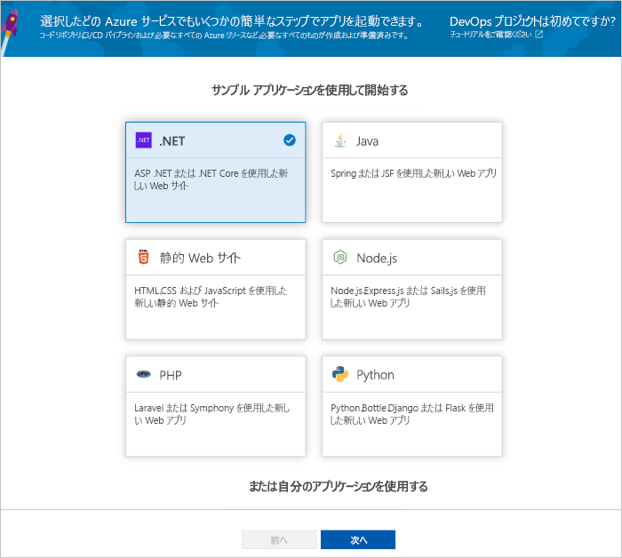
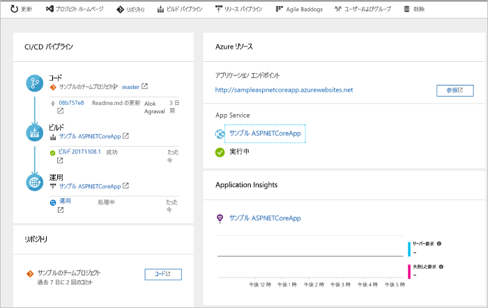
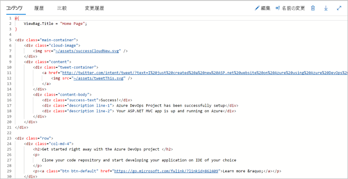
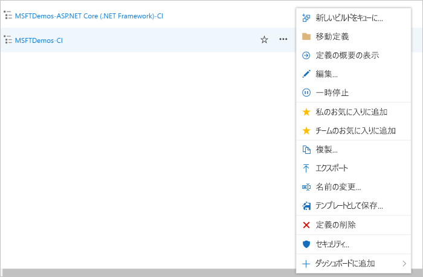

# Azure DevOps Projects を使用して .NET 用 CI/CD パイプラインを作成する

DevOps Projects を使用して、.NET Core または ASP.NET アプリケーション用に継続的インテグレーション (CI) と継続的デリバリー (CD) を構成します。 DevOps Projects によって、Azure Pipelines のビルドおよびリリース パイプラインの初期構成が簡略化されます。

Azure サブスクリプションをお持ちでない場合は、[Visual Studio Dev Essentials](https://visualstudio.microsoft.com/dev-essentials/) を通じて無料で取得できます。

## Azure portal にサインインします

DevOps Projects によって、Azure DevOps に CI/CD パイプラインが作成されます。 新しい Azure DevOps 組織を作成するか、既存の組織を使用できます。 DevOps Projects では、選択した Azure サブスクリプションに Azure リソースも作成されます。

1. [Microsoft Azure ポータル](https://portal.azure.com)にサインインします。

1. 左側のウィンドウで **[リソースの作成]** アイコンを選択し、**DevOps Projects** を検索します。  

3.  **作成** を選択します。

    

## サンプル アプリケーションと Azure サービスを選択する

1. **.NET** サンプル アプリケーションを選択します。 .NET のサンプルには、オープン ソースの ASP.NET Framework またはクロスプラットフォームの .NET Core Framework のいずれかの選択肢が含まれます。

   

2. このサンプルは、ASP.NET Core MVC アプリケーションです。 **.NET Core** アプリケーション フレームワークを選択し、 **[次へ]** を選択します。    
    
3. デプロイ ターゲットとして **[Windows Web アプリ]** を選択し、 **[次へ]** を選択します。 必要に応じて、デプロイ用に他の Azure サービスを選択できます。 前に選択したアプリケーション フレームワークによって、ここで使用可能な Azure サービスのデプロイ ターゲットの種類が決まります。

## Azure DevOps と Azure サブスクリプションを構成する 

1. **プロジェクト名**を入力します。

2. 新しい無料の **Azure DevOps 組織**を作成するか、ドロップダウンから既存の組織を選択します。

3. 自分の **Azure サブスクリプション**を選択し、**Web アプリ**の名前を入力するか既定のままにしてから、 **[完了]** を選択します。 数分後、DevOps Projects のデプロイの概要が Azure portal に表示されます。 

4. **[リソースに移動]** を選択して、DevOps Projects ダッシュボードを表示します。 すばやくアクセスできるように、右上隅で、**プロジェクト**をダッシュ​​ボードにピン留めします。 サンプル アプリが **Azure DevOps 組織**のリポジトリに設定されます。 ビルドが実行され、アプリが Azure にデプロイされます。

5. ダッシュボードでは、コード リポジトリ、CI/CD パイプライン、および Azure のアプリが可視化されます。 右側の Azure リソースの下の **[参照]** を選択すると、実行中のアプリが表示されます。

    

## コードの変更をコミットし、CI/CD を実行する

DevOps Projects によって、Azure Repos または GitHub に Git リポジトリが作成されました。 リポジトリを表示し、アプリケーションにコード変更を加えるには、次の手順に従います。

1. DevOps Projects ダッシュボードの左側にある**マスター**分岐のリンクを選択します。 このリンクは、新しく作成された Git リポジトリのビューを開きます。

2. 次のいくつかの手順では、Web ブラウザーを使用して**マスター** ブランチに直接コード変更を行い、コミットできます。 リポジトリ ページの右上の **[Clone]\(複製\)** を選択して、Git リポジトリをお気に入りの IDE に複製することもできます。 

3. 左側で、アプリケーション ファイル構造の中の **Application/aspnet-core-dotnet-core/Pages/Index.cshtml** に移動します。

4. **[編集]** を選択し、h2 見出しに変更を加えます。 たとえば、「**Azure DevOps Projects を今すぐ開始**」と入力したり、その他の変更を加えたりします。

      

5. **[コミット]** を選択し、コメントを入力してから **[コミット]** をもう一度選択します。

6. ブラウザーで、Azure DevOps Projects ダッシュボードに移動します。  ビルドが進行中であることが表示されます。 行った変更は、CI/CD パイプラインを介して自動的にビルドおよびデプロイされます。

## CI/CD パイプラインを確認する

前の手順で、Azure DevOps Projects によって完全な CI/CD パイプラインが自動的に構成されました。 パイプラインを探索し、必要に応じてカスタマイズします。 Azure DevOps のビルドおよびリリース パイプラインについて理解するには、次の手順を行います。

1. DevOps Projects ダッシュボードの上部の **[ビルド パイプライン]** を選択します。  
このリンクによって、ブラウザーのタブが開かれ、新しいプロジェクトの Azure DevOps ビルド パイプラインが表示されます。

1. 省略記号 (...) を選択します。この操作により、キューへの新しいビルドの挿入、ビルドの一時停止、ビルド パイプラインの編集などのいくつかのアクティビティを開始できるメニューが開きます。

1. **[編集]** を選択します。

    

1. このウィンドウで、ビルド パイプラインのさまざまなタスクを調べることができます。  
 ビルドでは、Git リポジトリからのソースのフェッチ、依存関係の復元、デプロイに使用した出力の発行など、さまざまなタスクが実行されます。

1. ビルド パイプラインの上部で、ビルド パイプラインの名前を選択します。

1. ビルド パイプラインの名前をよりわかりやすい名前に変更し、 **[保存してキューに登録]** を選択して、 **[保存]** を選択します。

1. ご自身のビルド パイプラインの名前の下で、 **[履歴]** を選択します。   
**[履歴]** ウィンドウに、ビルドの最近の変更の監査証跡が表示されます。  ビルド パイプラインに対するすべての変更が Azure Pipelines によって追跡されるため、各バージョンを比較できます。

1. **[トリガー]** を選択します。  
DevOps Projects では、CI トリガーが自動的に作成され、リポジトリに対してコミットするたびに新しいビルドが開始されます。  必要に応じて、CI プロセスのブランチを含めるか除外するかを選択できます。

1. **[保持]** を選択します。  
シナリオに基づいて、特定の数のビルドを保持または削除するポリシーを指定できます。

1. **[ビルドとリリース]** を選択し、 **[リリース]** を選択します。  
DevOps Projects により、Azure へのデプロイを管理するリリース パイプラインが作成されます。

1.  左側で、リリース パイプラインの横にある省略記号 (...) を選択し、 **[編集]** を選択します。  
リリース パイプラインには、リリース プロセスを定義するパイプラインが含まれています。  

1. **[成果物]** で、 **[ドロップ]** を選択します。  前の手順で調べたビルド パイプラインでは、成果物に使用される出力が生成されます。 

1. **[ドロップ]** アイコンの横にある **[継続的配置トリガー]** を選択します。  
このリリース パイプラインには、新しいビルド成果物が使用可能になるたびにデプロイを実行する有効な CD トリガーがあります。 必要に応じて、手動でのデプロイが必須となるように、トリガーを無効にすることができます。  

1. 左側の **[タスク]** を選択します。   
タスクは、デプロイ プロセスによって実行されるアクティビティです。 この例では、Azure App Service にデプロイするタスクが作成されました。

1. 右側の **[リリースの表示]** を選択します。 このビューには、リリースの履歴が表示されます。

1. いずれかのリリースの横にある省略記号 (...) を選択し、 **[開く]** を選択します。  
リリース概要、関連付けられた作業項目、テストなど、調べる必要があるいくつかのメニューがあります。

1. **[コミット]** を選択します。   
このビューには、特定のデプロイに関連付けられているコードのコミットが表示されます。 

1. **[ログ]** を選択します。  
ログには、デプロイ プロセスに関する有用な情報が含まれます。 これらは、デプロイ中とデプロイ後の両方に表示できます。

## リソースのクリーンアップ

作成した Azure App Service とその他の関連リソースが必要なくなったら、削除してかまいません。 DevOps Projects ダッシュボードで**削除**機能を使用します。

## 次の手順

チームのニーズを満たすためのビルドおよびリリース パイプラインの変更について詳しくは、このチュートリアルをご覧ください。

> [!div class="nextstepaction"]
> [CD プロセスをカスタマイズする](https://docs.microsoft.com/azure/devops/pipelines/release/define-multistage-release-process?view=vsts)

## ビデオ

> [!VIDEO https://www.youtube.com/embed/itwqMf9aR0w]
