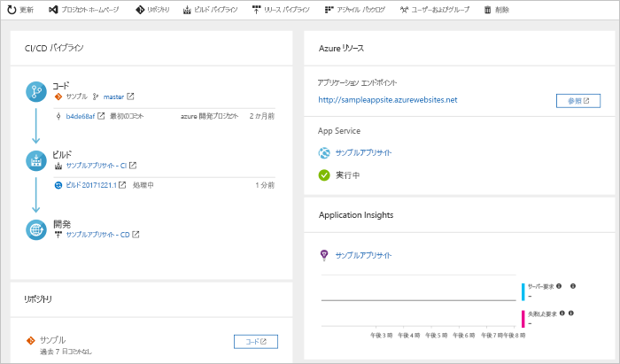

# Azure DevOps Projects を使用して Go 用の CI/CD パイプラインを作成する

Azure DevOps Projects を使用して、Go アプリ用に継続的インテグレーション (CI) と継続的デリバリー (CD) を構成します。 DevOps Projects によって、Azure DevOps のビルドおよびリリース パイプラインの初期構成が簡略化されます。

Azure サブスクリプションをお持ちでない場合は、[Visual Studio Dev Essentials](https://visualstudio.microsoft.com/dev-essentials/) を通じて無料で取得できます。

## Azure portal にサインインする

DevOps Projects によって、Azure Pipelines に CI/CD パイプラインが作成されます。 新しい Azure DevOps 組織を作成するか、既存の組織を使用できます。 DevOps Projects では、選択した Azure サブスクリプションに Azure リソースも作成されます。

1. [Azure portal](https://portal.azure.com) にサインインする

1. 左側のウィンドウで、 **[リソースの作成]** を選びます。

1. 検索ボックスに「**DevOps Projects**」と入力し、 **[作成]** を選択します。

    

## サンプル アプリと Azure サービスを選択する

1. **Go** のサンプル アプリを選択し、 **[次へ]** 選択します。  
    
1. **[シンプルな Go アプリ]** が既定のフレームワークです。 **[次へ]** を選択します。  
    前に選択したアプリ フレームワークによって、デプロイに使用可能な Azure サービスのデプロイ ターゲットの種類が決まります。 
    
1. 既定の Azure サービスのままにして、 **[次へ]** を選択します。

## Azure DevOps と Azure サブスクリプションを構成する 

1. 新しい無料の Azure DevOps 組織を作成するか、既存の組織を選択します。 

1. Azure DevOps プロジェクトの名前を入力します。 

1. Azure サブスクリプションと場所を選択し、アプリの名前を入力して、 **[完了]** を選択します。  
    数分後、DevOps Projects ダッシュボードが Azure portal に表示されます。 サンプル アプリが Azure DevOps 組織内のリポジトリに設定され、ビルドが実行され、アプリが Azure にデプロイされます。 
    
    ダッシュボードでは、コード リポジトリ、CI/CD パイプライン、および Azure のアプリが可視化されます。 右側の **[参照]** を選択すると、実行中のアプリが表示されます。

     

## コードの変更をコミットし、CI/CD を実行する

DevOps Projects によって、Azure Repos または GitHub に Git リポジトリが作成されます。 リポジトリを表示し、アプリにコード変更を加えるには、次の手順に従います。

1. DevOps Projects の左側で、マスター分岐のリンクを選択します。  
    このリンクによって、新しく作成された Git リポジトリのビューが開かれます。

1. リポジトリのクローン URL を表示するには、右上の **[複製]** を選択します。  
    お気に入りの IDE で Git リポジトリを複製できます。 次のいくつかの手順では、Web ブラウザーを使用してマスター ブランチに直接コード変更を行い、コミットできます。

1. 左側で *views/index.html* ファイルに移動し、 **[編集]** を選択します。

1. ファイルを変更します。 たとえば、いずれかの div タグ内のテキストを変更します。

1. **[コミット]** を選択し、変更を保存します。

1. ブラウザーで DevOps Projects ダッシュボードに移動します。  
    ビルドが進行中であるはずです。 行った変更は、CI/CD パイプラインを介して自動的にビルドおよびデプロイされます。

## CI/CD パイプラインを確認する

DevOps Projects によって、Azure Repos に完全な CI/CD パイプラインが自動的に構成されます。 パイプラインを探索し、必要に応じてカスタマイズします。 Azure DevOps のビルドおよびリリース パイプラインについて理解するには、次の手順を行います。

1. DevOps Projects ダッシュボードに移動します。

1. 上部の **[ビルド パイプライン]** を選択します。  
    ブラウザーのタブに、新しいプロジェクトのビルド パイプラインが表示されます。

1. **[状態]** フィールドをポイントして、省略記号 (...) を選択します。  
    メニューには、新しいビルドをキューに入れる、ビルドを一時停止する、ビルド パイプラインを編集するなど、いくつかのオプションが表示されます。

1. **[編集]** を選択します。

1. このウィンドウで、ビルド パイプラインのさまざまなタスクを調べることができます。  
    ビルドでは、Git リポジトリからのソースのフェッチ、依存関係の復元、デプロイに使用した出力の発行など、さまざまなタスクが実行されます。

1. ビルド パイプラインの上部で、ビルド パイプラインの名前を選択します。

1. ビルド パイプラインの名前をよりわかりやすい名前に変更し、 **[保存してキューに登録]** を選択して、 **[保存]** を選択します。

1. ご自身のビルド パイプラインの名前の下で、 **[履歴]** を選択します。  
    このウィンドウには、ビルドに対する最近の変更の監査証跡が表示されます。 ビルド パイプラインに対するすべての変更が Azure DevOps によって追跡されるため、各バージョンを比較できます。

1. **[トリガー]** を選択します。  
    DevOps Projects では、CI トリガーが自動的に作成され、リポジトリに対してコミットするたびに新しいビルドが開始されます。 必要に応じて、CI プロセスのブランチを含めるか除外するかを選択できます。

1. **[保持]** を選択します。  
    シナリオに基づいて、特定の数のビルドを保持または削除するポリシーを指定できます。

1. **[ビルドとリリース]** を選択し、 **[リリース]** を選択します。  
    DevOps Projects により、Azure へのデプロイを管理するリリース パイプラインが作成されます。

1. リリース パイプラインの横にある省略記号 (...) を選択し、 **[編集]** を選択します。  
    リリース パイプラインには、リリース プロセスを定義する*パイプライン*が含まれています。

1. **[成果物]** で、 **[ドロップ]** を選択します。  
    前に調べたビルド パイプラインでは、成果物に使用される出力が生成されます。 

1. **[ドロップ]** アイコンの右側にある **[継続的配置トリガー]** を選択します。  
    このリリース パイプラインには、新しいビルド成果物が使用可能になるたびにデプロイを実行する有効な CD トリガーがあります。 必要に応じて、手動でのデプロイが必須となるように、トリガーを無効にすることができます。 

1. 左側の **[タスク]** を選択します。  
    タスクは、デプロイ プロセスによって実行されるアクティビティです。 この例では、Azure App Service にデプロイするタスクが作成されました。

1. 右側で **[リリースの表示]** を選択して、リリースの履歴を表示します。

1. リリースの横にある省略記号 (...) を選択し、 **[開く]** を選択します。  
    リリース概要、関連付けられた作業項目、テストなど、いくつかのメニューを調べることができます。

1. **[コミット]** を選択します。  
    このビューには、このデプロイに関連付けられているコードのコミットが表示されます。 

1. **[ログ]** を選択します。  
    ログには、デプロイ プロセスに関する有用な情報が含まれます。 それらは、デプロイ中もデプロイ後も表示されます。

## リソースをクリーンアップする

このクイック スタートで作成した Azure App Service インスタンスと関連リソースが必要なくなったら、削除してかまいません。 そうするには、DevOps Projects ダッシュボードで**削除**機能を使用します。

## 次のステップ

チームのニーズを満たすためのビルドおよびリリース パイプラインの変更については、以下を参照してください。

> [!div class="nextstepaction"]
> [複数ステージの継続的デプロイ (CD) パイプラインを定義する](https://docs.microsoft.com/azure/devops/pipelines/release/define-multistage-release-process?view=vsts)
