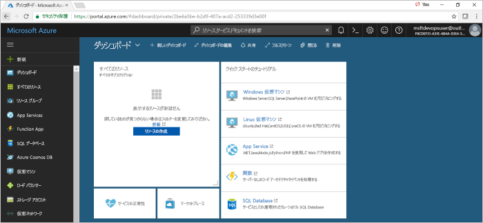

# Azure DevOps プロジェクトで Go 用の CI/CD パイプラインを作成する

**Azure DevOps プロジェクト**を使用して、**Go** アプリケーション用に継続的インテグレーション (CI) と継続的デリバリー (CD) を構成します。  Azure DevOps プロジェクトによって、Azure DevOps Services ビルドおよびリリース パイプラインの初期構成が簡略化されます。

Azure サブスクリプションをお持ちでない場合は、[Visual Studio Dev Essentials](https://visualstudio.microsoft.com/dev-essentials/) を通じて無料で取得できます。

## Azure ポータルにサインインします。

Azure DevOps プロジェクトによって、Azure に CI/CD パイプラインが作成されます。  **新しい Azure DevOps Services** 組織を作成するか、**既存の組織**を使用できます。  Azure DevOps プロジェクトでは、選択した **Azure サブスクリプション**に **Azure リソース**も作成されます。

1. [Microsoft Azure portal](https://portal.azure.com) にサインインします。

1. 左側のナビゲーション バーで **[+ リソースの作成]** アイコンを選択し、**DevOps project** を検索します。  **[作成]** を選択します。

    

## サンプル アプリケーションと Azure サービスを選択する

1. **Go** のサンプル アプリケーションを選択し、**[次へ]** 選択します。

1. **[シンプルな Go アプリ]** が既定のフレームワークです。  **[次へ]** を選択します。 

1. 前の手順で選択したアプリケーション フレームワークによって、デプロイに使用可能な Azure サービスのデプロイ ターゲットの種類が決まります。  既定の Azure サービスのままにして、**[次へ]** を選択します。

## Azure DevOps Services と Azure サブスクリプションを構成する 

1. 無料で**新しい** Azure DevOps Services 組織を作成するか、**既存**の組織を選択します。  ご自身の Azure DevOps プロジェクトの**名前**を選択します。  アプリケーションの **Azure サブスクリプション**、**場所**、**名前**を選択します。  完了したら、**[完了]** を選びます。

1. 数分間で、**DevOps プロジェクト ダッシュボード**が Azure portal に読み込まれます。  サンプル アプリケーションが Azure DevOps Services 組織内のリポジトリに設定され、ビルドが実行され、アプリケーションが Azure にデプロイされます。  このダッシュボードでは、**コード リポジトリ**、**Azure CI/CD パイプライン**、**Azure のアプリケーション**が可視化されます。  ダッシュボードの右側にある **[参照]** を選択して、実行中のアプリケーションを表示します。

     

## コードの変更をコミットし、CI/CD を実行する

Azure DevOps プロジェクトにより、Azure DevOps Services 組織または GitHub アカウントに Git リポジトリが作成されました。  リポジトリを表示し、アプリケーションにコード変更を加えるには、次の手順に従います。

1. DevOps プロジェクト ダッシュボードの左側にある**マスター**分岐のリンクを選択します。  このリンクは、新しく作成された Git リポジトリのビューを開きます。

1. リポジトリのクローン URL を表示するには、ブラウザーの右上から **[複製]** を選択します。 お気に入りの IDE で Git リポジトリを複製できます。  次のいくつかの手順では、Web ブラウザーを使用してマスター ブランチに直接コード変更を行い、コミットできます。

1. ブラウザーの左側で、**views/index.html** ファイルに移動します。

1. **[編集]** を選び、テキストをいくつか変更します。  たとえば、いずれかの div タグ内のテキストを変更します。

1. **[コミット]** を選択し、変更を保存します。

1. ブラウザーで、**Azure DevOps プロジェクト ダッシュボード**に移動します。  ビルドが進行中であることが表示されます。  行った変更は、Azure CI/CD パイプラインを介して自動的にビルドおよびデプロイされます。

## Azure CI/CD パイプラインを調べる

Azure DevOps プロジェクトによって、ご自身の Azure DevOps Services 組織に完全な Azure CI/CD パイプラインが自動的に構成されます。  パイプラインを探索し、必要に応じてカスタマイズします。  Azure DevOps Services ビルドとリリース パイプラインについて理解するには、次の手順に従います。

1. Azure DevOps プロジェクト ダッシュボードの**上部**から **[ビルド パイプライン]** を選択します。  このリンクによって、ブラウザー タブが開き、ご自身の新しいプロジェクトの Azure DevOps Services ビルド パイプラインが開きます。

1. **省略記号**を選択します。  このアクションにより、キューへの新しいビルドの挿入、ビルドの一時停止、ビルド パイプラインの編集などのいくつかのアクティビティを開始できるメニューが開きます。

1. **[編集]** を選択します。

1. このビューから、ビルド パイプラインの**さまざまなタスクについて調べます**。  ビルドでは、Git リポジトリからのソースのフェッチ、依存関係の復元、デプロイに使用した出力の公開など、さまざまなタスクが実行されます。

1. ビルド パイプラインの上部で、**ビルド パイプラインの名前**を選択します。

1. ご自身のビルド パイプラインの**名前**をわかりやすい名前に変更します。  **[保存してキューに登録]** を選択し、**[保存]** を選択します。

1. ご自身のビルド パイプラインの名前で、**[履歴]** を選択します。  ビルドの最近の変更の監査証跡が表示されます。  Azure DevOps Services は、ビルド パイプラインに対する変更を追跡し、バージョンを比較できるようにします。

1. **[トリガー]** を選択します。  Azure DevOps プロジェクトでは、CI トリガーが自動的に作成され、リポジトリに対してコミットするたびに新しいビルドが開始されます。  必要に応じて、CI プロセスのブランチを含めるか除外するかを選択できます。

1. **[保持]** を選択します。  シナリオに基づいて、特定の数のビルドを保持または削除するポリシーを指定できます。

1. **[ビルドとリリース]** を選択し、**[リリース]** を選択します。  Azure DevOps プロジェクトにより、Azure へのデプロイを管理する Azure DevOps Services リリース パイプラインが作成されました。

1. ブラウザーの左側で、リリース パイプラインの横にある**省略記号**を選択し、**[編集]** を選択します。

1. リリース パイプラインには、リリース プロセスを定義する**パイプライン**が含まれています。  **[成果物]** で、**[ドロップ]** を選択します。  前の手順で調べたビルド パイプラインでは、成果物に使用される出力が生成されます。 

1. **[ドロップ]** アイコンの右側にある **[継続的配置トリガー]** を選択します。  このリリース パイプラインでは、新しいビルド成果物が使用可能になるたびにデプロイを実行する有効な CD トリガーがあります。  必要に応じて、トリガーを無効にできるので、デプロイでは手動での実行が必要です。 

1. ブラウザーの左側の **[タスク]** を選択します。  タスクは、デプロイ プロセスによって実行されるアクティビティです。  この例では、**Azure App Service** にデプロイするタスクが作成されました。

1. ブラウザーの右側で、**[リリースの表示]** を選択します。  このビューには、リリースの履歴が表示されます。

1. リリースの 1 つの横にある**省略記号**を選択し、**[開く]** を選択します。  リリース概要、関連付けられた作業項目、テストなど、このビューから表示されるいくつかのメニューがあります。

1. **[コミット]** を選択します。  このビューには、特定のデプロイに関連付けられているコードのコミットが表示されます。 

1. **[ログ]** を選択します。  ログには、デプロイ プロセスに関する有用な情報が含まれます。  これらは、デプロイ中とデプロイ後の両方に表示できます。

## リソースのクリーンアップ

このクイック スタートで作成した Azure App Service および関連リソースは、不要になったら、Azure DevOps プロジェクト ダッシュボードの **[削除]** 機能を使用して削除できます。

## 次の手順

チームのニーズを満たすためのビルドおよびリリース パイプラインの変更について詳しくは、このチュートリアルをご覧ください。

> [!div class="nextstepaction"]
> [CD プロセスをカスタマイズする](https://docs.microsoft.com/azure/devops/pipelines/release/define-multistage-release-process?view=vsts)
