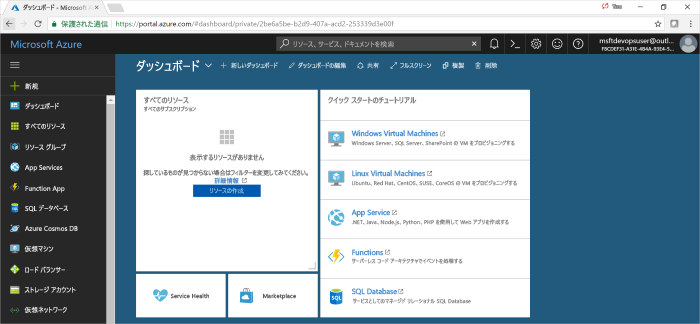
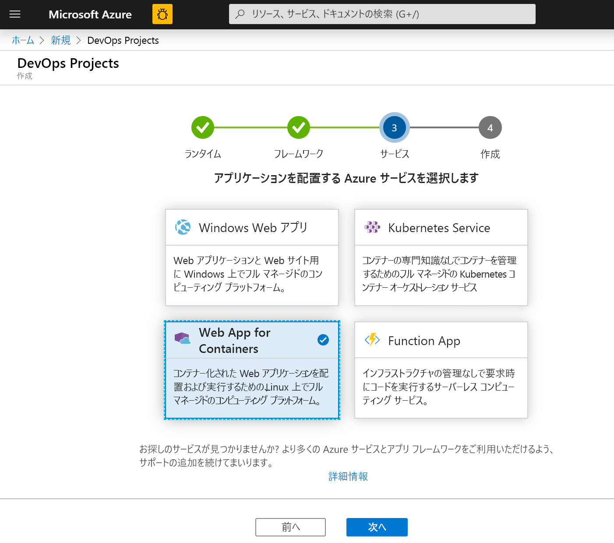
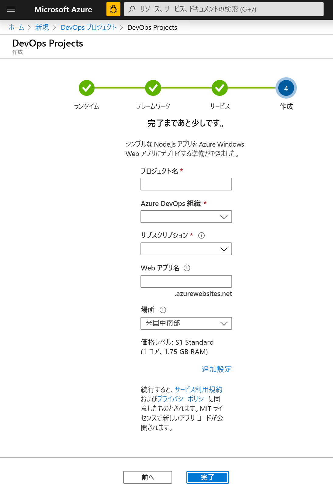
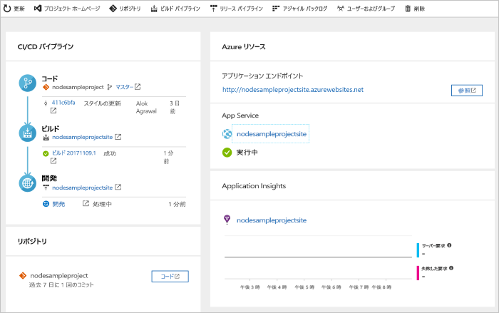
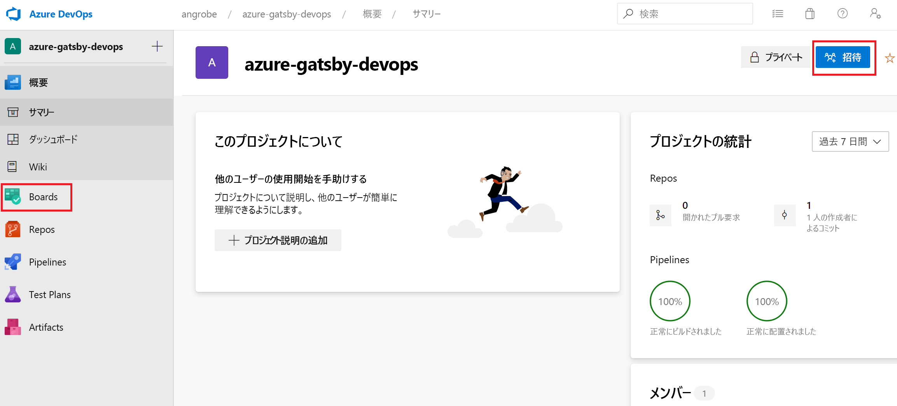
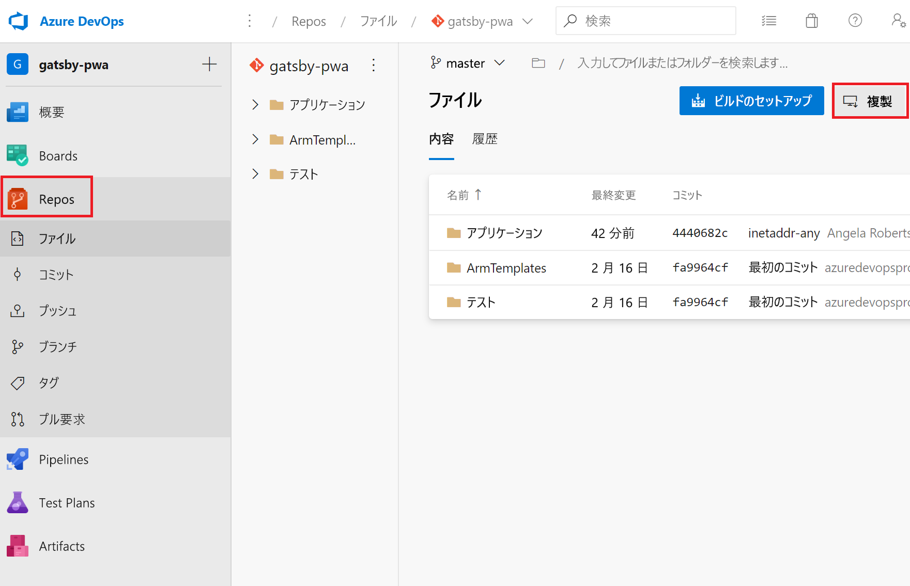
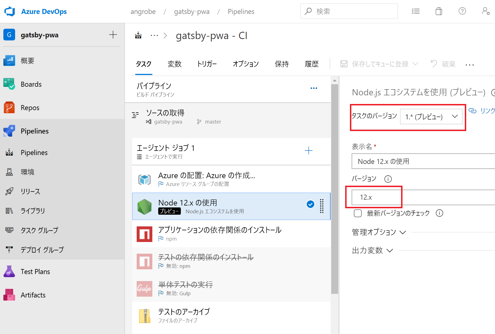
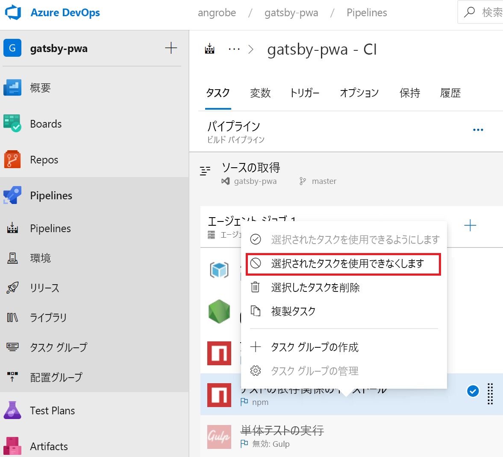
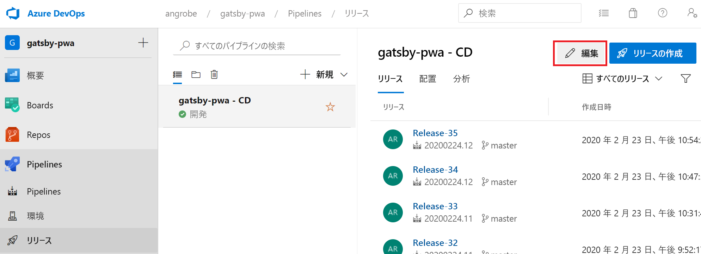
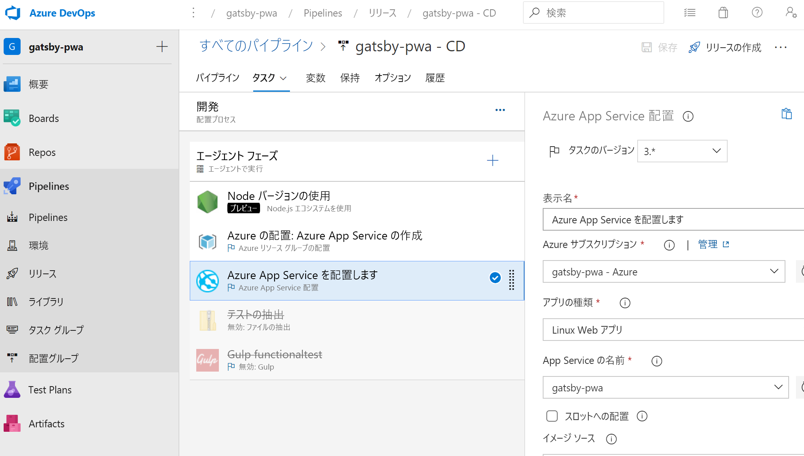

# <a name="create-a-cicd-pipeline-in-azure-pipelines-for-nodejs-with-azure-devops-starter"></a>Azure DevOps Starter を使用して Azure Pipelines に Node.js 用の CI/CD パイプラインを作成する

このクイックスタートでは、[GatsbyJS](https://www.gatsbyjs.org/) と簡略化された Azure DevOps Starter の作成エクスペリエンスを使用して NodeJS のプログレッシブ Web アプリ (PWA) を作成します。 完了すると、Azure Pipelines に PWA 用の継続的インテグレーション (CI) と継続的デリバリー (CD) パイプラインが作成されます。 Azure DevOps Starter により、開発、デプロイ、監視に必要なものがすべて設定されます。

## <a name="prerequisites"></a>前提条件

- アクティブなサブスクリプションが含まれる Azure アカウント。 [無料でアカウントを作成できます](https://azure.microsoft.com/free/?ref=microsoft.com&utm_source=microsoft.com&utm_medium=docs&utm_campaign=visualstudio)。 
- [Azure DevOps](https://azure.microsoft.com/services/devops/) 組織。

## <a name="sign-in-to-the-azure-portal"></a>Azure portal にサインインする

DevOps Starter によって、Azure Pipelines に CI/CD パイプラインが作成されます。 新しい Azure DevOps 組織を作成するか、既存の組織を使用できます。 DevOps Starter では、選択した Azure サブスクリプションに Azure リソースも作成されます。

1. [Azure portal](https://portal.azure.com) にサインインし、左側のペインで **[リソースの作成]** を選択します。 

   

1. 検索ボックスに「**DevOps Starter**」と入力して選択します。 新しく作成するには、 **[追加]** をクリックします。

    

## <a name="select-a-sample-application-and-azure-service"></a>サンプル アプリケーションと Azure サービスを選択する

1. Node.js サンプル アプリケーションを選択します。   

     

1. 既定のサンプル フレームワークは **Express.js** です。 選択内容を **[シンプルな Node.js アプリ]** に変更し、 **[次へ]** を選択します。 

    ![[シンプルな Node.js アプリ] を選択する](_img/azure-devops-project-nodejs/select-nodejs-framework.png) 

1. この手順で使用できるデプロイ ターゲットが、手順 2 で選択したアプリケーション フレームワークによって決まります。 この例では、 **[Windows Web アプリ]** が既定のデプロイ ターゲットです。 **[Web App for Containers]** を設定したままにし、 **[次へ]** を選択します。

    

## <a name="configure-a-project-name-and-an-azure-subscription"></a>プロジェクト名と Azure サブスクリプションを構成する

1. DevOps Starter 作成ワークフローの最後の手順では、プロジェクト名を割り当て、Azure サブスクリプションを選択し、 **[完了]** を選択します。  

    

1. 概要ページが表示されると同時に、プロジェクトがビルドされ、アプリケーションが Azure にデプロイされます。 しばらくすると、プロジェクトが [Azure DevOps 組織](https://dev.azure.com/)に作成されます。ここには、Git リポジトリ、かんばんボード、デプロイ パイプライン、テスト計画、アプリに必要な成果物が含まれています。  

## <a name="managing-your-project"></a>プロジェクトを管理する

1. **[すべてのリソース]** に移動し、自分の DevOps Starter を見つけます。 自分の **DevOps Starter** を選択します。

    

1. ダッシュボードが表示され、プロジェクト ホームページ、コード リポジトリ、CI/CD パイプライン、実行中のアプリへのリンクが可視化されます。 **[プロジェクト ホームページ]** を選択してアプリケーションを **Azure DevOps** で表示し、別のブラウザー タブで **[アプリケーション エンドポイント]** を選択してライブ サンプル アプリを表示します。 GatsbyJS によって生成された PWA を使用するよう、後でこのサンプルを変更します。

     

1. お使いの Azure DevOps プロジェクトから、チーム メンバーを招待して共同作業を行ったり、かんばんボードを確立して作業の追跡を開始したりできます。 詳細については、[このページ](https://docs.microsoft.com/azure/devops/user-guide/what-is-azure-devops?view=azure-devops)を参照してください。



## <a name="clone-the-repo-and-install-your-gatsby-pwa"></a>リポジトリをクローンして Gatsby PWA をインストールする

DevOps Starter によって、Azure Repos または GitHub に Git リポジトリが作成されます。 この例では、Azure リポジトリが作成されます。 次の手順では、リポジトリをクローンして変更を行います。

1. お使いの **DevOps プロジェクト**から **[リポジトリ]** を選択し、 **[クローン]** をクリックします。  Git リポジトリをデスクトップにクローンするメカニズムにはさまざまあります。  実際の開発エクスペリエンスに合ったものを選択してください。  

    

1. リポジトリがデスクトップにクローンされたら、スターター テンプレートにいくつかの変更を加えます。 まず、ターミナルから GatsbyJS CLI をインストールします。

   ```powershell
    npm install -g gatsby
   ```

1. ターミナルから、お使いのリポジトリのルートに移動します。 これには、次のような 3 つのフォルダーが含まれています。

    ```powershell
    Mode                LastWriteTime         Length Name
    ----                -------------         ------ ----
    d-----        2/23/2020  10:42 PM                Application
    d-----        2/23/2020   3:05 PM                ArmTemplates
    d-----        2/23/2020   3:05 PM                Tests
    ```
    
1. Application フォルダー内のすべてのファイルが必要とは限りません。これは、Gatsby スターターに置き換えるためです。 次のコマンドを順次実行し、スリム化します。
    
    ```powershell
    cp .\Application\Dockerfile .
    rmdir Application
    ```

1. Gatsby CLI を使用してサンプル PWA を生成します。 ターミナルから `gatsby new` を実行して PWA ウィザードを開始し、スターター テンプレート用に `gatsby-starter-blog` を選択します。 これは、次のサンプルのようになります。

    ```powershell
    c:\myproject> gatsby new
    √ What is your project called? ... my-gatsby-project
    ? What starter would you like to use? » - Use arrow-keys. Return to submit.
        gatsby-starter-default
        gatsby-starter-hello-world
    >   gatsby-starter-blog
        (Use a different starter)
    ```
    
1. これで、`my-gatsby-project` という名前のフォルダーが作成されました。 その名前を `Application` に変更し、`Dockerfile` をそれにコピーします。
    
    ```powershell
    mv my-gatsby-project Application
    mv Dockerfile Application
    ```
    
1. お好みのエディターで Dockerfile を開き、最初の行を `FROM node:8` から `FROM node:12` に変更します。 この変更により、お使いのコンテナーでは、Node.js のバージョン 8.x ではなくバージョン 12.x が使用されるようになります。 GatsbyJS には、最新バージョンの Node.js が必要です。

1. 次に、Application フォルダー内の package.json ファイルを開き、お使いの開発および運用サーバーが使用可能なすべてのネットワーク インターフェイス (例: 0.0.0.0) とポート 80 でリッスンするように [scripts フィールド](https://docs.npmjs.com/files/package.json#scripts)を編集します。 これらの設定を行わないと、コンテナー アプリ サービスは、コンテナー内で実行されている Node.js アプリにトラフィックをルーティングできません。 `scripts` フィールドは以下のようになります。 具体的には、`develop`、`serve`、`start` のターゲットを既定値から変更します。

    ```json
      "scripts": {
        "build": "gatsby build",
        "develop": "gatsby develop  -H 0.0.0.0 -p 80",
        "format": "prettier --write \"**/*.{js,jsx,json,md}\"",
        "start": "npm run serve",
        "serve": "npm run build && gatsby serve -H 0.0.0.0 -p 80",
        "clean": "gatsby clean",
        "test": "echo \"Write tests! -> https://gatsby.dev/unit-testing\" && exit 1"
      }
    ```
    
## <a name="edit-your-cicd-pipelines"></a>CI/CD パイプラインを編集する

1. 前のセクションのコードをコミットする前に、ビルドおよびリリース パイプラインにいくつかの変更を加えます。 "ビルド パイプライン" を編集し、Node.js バージョン 12.x を使用するよう Node のタスクを更新します。 **[タスクのバージョン]** フィールドを 1.x に、 **[バージョン]** フィールドを 12.x に設定します。

    

1. このクイックスタートでは、単体テストを作成していないため、ビルド パイプラインではこれらの手順を無効にしています。 テストの作成時に、これらの手順を再度有効にすることができます。 右クリックして **[Install test dependencies]\(テストの依存関係のインストール\)** および **[Run unit tests]\(単体テストの実行\)** というラベルの付いたタスクを選択し、それらを無効にします。

    

1. リリース パイプラインを編集します。

    

1. ビルド パイプラインと同様に、12.x を使用するよう Node タスクを変更し、この 2 つのテスト タスクを無効にします。 実際のリリースは、このスクリーンショットのようになります。

    

1. ブラウザーの左側で、**views/index.pug** ファイルに移動します。

1. **[編集]** を選択し、h2 見出しに変更を加えます。  たとえば、「**Azure DevOps Starter を今すぐ開始**」と入力したり、その他の変更を加えたりします。

1. **[コミット]** を選択し、変更を保存します。

1. ブラウザーで DevOps Starter ダッシュボードに移動します。   
進行中のビルドが表示されるようになりました。 行った変更は、CI/CD パイプラインを通じて自動的にビルド、デプロイされます。

## <a name="commit-your-changes-and-examine-the-azure-cicd-pipeline"></a>変更をコミットして Azure CI/CD パイプラインを調査する

前の 2 つの手順では、Gatsby で生成された PWA を Git リポジトリに追加し、コードをビルドしてデプロイするようパイプラインを編集しました。 コードをコミットし、ビルドおよびリリース パイプラインでその進捗を監視できます。

1. ターミナルでプロジェクトの Git リポジトリのルートから、次のコマンドを実行してコードを Azure DevOps プロジェクトにプッシュします。

    ```powershell
    git add .
    git commit -m "My first Gatsby PWA"
    git push
    ```
    
1. `git push` が完了するとすぐにビルドが開始されます。 **Azure DevOps ダッシュボード**で、進捗状況を確認できます。

3. 数分後に、ビルドおよびリリース パイプラインが完了し、PWA がコンテナーにデプロイされます。 上記のダッシュボードから **[アプリケーション エンドポイント]** リンクをクリックすると、ブログ用の Gatsby スターター プロジェクトが表示されます。

## <a name="clean-up-resources"></a>リソースをクリーンアップする

作成した Azure App Service と関連するその他のリソースは、必要なくなったら削除してかまいません。 DevOps Starter ダッシュボードで**削除**機能を使用します。

## <a name="next-steps"></a>次のステップ

CI/CD プロセスを構成すると、ビルドおよびリリース パイプラインが自動的に作成されます。 これらのビルドおよびリリース パイプラインを、チームのニーズを満たすように変更できます。 CI/CD パイプラインの詳細については、以下を参照してください。

> [!div class="nextstepaction"]
> [CD プロセスをカスタマイズする](https://docs.microsoft.com/azure/devops/pipelines/release/define-multistage-release-process?view=vsts)

