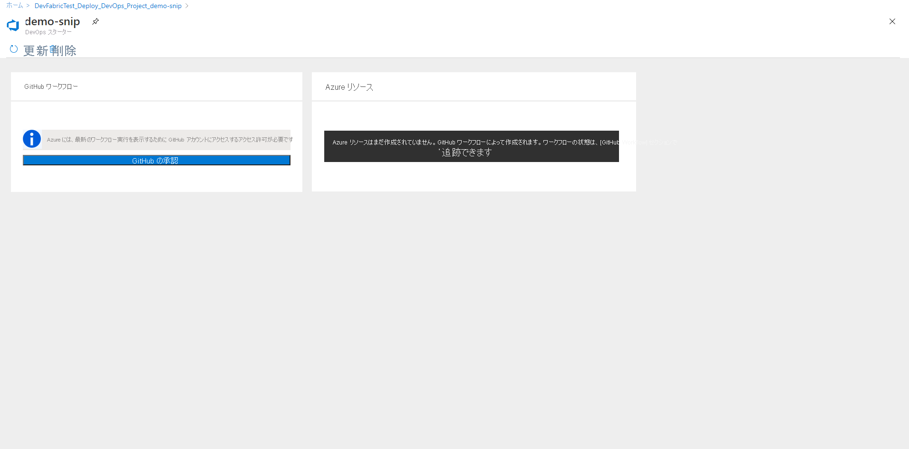

# DevOps Starter を使用して、GitHub Actions を利用する Node.js アプリ用の CI/CD を設定する

このクイックスタートでは、DevOps Starter の簡素化されたエクスペリエンスを使用して、GitHub Actions を利用する、Node.js アプリ用の継続的インテグレーション (CI) および継続的デリバリー (CD) のワークフローを設定します。 DevOps Starter を使用すると、アプリの開発、デプロイ、監視に必要なすべてのものを設定できます。 

## 前提条件

- アクティブなサブスクリプションが含まれる Azure アカウント。 [無料でアカウントを作成できます](https://azure.microsoft.com/free/?ref=microsoft.com&utm_source=microsoft.com&utm_medium=docs&utm_campaign=visualstudio)。 
- [GitHub](https://github.com/) のアカウント。

## Azure portal にサインインする

DevOps Starter によって、GitHub Actions を使用する CI/CD ワークフローが作成されます。 DevOps Starter では、選択した Azure サブスクリプションに Azure リソースも作成されます。

1. [Azure portal](https://portal.azure.com) にサインインします。

1. 検索ボックスに「**DevOps Starter**」と入力して選択します。 新しく作成するには、 **[追加]** をクリックします。

    

## サンプル アプリケーションと Azure サービスを選択する

1. 右側のバナーの **[Set up DevOps starter with GitHub]\(GitHub を使用した DevOps Starter の設定\)** をクリックします。

    

1. **GitHub Actions** として CI/CD プロバイダーが選択されていることを確認します。

    

1. **Node.js** サンプル アプリケーションを選択します。 Node.js のサンプルでは、複数のアプリケーション フレームワークから選択できます。

1. 既定のサンプル フレームワークは **Express.js** です。 既定の設定のままにして、**[次へ]** を選択します。   

2. Windows Web アプリが既定のデプロイ ターゲットです。 前に選択したアプリケーション フレームワークによって、ここで使用可能な Azure サービスのデプロイ ターゲットの種類が決まります。 既定のサービスのままにして、**[次へ]** を選択します。
 
## GitHub アカウントと Azure サブスクリプションを構成する 

1. GitHub に対する認証を行います。

   1. **[承認]** ボタンをクリックします。 
   
   1. GitHub にサインインします。 GitHub アカウントをお持ちでない場合は、ここでサインアップすることもできます。

2. 既存の **GitHub 組織** を選択します。 
   
   1. ご自身の GitHub リポジトリの名前を選択します。 
   
   1. Azure サブスクリプションと場所を選択し、アプリケーションの名前を選択して、**[完了]** を選択します。
    
       

    数分後、DevOps Starter ダッシュボードが Azure portal に表示されます。 サンプル アプリケーションがご自身の Azure DevOps 組織内のリポジトリに設定され、GitHub ワークフローがトリガーされ、ご自身のアプリケーションが Azure にデプロイされます。 このダッシュボードでは、ご自身のコード リポジトリ、GitHub ワークフロー、および Azure のアプリケーションが可視化されます。
   
3. **[参照]** を選択すると、実行中のアプリケーションが表示されます。
    
    ダッシュボードには、GitHub ワークフローと Azure リソースの詳細が含まれています。 最新の実行、コミット、ジョブの状態など、GitHub ワークフローの詳細を表示するには、**GitHub に対して承認する** 必要があります。
   
   

DevOps Starter によって、GitHub アクションを使用するビルドとデプロイ ジョブを含む GitHub ワークフローが自動的に構成されました。 Web サイトに最新の作業を自動的にデプロイする CI/CD プロセスを使用して、Node.js アプリに対してチームで共同作業を行う準備ができました。

   

## コードの変更をコミットし、CI/CD を実行する

DevOps Starter によって、GitHub のリポジトリが作成されます。 リポジトリを表示し、アプリケーションにコード変更を加えるには、次の手順に従います。

1. DevOps Starter ダッシュボードの左側にあるメイン ブランチのリンクを選択します。 このリンクによって、新しく作成された GitHub リポジトリのビューが開きます。

1. リポジトリのクローン URL を表示するには、ブラウザーの右上の **[複製]** を選択します。 お気に入りの IDE で Git リポジトリを複製できます。 次のいくつかの手順では、Web ブラウザーを使用してメイン ブランチに直接コード変更を行い、コミットできます。

1. ブラウザーの左側で、 **/Application/views/index.pug** ファイルに移動します。

1. **[編集]** を選択し、テキストの一部を変更します。
    たとえば、タグの 1 つのテキストの一部を変更します。

1. **[コミット]** を選択し、変更を保存します。

1. ブラウザーで DevOps Starter ダッシュボードに移動します。   
進行中の GitHub ワークフロー ビルド ジョブが表示されるようになりました。 行った変更は、GitHub ワークフローを介して自動的にビルドおよびデプロイされます。

## GitHub ワークフローを確認する

前の手順で、DevOps Starter によって完全な GitHub ワークフローが自動的に構成されました。 ワークフローを探索し、必要に応じてカスタマイズします。 ワークフローについて理解するには、次の手順を行います。

1. DevOps Starter ダッシュボードの左側にある **[GitHub workflow]\(GitHub ワークフロー\)** を選択します。 このリンクによって、ブラウザーのタブが開かれ、新しいプロジェクトの GitHub ワークフローが表示されます。
    > [!NOTE]
    > ワークフロー ファイルの名前を変更しないでください。 ダッシュボードから変更内容を反映するために、ワークフロー ファイルの名前は **devops-starter-workflow.yml** である必要があります

1. ワークフローの yaml ファイルには、アプリケーションのビルドとデプロイに必要なすべての GitHub アクションが含まれています。 ご自身のワークフロー ファイルをカスタマイズする場合は、 **[ファイルの編集]** オプションをクリックします。

1. リポジトリの **[コード]** タブで、 **[コミット]** をクリックします。 このビューには、特定のデプロイに関連付けられているコードのコミットが表示されます。

1. リポジトリの **[アクション]** タブでは、ご自身のリポジトリのすべてのワークフロー実行の履歴を確認できます。

1. **[前回の実行]** を選択して、ワークフロー内で実行されたすべてのジョブを確認します。

1. **[ジョブ]** をクリックして、ワークフロー実行の詳細ログを確認します。 ログには、デプロイ プロセスに関する有用な情報が含まれます。 これらは、デプロイ中とデプロイ後の両方に表示できます。

1. **[pull request]** タブをクリックして、ご自身のリポジトリ上のすべての pull request を確認します

## リソースをクリーンアップする

Azure App Service とその他の関連リソースが必要なくなったら、削除してかまいません。 DevOps Starter ダッシュボードで **削除** 機能を使用します。

## 次のステップ

CI/CD プロセスを構成したときに、GitHub ワークフローが自動的に作成されました。 ご自身のチームのニーズを満たすようにこのワークフローを変更できます。 GitHub Actions とワークフローの詳細については、以下を参照してください。

> [!div class="nextstepaction"]
> [GitHub ワークフローをカスタマイズする](https://docs.github.com/actions/configuring-and-managing-workflows/configuring-and-managing-workflow-files-and-runs)
