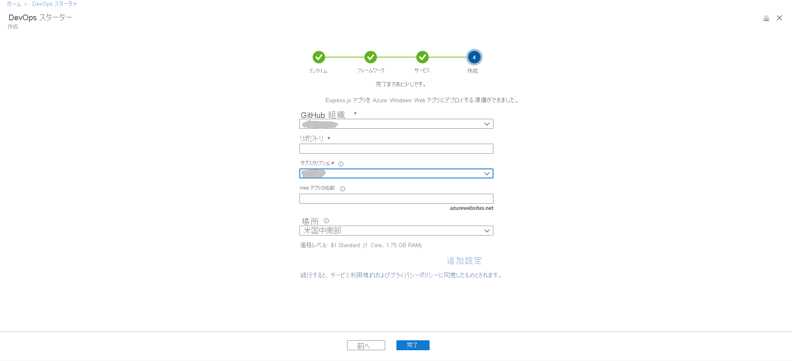
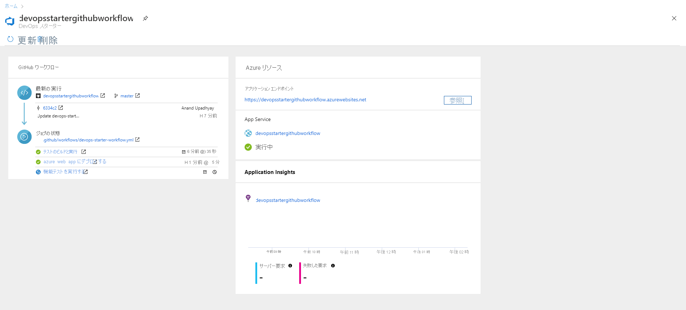

# チュートリアル:GitHub Actions 用 DevOps Starter を使用して Node.js アプリを Azure Web アプリにデプロイする

GitHub Actions 用 DevOps Starter によって提供される簡略化されたエクスペリエンスを使用すると、サンプル アプリケーションを選択して、Azure への継続的インテグレーション (CI) と継続的デリバリー (CD) のワークフローを作成することができます。 

DevOps Starter では次のこともできます。
* 新しい Azure Web アプリなどの Azure リソースを自動的に作成する。
* CI 用のビルド ジョブを含む、GitHub のワークフローを作成および構成する。
* このワークフローには、CD 用のデプロイ ジョブも含まれています。 
* 監視のために Azure Application Insights リソースを作成する。

このチュートリアルでは、次のことについて説明します。

> [!div class="checklist"]
> * DevOps Starter を使用して、Node.js アプリをデプロイする
> * GitHub と Azure サブスクリプションを構成する 
> * GitHub ワークフローを確認する
> * 変更を GitHub にコミットし、Azure に自動的にデプロイする
> * Azure Application Insights の監視を構成する
> * リソースをクリーンアップする

## 前提条件

* アクティブなサブスクリプションが含まれる Azure アカウント。 [無料でアカウントを作成できます](https://azure.microsoft.com/free/)。

## DevOps Starter を使用して、Node.js アプリをデプロイする

DevOps Starter によって、GitHub のワークフローが作成されます。 既存の GitHub 組織を使用できます。 DevOps Starter によって、選択した Azure サブスクリプションに Web アプリなどの Azure リソースも作成されます。

1. [Azure portal](https://portal.azure.com) にサインインします。

1. 検索ボックスに「**DevOps Starter**」と入力して選択します。 新しく作成するには、 **[追加]** をクリックします。

    

1. **GitHub Actions** として CI/CD プロバイダーが選択されていることを確認します。

    

1. **[Node.js]** を選択し、 **[次へ]** を選択します。

1. **[Choose an application Framework]\(アプリケーション フレームワークを選択します\)** で **[Express.js]** を選択し、 **[次へ]** を選択します。 前の手順で選択したアプリケーション フレームワークによって、ここで使用可能な Azure サービスのデプロイ ターゲットの種類が決まります。 

1. **Windows Web アプリ** を選択し、 **[次へ]** を選択します。

## GitHub と Azure サブスクリプションを構成する

1. **GitHub** を承認し、既存の GitHub 組織を選択します。 

1. ご自身の **GitHub リポジトリ** の名前を入力します。 

1. Azure サブスクリプション サービスを選択します。 必要に応じて、**[変更]** を選択し、Azure リソースの場所など、他の構成の詳細を入力できます。
 
1. Web アプリの名前を入力し、 **[完了]** を選択します。 数分後に Azure Web アプリの準備が完了します。 サンプル Node.js アプリケーションがご自身の GitHub 組織内のリポジトリに設定され、ワークフローがトリガーされ、新規に作成された Azure Web アプリにご自身のアプリケーションがデプロイされます。

       

   その完了後、DevOps Starter ダッシュボードが Azure portal に表示されます。 このダッシュボードには、Azure portal の **[すべてのリソース]** から直接移動することもできます。 

   このダッシュボードでは、ご自身の GitHub コード リポジトリ、CI/CD ワークフロー、および Azure 内で実行中のアプリケーションが可視化されます。   

   

DevOps Starter によって、コード変更をご自身のリポジトリにデプロイするトリガーが自動的に構成されます。
    
## GitHub ワークフローを確認する

前の手順で、DevOps Starter によって完全な GitHub ワークフローが自動的に構成されました。 ワークフローを探索し、必要に応じてカスタマイズします。 ワークフローについて理解するには、次の手順を行います。

1. DevOps Starter ダッシュボードの左側にある **[GitHub workflow]\(GitHub ワークフロー\)** を選択します。 このリンクによって、ブラウザーのタブが開かれ、新しいプロジェクトの GitHub ワークフローが表示されます。
    > [!NOTE]
    > ワークフロー ファイルの名前を変更しないでください。 ダッシュボードから変更内容を反映するために、ワークフロー ファイルの名前は **devops-starter-workflow.yml** である必要があります

1. ワークフローの yaml ファイルには、アプリケーションのビルドとデプロイに必要なすべての GitHub アクションが含まれています。 ご自身のワークフロー ファイルをカスタマイズする場合は、 **[ファイルの編集]** オプションをクリックします。

1. リポジトリの **[コード]** タブで、 **[コミット]** をクリックします。 このビューには、特定のデプロイに関連付けられているコードのコミットが表示されます。

1. リポジトリの **[アクション]** タブでは、ご自身のリポジトリのすべてのワークフロー実行の履歴を確認できます。

1. **[前回の実行]** を選択して、ワークフロー内で実行されたすべてのジョブを確認します。

1. **[ジョブ]** をクリックして、ワークフロー実行の詳細ログを確認します。 ログには、デプロイ プロセスに関する有用な情報が含まれます。 これらは、デプロイ中とデプロイ後の両方に表示できます。

1. **[pull request]** タブをクリックして、ご自身のリポジトリ上のすべての pull request を確認します

## コードの変更をコミットし、CI/CD を実行する

DevOps Starter によって、GitHub のリポジトリが作成されます。 リポジトリを表示し、アプリケーションにコード変更を加えるには、次の手順に従います。

1. DevOps Starter ダッシュボードの左側にあるメイン ブランチのリンクを選択します。 このリンクによって、新しく作成された GitHub リポジトリのビューが開きます。

1. リポジトリのクローン URL を表示するには、ブラウザーの右上の **[複製]** を選択します。 お気に入りの IDE で Git リポジトリを複製できます。 次のいくつかの手順では、Web ブラウザーを使用してメイン ブランチに直接コード変更を行い、コミットできます。

1. ブラウザーの左側で、 **/Application/views/index.pug** ファイルに移動します。

1. **[編集]** を選択し、テキストの一部を変更します。
    たとえば、タグの 1 つのテキストの一部を変更します。

1. **[コミット]** を選択し、変更を保存します。

1. ブラウザーで DevOps Starter ダッシュボードに移動します。   
進行中の GitHub ワークフロー ビルド ジョブが表示されるようになりました。 行った変更は、GitHub ワークフローを介して自動的にビルドおよびデプロイされます。

1. デプロイが完了したら、ご自身のアプリケーションを更新して、変更を確認します。

## Azure Application Insights の監視を構成する

Azure Application Insights を使うと、アプリケーションのパフォーマンスと利用状況を簡単に監視できます。 DevOps Starter によって、アプリケーションの Application Insights リソースが自動的に構成されます。 必要に応じて、さまざまなアラートと監視機能をさらに構成できます。

1. Azure portal で、DevOps Starter ダッシュボードに移動します。 

1. 右下で、アプリの **[Application Insights]** リンクを選択します。 **[Application Insights]** ウィンドウが開かれます。 このビューには、アプリの利用状況、パフォーマンス、可用性の監視情報が含まれています。

   ![[Application Insights] ウィンドウ](_img/azure-devops-project-github/appinsights.png) 

1. **[時間の範囲]** を選択し、 **[過去 1 時間]** を選択します。 結果をフィルター処理するには、 **[更新]** を選択します。 これで、過去 60 分間のすべてのアクティビティが表示されます。 
    
1. 時間の範囲を終了するには、 **[x]** を選択します。

1. **[アラート]** を選択し、 **[メトリック アラートの追加]** を選択します。 

1. アラートの名前を入力します。

1. **[メトリック]** ドロップダウン リストで、さまざまなアラート メトリックを確認します。 既定のアラートの対象は、**1 秒を超えるサーバー応答時間** です。 アプリの監視機能を向上させるためにさまざまなアラートを簡単に構成できます。

1. **[Notify via Email owners, contributors, and readers]\(電子メール、所有者、共同作成者、および閲覧者による通知\)** チェック ボックスをオンにします。 必要に応じて、アラートが表示されたときに、Azure Logic Apps を実行することによって追加のアクションを実行できます。

1. **[OK]** を選択してアラートを作成します。 しばらくして、アラートがダッシュボードにアクティブとして表示されます。 

1. **[アラート]** 領域を終了し、 **[Application Insights]** ウィンドウに戻ります。

1. **[可用性]** を選択し、 **[テストの追加]** を選択します。 

1. テスト名を入力し、 **[作成]** を選択します。 アプリケーションの可用性を確認する簡単な ping テストが作成されます。 数分後にテスト結果が使用可能になり、Application Insights ダッシュボードに可用性の状態が表示されます。

## リソースをクリーンアップする

テストを行っている場合は、リソースをクリーンアップすることによって、課金を回避することができます。 このチュートリアルで作成した Azure 仮想マシンと関連リソースが必要なくなったら、削除してかまいません。 そうするには、DevOps Starter ダッシュボードで **削除** 機能を使用します。 

> [!IMPORTANT]
> 次の手順で、リソースが完全に削除されます。 "*削除*" 機能では、DevOps Starter のプロジェクトによって作成されたデータが Azure の両方で破棄され、取得できなくなります。 画面に表示される説明を慎重に読んでから、この手順を行ってください。

1. Azure portal で、DevOps Starter ダッシュボードに移動します。
1. 右上の **[削除]** を選択します。 
1. 確認のメッセージで **[はい]** を選択すると、リソースが "*完全に削除*" されます。

必要に応じて、ご自身のチームのニーズを満たすようにワークフローを変更できます。 この CI/CD パターンをご自身の他のリポジトリのテンプレートとして使用することもできます。 

## 次のステップ

このチュートリアルでは、以下の内容を学習しました。

> [!div class="checklist"]
> * DevOps Starter を使用して、Node.js アプリをデプロイする
> * GitHub と Azure サブスクリプションを構成する 
> * GitHub ワークフローを確認する
> * 変更を GitHub にコミットし、Azure に自動的にデプロイする
> * Azure Application Insights の監視を構成する
> * リソースをクリーンアップする

GitHub Actions とワークフローの詳細については、以下を参照してください。

> [!div class="nextstepaction"]
> [GitHub ワークフローをカスタマイズする](https://docs.github.com/actions/configuring-and-managing-workflows/configuring-and-managing-workflow-files-and-runs)
