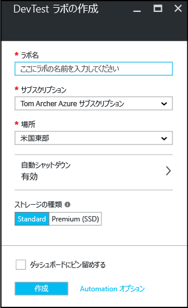

# Azure DevTest Labs でのラボの作成
## 前提条件
ラボを作成するには、次のものが必要です。

* Azure サブスクリプション。 Azure 購入オプションの詳細については、「[Azure の購入方法](https://azure.microsoft.com/pricing/purchase-options/)」または [1 か月間の無料試用版](https://azure.microsoft.com/pricing/free-trial/)に関するページをご覧ください。 ラボを作成するには、サブスクリプションの所有者である必要があります。

## Azure DevTest Labs でラボを作成する手順
次の手順は、Azure Portal を使用して Azure DevTest Labs でラボを作成する方法を示しています。 

1. [Azure ポータル](http://go.microsoft.com/fwlink/p/?LinkID=525040)にサインインします。
2. **[その他のサービス]** を選択し、一覧の **[DevTest Labs]** を選択します。
3. **[DevTest ラボ]** ブレードで **[追加]** をクリックします。
   
    
4. **[DevTest ラボの作成]** ブレードで:
   
   1. 新しいラボの **[ラボ名]** を入力します。
   2. ラボに関連付ける **[サブスクリプション]** を選択します。
   3. ラボを格納する **[場所]** を選択します。
   4. **[自動シャットダウン]** を選択し、ラボのすべての VM の自動シャットダウンを有効にする (およびそのパラメーターを定義する) かどうかを指定します。 
   5. **[作成]**を選択します。
      
      

[!INCLUDE [devtest-lab-try-it-out](../../includes/devtest-lab-try-it-out.md)]

## 次のステップ
ラボを作成した後は、次の手順を考慮します。

* [ラボへのアクセスをセキュリティで保護します](devtest-lab-add-devtest-user.md)。
* [ラボのポリシーを設定します](devtest-lab-set-lab-policy.md)。
* [ラボ テンプレートを作成します](devtest-lab-create-template.md)。
* [VM のカスタム アーティファクトを作成します](devtest-lab-artifact-author.md)。
* [アーティファクトを含む VM をラボに追加します](devtest-lab-add-vm-with-artifacts.md)。

<!--HONumber=Dec16_HO3-->

