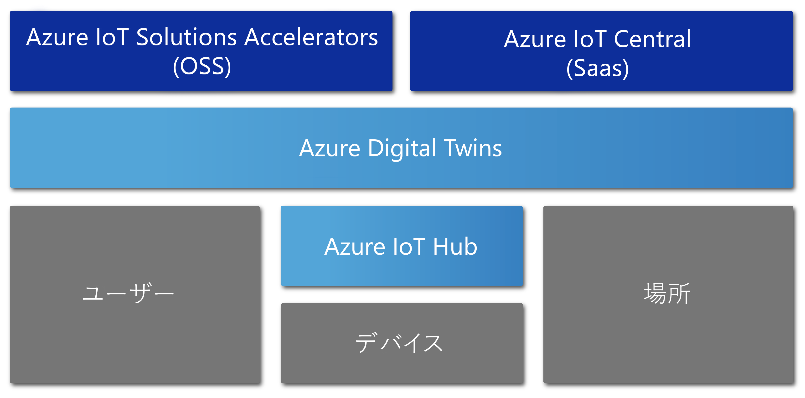

# Azure Digital Twins の概要

Azure Digital Twins は、物理環境の包括的なモデルを作成する Azure IoT サービスです。 その多くの機能の中に、人や空間、デバイスの相互関係と相互作用をモデル化する空間インテリジェンス グラフの作成機能があります。

Azure Digital Twins を使用すると、多数の雑多なセンサーのデータではなく、物理空間のデータを照会することができます。 このサービスは、再利用できてスケーラビリティが高く、また空間認識性を備えたエクスペリエンスを構築し、デジタル世界と現実世界の垣根を越えてストリーミング データをリンクするのに役立ちます。 工場におけるメンテナンスの必要性を予測するのであれ、配電網におけるリアルタイムのエネルギー要件を分析するのであれ、オフィスの空きスペースを最適化するのであれ、他に類を見ないほどの的確なコンテキスト機能によってアプリを強化することができます。

Azure Digital Twins は、倉庫、オフィス、学校、病院、銀行、スタジアム、工場、パーキング、公園、スマート グリッド、都市など、あらゆるタイプの環境を対象としています。 複数の州における日々の気温を追跡するシナリオや、複雑なドローンの経路を監視するシナリオ、自律型車両を特定するシナリオ、ビルの入居率を分析するシナリオ、店舗内で最も稼働率の高いキャッシュ レジスターを調べるシナリオについて考えてみてください。 実世界のビジネス シナリオが何であれ、Azure Digital Twins を通じて、対応するデジタル インスタンスをプロビジョニングすることができます。

次のビデオでは、Digital Twins についてさらに詳しく掘り下げています。

> [!VIDEO https://www.youtube.com/embed/TvN_NxpgyzQ]

## 主な機能

Azure Digital Twins の主な機能を次に示します。

### 空間インテリジェンス グラフ

"[*空間インテリジェンス グラフ*](./concepts-objectmodel-spatialgraph.md)" または " *空間グラフ*" は、人、場所、デバイスの相互関係をモデル化することができる物理環境の仮想表現です。

近隣一帯で互いに接続されたいくつかの電力量計を対象とするようなスマート ユーティリティ アプリを考えてみましょう。 このスマート ユーティリティの会社は、電力使用量と電気料金を正確に監視して予測するために、場所のコンテキストと請求対象となる顧客とに基づいて、それぞれのデバイスとセンサーをモデル化する必要があります。 空間インテリジェンス グラフを使用すれば、このような複雑な関係をモデル化することができます。

### デジタル ツインのオブジェクト モデル

[デジタル ツインのオブジェクト モデル](./concepts-objectmodel-spatialgraph.md)は、開発を迅速かつシンプルに行えるよう、ソリューションのドメイン特有のニーズに沿ってあらかじめ定義されたデバイス プロトコルとデータ スキーマです。

たとえば空間利用率アプリケーションであれば、あらかじめ定義された空間タイプ (キャンパス、ビル、フロア、部屋など) を使用できます。

### 複数のテナントと入れ子になったテナント

安全にスケーリングできて、なおかつ複数のテナントに再利用できるソリューションを構築できます。 また、隔離された安全な方法でアクセスおよび使用できる複数のサブテナントを作成することもできます。

たとえば空間利用率アプリであれば、1 つのビル内でテナントのデータを他のテナントのデータから隔離したり、1 つのテナントのデータを複数のビル間で結合したりすることができます。

### 高度な計算機能

[ユーザー定義関数](./concepts-user-defined-functions.md)と呼ばれる高度な計算機能を使用すると、受信した[デバイス データ](./concepts-device-ingress.md)に対するカスタム関数を定義して実行し、あらかじめ定義されたエンドポイントにシグナルを送信できます。 この機能によって、デバイス タスクのカスタマイズとオートメーションが強化されます。

たとえばスマート農業アプリケーションで、土壌水分センサーの測定値と気象予報を評価し、散水の必要性についてのシグナルを送信するユーザー定義関数を取り入れることができます。

### ビルトインされたアクセスの制御

アクセスと ID 管理機能 ([ロールベースのアクセス制御](./security-role-based-access-control.md)や [Azure Active Directory](./security-authenticating-apis.md) など) により、人やデバイスのアクセスを安全に制御することができます。

たとえば設備管理アプリであれば、特定の範囲内で温度設定することを部屋の居住者に許可する一方で、施設の管理者にはすべての部屋の温度を任意の値に設定できるようにすることが可能です。

### エコシステム

Azure Stream Analytics、AI、ストレージ サービス、Azure Maps、Microsoft Mixed Reality、Dynamics 365、Office 365 など、多数の強力な Azure サービスに Azure Digital Twins のインスタンスを接続することができます。

たとえば、スマート オフィス ビル アプリケーションで Azure Digital Twins を使用すると、多数のフロアに配置されたチームとデバイスを表現することができます。 プロビジョニングされた Digital Twins インスタンスに対してデバイスからライブ データがストリーム配信されると同時に、そのデータを Azure Stream Analytics で処理して、アクションにつながる重要な分析情報を得ることができます。 さらに、Office 365 を使用すれば、そのデータを Azure Storage に格納し、共有可能なファイル形式に変換して、組織全体に配布することもできます。

## Azure Digital Twins の恩恵を受けるソリューション

IoT のモデリング、データ処理、イベント処理、デバイス追跡を単純化する Azure Digital Twins は、現実世界とその多くの関係を表現するのに役立ちます。 その利便性が発揮されるごく一部の例として、さまざまな業種でのシナリオを考えてみましょう。

* オフィス ビルを構成する最善の方法についての分析情報を収集するために、時間経過に伴う入居率を資産管理会社に伝える。
* 警備員の派遣、清掃業務のスケジュールなど、小売店舗やスポーツの試合会場におけるサービスを支援するモバイル アプリ向けに作業指示チケットをトリガーする。
* ビル内の使用中の部屋をリアルタイムで入居者に示す。 そのうえで、目的に合ったワークスペースを入居者が予約できるように支援します。
* 資産がスペース内のどこにあるかを追跡する。
* ユーザーの傾向や電力供給網の制約をモデル化することによって電気自動車の充電を最適化する。

## 他の IoT サービスのコンテキストにおける Azure Digital Twins

現実世界を絶えず追跡する IoT のデバイスやセンサーと Azure Digital Twins との接続には、Azure IoT Hub が使用されます。 次の図は、Azure Digital Twins と他の Azure IoT サービスの関係を示しています。

IoT エコシステムに関するその他の詳しい説明については、[Azure IoT のテクノロジとソリューション](https://docs.microsoft.com/azure/iot-fundamentals/iot-services-and-technologies)に関するページを参照してください。

## 次の手順

Azure Digital Twins の機能についての短いデモにお進みください。

> [!div class="nextstepaction"]
> [クイック スタート: Azure Digital Twins を使用して空き部屋を探す](./quickstart-view-occupancy-dotnet.md)

Azure Digital Twins を使用した設備管理アプリケーションについて詳しく説明します。

> [!div class="nextstepaction"]
> [チュートリアル: Azure Digital Twins をデプロイし、空間グラフを構成する](./tutorial-facilities-setup.md)

Azure Digital Twins の主要な概念について説明します。

> [!div class="nextstepaction"]
> [Digital Twins オブジェクト モデルと空間インテリジェンス グラフについて](./concepts-objectmodel-spatialgraph.md)
