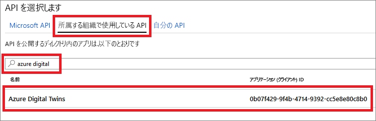
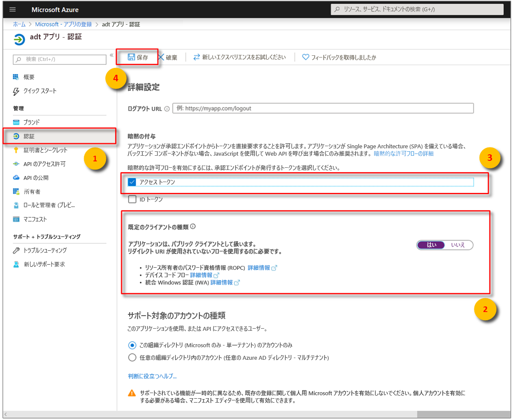

# <a name="how-to-configure-postman-for-azure-digital-twins"></a>Azure Digital Twins 用に Postman を構成する方法

この記事では、Azure Digital Twins Management API を操作およびテストするために、Postman REST クライアントを構成する方法について説明します。 具体的には、次の項目について説明します。

* OAuth 2.0 の暗黙的な許可フローを使用するように Azure Active Directory アプリケーションを構成する方法。
* Management API に対してトークンを使用する HTTP 要求を行うように Postman REST クライアントを使用する方法。
* Postman を使用し、管理 API にマルチパートの POST 要求を行う方法。

## <a name="postman-summary"></a>Postman の概要

ローカル テスト環境を準備するには、[Postman](https://www.getpostman.com/) などの REST クライアント ツールを使用して Azure Digital Twins を開始します。 Postman クライアントは、複雑な HTTP 要求を簡単に作成するのに役立ちます。 Postman クライアントのデスクトップ バージョンをダウンロードするには、[www.getpostman.com/apps](https://www.getpostman.com/apps) にアクセスします。

[Postman](https://www.getpostman.com/) は、便利なデスクトップとプラグイン ベースの GUI に重要な HTTP 要求機能を配置する REST テスト ツールです。

ソリューション開発者は、Postman クライアントを使用して、HTTP 要求の種類 (*POST*、*GET*、*UPDATE*、*PATCH*、*DELETE*)、呼び出す API エンドポイント、SSL の使用を指定できます。 また、Postman では、HTTP 要求ヘッダー、パラメーター、フォーム データ、本文の追加もサポートされています。

## <a name="configure-azure-active-directory-to-use-the-oauth-20-implicit-grant-flow"></a>OAuth 2.0 の暗黙的な許可フローを使用するように Azure Active Directory を構成する

OAuth 2.0 の暗黙的な許可フローを使用するように Azure Active Directory アプリを構成します。

1. アプリの登録の **[API アクセス許可]** ウィンドウを開きます。 **[アクセス許可の追加]** ボタンを選択します。 **[API アクセス許可の要求]** ウィンドウで、 **[所属する組織で使用している API]** タブを選択し、以下を探します:
    
    1. `Azure Digital Twins`. **Azure Digital Twins** API を選択します。

        [](../../includes/media/digital-twins-permissions/aad-aap-search-api-dt.png#lightbox)

    1. または、`Azure Smart Spaces Service` を検索します。 **Azure Smart Spaces Service** API を選択します。

        [](../../includes/media/digital-twins-permissions/aad-app-search-api.png#lightbox)

    > [!IMPORTANT]
    > 表示される Azure AD API の名前と ID は、テナントによって異なります。
    > * テスト テナントと顧客アカウントでは、`Azure Digital Twins` を検索する必要があります。
    > * 他の Microsoft アカウントでは、`Azure Smart Spaces Service` を検索する必要があります。

1. 選択された API は、同じ **[API アクセス許可の要求]** ウィンドウに **Azure Digital Twins** と表示されます。 **[Read (1)]\(読み取り (1)\)** ドロップ ダウンを選択し、 **[Read.Write]** チェック ボックスをオンにします。 **[アクセス許可の追加]** ボタンを選択します

    [](../../includes/media/digital-twins-permissions/aad-app-req-permissions.png#lightbox)

1. 組織の設定によっては、この API への管理者アクセスを許可するために追加の手順を実行する必要があります。 詳細については、管理者にお問い合わせください。 管理者アクセスが承認されると、 **[API アクセス許可]** ウィンドウの **[管理者の同意が必要]** 列に API の次のような内容が表示されます。

    [](../../includes/media/digital-twins-permissions/aad-app-admin-consent.png#lightbox)

1. 2 番目の **[リダイレクト URI]** を `https://www.getpostman.com/oauth2/callback` に構成します。

    [](media/how-to-configure-postman/authentication-redirect-uri.png#lightbox)

1. [アプリが**パブリック クライアント**として登録されている](https://docs.microsoft.com/azure/active-directory/develop/scenario-desktop-app-registration)ことを確認するには、アプリ登録のための **[認証]** ウィンドウを開き、そのウィンドウ内を下へスクロールします。 **[既定のクライアントの種類]** セクションで、 **[アプリケーションは、パブリック クライアントとして扱います]** に対して **[はい]** を選択し、 **[保存]** をクリックします。

    Manifest.json 内の **oauth2AllowImplicitFlow** 設定を有効にするには、 **[アクセス トークン]** をオンにします。

    [](../../includes/media/digital-twins-permissions/aad-configure-public-client.png#lightbox)

1. Azure Active Directory アプリの**アプリケーション ID** をコピーして保管します。 これは後述する手順で使用されます。

   [](../../includes/media//digital-twins-permissions/aad-app-reg-app-id.png#lightbox)


## <a name="obtain-an-oauth-20-token"></a>OAuth 2.0 トークンを取得する

[!INCLUDE [digital-twins-management-api](../../includes/digital-twins-management-api.md)]

Postman をセットアップし、Azure Active Directory トークンを取得するように構成します。 その後、取得したトークンを使用し、Azure Digital Twins に対して認証済みの HTTP 要求を行います。

1. [www.getpostman.com](https://www.getpostman.com/) に移動してアプリをダウンロードします。
1. **[承認 URL]** が正しいことを検証します。 次のような形式になっている必要があります。

    ```plaintext
    https://login.microsoftonline.com/YOUR_AZURE_TENANT.onmicrosoft.com/oauth2/authorize?resource=0b07f429-9f4b-4714-9392-cc5e8e80c8b0
    ```

    | Name  | 置換後の文字列 | 例 |
    |---------|---------|---------|
    | YOUR_AZURE_TENANT | テナントまたは組織の名前 | `microsoft` |

1. **[承認] タブ**を選択し、 **[OAuth 2.0]** を選択して **[Get New Access Token]\(新しいアクセス トークンの取得\)** を選択します。

    | フィールド  | 値 |
    |---------|---------|
    | 付与タイプ | `Implicit` |
    | コールバック URL | `https://www.getpostman.com/oauth2/callback` |
    | 認証 URL | **ステップ 2** の**承認 URL** を使用します |
    | クライアント ID | 前のセクションで作成または再利用した Azure Active Directory アプリの**アプリケーション ID** を使用します |
    | スコープ | 空白 |
    | State | 空白 |
    | クライアント認証 | `Send as Basic Auth header` |

1. クライアントは次のようになります。

    [](media/how-to-configure-postman/configure-postman-oauth-token.png#lightbox)

1. **[Request Token]\(要求トークン\)** を選択します。
  
1. 下へスクロールし、 **[Use Token]\(トークンの使用\)** を選択します。

## <a name="make-a-multipart-post-request"></a>マルチパートの POST 要求を行う

前の手順を完了したら、認証済み HTTP マルチパート POST 要求を行うように Postman を設定します。

1. **[ヘッダー]** タブで、値が `multipart/mixed` の HTTP 要求ヘッダー キー **[Content-Type]** を追加します。

   [](media/how-to-configure-postman/configure-postman-content-type.png#lightbox)

1. テキストではないデータをシリアル化し、ファイルを生成します。 JSON データは JSON ファイルとして保存されます。
1. **[Body]\(本文\)** タブで、`form-data` を選択します。 
1. **キー**名を割り当て、`File` を選択することによって、各ファイルを追加します。
1. 次に、 **[ファイルの選択]** ボタンで各ファイルを選択します。

   [](media/how-to-configure-postman/configure-postman-form-body.png#lightbox)

   >[!NOTE]
   > * Postman クライアントでは、**Content-Type** または **Content-Disposition** をマルチパートに手動で割り当てる必要がありません。
   > * これらのヘッダーをパートごとに指定する必要がありません。
   > * 要求全体に `multipart/mixed` か別の適切な **Content-Type** を選択する必要がありません。

1. 最後に、 **[送信]** を選択し、マルチパート HTTP POST 要求を送信します。 `200` または `201` の状態コードは成功した要求を示します。 適切な応答メッセージが、クライアント インターフェイスに表示されます。

1. API エンドポイントを呼び出して、HTTP POST 要求データを検証します。 

   ```URL
   YOUR_MANAGEMENT_API_URL/spaces/blobs?includes=description
   ```

## <a name="next-steps"></a>次のステップ

- Digital Twins 管理 API の概要とその使用方法については、「[Azure Digital Twins 管理 API の使用方法](how-to-navigate-apis.md)」をご覧ください。

- マルチパート要求を使用し、[Azure Digital Twins のエンティティに BLOB を追加します](./how-to-add-blobs.md)。

- Management API を使用した認証については、[API を使用した認証](./security-authenticating-apis.md)に関するページをご覧ください。
