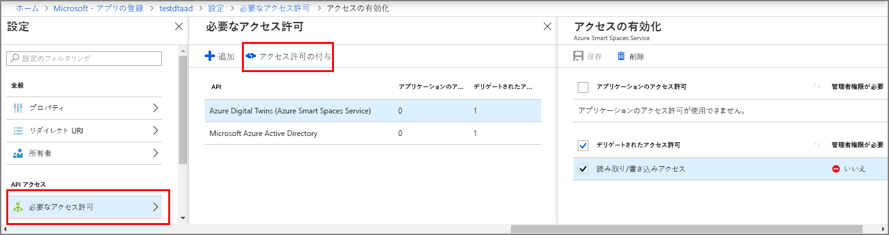

# <a name="how-to-configure-postman-for-azure-digital-twins"></a>Azure Digital Twins 用に Postman を構成する方法

この記事では、Azure Digital Twins Management API を操作およびテストするために、Postman REST クライアントを構成する方法について説明します。 具体的には、次の項目について説明します。

* OAuth 2.0 の暗黙的な許可フローを使用するように Azure Active Directory アプリケーションを構成する方法。
* Management API に対してトークンを使用する HTTP 要求を行うように Postman REST クライアントを使用する方法。
* Postman を使用し、管理 API にマルチパートの POST 要求を行う方法。

## <a name="postman-summary"></a>Postman の概要

ローカル テスト環境を準備するには、[Postman](https://www.getpostman.com/) などの REST クライアント ツールを使用して Azure Digital Twins を開始します。 Postman クライアントは、複雑な HTTP 要求を簡単に作成するのに役立ちます。 Postman クライアントのデスクトップ バージョンをダウンロードするには、[www.getpostman.com/apps](https://www.getpostman.com/apps) にアクセスします。

[Postman](https://www.getpostman.com/) は、便利なデスクトップとプラグイン ベースの GUI に重要な HTTP 要求機能を配置する REST テスト ツールです。

ソリューション開発者は、Postman クライアントを使用して、HTTP 要求の種類 (*POST*、*GET*、*UPDATE*、*PATCH*、*DELETE*)、呼び出す API エンドポイント、SSL の使用を指定できます。 また、Postman では、HTTP 要求ヘッダー、パラメーター、フォーム データ、本文の追加もサポートされています。

## <a name="configure-azure-active-directory-to-use-the-oauth-20-implicit-grant-flow"></a>OAuth 2.0 の暗黙的な許可フローを使用するように Azure Active Directory を構成する

OAuth 2.0 の暗黙的な許可フローを使用するように Azure Active Directory アプリを構成します。

1. [こちらのクイック スタート](https://docs.microsoft.com/azure/active-directory/develop/quickstart-v1-integrate-apps-with-azure-ad)の手順に従って、種類がネイティブの Azure AD アプリケーションを作成します。 または、既存のネイティブ アプリの登録を再利用することもできます。

1. **[必要なアクセス許可]** で、 **[追加]** を選択し、 **[API アクセスの追加]** に「**Azure Digital Twins**」と入力します。 検索で API が見つからない場合は、代わりに **Azure Smart Spaces** を検索します。 次に、 **[アクセス許可の付与] > [委任されたアクセス許可]** を選択し、 **[完了]** を選択します。

    [](../../includes/media/digital-twins-permissions/aad-app-req-permissions.png#lightbox)

1. **[マニフェスト]** を選択して、アプリのアプリケーション マニフェストを開きます。 *oauth2AllowImplicitFlow* を `true` に設定します。

    [](media/how-to-configure-postman/implicit-flow.png#lightbox)

1. **[応答 URL]** を `https://www.getpostman.com/oauth2/callback` に構成します。

    [](media/how-to-configure-postman/reply-url.png#lightbox)

1. Azure Active Directory アプリの**アプリケーション ID** をコピーして保管します。 これは後述する手順で使用されます。

## <a name="obtain-an-oauth-20-token"></a>OAuth 2.0 トークンを取得する

次に、Postman をセットアップし、Azure Active Directory トークンを取得するように構成します。 その後、取得したトークンを使用し、Azure Digital Twins に対して認証済みの HTTP 要求を行います。

1. [www.getpostman.com](https://www.getpostman.com/) に移動してアプリをダウンロードします。
1. **[承認 URL]** が正しいことを検証します。 次のような形式になっている必要があります。

    ```plaintext
    https://login.microsoftonline.com/YOUR_AZURE_TENANT.onmicrosoft.com/oauth2/authorize?resource=0b07f429-9f4b-4714-9392-cc5e8e80c8b0
    ```

    | Name  | 置換後の文字列 | 例 |
    |---------|---------|---------|
    | YOUR_AZURE_TENANT | テナントまたは組織の名前 | `microsoft` |

1. **[承認] タブ**を選択し、 **[OAuth 2.0]** を選択して **[Get New Access Token]\(新しいアクセス トークンの取得\)** を選択します。

    | フィールド  | 値 |
    |---------|---------|
    | 付与タイプ | `Implicit` |
    | コールバック URL | `https://www.getpostman.com/oauth2/callback` |
    | 認証 URL | ステップ 2 の**承認 URL** を使用します |
    | クライアント ID | 前のセクションで作成または別の用途のために作り変えた Azure Active Directory アプリの**アプリケーション ID** を使用します |
    | Scope (スコープ) | 空白 |
    | 状態 | 空白 |
    | クライアント認証 | `Send as Basic Auth header` |

1. クライアントは次のようになります。

    [](media/how-to-configure-postman/postman-oauth-token.png#lightbox)

1. **[Request Token]\(要求トークン\)** を選択します。

    >[!TIP]
    >「OAuth 2 couldn’t be completed」(OAuth 2 を完了できませんでした) というエラー メッセージを受け取った場合は、次の操作を試してください。
    > * Postman を閉じて再起動し、もう一度実行する。
  
1. 下へスクロールし、 **[Use Token]\(トークンの使用\)** を選択します。

<div id="multi"></div>

## <a name="make-a-multipart-post-request"></a>マルチパートの POST 要求を行う

前の手順を完了したら、認証済み HTTP マルチパート POST 要求を行うように Postman を設定します。

1. **[ヘッダー]** タブで、値が `multipart/mixed` の HTTP 要求ヘッダー キー **[Content-Type]** を追加します。

   [](media/how-to-configure-postman/content-type.png#lightbox)

1. テキストではないデータをシリアル化し、ファイルを生成します。 JSON データは JSON ファイルとして保存されます。
1. **[本文]** タブで、 **[キー]** 名を割り当て、`file` または `text` を選択して各ファイルを追加します。
1. 次に、 **[ファイルの選択]** ボタンで各ファイルを選択します。

   [](media/how-to-configure-postman/form-body.png#lightbox)

   >[!NOTE]
   > * Postman クライアントでは、**Content-Type** または **Content-Disposition** をマルチパートに手動で割り当てる必要がありません。
   > * これらのヘッダーをパートごとに指定する必要がありません。
   > * 要求全体に `multipart/mixed` か別の適切な **Content-Type** を選択する必要がありません。

1. 最後に、 **[送信]** を選択し、マルチパート HTTP POST 要求を送信します。

## <a name="next-steps"></a>次の手順

- Digital Twins 管理 API の概要とその使用方法については、「[Azure Digital Twins 管理 API の使用方法](how-to-navigate-apis.md)」をご覧ください。

- マルチパート要求を使用し、[Azure Digital Twins のエンティティに BLOB を追加します](./how-to-add-blobs.md)。

- Management API を使用した認証については、[API を使用した認証](./security-authenticating-apis.md)に関するページをご覧ください。