# <a name="quickstart-create-an-instance-of-azure-database-migration-service-in-hybrid-mode-using-the-azure-portal-preview"></a>クイック スタート:Azure portal を使用してハイブリッド モードで Azure Database Migration Service のインスタンスを作成する (プレビュー)

Azure Database Migration Service のハイブリッド モードを使うと、オンプレミスでホストされている移行 worker と、クラウドで実行されている Azure Database Migration Service のインスタンスを併用して、データベースの以降を管理できます。 ハイブリッド モードは、オンプレミス ネットワークと Azure の間にサイト間接続がないシナリオで、またはサイト間接続の帯域幅が限られている場合に、特に便利です。

このクイックスタートでは、Azure portal を使用してハイブリッド モードで Azure Database Migration Service のインスタンスを作成します。 その後、オンプレミス ネットワークにハイブリッド worker をダウンロードしてインストールし、設定します。 プレビューの間は、Azure Database Migration Service のハイブリッド モードを使用して、SQL Server のオンプレミスのインスタンスから Azure SQL Database に、データを移行できます。

> [!IMPORTANT]
> Azure Database Migration Service ハイブリッド インストーラーには .NET 4.7.2 以降が必要です。 最新バージョンの .NET については、「[.NET Framework のダウンロード](https://dotnet.microsoft.com/download/dotnet-framework)」ページで確認してください。

Azure サブスクリプションをお持ちでない場合は、開始する前に[無料](https://azure.microsoft.com/free/)アカウントを作成してください。

## <a name="sign-in-to-the-azure-portal"></a>Azure portal にサインインする

Web ブラウザーを開いて [Microsoft Azure Portal](https://portal.azure.com/) にアクセスし、資格情報を入力して Portal にサインインします。

既定のビューはサービス ダッシュボードです。

## <a name="register-the-resource-provider"></a>リソース プロバイダーの登録

Azure Database Migration Service の最初のインスタンスを作成する前に、Microsoft.DataMigration リソース プロバイダーを登録します。

1. Azure portal で **[サブスクリプション]** を選択し、Azure Database Migration Service のインスタンスを作成するサブスクリプションを選択して、 **[リソース プロバイダー]** を選択します。

    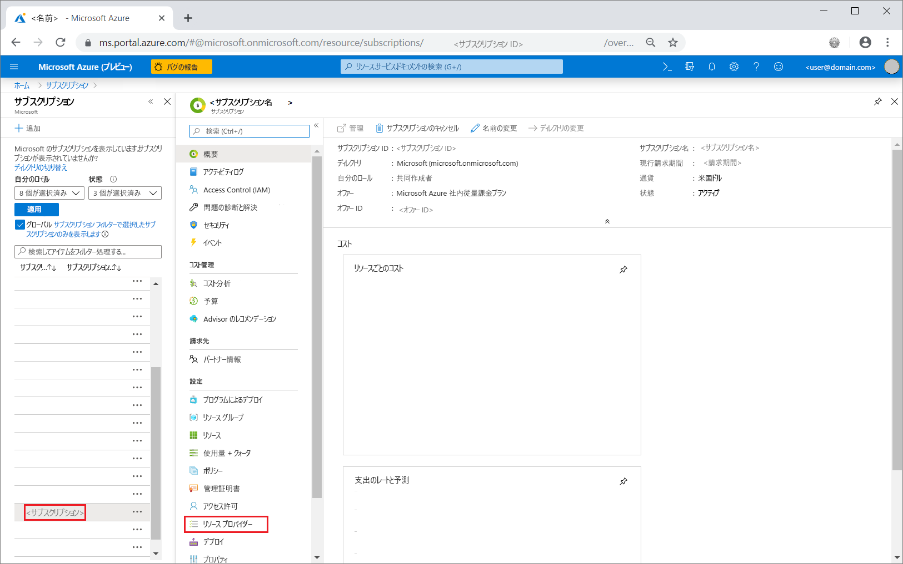

2. 移行を検索し、**Microsoft.DataMigration** の右側にある **[登録]** を選択します。

    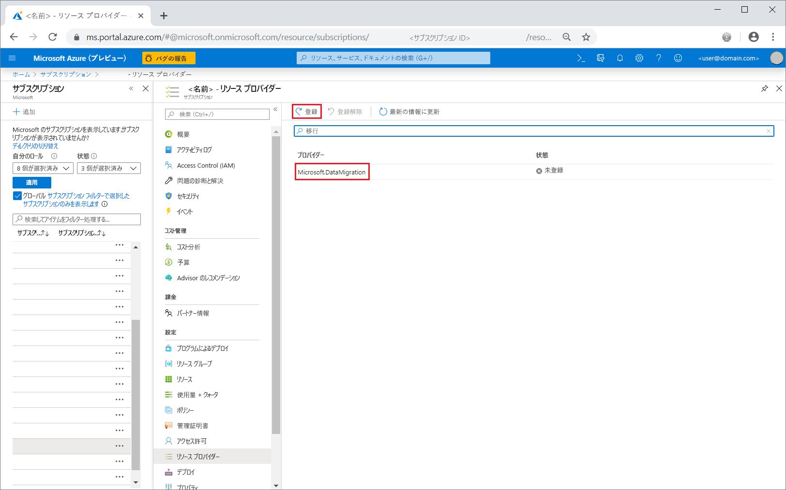

## <a name="create-an-instance-of-the-service"></a>サービスのインスタンスを作成します。

1. **[+ リソースの作成]** を選択して、Azure Database Migration Service のインスタンスを作成します。

2. マーケットプレースで "migration" を検索し、 **[Azure Database Migration Service]** を選択します。 **[Azure Database Migration Service]** 画面で **[作成]** を選択します。

3. **[移行サービスの作成]** 画面で:

    - Azure Database Migration Service のインスタンスを識別する、覚えやすい一意の**サービス名**を選択します。
    - インスタンスを作成する Azure **サブスクリプション**を選択します。
    - 既存の**リソース グループ**を選択するか、新しいリソース グループを作成します。
    - ソースまたはターゲット サーバーに最も近い **[場所]** を選択します。

    > [!IMPORTANT]
    > プレビュー期間中、ハイブリッド モードは米国東部リージョンでのみサポートされます。 ハイブリッド worker はオンプレミス ネットワークにインストールされるため、別のリージョンのターゲットに移行する場合でも、パフォーマンスへの影響はほとんど、またはまったくありません。

    - **[サービス モード]** では、 **[ハイブリッド (プレビュー)]** を選択します。

      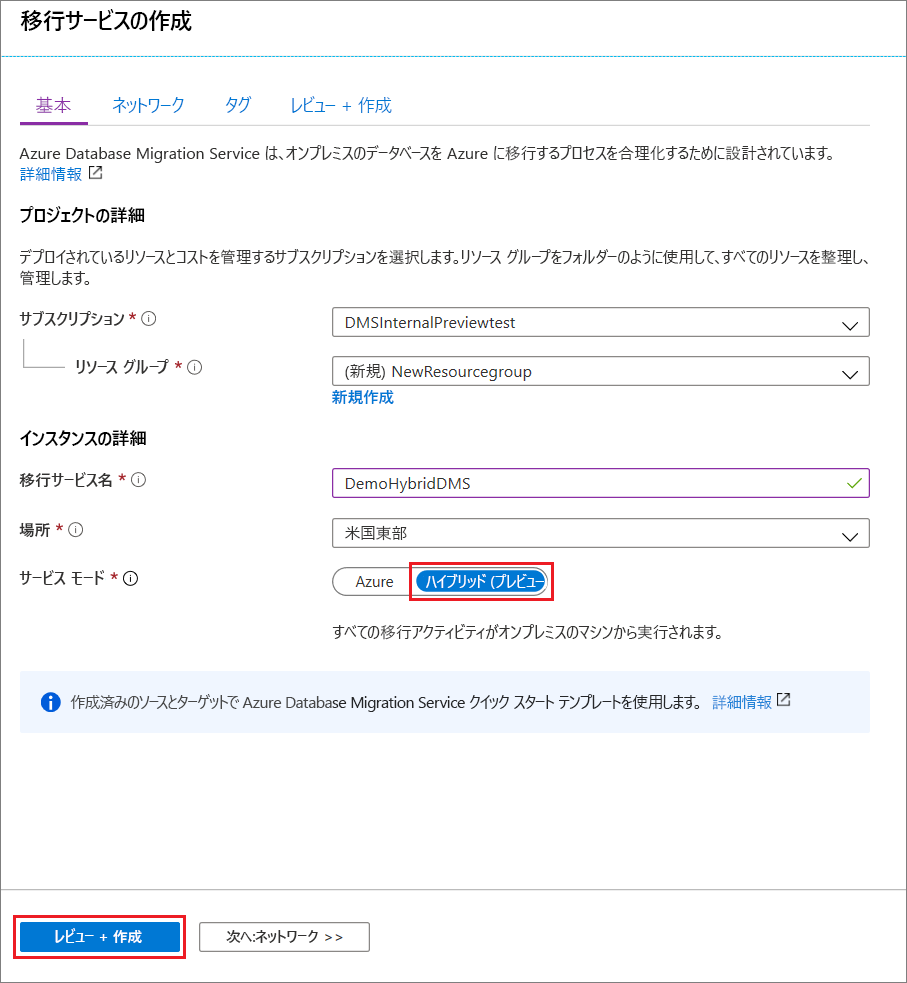

4. **[Review + create]\(レビュー + 作成\)** を選択します。

5. **[確認および作成]** タブで、使用条件を確認し、表示されるその他の情報を確認してから、 **[作成]** を選択します。

    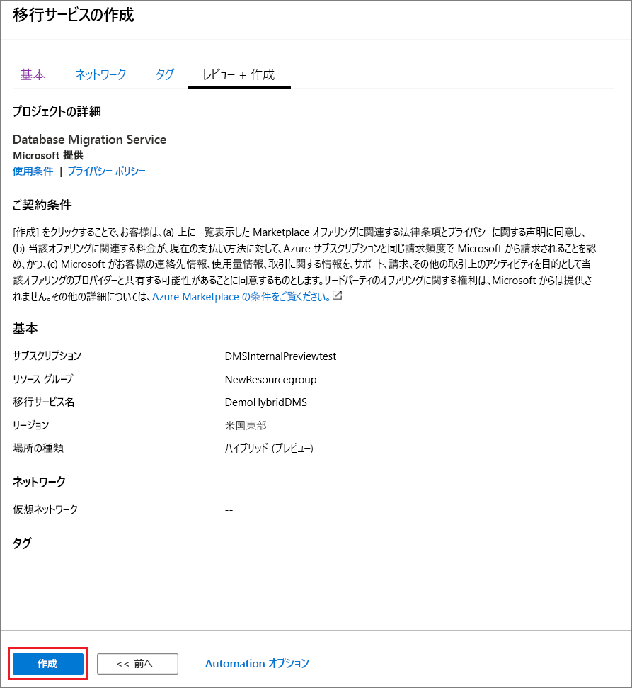

    しばらくすると、ハイブリッド モードの Azure Database Migration Service のインスタンスが作成され、使用できるようになります。 Azure Database Migration Service のインスタンスは、次の図のように表示されます。

    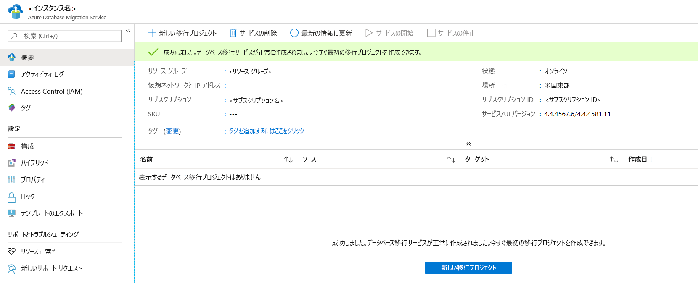

6. サービスが作成されたら、 **[プロパティ]** を選択し、 **[リソース ID]** ボックスに表示されている値をコピーします。この値を使用して、Azure Database Migration Service のハイブリッド worker をインストールします。

    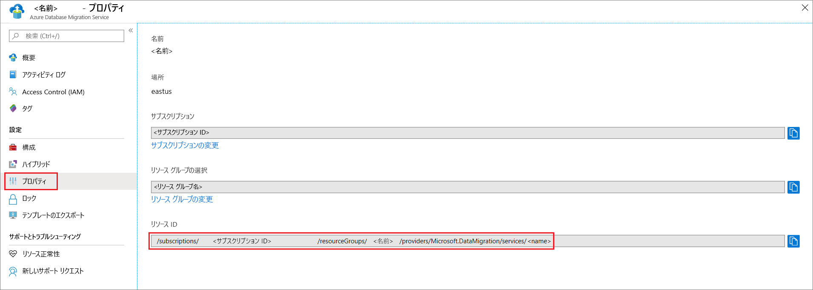

## <a name="create-azure-app-registration-id"></a>Azure アプリの登録 ID を作成する

オンプレミスのハイブリッド worker がクラウド内の Azure Database Migration Service と通信するために使用できる Azure アプリ登録 ID を作成する必要があります。

1. Azure portal で、 **[Azure Active Directory]** 、 **[アプリの登録]** 、 **[新しい登録]** の順に選択します。
2. アプリケーションの名前を指定してから、 **[サポートされているアカウントの種類]** でサポートするアカウントの種類を選択して、アプリケーションを使用できるユーザーを指定します。

    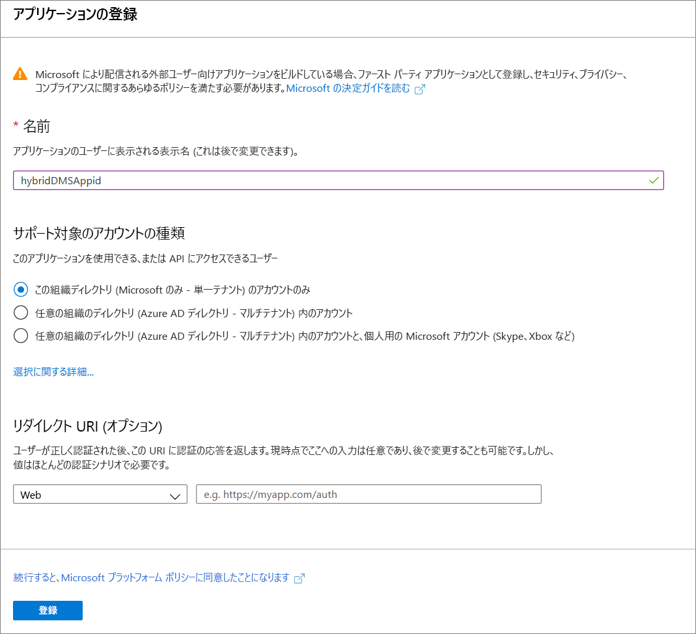

3. **[リダイレクト URI (省略可能)]** フィールドでは既定値を使用し、 **[登録]** を選択します。

4. アプリ ID の登録が完了したら、ハイブリッド worker のインストール時に使用するので、 **[アプリケーション (クライアント) ID]** を記録しておきます。

5. Azure portal で Azure Database Migration Service に移動し、 **[アクセス制御 (IAM)]** を選択した後、 **[ロールの割り当ての追加]** を選択して、アプリ ID に共同作成者のアクセス権を割り当てます。

    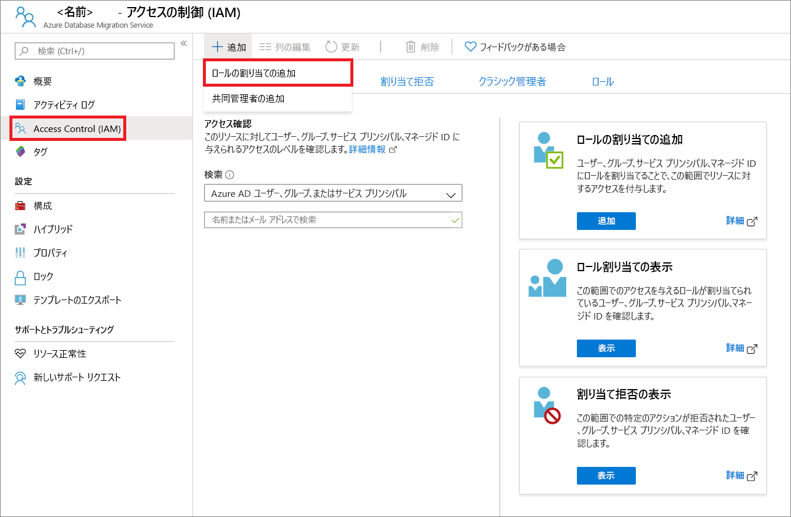

6. ロールとして **[共同作成者]** を選択し、 **[Azure AD のユーザー、グループ、サービス プリンシパル]** にアクセス権を割り当ててから、アプリ ID 名を選択します。

    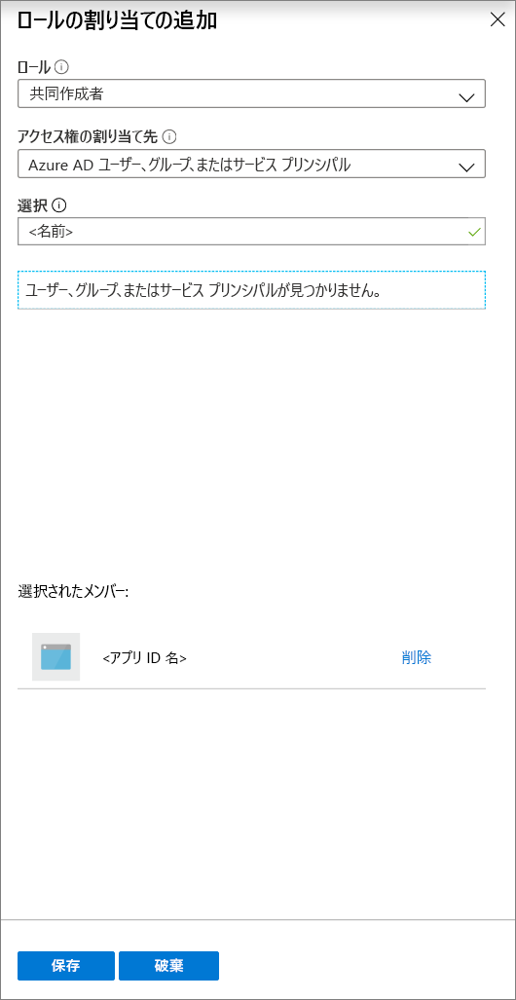

7. **[保存]** を選択して、Azure Database Migration Service リソースに対するアプリ ID のロールの割り当てを保存します。

## <a name="download-and-install-the-hybrid-worker"></a>ハイブリッド worker をダウンロードしてインストールする

1. Azure portal で、Azure Database Migration Service のお使いのインスタンスに移動します。

2. **[設定]** で **[ハイブリッド]** を選択し、 **[Installer download]\(インストーラーのダウンロード\)** を選択して、ハイブリッド worker をダウンロードします。

    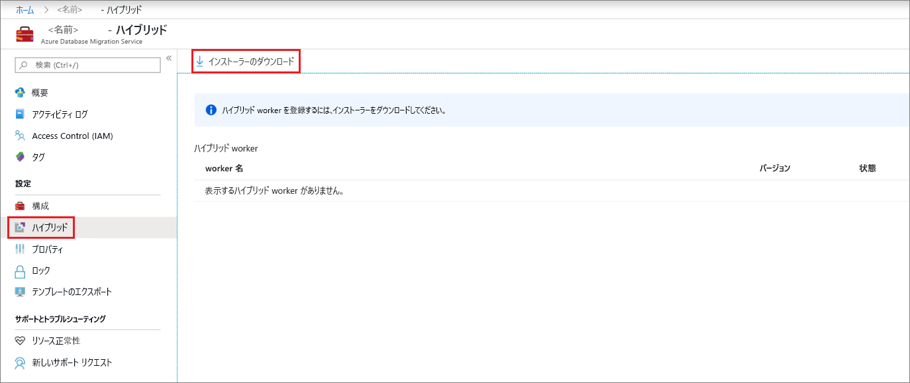

3. Azure Database Migration Service ハイブリッド worker をホストするサーバーで、ZIP ファイルを抽出します。

    > [!IMPORTANT]
    > Azure Database Migration Service ハイブリッド インストーラーには .NET 4.7.2 以降が必要です。 最新バージョンの .NET については、「[.NET Framework のダウンロード](https://dotnet.microsoft.com/download/dotnet-framework)」ページで確認してください。

4. インストール フォルダーで **dmsSettings.json** ファイルを見つけて開き、**ApplicationId** と **resourceId** を指定して、ファイルを保存します。

    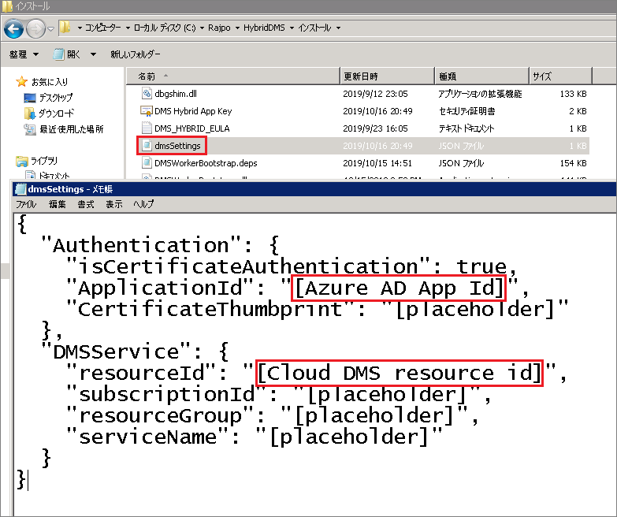
 
5. 次のコマンドを使用して、ハイブリッド worker からの通信の認証を行うために Azure Database Migration Service で使用できる証明書を生成します。

    ```
    <drive>:\<folder>\Install>DMSWorkerBootstrap.exe -a GenerateCert
    ```

    証明書は Install フォルダーに生成されます。

    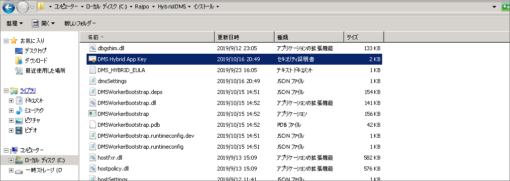

6. Azure portal でアプリ ID に移動し、 **[管理]** で **[証明書とシークレット]** を選択した後、 **[証明書のアップロード]** を選択して、生成した公開証明書を選択します。

    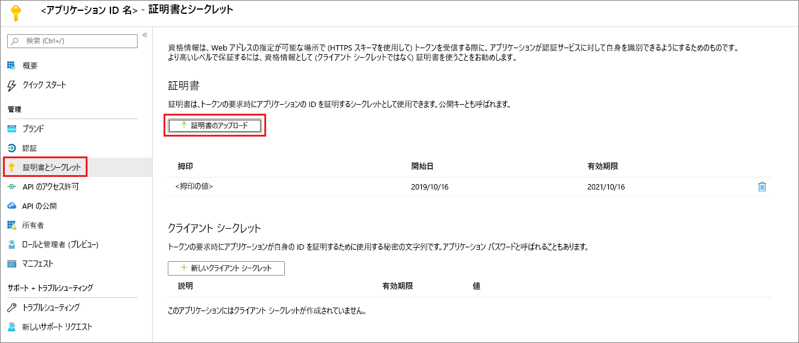

7. 次のコマンドを実行して、オンプレミスのサーバーに Azure Database Migration Service ハイブリッド worker をインストールします。

    ```
    <drive>:\<folder>\Install>DMSWorkerBootstrap.exe -a Install -IAcceptDMSLicenseTerms
    ```

8. インストーラーがエラーなしで実行されると、Azure Database Migration Service でサービスがオンライン状態として表示され、データベースを移行できる状態になります。

    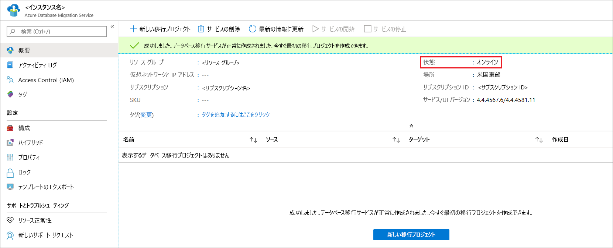

## <a name="uninstall-azure-database-migration-service-hybrid-mode"></a>Azure Database Migration Service のハイブリッド モードをアンインストールする

現状では、Azure Database Migration Service ハイブリッド モードのアンインストールは、オンプレミス サーバー上の Azure Database Migration Service ハイブリッド worker インストーラーで、次のコマンドを使用することによってのみ、サポートされています。

```
<drive>:\<folder>\Install>DMSWorkerBootstrap.exe -a uninstall
```

## <a name="next-steps"></a>次の手順

> [!div class="nextstepaction"]
> [SQL Server を Azure SQL Database マネージド インスタンスにオンラインで移行する](tutorial-sql-server-managed-instance-online.md)
> [SQL Server を Azure SQL Database の単一データベースまたはプールされたデータベースにオフラインで移行する](tutorial-sql-server-to-azure-sql.md)
