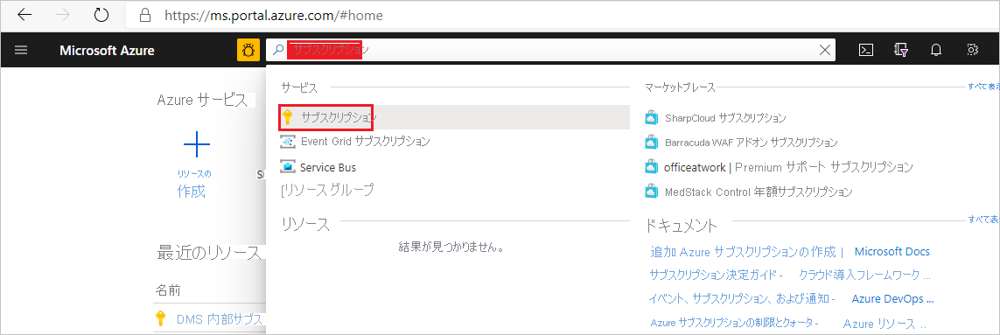
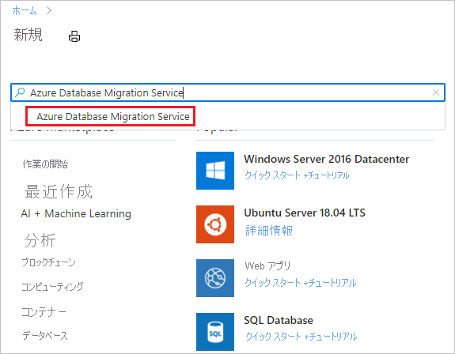
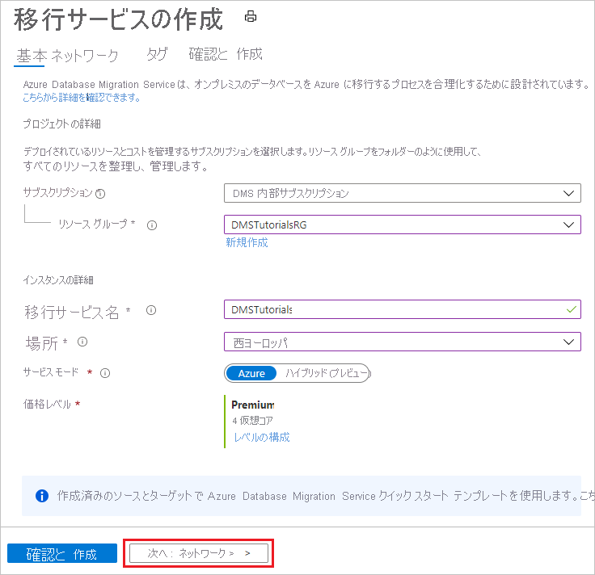
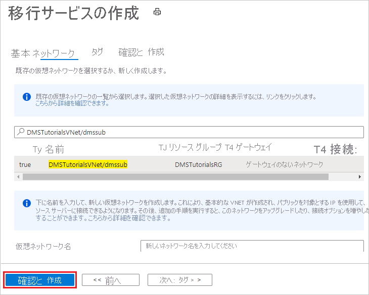

# クイック スタート:Azure Portal を使用して Azure Database Migration Service のインスタンスを作成する

このクイックスタートでは、Azure portal を使用して Azure Database Migration Service のインスタンスを作成します。 作成したインスタンスを使用して、複数のデータベース ソースから Azure データ プラットフォームにデータを移行することができます (SQL Server から Azure SQL Database、SQL Server から Azure SQL Managed Instance など)。

Azure サブスクリプションをお持ちでない場合は、開始する前に[無料](https://azure.microsoft.com/free/)アカウントを作成してください。

## Azure portal にサインインする

Web ブラウザーを開いて [Microsoft Azure Portal](https://portal.azure.com/) にアクセスし、資格情報を入力して Portal にサインインします。 既定のビューはサービス ダッシュボードです。

> [!NOTE]
> リージョンごとにサブスクリプションあたり最大 10 個の DMS インスタンスを作成できます。 それ以上のインスタンスが必要な場合は、サポート チケットを作成してください。

## リソース プロバイダーの登録

Database Migration Service の最初のインスタンスを作成する前に、Microsoft.DataMigration リソース プロバイダーを登録します。

1. Azure portal で、**サブスクリプション** を検索して選択します。

   

2. Azure Database Migration Service のインスタンスを作成するサブスクリプションを選択してから、 **[リソース プロバイダー]** を選びます。

    

3. 移行を検索してから、 **[Microsoft.DataMigration]** の **[登録]** を選択します。

    

## サービスのインスタンスを作成します。

1. Azure portal メニューまたは **[ホーム]** ページで、 **[リソースの作成]** を選択します。 **[Azure Database Migration Service]** を検索して選択します。

    

2. **[Azure Database Migration Service]** 画面で、 **[作成]** を選択します。

    

3. **[移行サービスの作成]** の [基本] 画面で、次の手順を実行します。

     - サブスクリプションを選択します。
     - 新しいリソース グループを作成するか、既存のリソース グループを選択します。
     - Azure Database Migration Service のインスタンスの名前を指定します。
     - Azure Database Migration Service のインスタンスを作成する場所を選択します。
     - サービス モードとして **[Azure]** を選択します。
     - 価格レベルを選択します。 コストと価格レベルの詳細については、[価格に関するページ](https://aka.ms/dms-pricing)を参照してください。
     
    

     - [次へ: ネットワーク] を選択します。

4. **[移行サービスの作成]** の [ネットワーク] 画面で、次の手順を実行します。

    - 既存の仮想ネットワークを選択するか、新しく作成します。 仮想ネットワークによって、ソース データベースとターゲット環境へのアクセスが Azure Database Migration Service に提供されます。 Azure portal で仮想ネットワークを作成する方法の詳細については、「[Azure portal を使用した仮想ネットワークの作成](../virtual-network/quick-create-portal.md)」を参照してください。

    

    - **[確認および作成]** を選択してサービスを作成します。 
    
    - しばらくすると、Azure Database Migration Service のインスタンスが作成され、使用できるようになります。

    

## リソースをクリーンアップする

このクイックスタートで作成したリソースは、[Azure リソース グループ](../azure-resource-manager/management/overview.md)を削除することでクリーンアップできます。 リソース グループを削除するには、作成した Azure Database Migration Service のインスタンスに移動します。 **リソース グループ** 名を選択し、 **[リソース グループの削除]** を選択します。 この操作により、リソース グループ内のすべての資産だけでなく、グループ自体も削除されます。

## 次のステップ

* [オフラインで SQL Server から Azure SQL Database に移行する](tutorial-sql-server-to-azure-sql.md)
* [オンラインで SQL Server から Azure SQL Database に移行する](./tutorial-sql-server-to-azure-sql.md)
* [オフラインで SQL Server を Azure SQL Managed Instance に移行する](tutorial-sql-server-to-managed-instance.md)
* [オンラインで SQL Server を Azure SQL Managed Instance に移行する](tutorial-sql-server-managed-instance-online.md)