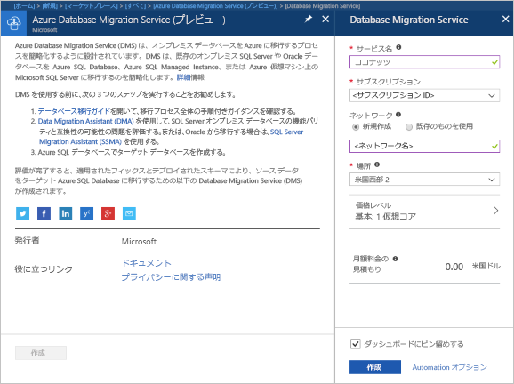

# Azure Portal を使用して Azure Database Migration Service のインスタンスを作成する
このクイック スタートでは、Azure Portal を使用して Azure Database Migration Service のインスタンスを作成します。  サービスを作成したら、それを使用してオンプレミスの SQL Server から Azure SQL Database にデータを移行できます。

Azure サブスクリプションをお持ちでない場合は、開始する前に[無料](https://azure.microsoft.com/free/)アカウントを作成してください。

## Azure Portal にログインする
Web ブラウザーを開いて [Microsoft Azure Portal](https://portal.azure.com/) にアクセスし、資格情報を入力して Portal にサインインします。

既定のビューはサービス ダッシュボードです。

## リソース プロバイダーの登録
Database Migration Service の最初のインスタンスを作成する前に、Microsoft.DataMigration リソース プロバイダーを登録します。

1. Azure Portal で、**[すべてのサービス]** を選択してから、**[サブスクリプション]** を選択します。

2. Azure Database Migration Service のインスタンスを作成するサブスクリプションを選択して、**[リソース プロバイダー]** を選択します。

3. 移行を検索し、Microsoft.DataMigration の右側にある **[登録]** を選択します。

## サービスのインスタンスを作成します。
1. **[+ リソースの作成]** をクリックして、Azure Database Migration Service のインスタンスを作成します。

2. マーケットプレースで "migration" を検索し、**[Azure Database Migration Service]** を選択します。**[Azure Database Migration Service]** 画面で **[作成]** をクリックします。

3. **[Database Migration Service]** 画面で次の操作を行います。 

    - Azure Database Migration Service のインスタンスを識別する、覚えやすい一意の**サービス名**を選択します。
    - インスタンスを作成する Azure **サブスクリプション**を選択します。
    - 一意の名前の新しい**ネットワーク**を作成します。
    - ソースまたはターゲット サーバーに最も近い **[場所]** を選択します。
    - **[価格レベル]** に [Basic: 1 vCore]\(Basic: 1 仮想コア\) を選択します。

    
4. **[作成]** を選択します。

しばらくすると、Azure Database Migration Service のインスタンスが作成され、使用できるようになります。 Database Migration Service は、次の図のように表示されます。

## リソースのクリーンアップ
このクイック スタートで作成したリソースは、[Azure リソース グループ](../azure-resource-manager/resource-group-overview.md)を削除することでクリーンアップできます。  リソース グループを削除するには、作成した Azure Database Migration Service のインスタンスに移動します。 **リソース グループ**名を選択し、**[リソース グループの削除]** を選択します。  この操作により、リソース グループ内のすべての資産だけでなく、グループ自体も削除されます。

## 次の手順
> [!div class="nextstepaction"]
> [オンプレミスの SQL Server を Azure SQL Database に移行する](tutorial-sql-server-to-azure-sql.md)