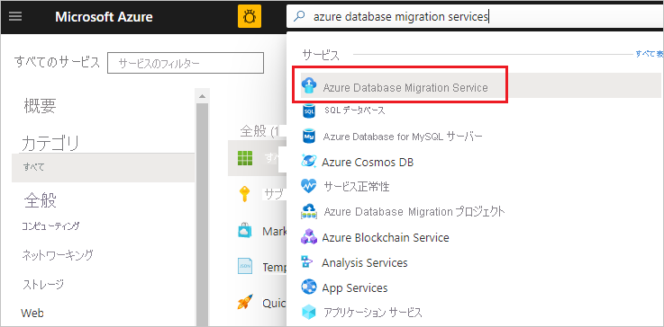

# チュートリアル: DMS を使用して、SQL Server を Azure SQL Database Managed Instance にオンラインで移行する
Azure Database Migration Service を使用すれば、オンプレミスの SQL Server インスタンスから [Azure SQL Database Managed Instance](../sql-database/sql-database-managed-instance.md) に、最小限のダウンタイムでデータベースを移行できます。 一定の手作業が必要になる可能性のあるその他の方法については、記事「[Azure SQL Database Managed Instance への SQL Server インスタンスの移行](../sql-database/sql-database-managed-instance-migrate.md)」を参照してください。

このチュートリアルでは、Azure Database Migration Service を使用して、SQL Server のオンプレミスのインスタンスから Azure SQL Database Managed Instance に、最小限のダウンタイムで **Adventureworks2012** データベースを移行します。

このチュートリアルでは、以下の内容を学習します。
> [!div class="checklist"]
> * Azure Database Migration Service のインスタンスを作成する。
> * Azure Database Migration Service を使用して、移行プロジェクトを作成し、オンライン移行を開始する。
> * 移行を監視する。
> * 準備が整ったら、移行をカットオーバーする。

> [!NOTE]
> Azure Database Migration Service を使用してオンライン移行を実行するには、Premium 価格レベルに基づいてインスタンスを作成する必要があります。

> [!IMPORTANT]
> 最適な移行エクスペリエンスのために、ターゲット データベースと同じ Azure リージョンに Azure Database Migration Service のインスタンスを作成することをお勧めします。 リージョンや地域をまたいでデータを移動する場合、移行プロセスが遅くなり、エラーが発生する可能性があります。

[!INCLUDE [online-offline](../../includes/database-migration-service-offline-online.md)]

この記事では、SQL Server から Azure SQL Database Managed Instance へのオンライン移行について説明します。 オフライン移行については、「[DMS を使用して、SQL Server を Azure SQL Database Managed Instance にオフラインで移行する](tutorial-sql-server-to-managed-instance.md)」を参照してください。

## 前提条件
このチュートリアルを完了するには、以下を実行する必要があります。

- Azure Resource Manager デプロイ モデルを使用して、Azure Database Migration Service 用の VNET を作成します。これで、[ExpressRoute](https://docs.microsoft.com/azure/expressroute/expressroute-introduction) または [VPN](https://docs.microsoft.com/azure/vpn-gateway/vpn-gateway-about-vpngateways) を使用したオンプレミスのソース サーバーとのサイト間接続を確立します。 [Azure Database Migration Service を使用して Azure SQL DB Managed Instance を移行するためのネットワーク トポロジを学習します](https://aka.ms/dmsnetworkformi)。
- Azure Virtual Network (VNET) のネットワーク セキュリティ グループの規則によって、通信ポート 443、53、9354、445、12000 がブロックされていないことを確認します。 Azure VNET NSG トラフィックのフィルター処理の詳細については、「[ネットワーク セキュリティ グループによるネットワーク トラフィックのフィルタリング](https://docs.microsoft.com/azure/virtual-network/virtual-networks-nsg)」を参照してください。
- [ソース データベース エンジンへのアクセスのために Windows ファイアウォール](https://docs.microsoft.com/sql/database-engine/configure-windows/configure-a-windows-firewall-for-database-engine-access)を構成します。
- Azure Database Migration Service がソースの SQL Server にアクセスできるように Windows ファイアウォールを開きます。既定では TCP ポート 1433 が使用されます。
- 動的ポートを使用して複数の名前付き SQL Server インスタンスを実行している場合は、SQL Browser サービスを有効にし、ファイアウォール経由の UDP ポート 1434 へのアクセスを許可することをお勧めします。これにより、Azure Database Migration Service はソース サーバー上の名前付きインスタンスに接続できるようになります。
- ソース データベースの前でファイアウォール アプライアンスを使用する場合は、Azure Database Migration Service が移行のためにソース データベースにアクセスし、SMB ポート 445 経由でファイルにアクセスできるように、ファイアウォール規則を追加することが必要な場合があります。
- Azure SQL Database マネージド インスタンスを作成します。手順の詳細については、「[Create an Azure SQL Database Managed Instance in the Azure portal](https://aka.ms/sqldbmi)」 (Azure Portal で Azure SQL Database マネージド インスタンスを作成する) を参照してください。
- ソース SQL Server への接続と、ターゲットのマネージド インスタンスに使用するログインが sysadmin サーバー ロールのメンバーであることを確認してください。
- Azure Database Migration Service がデータベースの移行に使用できる、すべてのデータベースの完全なデータベース バックアップ ファイルと、その後のトランザクション ログのバックアップ ファイルを収納する SMB ネットワーク共有を提供します。
- 作成したネットワーク共有に対して、ソース SQL Server インスタンスを実行しているサービス アカウントが書き込み特権を持っていること、およびソース サーバーのコンピューター アカウントが読み取り/書き込みアクセス権を持っていることを確認します。
- 作成したネットワーク共有に対するフル コントロール権限を持つ Windows ユーザー (とパスワード) をメモしておきます。 Azure Database Migration Service は、ユーザーの資格情報を借用して、復元操作のために、Azure ストレージ コンテナーにバックアップ ファイルをアップロードします。
- Azure Active Directory のアプリケーション ID を作成します。これは、DMS サービスがターゲットの Azure SQL Database Managed Instance と Azure Storage Container に接続するために使用できる、アプリケーション ID キーを生成します。 詳細については、[ポータルを使用した、リソースにアクセスできる Azure Active Directory アプリケーションとサービス プリンシパルの作成](https://docs.microsoft.com/azure/azure-resource-manager/resource-group-create-service-principal-portal)に関する記事を参照してください。
- DMS サービスがデータベース バックアップ ファイルをアップロードしてデータベースの移行に使用できるように、**標準パフォーマンス レベル**と Azure Storage Account のメモを作成します。  作成された DMS サービスと同じ地域で、Azure Storage Account を確実に作成します。

## Microsoft.DataMigration リソース プロバイダーを登録する

1. Azure portal にサインインし、**[すべてのサービス]** を選択し、**[サブスクリプション]** を選択します。

            
2. Azure Database Migration Service のインスタンスを作成するサブスクリプションを選択して、**[リソース プロバイダー]** を選択します。

    

3. 移行を検索し、**Microsoft.DataMigration** の右側にある **[登録]** を選択します。

       

## Azure Database Migration Service インスタンスを作成する

1. Azure portal で **[+ リソースの作成]** を選択し、**Azure Database Migration Service** を検索して、ドロップダウン リストから **[Azure Database Migration Service]** を選択します。

     

2. **[Azure Database Migration Service]** 画面で、**[作成]** を選択します。

    

3. **[移行サービスの作成]** 画面で、サービスの名前、サブスクリプション、新規または既存のリソース グループを指定します。

4.  DMS のインスタンスの作成先となる場所を選択します。

5. 既存の仮想ネットワーク (VNET) を選択するか、新たに VNET を作成します。
 
    この VNET が Azure Database Migration Service に、ソース SQL Server とターゲット Azure SQL Database Managed Instance へのアクセスを提供します。

    Azure portal で VNET を作成する方法の詳細については、[Azure portal を使用した仮想ネットワークの作成](https://aka.ms/DMSVnet)に関する記事を参照してください。

    その他の詳細については、記事「[Azure Database Migration Service を使用して Azure SQL DB Managed Instance を移行するためのネットワーク トポロジ](https://aka.ms/dmsnetworkformi)」を参照してください。

6. Premium 価格レベルの SKU を選択します。

    > [!NOTE]
    > オンライン移行は、Premium レベルを使用している場合にのみサポートされます。 
   
    コストと価格レベルの詳細については、[価格に関するページ](https://aka.ms/dms-pricing)を参照してください。
   
    

7.  **[作成]** を選択して、サービスを作成します。

## 移行プロジェクトを作成する

サービスのインスタンスが作成されたら、Azure portal 内でそのサービスを探して開き、新しい移行プロジェクトを作成します。

1. Azure ポータルで、**[All services]\(すべてのサービス\)** を選択し、Azure Database Migration Service を検索して、**Azure Database Migration Service** を選択します。

    

2. **[Azure Database Migration Service]** 画面で、作成したインスタンスの名前を検索して、そのインスタンスを選択します。
 
3. **[+ 新しい移行プロジェクト]** を選択します。

4. **[新しい移行プロジェクト]** 画面でプロジェクトの名前を指定し、**[Source server type]\(ソース サーバーの種類\)** ボックスで **[SQL Server]** を選択した後、**[対象サーバーの種類]** ボックスで **[Azure SQL Database Managed Instance]** を選択し、**[アクティビティの種類を選択します]** で **[オンライン データの移行]** を選択します。

   

5. **[アクティビティの作成と実行]** を選択してプロジェクトを作成ます。

## ソース詳細を指定する

1. **[移行ソースの詳細]** 画面で、ソース SQL Server の接続の詳細を指定します。

2. 信頼できる証明書をサーバーにインストールしていない場合は、**[サーバー証明書を信頼する]** チェック ボックスをオンにします。

    信頼できる証明書がインストールされていない場合、SQL Server はインスタンスの開始時に自己署名証明書を生成します。 この証明書は、クライアント接続の資格情報の暗号化に使用されます。

    > [!CAUTION]
    > 自己署名証明書を使用して暗号化されている SSL 接続のセキュリティは強力ではありません。 man-in-the-middle (中間者) 攻撃を受ける可能性が高くなります。 運用環境や、インターネットに接続されているサーバーでは、自己署名証明書を使用した SSL を信頼しないでください。

   

3. **[保存]** を選択します。

## ターゲット詳細を指定する

1.  **[移行ターゲットの詳細]** 画面で **アプリケーション ID** と**キー**を指定します。DMS インスタンスは、これらを使用することで、Azure SQL Database Managed Instance と Azure Storage Account のターゲット インスタンスに接続できます。

    詳細については、[ポータルを使用した、リソースにアクセスできる Azure Active Directory アプリケーションとサービス プリンシパルの作成](https://docs.microsoft.com/azure/azure-resource-manager/resource-group-create-service-principal-portal)に関する記事を参照してください。
    
2. Azure SQL Database Managed Instance のターゲット インスタンスを収納する**サブスクリプション**を選択したら、そのターゲット インスタンスを選択します。

    Azure SQL Database Managed Instance のプロビジョニングがまだ済んでいない場合は、インスタンスのプロビジョニングに役立つ[リンク](https://aka.ms/SQLDBMI)を選択します。 Azure SQL Database Managed Instance のインスタンスが準備できたら、この特定のプロジェクトに戻って移行を実行します。

3. **SQL ユーザー**と**パスワード**を提示して、Azure SQL Database Managed Instance のターゲット インスタンスに接続します。

    

2.  **[保存]** を選択します。

## ソース データベースを選択する

1. **[ソース データベースの選択]** 画面で、移行するソース データベースを選択します。

    

2. **[保存]** を選択します。

## 移行の設定の構成
 
1. **[移行の設定の構成]** 画面で、次の情報を入力します。

    | | |
    |--------|---------|
    |**SMB ネットワーク場所の共有** | Azure Database Migration Service が移行に使用できる、完全なデータベース バックアップ ファイルとトランザクション ログのバックアップ ファイルを収納する、ローカルな SMB ネットワーク共有です。 ソースの SQL Server インスタンスを実行しているサービス アカウントには、このネットワーク共有での読み取り/書き込み権限がなければなりません。 たとえば、ネットワーク共有のサーバーの FQDN または IP アドレスを "\\\servername.domainname.com\backupfolder" または "\\\IP address\backupfolder" と指定します。|
    |**ユーザー名** | 上で指定したネットワーク共有に対するフル コントロール権限が Windows ユーザーにあることを確認してください。 Azure Database Migration Service は、ユーザーの資格情報を借用して、復元操作のために、Azure ストレージ コンテナーにバックアップ ファイルをアップロードします。 |
    |**パスワード** | ユーザーのパスワード。 |
    |**Azure Storage Account のサブスクリプション** | Azure Storage Account を収納するサブスクリプションを選択します。 |
    |**Azure Storage アカウント** | DMS が SMB ネットワーク共有からバックアップ ファイルをアップロードして、データベース移行に使用できるように、Azure Storage Account を選択します。  最適なファイル アップロードのパフォーマンスを得るには、DMS サービスと同じ地域にある Storage Account を選択することをお勧めします。 |
    
    

2. **[保存]** を選択します。
 
## 移行の概要を確認する

1. **[Migration summary]\(移行の概要\)** 画面の **[アクティビティ名]** ボックスに移行アクティビティの名前を指定します。

2. 移行プロジェクトに関連付けられた詳細を確認します。
 
    

## 移行を実行して監視する

1. **[移行の実行]** を選択します。

2. 移行アクティビティ画面で、**[更新]** を選択して表示を更新します。
 
   

    データベースとログインのカテゴリを展開して、該当するサーバー オブジェクトの移行状態を監視できます。

   

## 移行カットオーバーの実行

Azure SQL Database Managed Instance のターゲット インスタンスで完全なデータベース バックアップが復元されたら、データベースは移行カットオーバーを実行するために使用できます。

1.  オンライン データベースの移行を完了する準備が整ったら、**[カットオーバーの開始]** を選択します。

2.  ソース データベースへの着信トラフィックをすべて停止します。

3.  [ログ末尾のバックアップ] を採用し、バックアップ ファイルを SMB ネットワーク共有で使用できるようにしたら、この最後のトランザクション ログのバックアップが復元されるまで待機します。

    その時点で、**[保留中の変更]** が 0 に設定されたことがわかります。

4.  **[確認]** を選択したら、**[適用]** を選択します。

    

5.  データベース移行の状態が **[完了]** と表示されたら、Azure SQL Database Managed Instance の新しいターゲット インスタンスにアプリケーションを接続します。

    

## 次の手順

- T-SQL RESTORE コマンドを使用してマネージド インスタンスにデータベースを移行する方法を示したチュートリアルについては、[復元コマンドを使用したマネージド インスタンスへのバックアップの復元](../sql-database/sql-database-managed-instance-restore-from-backup-tutorial.md)に関するページを参照してください。
- マネージド インスタンスについては、「[What is a Managed Instance? (マネージド インスタンスとは)](../sql-database/sql-database-managed-instance.md)」をご覧ください。
- マネージド インスタンスへのアプリケーションの接続については、[アプリケーションの接続](../sql-database/sql-database-managed-instance-connect-app.md)に関するページを参照してください。
