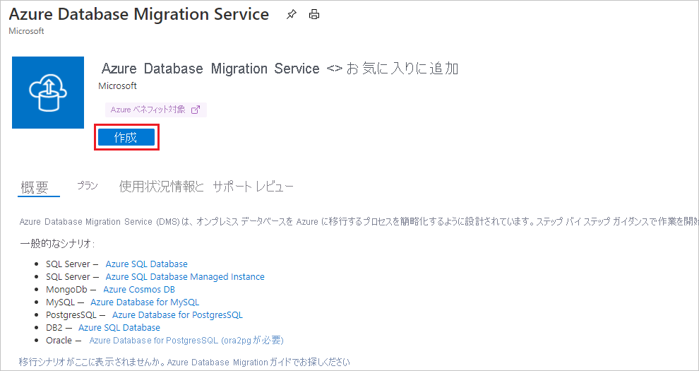
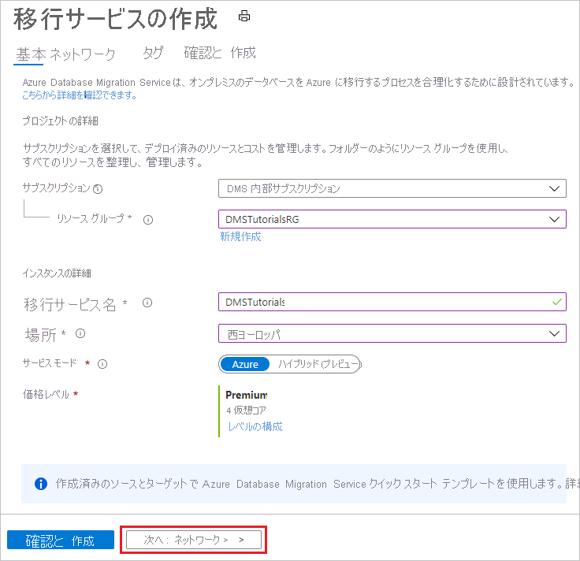
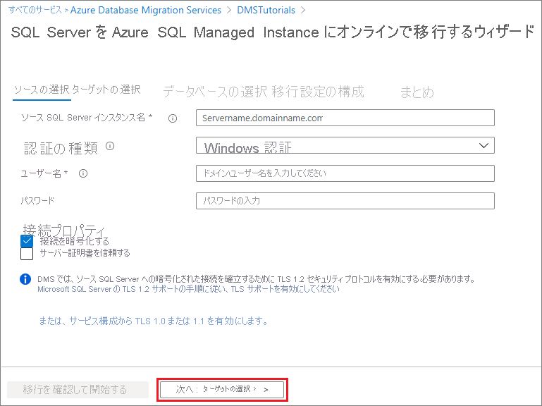
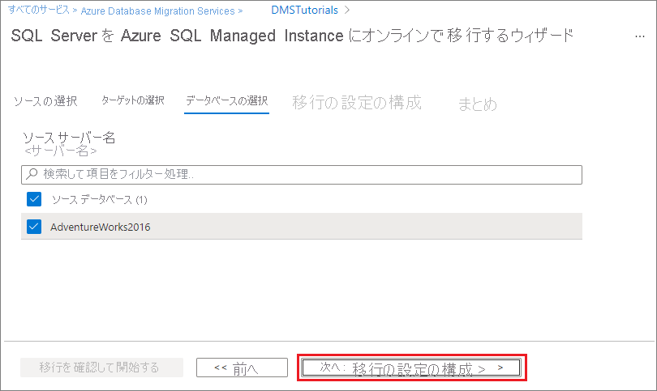
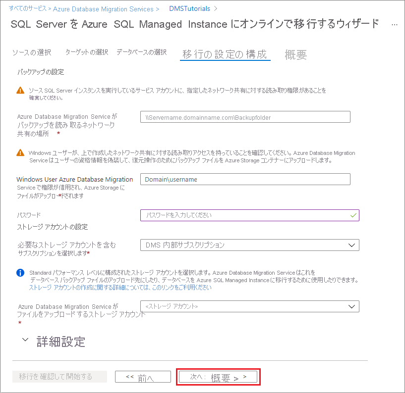
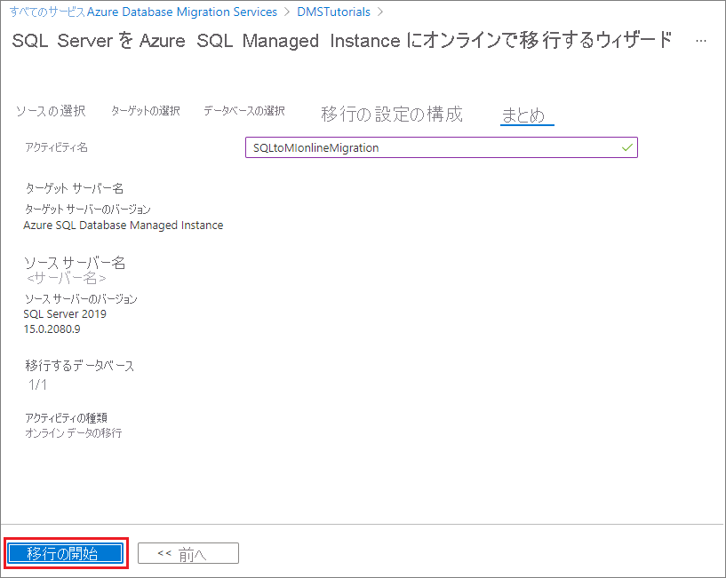
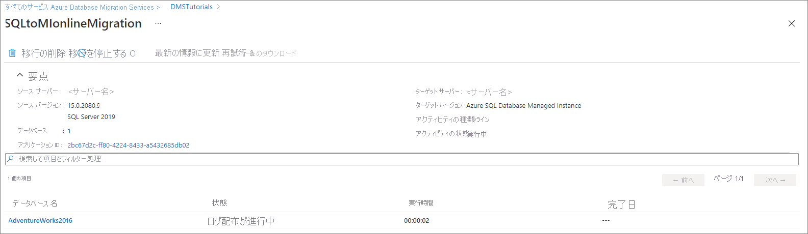

# チュートリアル:DMS を使用してオンラインで SQL Server を Azure SQL Managed Instance に移行する

Azure Database Migration Service を使用して、最小限のダウンタイムで SQL Server インスタンスから [Azure SQL Managed Instance ](../azure-sql/managed-instance/sql-managed-instance-paas-overview.md) にデータベースを移行することができます。 一定の手作業が必要になる可能性のあるその他の方法については、記事「[Azure SQL Managed Instance への SQL Server インスタンスの移行](../azure-sql/migration-guides/managed-instance/sql-server-to-managed-instance-guide.md)」を参照してください。

このチュートリアルでは、Azure Database Migration Service を使用して、SQL Server のオンプレミスのインスタンスから SQL Managed Instance に、最小限のダウンタイムで [AdventureWorks2016](/sql/samples/adventureworks-install-configure#download-backup-files) データベースを移行します。

学習内容:
> [!div class="checklist"]
>
> * Azure DataMigration リソース プロバイダーを登録する。
> * Azure Database Migration Service のインスタンスを作成する。
> * Azure Database Migration Service を使用して、移行プロジェクトを作成し、オンライン移行を開始する。
> * 移行を監視する。
> * 準備ができたら、移行カットオーバーを実行します。

> [!IMPORTANT]
> Azure Database Migration Service を使用した SQL Server から SQL Managed Instance へのオンライン移行を行うには、データベースを移行するためにそのサービスで使用できる SMB ネットワーク共有上にデータベースの完全バックアップとその後のログ バックアップを用意する必要があります。 Azure Database Migration Service によってバックアップが開始されることはなく、移行には既存のバックアップが使用されます。これは、ディザスター リカバリー計画の一部として既に作成されている場合があります。
> 必ず [WITH CHECKSUM オプションを使用してバックアップ](/sql/relational-databases/backup-restore/enable-or-disable-backup-checksums-during-backup-or-restore-sql-server?preserve-view=true&view=sql-server-2017)を作成してください。 各バックアップは、独立したバックアップ ファイルまたは複数のバックアップ ファイルに書き込まれます。 ただし、1 つのバックアップ メディアに複数のバックアップ (完全バックアップとトランザクション ログなど) を追加することはサポートされていません。 最後に、圧縮されたバックアップを使用すると、大きなバックアップの移行に関連する潜在的な問題が発生する可能性を低減できます。

> [!NOTE]
> Azure Database Migration Service を使用してオンライン移行を実行するには、Premium 価格レベルに基づいてインスタンスを作成する必要があります。

> [!IMPORTANT]
> 最適な移行エクスペリエンスのために、ターゲット データベースと同じ Azure リージョンに Azure Database Migration Service のインスタンスを作成することをお勧めします。 リージョンや地域をまたいでデータを移動する場合、移行プロセスが遅くなり、エラーが発生する可能性があります。

> [!IMPORTANT]
> インスタンスの再構成や計画メンテナンスによる中断のリスクを最小限に抑えるために、オンライン移行プロセスの期間をできるだけ短くしてください。 このようなイベントが発生した場合、移行プロセスは最初から開始されます。 計画メンテナンスの場合、移行プロセスが再開されるまでに 36 時間の猶予期間があります。

[!INCLUDE [online-offline](../../includes/database-migration-service-offline-online.md)]

この記事では、SQL Server から SQL Managed Instance へのオンライン移行について説明します。 オフライン移行については、[DMS を使用してオフラインで SQL Server を SQL Managed Instance に移行する方法](tutorial-sql-server-to-managed-instance.md)に関するページを参照してください。

## 前提条件

このチュートリアルを完了するには、以下を実行する必要があります。

* [SQL Server 2016 以降](https://www.microsoft.com/sql-server/sql-server-downloads)をダウンロードしてインストールします。
* SQL Server Express のインストール時に既定では無効になっている TCP/IP プロトコルを有効にします。有効にする手順については、[サーバー ネットワーク プロトコルの有効化または無効化](/sql/database-engine/configure-windows/enable-or-disable-a-server-network-protocol#SSMSProcedure)に関する記事を参照してください。
* [AdventureWorks2016 データベースを SQL Server インスタンスに復元します。](/sql/samples/adventureworks-install-configure#restore-to-sql-server)
* Azure Resource Manager デプロイ モデルを使用して、Azure Database Migration Service 用の Microsoft Azure 仮想ネットワークを作成します。これで、[ExpressRoute](../expressroute/expressroute-introduction.md) または [VPN](../vpn-gateway/vpn-gateway-about-vpngateways.md) を使用したオンプレミスのソース サーバーとのサイト間接続を確立します。 [Azure Database Migration Service を使用した SQL Managed Instance の移行のネットワーク トポロジについて学習してください](./resource-network-topologies.md)。 仮想ネットワークの作成方法の詳細については、[Virtual Network のドキュメント](../virtual-network/index.yml)を参照してください。特に、詳細な手順が記載されたクイックスタートの記事を参照してください。

    > [!NOTE]
    > 仮想ネットワークのセットアップ中、Microsoft へのネットワーク ピアリングに ExpressRoute を使用する場合は、サービスのプロビジョニング先となるサブネットに、次のサービス [エンドポイント](../virtual-network/virtual-network-service-endpoints-overview.md)を追加してください。
    >
    > * ターゲット データベース エンドポイント (SQL エンドポイント、Cosmos DB エンドポイントなど)
    > * ストレージ エンドポイント
    > * サービス バス エンドポイント
    >
    > Azure Database Migration Service にはインターネット接続がないため、この構成が必要となります。
    >
    >オンプレミス ネットワークと Azure の間にサイト間接続がない場合、またはサイト間接続の帯域幅が制限されている場合は、Azure Database Migration Service をハイブリッド モード (プレビュー) で使用することを検討してください。 ハイブリッド モードでは、オンプレミスの移行 worker と、クラウドで実行されている Azure Database Migration Service のインスタンスを利用します。 ハイブリッド モードで Azure Database Migration Service のインスタンスを作成するには、[Azure portal を使用してハイブリッド モードで Azure Database Migration Service のインスタンスを作成する方法](./quickstart-create-data-migration-service-portal.md)に関する記事を参照してください。

    > [!IMPORTANT]
    > 移行の一環として使用されるストレージ アカウントに関して、次のいずれかの作業を行う必要があります。
    > * ストレージ アカウントへのアクセスをすべてのネットワークに許可します。
    > * MI サブネットで[サブネットの委任](../virtual-network/manage-subnet-delegation.md)をオンにし、このサブネットを許可するようにストレージ アカウントのファイアウォール規則を更新します。

* 仮想ネットワークのネットワーク セキュリティ グループの規則によって、ServiceBus、Storage、AzureMonitor の ServiceTag の送信ポート 443 がブロックされていないことを確認します。 仮想ネットワークの NSG トラフィックのフィルター処理の詳細については、[ネットワーク セキュリティ グループによるネットワーク トラフィックのフィルター処理](../virtual-network/virtual-network-vnet-plan-design-arm.md)に関する記事を参照してください。
* [ソース データベース エンジンへのアクセスのために Windows ファイアウォール](/sql/database-engine/configure-windows/configure-a-windows-firewall-for-database-engine-access)を構成します。
* Azure Database Migration Service でソース SQL Server にアクセスできるように Windows ファイアウォールを開放します。既定では TCP ポート 1433 が使用されます。 使用している既定のインスタンスが他のポートでリッスンしている場合は、それをファイアウォールに追加してください。
* 動的ポートを使用して複数の名前付き SQL Server インスタンスを実行している場合は、SQL Browser サービスを有効にし、ファイアウォール経由の UDP ポート 1434 へのアクセスを許可することをお勧めします。これにより、Azure Database Migration Service はソース サーバー上の名前付きインスタンスに接続できるようになります。
* ソース データベースの前でファイアウォール アプライアンスを使用する場合は、Azure Database Migration Service が移行のためにソース データベースにアクセスし、SMB ポート 445 経由でファイルにアクセスできるように、ファイアウォール規則を追加することが必要な場合があります。
* SQL マネージド インスタンスを作成します。手順の詳細については、[Azure portal で SQL マネージド インスタンスを作成する方法](../azure-sql/managed-instance/instance-create-quickstart.md)に関する記事を参照してください。
* ソースの SQL Server とターゲットの SQL Managed Instance の接続に使用するログインが、sysadmin サーバー ロールのメンバーであることを確認します。
* Azure Database Migration Service でデータベースの移行に使用できる、すべてのデータベースの完全なデータベース バックアップ ファイルと、その後のトランザクション ログのバックアップ ファイルが格納されている、SMB ネットワーク共有を提供します。
* 作成したネットワーク共有に対して、ソース SQL Server インスタンスを実行しているサービス アカウントが書き込み特権を持っていること、およびソース サーバーのコンピューター アカウントが読み取り/書き込みアクセス権を持っていることを確認します。
* 作成したネットワーク共有に対するフル コントロール権限を持つ Windows ユーザー (とパスワード) をメモしておきます。 Azure Database Migration Service は、ユーザーの資格情報を借用して、復元操作のために、Azure Storage コンテナーにバックアップ ファイルをアップロードします。
* Azure Active Directory のアプリケーション ID を作成します。これにより、Azure Database Migration Service がターゲットの Azure Database Managed Instance と Azure Storage Container に接続するために使用できる、アプリケーション ID キーが生成されます。 詳細については、[ポータルを使用した、リソースにアクセスできる Azure Active Directory アプリケーションとサービス プリンシパルの作成](../active-directory/develop/howto-create-service-principal-portal.md)に関する記事を参照してください。

  > [!NOTE]
  > Azure Database Migration Service によって使用されるアプリケーション ID では、サービス プリンシパルに対するシークレット (パスワードベース) 認証がサポートされています。 証明書ベースの認証は、サポートされていません。

  > [!NOTE]
  > Azure Database Migration Service では、指定されたアプリケーション ID のサブスクリプションに対する共同作成者アクセス許可が必要です。 または、Azure Database Migration Service で必要な特定のアクセス許可を付与するカスタム ロールを作成することもできます。 カスタム ロールの使用に関する詳細な手順については、「[SQL Server から SQL Managed Instance にオンライン移行するためのカスタム ロール](./resource-custom-roles-sql-db-managed-instance.md)」を参照してください。

* DMS サービスがデータベース バックアップ ファイルをアップロードしてデータベースの移行に使用できるように、**標準パフォーマンス レベル** と Azure Storage Account のメモを作成します。  Azure Storage アカウントは、Azure Database Migration Service インスタンスの作成先と同じリージョンに作成してください。

  > [!NOTE]
  > オンライン移行を使用して、[Transparent Data Encryption](../azure-sql/database/transparent-data-encryption-tde-overview.md) によって保護されたデータベースをマネージド インスタンスに移行する場合は、データベースの復元の前に、オンプレミスまたは Azure VM SQL Server インスタンスの対応する証明書を移行する必要があります。 詳細な手順については、[TDE 証明書のマネージド インスタンスへの移行](../azure-sql/database/transparent-data-encryption-tde-overview.md)に関するページを参照してください。

[!INCLUDE [resource-provider-register](../../includes/database-migration-service-resource-provider-register.md)]

## Azure Database Migration Service インスタンスを作成する

1. Azure portal メニューまたは **[ホーム]** ページで、 **[リソースの作成]** を選択します。 **[Azure Database Migration Service]** を検索して選択します。

    

2. **[Azure Database Migration Service]** 画面で、 **[作成]** を選択します。

    

3. **[移行サービスの作成]** の [基本] 画面で、次の手順を実行します。

     - サブスクリプションを選択します。
     - 新しいリソース グループを作成するか、既存のリソース グループを選択します。
     - Azure Database Migration Service のインスタンスの名前を指定します。
     - Azure Database Migration Service のインスタンスを作成する場所を選択します。
     - サービス モードとして **[Azure]** を選択します。
     - Premium 価格レベルの SKU を選択します。 
     
      > [!NOTE]
      > オンライン移行は、Premium レベルを使用している場合にのみサポートされます。

     - コストと価格レベルの詳細については、[価格に関するページ](https://aka.ms/dms-pricing)を参照してください。

    

     - **[次へ: ネットワーク]** を選択します。

4. **[移行サービスの作成]** の [ネットワーク] 画面で、次の手順を実行します。

    - 既存の仮想ネットワークを選択するか、新しく作成します。 この仮想ネットワークによって、Azure Database Migration Service に、ソース SQL Server とターゲット Azure SQL Managed Instance へのアクセスが提供されます。
     
    - Azure portal で仮想ネットワークを作成する方法の詳細については、「[Azure portal を使用した仮想ネットワークの作成](../virtual-network/quick-create-portal.md)」を参照してください。
    
    - その他の詳細については、記事「[Azure Database Migration Service を使用して Azure SQL Managed Instance を移行するためのネットワーク トポロジ](./resource-network-topologies.md)」を参照してください。

      

    - **[確認と作成]** を選択して詳細を確認し、 **[作成]** を選択してサービスを作成します。

## 移行プロジェクトを作成する

サービスのインスタンスが作成されたら、Azure portal 内でそのサービスを探して開き、新しい移行プロジェクトを作成します。

1. Azure portal のメニューで、 **[すべてのサービス]** を選択します。 **[Azure Database Migration Service]** を検索して選択します。

    

2. **[Azure Database Migration Service]** 画面で、作成した Azure Database Migration Service インスタンスを選択します。

3. **[新しい移行プロジェクト]** を選択します。

     

4. **[新しい移行プロジェクト]** 画面でプロジェクトの名前を指定し、**[Source server type]\(ソース サーバーの種類\)** ボックスで **[SQL Server]** を選択した後、**[ターゲット サーバーの種類]** ボックスで **[Azure SQL Database Managed Instance]** を選択し、**[アクティビティの種類を選択します]** で **[オンライン データの移行]** を選択します。

   

5. **[アクティビティの作成と実行]** を選択してプロジェクトを作成し、移行アクティビティを実行します。

## ソース詳細を指定する

1. **[ソースの選択]** 画面で、ソース SQL Server インスタンスの接続の詳細を指定します。

    ソース SQL Server インスタンス名には、必ず完全修飾ドメイン名 (FQDN) を使用してください。 DNS の名前解決ができない場合は、IP アドレスを使用することもできます。

2. 信頼できる証明書をサーバーにインストールしていない場合は、 **[サーバー証明書を信頼する]** チェック ボックスをオンにします。

    信頼できる証明書がインストールされていない場合、SQL Server はインスタンスの開始時に自己署名証明書を生成します。 この証明書は、クライアント接続の資格情報の暗号化に使用されます。

    > [!CAUTION]
    > 自己署名証明書で暗号化されている TLS 接続のセキュリティは強力ではありません。 man-in-the-middle (中間者) 攻撃を受ける可能性が高くなります。 実稼働環境やインターネットに接続しているサーバーでは、自己署名証明書を使用した TLS 接続は使用しないでください。

    

3. **[次へ: ターゲットの選択]** を選択します。

## ターゲット詳細を指定する

1. **[ターゲットの選択]** 画面で **アプリケーション ID** と **キー** を指定します。DMS インスタンスは、これらを使用することで、SQL Managed Instance のターゲット インスタンスと Azure Storage アカウントに接続できます。

    詳細については、[ポータルを使用した、リソースにアクセスできる Azure Active Directory アプリケーションとサービス プリンシパルの作成](../active-directory/develop/howto-create-service-principal-portal.md)に関する記事を参照してください。

2. SQL Managed Instance のターゲット インスタンスを収納する **サブスクリプション** を選択した後、ターゲットの SQL Managed Instance を選択します。

    SQL Managed Instance のプロビジョニングがまだ済んでいない場合は、インスタンスのプロビジョニングに役立つ[リンク](../azure-sql/managed-instance/instance-create-quickstart.md)を選択します。 SQL Managed Instance の準備ができたら、この特定のプロジェクトに戻って移行を実行します。

3. SQL Managed Instance に接続するための **SQL ユーザー** と **パスワード** を入力します。

    

4. **[次へ: データベースの選択]** を選択します。

## ソース データベースの指定

1. **[データベースの選択]** 画面で、移行するソース データベースを選択します。

  

  > [!IMPORTANT]
  > SQL Server Integration Services (SSIS) を使用する場合、DMS では現在、SQL Server から SQL Managed Instance への SSIS プロジェクトまたはパッケージ (SSISDB) 用のカタログ データベースの移行がサポートされていません。 ただし、Azure Data Factory (ADF) に SSIS をプロビジョニングした後、SQL Managed Instance によってホストされている移行先 SSISDB に SSIS プロジェクトまたはパッケージを再デプロイすることはできます。 SSIS パッケージの移行の詳細については、記事「[SQL Server Integration Services パッケージを Azure に移行する](./how-to-migrate-ssis-packages.md)」を参照してください。

2. **[次へ: 移行の設定の構成]** を選択します。

## 移行の設定の構成

1. **[移行の設定の構成]** 画面で、次の詳細情報を入力します。

    | パラメーター | 説明 |
    |--------|---------|
    |**SMB ネットワーク場所の共有** | Azure Database Migration Service が移行に使用できる、完全なデータベース バックアップ ファイルとトランザクション ログのバックアップ ファイルを収納する、ローカルな SMB ネットワーク共有または Azure ファイル共有です。 ソースの SQL Server インスタンスを実行しているサービス アカウントには、このネットワーク共有での読み取り/書き込み権限がなければなりません。 たとえば、ネットワーク共有のサーバーの FQDN または IP アドレスを "\\\servername.domainname.com\backupfolder" または "\\\IP address\backupfolder" と指定します。 パフォーマンスを向上するために、移行するデータベースごとに個別のフォルダーを使用することをお勧めします。 **[詳細設定]** オプションを使用すると、データベース レベルのファイル共有パスを指定できます。 SMB 共有への接続時に問題が発生した場合は、[SMB 共有](known-issues-azure-sql-db-managed-instance-online.md#smb-file-share-connectivity)に関するページを参照してください。 |
    |**ユーザー名** | 上で指定したネットワーク共有に対するフル コントロール権限が Windows ユーザーにあることを確認してください。 Azure Database Migration Service により、ユーザーの資格情報を借用することで、復元操作のために、Azure Storage コンテナーにバックアップ ファイルがアップロードされます。 Azure ファイル共有を使用している場合は、先頭に AZURE\ を付けたストレージ アカウント名をユーザー名として使用してください。 |
    |**パスワード** | ユーザーのパスワード。 Azure ファイル共有を使用している場合は、ストレージ アカウント キーをパスワードとして使用してください。 |
    |**Azure Storage Account のサブスクリプション** | Azure Storage Account を収納するサブスクリプションを選択します。 |
    |**Azure Storage アカウント** | DMS が SMB ネットワーク共有からバックアップ ファイルをアップロードして、データベース移行に使用できるように、Azure Storage Account を選択します。  最適なファイル アップロードのパフォーマンスを得るには、DMS サービスと同じ地域にある Storage Account を選択することをお勧めします。 |

    

    > [!NOTE]
    > Azure Database Migration Service で "システム エラー 53" または "システム エラー 57" が表示される場合、Azure Database Migration Service が Azure ファイル共有にアクセスできないことが原因である可能性があります。 このいずれかのエラーが発生した場合は、[こちら](../storage/common/storage-network-security.md?toc=%2fazure%2fvirtual-network%2ftoc.json#grant-access-from-a-virtual-network)の手順に従って、ストレージ アカウントに仮想ネットワークからアクセスできるようにしてください。

    > [!IMPORTANT]
    > ループバック チェック機能が有効になっていて、ソース SQL Server とファイル共有が同じコンピューター上にある場合、ソースは FQDN を使用してファイル共有にアクセスできません。 この問題を解決するには、[こちら](https://support.microsoft.com/help/926642/error-message-when-you-try-to-access-a-server-locally-by-using-its-fqd)の手順を使用して、ループバック チェック機能を無効にしてください。

2. **概要** を選択します。

## 移行の概要を確認する

1. **[概要]** 画面の **[アクティビティ名]** テキスト ボックスに、移行アクティビティの名前を指定します。

2. 移行プロジェクトに関連付けられた詳細を確認します。

    

## 移行を実行して監視する

1. **[移行の開始]** を選択します。

2. 移行アクティビティ ウィンドウに、現在のデータベースの移行状態が表示されます。 **[最新の情報に更新]** を選択して、表示を更新してください。

   

    データベースとログインのカテゴリを展開して、該当するサーバー オブジェクトの移行状態を監視できます。

   

## 移行カットオーバーの実行

SQL Managed Instance のターゲット インスタンスで完全なデータベース バックアップが復元されたら、データベースは移行カットオーバーを実行するために使用できます。

1. オンライン データベースの移行を完了する準備が整ったら、 **[カットオーバーの開始]** を選択します。

2. ソース データベースへの着信トラフィックをすべて停止します。

3. [ログ末尾のバックアップ] を採用し、バックアップ ファイルを SMB ネットワーク共有で使用できるようにしたら、この最後のトランザクション ログのバックアップが復元されるまで待機します。

    その時点で、 **[保留中の変更]** が 0 に設定されたことがわかります。

4. **[確認]** を選択したら、 **[適用]** を選択します。

    

    > [!IMPORTANT]
    > カットオーバーの後、Business Critical サービス レベルでの SQL Managed Instance の可用性だけは、AlwaysOn 高可用性グループに対して 3 つのセカンダリ レプリカをシードする必要があるため、General Purpose よりかなり長くかかることがあります。 この操作の所要時間は、データのサイズに依存します。詳細については、「[管理操作の所要時間](../azure-sql/managed-instance/management-operations-overview.md#duration)」を参照してください。

5. データベース移行の状態が **[完了]** と表示されたら、SQL Managed Instance の新しいターゲット インスタンスにアプリケーションを接続します。

    

## その他のリソース

* T-SQL RESTORE コマンドを使用して SQL Managed Instance にデータベースを移行する方法を示したチュートリアルについては、[復元コマンドを使用した SQL Managed Instance へのバックアップの復元](../azure-sql/managed-instance/restore-sample-database-quickstart.md)に関するページを参照してください。
* SQL Managed Instance については、「[Azure SQL Managed Instance とは](../azure-sql/managed-instance/sql-managed-instance-paas-overview.md)」を参照してください。
* SQL Managed Instance へのアプリの接続については、[アプリケーションの接続](../azure-sql/managed-instance/connect-application-instance.md)に関するページを参照してください。
