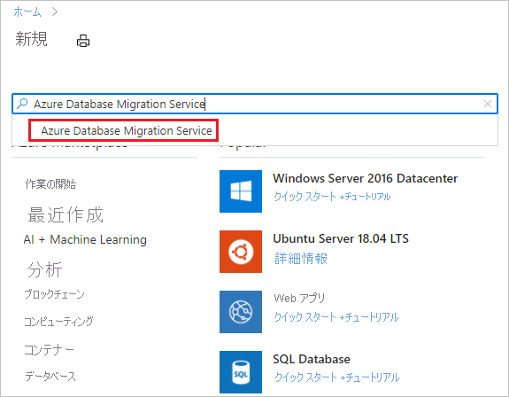
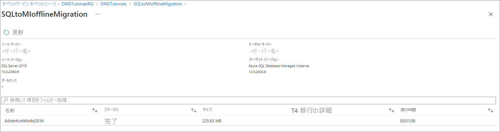

# チュートリアル:DMS を使用してオフラインで SQL Server を Azure SQL Managed Instance に移行する

Azure Database Migration Service を使用して、SQL Server インスタンスから [Azure SQL Managed Instance ](../azure-sql/managed-instance/sql-managed-instance-paas-overview.md) にデータベースを移行することができます。 一定の手作業が必要になる可能性のあるその他の方法については、[SQL Managed Instance への SQL Server インスタンスの移行](../azure-sql/managed-instance/migrate-to-instance-from-sql-server.md)に関する記事を参照してください。

このチュートリアルでは、Azure Database Migration Service を使用して、SQL Server のオンプレミスのインスタンスから SQL Managed Instance に **Adventureworks2012** データベースを移行します。

このチュートリアルでは、以下の内容を学習します。
> [!div class="checklist"]
>
> - Azure Database Migration Service のインスタンスを作成する。
> - Azure Database Migration Service を使用して移行プロジェクトを作成する。
> - 移行を実行する。
> - 移行を監視する。
> - 移行レポートをダウンロードする。

> [!IMPORTANT]
> SQL Server から SQL Managed Instance へのオフライン移行では、Azure Database Migration Service によって自動でバックアップ ファイルを作成できます。 または、サービスがデータベースの移行に使用する SMB ネットワーク共有に、データベースの最新の完全バックアップを提供することもできます。 単一のバックアップ メディアに複数のバックアップを追加しないでください。各バックアップを別々のバックアップ ファイルに作成します。 なお、圧縮されたバックアップを使用して、大規模なバックアップの移行に関する潜在的な問題が発生する可能性を低減させることもできます。

[!INCLUDE [online-offline](../../includes/database-migration-service-offline-online.md)]

この記事では、SQL Server から SQL Managed Instance へのオフライン移行について説明します。 オンライン移行については、[DMS を使用してオンラインで SQL Server を Azure SQL Managed Instance に移行する方法](tutorial-sql-server-managed-instance-online.md)に関するページを参照してください。

## 前提条件

このチュートリアルを完了するには、以下を実行する必要があります。

- Azure Resource Manager デプロイ モデルを使用して、Azure Database Migration Service 用の Microsoft Azure 仮想ネットワークを作成します。これで、[ExpressRoute](../expressroute/expressroute-introduction.md) または [VPN](../vpn-gateway/vpn-gateway-about-vpngateways.md) を使用したオンプレミスのソース サーバーとのサイト間接続を確立します。 [Azure Database Migration Service を使用した SQL Managed Instance の移行のネットワーク トポロジについて学習してください](./resource-network-topologies.md)。 仮想ネットワークの作成方法の詳細については、[Virtual Network のドキュメント](../virtual-network/index.yml)を参照してください。特に、詳細な手順が記載されたクイックスタートの記事を参照してください。

    > [!NOTE]
    > 仮想ネットワークのセットアップ中、Microsoft へのネットワーク ピアリングに ExpressRoute を使用する場合は、サービスのプロビジョニング先となるサブネットに、次のサービス [エンドポイント](../virtual-network/virtual-network-service-endpoints-overview.md)を追加してください。
    > - ターゲット データベース エンドポイント (SQL エンドポイント、Cosmos DB エンドポイントなど)
    > - ストレージ エンドポイント
    > - サービス バス エンドポイント
    >
    > Azure Database Migration Service にはインターネット接続がないため、この構成が必要となります。

- 仮想ネットワークのネットワーク セキュリティ グループの規則によって、ServiceBus、Storage、AzureMonitor の ServiceTag の送信ポート 443 がブロックされていないことを確認します。 仮想ネットワークの NSG トラフィックのフィルター処理の詳細については、[ネットワーク セキュリティ グループによるネットワーク トラフィックのフィルター処理](../virtual-network/virtual-network-vnet-plan-design-arm.md)に関する記事を参照してください。
- [ソース データベース エンジンへのアクセスのために Windows ファイアウォール](/sql/database-engine/configure-windows/configure-a-windows-firewall-for-database-engine-access)を構成します。
- Azure Database Migration Service でソース SQL Server にアクセスできるように Windows ファイアウォールを開放します。既定では TCP ポート 1433 が使用されます。 使用している既定のインスタンスが他のポートでリッスンしている場合は、それをファイアウォールに追加してください。
- 動的ポートを使用して複数の名前付き SQL Server インスタンスを実行している場合は、SQL Browser サービスを有効にし、ファイアウォール経由の UDP ポート 1434 へのアクセスを許可することをお勧めします。これにより、Azure Database Migration Service はソース サーバー上の名前付きインスタンスに接続できるようになります。
- ソース データベースの前でファイアウォール アプライアンスを使用する場合は、Azure Database Migration Service が移行のためにソース データベースにアクセスし、SMB ポート 445 経由でファイルにアクセスできるように、ファイアウォール規則を追加することが必要な場合があります。
- SQL マネージド インスタンスを作成します。手順の詳細については、[Azure portal で SQL マネージド インスタンスを作成する方法](../azure-sql/managed-instance/instance-create-quickstart.md)に関する記事を参照してください。
- ソースの SQL Server とターゲットの SQL Managed Instance の接続に使用するログインが、sysadmin サーバー ロールのメンバーであることを確認します。

    >[!NOTE]
    >既定では Azure Database Migration Service でサポートされているのは、SQL ログインの移行のみです。 ただし、次の方法により Windows ログインを移行する機能を有効にすることができます。
    >
    >- ターゲット SQL Managed Instance に AAD 読み取りアクセス権が付与されていることを確認します。これは、**グローバル管理者** ロールを持つユーザーが Azure portal を介して構成できます。
    >- Azure portal ([構成] ページ) を介して設定された Windows ユーザーまたはグループのログイン移行を有効にするように、ご利用の Azure Database Migration Service インスタンスを構成します。 この設定を有効にしたら、サービスを再起動して変更を有効にします。
    >
    > サービスを再起動すると、Windows ユーザーまたはグループのログインが、移行可能なログインの一覧に表示されます。 移行する Windows ユーザーまたはグループのログインについては、関連付けられているドメイン名を指定するように求められます。 サービス ユーザー アカウント (ドメイン名 NT AUTHORITY を含むアカウント) と仮想ユーザー アカウント (ドメイン名 NT SERVICE を含むアカウント名) はサポートされていません。

- Azure Database Migration Service がソース データベースのバックアップに使用できるネットワーク共有を作成します。
- 作成したネットワーク共有に対して、ソース SQL Server インスタンスを実行しているサービス アカウントが書き込み特権を持っていること、およびソース サーバーのコンピューター アカウントが読み取り/書き込みアクセス権を持っていることを確認します。
- 作成したネットワーク共有に対するフル コントロール権限を持つ Windows ユーザー (とパスワード) をメモしておきます。 Azure Database Migration Service は、ユーザーの資格情報を借用して、復元操作のために、Azure Storage コンテナーにバックアップ ファイルをアップロードします。
- Blob コンテナーを作成して、[ストレージ エクスプローラーを使用した Azure Blob Storage リソースの管理](../vs-azure-tools-storage-explorer-blobs.md#get-the-sas-for-a-blob-container)に関するページの手順に従って、SAS URI を取得します。SAS URI の作成時には、必ずポリシー ウィンドウに表示されるすべてのアクセス許可 (読み取り、書き込み、削除、一覧表示) を選択してください。 この詳細情報により、Azure Database Migration Service は、対象のストレージ アカウント コンテナーにアクセスし、SQL Managed Instance にデータベースを移行するために使用されるバックアップ ファイルをアップロードできます。

    > [!NOTE]
    > Azure Database Migration Service では、[移行の設定の構成](#configure-migration-settings)ステップでストレージ アカウント設定を構成するときに、アカウント レベルの SAS トークンの使用がサポートされていません。
    
## Microsoft.DataMigration リソース プロバイダーを登録する

1. Azure portal にサインインし、 **[すべてのサービス]** を選択し、 **[サブスクリプション]** を選択します。

    

2. Azure Database Migration Service のインスタンスを作成するサブスクリプションを選択してから、 **[リソース プロバイダー]** を選びます。

    

3. 移行を検索し、**Microsoft.DataMigration** の右側にある **[登録]** を選択します。

    

## Azure Database Migration Service インスタンスを作成する

1. Azure portal で **[+ リソースの作成]** を選択し、**Azure Database Migration Service** を検索して、ドロップダウン リストから **[Azure Database Migration Service]** を選択します。

    

2. **[Azure Database Migration Service]** 画面で、 **[作成]** を選択します。

    

3. **[移行サービスの作成]** 画面で、サービスの名前、サブスクリプション、新規または既存のリソース グループを指定します。

4. DMS のインスタンスの作成先となる場所を選択します。

5. 既存の仮想ネットワークを選択するか、新たに作成します。

    この仮想ネットワークによって、Azure Database Migration Service に、ソース SQL Server とターゲット SQL マネージド インスタンスへのアクセスが提供されます。

    Azure portal で仮想ネットワークを作成する方法の詳細については、[Azure portal を使用した仮想ネットワークの作成](../virtual-network/quick-create-portal.md)に関する記事を参照してください。

    その他の詳細については、記事「[Azure Database Migration Service を使用して Azure SQL Managed Instance を移行するためのネットワーク トポロジ](./resource-network-topologies.md)」を参照してください。

6. 価格レベルを選択します。

    コストと価格レベルの詳細については、[価格に関するページ](https://aka.ms/dms-pricing)を参照してください。

    

7. **[作成]** を選択して、サービスを作成します。

## 移行プロジェクトを作成する

サービスのインスタンスが作成されたら、Azure portal 内でそのサービスを探して開き、新しい移行プロジェクトを作成します。

1. Azure ポータルで、 **[All services]\(すべてのサービス\)** を選択し、Azure Database Migration Service を検索して、**Azure Database Migration Service** を選択します。

    

2. **[Azure Database Migration Service]** 画面で、作成したインスタンスの名前を検索して、そのインスタンスを選択します。

3. **[+ 新しい移行プロジェクト]** を選択します。

4. **[新しい移行プロジェクト]** 画面で、プロジェクトの名前を指定します。 **[ソース サーバーの種類]** ボックスで **[SQL Server]** を選択し、 **[ターゲット サーバーの種類]** ボックスで **[Azure SQL Managed Instance]** を選択します。次に、 **[アクティビティの種類を選択します]** で **[オフライン データの移行]** を選択します。

   

5. **[作成]** を選択してプロジェクトを作成します。

## ソース詳細を指定する

1. **[移行ソースの詳細]** 画面で、ソース SQL Server の接続の詳細を指定します。

2. 信頼できる証明書をサーバーにインストールしていない場合は、 **[サーバー証明書を信頼する]** チェック ボックスをオンにします。

    信頼できる証明書がインストールされていない場合、SQL Server はインスタンスの開始時に自己署名証明書を生成します。 この証明書は、クライアント接続の資格情報の暗号化に使用されます。

    > [!CAUTION]
    > 自己署名証明書で暗号化されている TLS 接続のセキュリティは強力ではありません。 man-in-the-middle (中間者) 攻撃を受ける可能性が高くなります。 実稼働環境やインターネットに接続しているサーバーでは、自己署名証明書を使用した TLS 接続は使用しないでください。

   

3. **[保存]** を選択します。

4. **[ソース データベースの選択]** 画面で、移行する **Adventureworks2012** データベースを選択します。

   

    > [!IMPORTANT]
    > SQL Server Integration Services (SSIS) を使用する場合、DMS では現在、SQL Server から SQL Managed Instance への SSIS プロジェクトまたはパッケージ (SSISDB) 用のカタログ データベースの移行がサポートされていません。 ただし、Azure Data Factory (ADF) に SSIS をプロビジョニングした後、SQL Managed Instance によってホストされている移行先 SSISDB に SSIS プロジェクトまたはパッケージを再デプロイすることはできます。 SSIS パッケージの移行の詳細については、記事「[SQL Server Integration Services パッケージを Azure に移行する](./how-to-migrate-ssis-packages.md)」を参照してください。

5. **[保存]** を選択します。

## ターゲット詳細を指定する

1. **[移行のターゲットの詳細]** 画面で、ターゲットの接続の詳細を指定します。このターゲットは、**AdventureWorks2012** データベースの移行先である、事前プロビジョニング済みの SQL Managed Instance です。

    SQL Managed Instance のプロビジョニングがまだ済んでいない場合は、インスタンスのプロビジョニングに役立つ[リンク](../azure-sql/managed-instance/instance-create-quickstart.md)を選択します。 そのままプロジェクトの作成を続行し、SQL Managed Instance の準備ができたら、この特定のプロジェクトに戻って移行を実行できます。

    

2. **[保存]** を選択します。

## ソース データベースを選択する

1. **[ソース データベースの選択]** 画面で、移行するソース データベースを選択します。

    

2. **[保存]** を選択します。

## ログインを選択する

1. **[ログインの選択]** 画面で、移行するログインを選択します。

    >[!NOTE]
    >既定では Azure Database Migration Service でサポートされているのは、SQL ログインの移行のみです。 Windows ログインの移行に対するサポートを有効にするには、このチュートリアルの「**前提条件**」セクションを参照してください。

    

2. **[保存]** を選択します。

## 移行の設定の構成

1. **[移行の設定の構成]** 画面で、次の情報を入力します。

    | パラメーター | 説明 |
    |--------|---------|
    |**ソースのバックアップ オプションを選択します** | DMS がデータベースの移行に使用できる完全バックアップ ファイルが既に存在する場合は、 **[最新のバックアップ ファイルを自分で用意する]** オプションを選択します。 ソース データベースの完全バックアップを最初に DMS で作成し、それを移行に使用する場合は、 **[I will let Azure Database Migration Service create backup files]\(バックアップ ファイルを Azure Database Migration Service で作成する\)** を選択します。 |
    |**ネットワーク共有の場所** | Azure Database Migration Service がソース データベース バックアップを移行できるローカル SMB ネットワーク共有です。 ソースの SQL Server インスタンスを実行しているサービス アカウントには、このネットワーク共有に対する書き込み権限が必要です。 たとえば、ネットワーク共有のサーバーの FQDN または IP アドレスを "\\\servername.domainname.com\backupfolder" または "\\\IP address\backupfolder" と指定します。|
    |**ユーザー名** | 上で指定したネットワーク共有に対するフル コントロール権限が Windows ユーザーにあることを確認してください。 Azure Database Migration Service により、ユーザーの資格情報を借用することで、復元操作のために、Azure Storage コンテナーにバックアップ ファイルがアップロードされます。 TDE 対応データベースが選択されている場合、Azure Database Migration Service で証明書ファイルをアップロードしたり削除したりするために、上記の Windows ユーザーはビルトイン Administrator アカウントでなければならず、[ユーザー アカウント制御](/windows/security/identity-protection/user-account-control/user-account-control-overview)は無効にする必要があります。 |
    |**パスワード** | ユーザーのパスワード。 |
    |**ストレージ アカウントの設定** | サービスがバックアップ ファイルをアップロードするストレージ アカウント コンテナーへのアクセスを Azure Database Migration Service に提供する SAS URI。これが、データベースを SQL Managed Instance に移行するために使用されます。 [Blob コンテナーの SAS URI を取得する方法について説明します](../vs-azure-tools-storage-explorer-blobs.md#get-the-sas-for-a-blob-container)。 この SAS URI は、ストレージ アカウントではなく、BLOB コンテナー用である必要があります。|
    |**TDE の設定** | Transparent Data Encryption (TDE) が有効になっているソース データベースを移行する場合は、ターゲット SQL マネージド インスタンスに対する書き込み特権が必要です。  SQL Managed Instance がプロビジョニングされているサブスクリプションをドロップダウン メニューから選択します。  ドロップダウン メニューでターゲットの **[Azure SQL Database Managed Instance]** を選択します。 |

    

2. **[保存]** を選択します。

## 移行の概要を確認する

1. **[Migration summary]\(移行の概要\)** 画面の **[アクティビティ名]** ボックスに移行アクティビティの名前を指定します。

2. **[検証オプション]** セクションを展開して **[検証オプションの選択]** 画面を表示し、移行したデータベースでクエリの正確さを検証するかどうかを指定して、 **[保存]** を選択します。

3. 移行プロジェクトに関連付けられた詳細を確認します。

    

4. **[保存]** を選択します。

## 移行を実行する

- **[移行の実行]** を選択します。

  移行アクティビティ ウィンドウが表示され、アクティビティの [状態] は **[Pending]\(保留\)** になっています。

## 移行を監視する

1. 移行アクティビティ画面で、 **[更新]** を選択して表示を更新します。

   ![移行アクティビティ画面と [更新] ボタンを示すスクリーンショット。](media/tutorial-sql-server-to-managed-instance/dms-monitor-migration1.png)

    データベースとログインのカテゴリを展開して、該当するサーバー オブジェクトの移行状態を監視できます。

   

2. 移行が完了したら、 **[レポートのダウンロード]** を選択して、移行プロセスに関連する詳細情報を一覧表示したレポートを取得します。

3. ターゲットの SQL マネージド インスタンス環境のターゲット データベースを確認します。

## 次のステップ

- T-SQL RESTORE コマンドを使用して SQL Managed Instance にデータベースを移行する方法を示したチュートリアルについては、[復元コマンドを使用した SQL Managed Instance へのバックアップの復元](../azure-sql/managed-instance/restore-sample-database-quickstart.md)に関するページを参照してください。
- SQL Managed Instance については、「[Azure SQL Managed Instance とは](../azure-sql/managed-instance/sql-managed-instance-paas-overview.md)」を参照してください。
- SQL Managed Instance へのアプリの接続については、[アプリケーションの接続](../azure-sql/managed-instance/connect-application-instance.md)に関するページを参照してください。
