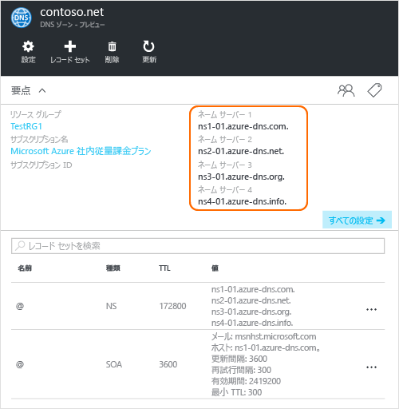

# <a name="delegate-a-domain-to-azure-dns"></a>Azure DNS へのドメインの委任

Azure DNS を使用すると、DNS ゾーンをホストし、Azure のドメインの DNS レコードを管理できます。 ドメインに対する DNS クエリを Azure DNS に到達させるには、ドメインを親ドメインから Azure DNS に委任する必要があります。 Azure DNS はドメイン レジストラーではないことに注意してください。 この記事では、ドメインの委任のしくみとドメインを Azure DNS に委任する方法について説明します。

## <a name="how-dns-delegation-works"></a>DNS 委任のしくみ

### <a name="domains-and-zones"></a>ドメインとゾーン

ドメイン ネーム システムはドメインの階層構造です。 階層は、"**.**" という名前の "root" ドメインから始まります。  その下には "com"、"net"、"org"、"uk"、"jp" などのトップ レベル ドメインがあります。  さらに、これらの下には "org.uk" や "co.jp" などの第&2; レベル ドメインがあります。  同様に続きます。 DNS 階層内のドメインのホストには、個別の DNS ゾーンを使用します。 これらのゾーンはグローバルに分散していて、世界中の DNS ネーム サーバーでホストされています。

**DNS ゾーン**

ドメインとは、"contoso.com" など、ドメイン ネーム システム内で一意の名前です。 DNS ゾーンは、特定のドメインの DNS レコードをホストするために使用されます。 たとえば、ドメイン "contoso.com" には、"mail.contoso.com" (メール サーバー用) や "www.contoso.com" (Web サイト用) など、多数の DNS レコードが含まれている場合があります。

**ドメイン レジストラー**

ドメイン レジストラーは、インターネット ドメイン名を提供できる企業です。 ドメイン レジストラーは、ユーザーが希望するインターネット ドメインが使用可能かどうかを確認し、購入を許可します。 ドメイン名が登録されると、そのユーザーはドメイン名の法律上の所有者になります。 既にインターネット ドメインを所有している場合は、現在のドメイン レジストラーを使用して、Azure DNS に委任します。

> [!NOTE]
> 特定のドメイン名の所有者の詳細や、ドメインの購入方法の詳細については、「 [Internet domain management in Azure AD (Azure AD でのインターネット ドメイン管理)](https://msdn.microsoft.com/library/azure/hh969248.aspx)」を参照してください。

### <a name="resolution-and-delegation"></a>解決と委任

DNS サーバーには次の&2; 種類があります。

* *権限のある* DNS サーバーは、DNS ゾーンをホストします。 このサーバーは、これらのゾーン内のレコードに対する DNS クエリのみに応答します。
* *再帰* DNS サーバーは、DNS ゾーンをホストしません。 このサーバーは、権限のある DNS サーバーを呼び出して必要なデータを収集することで、すべての DNS クエリに応答します。

> [!NOTE]
> Azure DNS は、権限のある DNS サービスを提供します。  再帰 DNS サービスは提供しません。
>
> Azure の Cloud Services と VM は、Azure のインフラストラクチャの一部として個別に提供されている再帰 DNS サービスを使用するように自動的に構成されます。  これらの DNS 設定を変更する方法については、 [Azure での名前解決](../virtual-network/virtual-networks-name-resolution-for-vms-and-role-instances.md#name-resolution-using-your-own-dns-server)に関するページを参照してください。

PC やモバイル デバイスの DNS クライアントは、通常、クライアント アプリケーションが必要とする DNS クエリを実行するために、再帰 DNS サーバーを呼び出します。

再帰 DNS サーバーは、"www.contoso.com" などの DNS レコードに対するクエリを受け取ると、まず、"contoso.com" ドメインのゾーンをホストするネーム サーバーを検索する必要があります。 そのためには、ルート名サーバーから開始し、そこから、"com" ゾーンをホストするネーム サーバーを見つけます。 次に、"com" ネーム サーバーを照会し、"contoso.com" ゾーンをホストするネーム サーバーを見つけます。  最後に、"www.contoso.com" についてこれらのネーム サーバーを照会できます。

これを、DNS 名の解決と呼びます。 厳密に言えば、DNS 解決には、次の CNAME などのその他の手順が含まれますが、DNS の委任のしくみを理解するうえでは重要ではありません。

親ゾーンが子ゾーンのネーム サーバーを "指す" には、 NS レコード (NS は "ネーム サーバー" の略) と呼ばれる特殊な種類の DNS レコードを使用します。 たとえば、root ゾーンには "com" の NS レコードが格納され、"com" ゾーンのネーム サーバーが示されます。 同様に、"com" ゾーンには "contoso.com" の NS レコードが格納されます。このレコードは "contoso.com" ゾーンのネーム サーバーを示します。 親ゾーンで子ゾーンの NS レコードを設定することを、ドメインの委任と呼びます。


実際に、各委任には、NS レコードの&2; つのコピーがあります。1 つは親ゾーン内で子ゾーンを指すレコード、もう&1; つは子ゾーン自体にあるレコードです。 "contoso.com" ゾーンには、("com" 内の NS レコードだけでなく) "contoso.com" の NS レコードも格納されています。 これらは権限のある NS レコードと呼ばれ、子ゾーンの頂点に配置されます。

## <a name="delegating-a-domain-to-azure-dns"></a>Azure DNS へのドメインの委任
Azure DNS 内に DNS ゾーンを作成した後は、Azure DNS がゾーンの名前解決のための権限のあるソースになるように、親ゾーン内の NS レコードを設定する必要があります。 レジストラーから購入したドメインの場合は、レジストラーから、これらの NS レコードを設定するオプションが提供されます。

> [!NOTE]
> Azure DNS 内にそのドメイン名で DNS ゾーンを作成するには、ドメインを所有する必要はありません。 ただし、レジストラーを使用して Azure DNS への委任を設定するには、ドメインを所有する必要があります。

たとえば、ドメイン "contoso.com" を購入し、Azure DNS に "contoso.com" という名前のゾーンを作成するとします。 レジストラーは、ドメインの所有者として、ドメインのネーム サーバー アドレス (つまり、NS レコード) を構成するオプションを提供します。 レジストラーはこれらの NS レコードを親ドメイン (この場合は ".com") に格納します。 その後、世界中のクライアントは、"contoso.com" 内の DNS レコードを解決しようとすると、Azure DNS ゾーン内のドメインに転送されます。

### <a name="finding-the-name-server-names"></a>ネーム サーバー名の特定
DNS ゾーンを Azure DNS に委任するには、事前にゾーンのネーム サーバー名を把握する必要があります。 Azure DNS は、ゾーンが作成されるたびに、プールからネーム サーバーを割り当てます。

ゾーンに割り当てられたネーム サーバーを把握する最も簡単な方法は、Azure ポータルの表示を確認することです。  この例では、ゾーン "contoso.net" に、ネーム サーバー "ns1-01.azure-dns.com"、"ns2-01.azure-dns.net"、"ns3-01.azure-dns.org"、"ns4-01.azure-dns.info" が割り当てられています。

 

割り当てられたネーム サーバーが含まれたゾーンに、権限のある NS レコードが自動的に作成されます。  Azure PowerShell または Azure CLI を使用してネーム サーバー名を確認する際は、これらのレコードを取得するだけで済みます。

Azure PowerShell を使用して、次のようにして権限のある NS レコードを取得できます。 レコード名 "@" を使用して、ゾーンの頂点にあるレコードを参照することに注意してください。

```powershell
$zone = Get-AzureRmDnsZone -Name contoso.net -ResourceGroupName MyResourceGroup
Get-AzureRmDnsRecordSet -Name "@" -RecordType NS -Zone $zone
```

次の例は応答です。

```
Name              : @
ZoneName          : contoso.net
ResourceGroupName : MyResourceGroup
Ttl               : 3600
Etag              : 5fe92e48-cc76-4912-a78c-7652d362ca18
RecordType        : NS
Records           : {ns1-01.azure-dns.com, ns2-01.azure-dns.net, ns3-01.azure-dns.org,
                    ns4-01.azure-dns.info}
Tags              : {}
```

また、クロスプラット フォームの Azure CLI を使用して、権限のある NS レコードを取得し、ゾーンに割り当てられたネーム サーバーを検出することができます。

```azurecli
azure network dns record-set show MyResourceGroup contoso.net @ NS
```

次の例は応答です。

```
info:    Executing command network dns record-set show
    + Looking up the DNS Record Set "@" of type "NS"
data:    Id                              : /subscriptions/.../resourceGroups/MyResourceGroup/providers/Microsoft.Network/dnszones/contoso.net/NS/@
data:    Name                            : @
data:    Type                            : Microsoft.Network/dnszones/NS
data:    Location                        : global
data:    TTL                             : 172800
data:    NS records
data:        Name server domain name     : ns1-01.azure-dns.com.
data:        Name server domain name     : ns2-01.azure-dns.net.
data:        Name server domain name     : ns3-01.azure-dns.org.
data:        Name server domain name     : ns4-01.azure-dns.info.
data:
info:    network dns record-set show command OK
```

### <a name="to-set-up-delegation"></a>委任を設定するには

各レジストラーは独自の DNS 管理ツールを所有していて、ドメインのネーム サーバー レコードを変更します。 レジストラーの DNS 管理ページで、NS レコードを編集し、その NS レコードを、Azure DNS で作成されたレコードに置き換えます。

ドメインを Azure DNS に委任する場合は、Azure DNS によって提供されるネーム サーバー名を使用する必要があります。  対象のドメインの名前に関係なく、常に 4 つのネーム サーバー名すべてを使用する必要があります。  ドメインの委任では、対象のドメインと同じトップレベル ドメインがネーム サーバー名に使用される必要はありません。

Azure DNS ネーム サーバーの IP アドレスは後で変更される可能性があるため、これらの IP アドレスを指すために "グルー レコード" を使用しないでください。 独自のゾーンのネーム サーバー名 ("バニティ ネーム サーバー" と呼ばれることもあります) を使用した委任は、現在、Azure DNS ではサポートされていません。

### <a name="to-verify-name-resolution-is-working"></a>名前解決が動作していることを確認するには

委任が完了したら、"nslookup" などのツールを使用してゾーンの SOA レコードを照会することで、名前解決が動作していることを確認できます (SOA レコードは、ゾーンの作成時にも自動的に作成されます)。

委任が正しく設定されている場合は、通常の DNS 解決プロセスでネーム サーバーが自動的に検出されるため、Azure DNS ネーム サーバーを指定する必要はありません。

```
nslookup -type=SOA contoso.com

Server: ns1-04.azure-dns.com
Address: 208.76.47.4

contoso.com
primary name server = ns1-04.azure-dns.com
responsible mail addr = msnhst.microsoft.com
serial = 1
refresh = 900 (15 mins)
retry = 300 (5 mins)
expire = 604800 (7 days)
default TTL = 300 (5 mins)
```

## <a name="delegating-sub-domains-in-azure-dns"></a>Azure DNS サブドメインの委任

別の子ゾーンを設定する必要がある場合は、Azure DNS でサブドメインを委任できます。 たとえば、Azure DNS で "contoso.com" を設定して委任した後、別の子ゾーン "partners.contoso.com" を設定するとします。

通常の委任と同様の手順で、サブドメインを設定します。 唯一異なる点は、手順 3. で、ドメイン レジストラーを使用して NS レコードを設定するのではなく、Azure DNS の親ゾーン "contoso.com" に NS レコードを作成する必要があることです。

1. Azure DNS で子ゾーン "partners.contoso.com" を作成します。
2. 子ゾーンで権限のある NS レコードを検索し、Azure DNS で子ゾーンをホストするネーム サーバーを取得します。
3. 子ゾーンを指す親ゾーンで NS レコードを構成することで、子ゾーンを委任します。

### <a name="to-delegate-a-sub-domain"></a>サブドメインを委任するには

これを PowerShell で行う例を次に示します。 同じ手順を、Azure ポータルまたはクロスプラットフォームの Azure CLI を使用して実行できます。

#### <a name="step-1-create-the-parent-and-child-zones"></a>手順 1. 親ゾーンと子ゾーンを作成する
最初に、親ゾーンと子ゾーンを作成します。 どちらも同じリソース グループに含めることも、別々のリソース グループに含めることもできます。

```powershell
$parent = New-AzureRmDnsZone -Name contoso.com -ResourceGroupName RG1
$child = New-AzureRmDnsZone -Name partners.contoso.com -ResourceGroupName RG1
```

#### <a name="step-2-retrieve-ns-records"></a>手順 2. NS レコードを取得する

次に、次の例で示すように、子ゾーンから権限のある NS レコードを取得します。  このレコードに、子ゾーンに割り当てられたネーム サーバーが記載されています。

```powershell
$child_ns_recordset = Get-AzureRmDnsRecordSet -Zone $child -Name "@" -RecordType NS
```

#### <a name="step-3-delegate-the-child-zone"></a>手順 3. 子ゾーンを委任する

対応する NS レコード セットを親ゾーンに作成して、委任を完了します。 親ゾーン内のレコード セットの名前が、子ゾーンの名前と一致していることに注意してください。この例では "partners" です。

```powershell
$parent_ns_recordset = New-AzureRmDnsRecordSet -Zone $parent -Name "partners" -RecordType NS -Ttl 3600
$parent_ns_recordset.Records = $child_ns_recordset.Records
Set-AzureRmDnsRecordSet -RecordSet $parent_ns_recordset
```

### <a name="to-verify-name-resolution-is-working"></a>名前解決が動作していることを確認するには

子ゾーンの SOA レコードを検索することで、すべてが正しく設定されていることを確認できます。

```
nslookup -type=SOA partners.contoso.com

Server: ns1-08.azure-dns.com
Address: 208.76.47.8

partners.contoso.com
    primary name server = ns1-08.azure-dns.com
    responsible mail addr = msnhst.microsoft.com
    serial = 1
    refresh = 900 (15 mins)
    retry = 300 (5 mins)
    expire = 604800 (7 days)
    default TTL = 300 (5 mins)
```

## <a name="next-steps"></a>次のステップ

[DNS ゾーンの管理](dns-operations-dnszones.md)

[DNS レコードの管理](dns-operations-recordsets.md)


