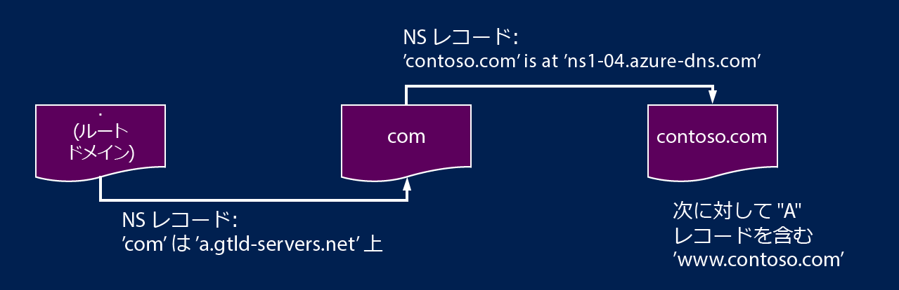

# Azure DNS による DNS ゾーンの委任

Azure DNS を使用すると、DNS ゾーンをホストし、Azure のドメインの DNS レコードを管理できます。 ドメインに対する DNS クエリを Azure DNS に到達させるには、ドメインを親ドメインから Azure DNS に委任する必要があります。 Azure DNS はドメイン レジストラーではないことに注意してください。 この記事では、ドメインの委任のしくみとドメインを Azure DNS に委任する方法について説明します。

## DNS 委任のしくみ

### ドメインとゾーン

ドメイン ネーム システムはドメインの階層構造です。 階層は、"**.**" という名前の "root" ドメインから始まります。  その下には "com"、"net"、"org"、"uk"、"jp" などのトップ レベル ドメインがあります。  さらに、このようなトップレベル ドメインの下には "org.uk" や "co.jp" などの第 2 レベル ドメインがあります。  同様に続きます。 DNS 階層内のドメインのホストには、個別の DNS ゾーンを使用します。 これらのゾーンはグローバルに分散していて、世界中の DNS ネーム サーバーでホストされています。

**DNS ゾーン** - ドメインとは、"contoso.com" など、ドメイン ネーム システム内で一意の名前です。 DNS ゾーンは、特定のドメインの DNS レコードをホストするために使用されます。 たとえば、ドメイン "contoso.com" に、"mail.contoso.com" (メール サーバー用) や "www.contoso.com" (Web サイト用) など、複数の DNS レコードを含めることができます。

**ドメイン レジストラー** - ドメイン レジストラーは、インターネット ドメイン名を提供できる企業です。 ドメイン レジストラーは、ユーザーが希望するインターネット ドメインが使用可能かどうかを確認し、購入を許可します。 ドメイン名が登録されると、そのユーザーはドメイン名の法律上の所有者になります。 既にインターネット ドメインを所有している場合は、現在のドメイン レジストラーを使用して、Azure DNS に委任します。

特定のドメイン名の所有者の詳細や、ドメインの購入方法の詳細については、「 [Internet domain management in Azure AD (Azure AD でのインターネット ドメイン管理)](https://msdn.microsoft.com/library/azure/hh969248.aspx)」を参照してください。

### 解決と委任

DNS サーバーには次の 2 種類があります。

* *権限のある* DNS サーバーは、DNS ゾーンをホストします。 このサーバーは、これらのゾーン内のレコードに対する DNS クエリのみに応答します。
* *再帰* DNS サーバーは、DNS ゾーンをホストしません。 このサーバーは、権限のある DNS サーバーを呼び出して必要なデータを収集することで、すべての DNS クエリに応答します。

Azure DNS は、権限のある DNS サービスを提供します。  再帰 DNS サービスは提供しません。 Azure の Cloud Services と VM は、Azure のインフラストラクチャの一部として個別に提供されている再帰 DNS サービスを使用するように自動的に構成されます。 これらの DNS 設定を変更する方法については、[Azure での名前解決](../virtual-network/virtual-networks-name-resolution-for-vms-and-role-instances.md#name-resolution-that-uses-your-own-dns-server)に関するページを参照してください。

PC やモバイル デバイスの DNS クライアントは、通常、クライアント アプリケーションが必要とする DNS クエリを実行するために、再帰 DNS サーバーを呼び出します。

再帰 DNS サーバーは、"www.contoso.com" などの DNS レコードに対するクエリを受け取ると、まず、"contoso.com" ドメインのゾーンをホストするネーム サーバーを検索する必要があります。 ネーム サーバーを検索するには、ルート名サーバーから開始し、そこから、"com" ゾーンをホストするネーム サーバーを見つけます。 次に、"com" ネーム サーバーを照会し、"contoso.com" ゾーンをホストするネーム サーバーを見つけます。  最後に、"www.contoso.com" についてこれらのネーム サーバーを照会できます。

この手順を、DNS 名の解決といいます。 厳密に言えば、DNS 解決には、次の CNAME などのその他の手順が含まれますが、DNS の委任のしくみを理解するうえでは重要ではありません。

親ゾーンが子ゾーンのネーム サーバーを "指す" には、 NS レコード (NS は "ネーム サーバー" の略) と呼ばれる特殊な種類の DNS レコードを使用します。 たとえば、root ゾーンには "com" の NS レコードが格納され、"com" ゾーンのネーム サーバーが示されます。 同様に、"com" ゾーンには "contoso.com" の NS レコードが格納されます。このレコードは "contoso.com" ゾーンのネーム サーバーを示します。 親ゾーンで子ゾーンの NS レコードを設定することを、ドメインの委任と呼びます。

次の図に DNS クエリの例を示します。 contoso.net と partners.contoso.net は Azure DNS ゾーンです。

1. クライアントがローカル DNS サーバーに `www.partners.contoso.net` を要求します。
1. レコードがないため、ローカル DNS サーバーはルート ネーム サーバーに要求を行います。
1. ルート ネーム サーバーにはレコードがありません。しかし、`.net` ネーム サーバーのアドレスがあるため、ルート ネーム サーバーはそのアドレスを DNS サーバーに提供します。
1. DNS サーバーは `.net` ネーム サーバーに要求を送信します。ネーム サーバーにはレコードはありませんが、contoso.net ネーム サーバーのアドレスがあります。 この例では、これは Azure DNS でホストされている DNS ゾーンです。
1. `contoso.net` ゾーンにはレコードはありませんが、`partners.contoso.net` のネーム サーバーがあるので、このネーム サーバーが返されます。 この例では、これは Azure DNS でホストされている DNS ゾーンです。
1. DNS サーバーは、`partners.contoso.net` ゾーンに対して `partners.contoso.net` の IP アドレスを要求します。 このゾーンには A レコードが格納されており、IP アドレスが返されます。
1. DNS サーバーからクライアントに IP アドレスが提供されます。
1. クライアントは Web サイト `www.partners.contoso.net` に接続します。

実際に、各委任には、NS レコードの 2 つのコピーがあります。1 つは親ゾーン内で子ゾーンを指すレコード、もう 1 つは子ゾーン自体にあるレコードです。 "contoso.net" ゾーンには、("net" 内の NS レコードだけでなく) "contoso.net" の NS レコードも格納されています。 これらのレコードは、優先する NS レコードと呼ばれ、子ゾーンの頂点に配置されます。

## 次の手順

Azure DNS にドメインを委任する方法については[こちら](dns-delegate-domain-azure-dns.md)を参照してください。

