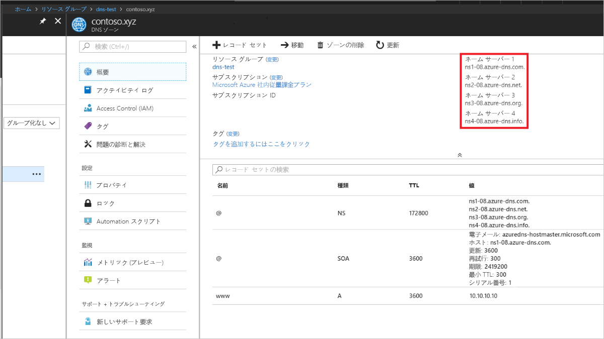

# <a name="quickstart-configure-azure-dns-for-name-resolution-using-the-azure-portal"></a>クイック スタート: Azure Portal を使用して、名前解決を行うように Azure DNS を構成する

 パブリック ドメイン内のホスト名を解決するように Azure DNS を構成できます。 たとえば、contoso.com というドメイン名をドメイン名レジストラーから購入した場合、contoso.com ドメインをホストし、www.contoso.com を Web サーバーまたは Web アプリの IP アドレスに解決するように Azure DNS を構成できます。

このクイック スタートでは、テスト ドメインを作成し、IP アドレス 10.10.10.10 に解決する「www」という名前のアドレス レコードを作成します。

このクイック スタートで使用されるすべての名前と IP アドレスは例にすぎず、実際のシナリオを示すものではないことに注意することが重要です。 ただし、該当する場合は、実際のシナリオも説明しています。

<!---
You can also perform these steps using [Azure PowerShell](dns-getstarted-powershell.md) or the cross-platform [Azure CLI 2.0](dns-getstarted-cli.md).
--->

DNS ゾーンは、特定のドメインの DNS エントリを含めるために使用されます。 Azure DNS でドメインのホストを開始するには、そのドメイン名用に DNS ゾーンを作成する必要があります。 ドメインの各 DNS エントリ (またはレコード) は、この DNS ゾーン内に作成されます。 次の手順では、これを行う方法について説明します。

Azure サブスクリプションをお持ちでない場合は、開始する前に [無料アカウント](https://azure.microsoft.com/free/?WT.mc_id=A261C142F) を作成してください。

## <a name="create-a-dns-zone"></a>DNS ゾーンの作成

1. Azure ポータルにサインインします。
2. 左上で **[+ リソースの作成]**、**[ネットワーク]** の順にクリックします。次に **[DNS ゾーン]** をクリックして、**[DNS ゾーンの作成]** ページを開きます。

    ![[DNS ゾーン]](./media/dns-getstarted-portal/openzone650.png)

4. **[DNS ゾーンの作成]** ページで次の値を入力してから、**[作成]** をクリックします。


   | **設定** | **値** | **詳細** |
   |---|---|---|
   |**名前**|contoso.xyz|この例の DNS ゾーンの名前。 このクイック スタートでは、Azure DNS サーバーでまだ構成されていない限り、どのような値でも使用できます。 実際の値は、ドメイン名レジストラーから購入したドメインになります。|
   |**サブスクリプション**|<該当するサブスクリプション>|DNS ゾーンを作成するサブスクリプションを選択します。|
   |**リソース グループ**|**新規作成:** dns-test|リソース グループを作成します。 選択したサブスクリプション内で一意となるリソース グループ名を使用してください。 |
   |**場所**|米国東部||

ゾーンの作成には数分かかることがあります。

## <a name="create-a-dns-record"></a>DNS レコードの作成

ここで、新しいアドレス レコード (「A」レコード) を作成します。 「A」レコードは、ホスト名を IP v4 アドレスに解決するために使用されます。

1. Azure Portal の **[お気に入り]** ウィンドウで **[すべてのリソース]** をクリックします。 [すべてのリソース] ページで**contoso.xyz** DNS ゾーンをクリックします。 選択したサブスクリプションに既存のリソースがいくつもある場合は、**[名前でフィルター]** ボックスに「**contoso.xyz**」と入力すると、 目的の DNS ゾーンがすぐに見つかります。

1. **[DNS ゾーン]** ページの上部にある **[+ レコード セット]** を選択して **[レコード セットの追加]** ページを開きます。

1. **[レコード セットの追加]** ページで、次の値を入力し、**[OK]** をクリックします。 この例では、「A」レコードを作成します。

   |**設定** | **値** | **詳細** |
   |---|---|---|
   |**名前**|www|レコードの名前です。 この名前をホストに使用して、IP アドレスに解決します。|
   |**種類**|A| 作成する DNS レコードの種類。 「A」レコードが最もよく使用されますが、他の種類のレコードもあります。たとえば、メール サーバーの場合は MX、IP v6 アドレスの場合は AAAA です。 |
   |**TTL**|1|DNS 要求の有効期限です。 DNS サーバーおよびクライアントが応答をキャッシュに入れておくことができる時間を指定します。|
   |**TTL の単位**|hours|TTL 値の時間の単位です。|
   |**IP アドレス**|10.10.10.10| この値は、「A」レコードが解決される IP アドレスです。 これは、このクイック スタートのテスト値にすぎません。 実際の例では、Web サーバーのパブリック IP アドレスを入力します。|


このクイック スタートでは、実際にはドメイン名を購入しません。そのため、ドメイン名レジストラーを使用して、Azure DNS をネーム サーバーとして構成する必要はありません。 ただし、実際のシナリオでは、インターネット上の誰かにホスト名を解決してもらわないと、Web サーバーまたはアプリに接続できません。 その実際のシナリオの詳細については、「[Azure DNS へのドメインの委任](dns-delegate-domain-azure-dns.md)」を参照してください。


## <a name="test-the-name-resolution"></a>名前解決をテストする

テスト ゾーンを作成し、その中にテスト「A」レコードを含めたので、nslookup という名前のツールを使用して、名前解決をテストできます。 

1. 最初に、nslookup で使用する Azure DNS ネーム サーバーを書き留める必要があります。 

   ゾーンのネーム サーバーは、DNS ゾーンの **[概要]** ページに一覧表示されます。 いずれかのネーム サーバーの名前をコピーします。

   

2. コマンド プロンプトを開き、次のコマンドを実行します。

   ```
   nslookup <host name> <name server>
   
   For example:

   nslookup www.contoso.xyz ns1-08.azure-dns.com
   ```

次のスクリーンショットのような画面が表示されます。


これにより、名前解決が正常に機能していることを確認できます。 www.contoso.xyz は、構成したとおり、10.10.10.10 に名前解決されています。

## <a name="clean-up-resources"></a>リソースのクリーンアップ

**dns-test** リソース グループは、不要になったら削除します。これにより、このクイック スタートで作成したリソースが削除されます。 これを行うには、**dns-test** リソース グループをクリックし、**[リソース グループの削除]** をクリックします。


## <a name="next-steps"></a>次の手順

> [!div class="nextstepaction"]
> [カスタム ドメインにおける Web アプリの DNS レコードの作成](./dns-web-sites-custom-domain.md)