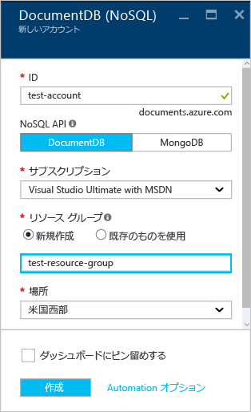

# Azure Portal を使用して Azure Cosmos DB NoSQL アカウントを作成する方法
> [!div class="op_single_selector"]
> * [Azure ポータル](documentdb-create-account.md)
> * [Azure CLI 1.0](documentdb-automation-resource-manager-cli-nodejs.md)
> * [Azure CLI 2.0](documentdb-automation-resource-manager-cli.md)
> * [Azure Powershell](documentdb-manage-account-with-powershell.md)

Microsoft Azure Cosmos DB でデータベースを作成するには、次のことが必要です。

* Azure アカウントを入手する。 まだ持っていない場合は、 [無料の Azure アカウント](https://azure.microsoft.com/free) を取得できます。
* Azure Cosmos DB アカウントを作成する。  

Azure Cosmos DB アカウントは、Azure Portal、Azure Resource Manager テンプレート、Azure コマンド ライン インターフェイス (CLI) のいずれかを使用して作成できます。 この記事では、Azure Portal を使用して Azure Cosmos DB アカウントを作成する方法について説明します。 Azure Resource Manager または Azure CLI を使用してアカウントを作成するには、[Azure Cosmos DB データベース アカウントの自動作成](documentdb-automation-resource-manager-cli.md)に関する記事を参照してください。

Azure Cosmos DB を初めて使用する場合は、 Scott Hansleman による[こちら](https://azure.microsoft.com/documentation/videos/create-documentdb-on-azure/)の 4 分間のビデオを視聴して、オンライン ポータルで最も一般的なタスクを実行する方法を確認してください。

1. [Azure ポータル](https://portal.azure.com/)にサインインします。
2. 左側のナビゲーションで **[新規]**、**[データベース]**、**[Azure Cosmos DB]** の順にクリックします。

   ![[その他のサービス] と [NoSQL (Azure Cosmos DB)] が強調表示された Azure Portal のスクリーン ショット](./media/documentdb-create-account/create-nosql-db-databases-json-tutorial-1.png)  
3. **[新しいアカウント]** ブレードで、Azure Cosmos DB アカウントに必要な構成を指定します。

    

   * **[ID]** ボックスに、Azure Cosmos DB アカウントを識別する名前を入力します。  **ID** が検証されると、緑色のチェック マークが **[ID]** ボックスに表示されます。 この **ID** の値は、URI 内のホスト名になります。 **ID** に含めることができるのは英小文字、数字、および "-" のみで、文字数は 3 ～ 50 文字にする必要があります。 選択したエンドポイント名に *documents.azure.com* が追加され、これが Azure Cosmos DB アカウント エンドポイントになります。
   * **[NoSQL API]** ボックスで、使用するプログラミング モデルを選択します。

     * **[DocumentDB]**: DocumentDB API は、HTTP [REST](https://msdn.microsoft.com/library/azure/dn781481.aspx) だけでなく、.NET、Java、Node.js、Python、JavaScript の各 [SDK](documentdb-sdk-dotnet.md) でも使用することができ、DocumentDB のすべての機能にプログラムによってアクセスできます。
     * **[MongoDB]**: DocumentDB では、**MongoDB** API の[プロトコル レベルのサポート](documentdb-protocol-mongodb.md)も提供します。 MongoDB API オプションを選択した場合は、既存の MongoDB SDK と [ツール](documentdb-mongodb-mongochef.md) を使用して DocumentDB を操作できます。 DocumentDB を使用するために、[コードの変更を必要とせずに](documentdb-connect-mongodb-account.md)、既存の MongoDB アプリを[移行](documentdb-import-data.md)し、完全に管理されたデータベースを、無制限のスケーリングやグローバル レプリケーションなどの機能を備えたサービスとして利用できます。
   * **[サブスクリプション]** で、Azure Cosmos DB アカウントに使用する Azure サブスクリプションを選択します。 アカウントにサブスクリプションが 1 つしかない場合は、そのアカウントが既定で選択されます。
   * **[リソース グループ]** で、Azure Cosmos DB アカウントのリソース グループを選択または作成します。  既定では、新しいリソース グループが作成されます。 詳細については、 [Azure Portal を使用した Azure リソースの管理](../azure-portal/resource-group-portal.md)に関する記事をご覧ください。
   * **[場所]** を使用して、Azure Cosmos DB アカウントをホストする地理的な場所を指定します。
4. 新しい Azure Cosmos DB アカウントのオプションを構成したら、**[作成]** をクリックします。 デプロイの状態を通知ハブで確認します。  

     

   
5. Azure Cosmos DB アカウントは作成されると、既定の設定で使用できる状態になります。 Azure Cosmos DB アカウントの既定の整合性は **[セッション]** に設定されます。  既定の整合性は、リソース メニューの **[既定の整合性]** をクリックして調整できます。 Azure Cosmos DB によって提供される整合性レベルの詳細については、[Azure Cosmos DB の整合性レベル](documentdb-consistency-levels.md)に関する記事を参照してください。

   ![[リソース グループ] ブレードのスクリーンショット - アプリケーション開発の開始](./media/documentdb-create-account/create-nosql-db-databases-json-tutorial-6.png)  

     

[How to: Create an Azure Cosmos DB account]: #Howto
[Next steps]: #NextSteps

## 次のステップ
Azure Cosmos DB アカウントが作成できたら、次の手順として、Azure Cosmos DB コレクションおよびデータベースを作成します。

新しいコレクションとデータベースは、次のいずれかを使用して作成できます。

* Azure Portal。[Azure Portal を使用した Azure Cosmos DB コレクションの作成](documentdb-create-collection.md)に関する記事を参照してください。
* サンプル データが含まれた包括的なチュートリアル ([.NET](documentdb-get-started.md)、[.NET MVC](documentdb-dotnet-application.md)、[Java](documentdb-java-application.md)、[Node.js](documentdb-nodejs-application.md)、[Python](documentdb-python-application.md))。
* GitHub で入手できる [.NET](documentdb-dotnet-samples.md#database-examples)、[Node.js](documentdb-nodejs-samples.md#database-examples)、[Python](documentdb-python-samples.md#database-examples) のサンプル コード。
* [.NET](documentdb-sdk-dotnet.md)、[.NET Core](documentdb-sdk-dotnet-core.md)、[Node.js](documentdb-sdk-node.md)、[Java](documentdb-sdk-java.md)、[Python](documentdb-sdk-python.md)、[REST](https://msdn.microsoft.com/library/azure/mt489072.aspx) の各 SDK。

データベースとコレクションを作成したら、コレクションに[ドキュメントを追加](documentdb-view-json-document-explorer.md)する必要があります。

ドキュメントをコレクションに追加したら、[DocumentDB SQL](documentdb-sql-query.md) を使用してドキュメントに対して[クエリを実行](documentdb-sql-query.md#ExecutingSqlQueries)できます。 クエリは、ポータル、[REST API](https://msdn.microsoft.com/library/azure/dn781481.aspx)、またはいずれかの [SDK](documentdb-sdk-dotnet.md) で[クエリ エクスプローラー](documentdb-query-collections-query-explorer.md)を使用して実行できます。

### 詳細情報
Azure Cosmos DB の詳細については、次の資料を参照してください。

* [Azure Cosmos DB の概要](../cosmos-db/introduction.md)

