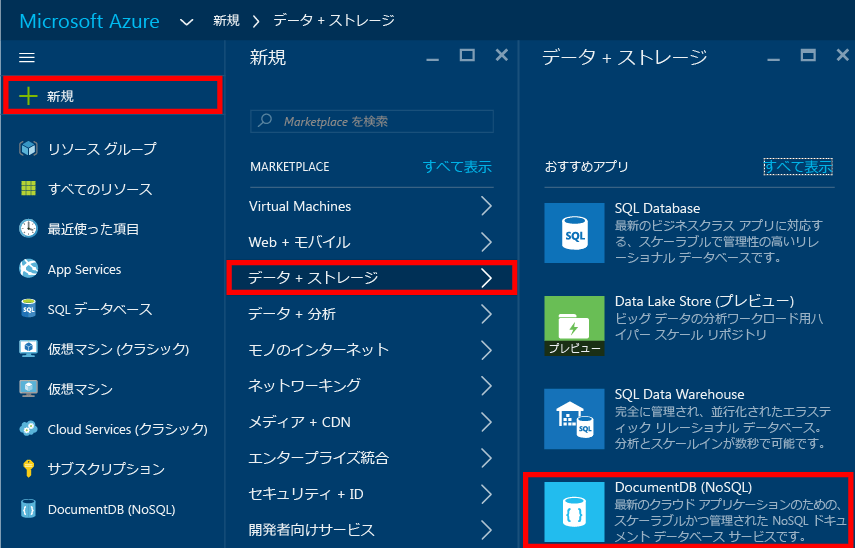
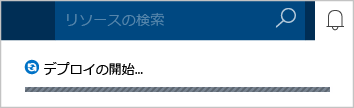
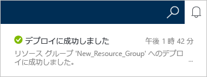
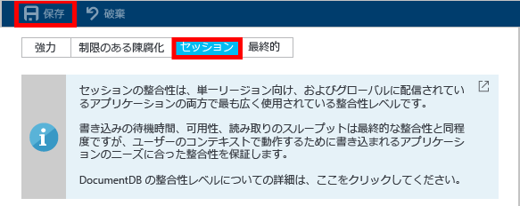

<properties
	pageTitle="DocumentDB アカウントを作成する方法 | Microsoft Azure"
	description="Azure DocumentDB で NoSQL データベースを作成します。手順に従って DocumentDB アカウントを作成し、グローバル スケールの超高速 NoSQL データベースを作成します。" 
	keywords="データベースの作成"
	services="documentdb"
	documentationCenter=""
	authors="mimig1"
	manager="jhubbard"
	editor="monicar"/>

<tags
	ms.service="documentdb"
	ms.workload="data-services"
	ms.tgt_pltfrm="na"
	ms.devlang="na"
	ms.topic="get-started-article"
	ms.date="09/12/2016"
	ms.author="mimig"/>

# Azure Portal を使用して DocumentDB NoSQL アカウントを作成する方法

> [AZURE.SELECTOR]
- [Azure Portal](documentdb-create-account.md)
- [Azure CLI と Azure Resource Manager](documentdb-automation-resource-manager-cli.md)

Microsoft Azure DocumentDB でデータベースを作成するには、次の条件を満たす必要があります。

- Azure アカウントを入手する。まだ持っていない場合は、[無料の Azure アカウント](https://azure.microsoft.com/free)を取得できます。
- DocumentDB アカウントを作成する。

DocumentDB アカウントは、Azure Portal、Azure Resource Manager テンプレート、Azure CLI (コマンド ライン インターフェイス) のいずれかを使用して作成できます。この記事では、Azure Portal を使用して DocumentDB アカウントを作成する方法について説明します。Azure Resource Manager または Azure CLI を使用してアカウントを作成する方法については、[DocumentDB データベース アカウントの自動作成](documentdb-automation-resource-manager-cli.md)に関する記事をご覧ください。

DocumentDB を初めて使用する場合は、 Scott Hansleman による[こちら](https://azure.microsoft.com/documentation/videos/create-documentdb-on-azure/)の 4 分間のビデオを視聴し、オンライン ポータルで最もよく使用されるタスクの実行方法を確認してください。

1.	[Azure Portal](https://portal.azure.com/) にサインインします。
2.	ジャンプバーで **[新規]** をクリックし、**[データ + ストレージ]**、**[DocumentDB (NoSQL)]** の順にクリックします。

	

3. **[新しいアカウント]** ブレードで、DocumentDB アカウントに必要な構成を指定します。

	![新しい [DocumentDB] ブレードのスクリーンショット](./media/documentdb-create-account/create-nosql-db-databases-json-tutorial-2.png)

	- **[ID]** ボックスに、DocumentDB アカウントを識別する名前を入力します。**ID** が検証されると、緑色のチェック マークが **[ID]** ボックスに表示されます。この **ID** の値は、URI 内のホスト名になります。**ID** に含めることができるのは英小文字、数字、および "-" のみで、文字数は 3 ～ 50 文字にする必要があります。選択したエンドポイント名に *documents.azure.com* が追加され、これが DocumentDB アカウント エンドポイントになります。

    - **[NoSQL API]** ボックスで、使用するプログラミング モデルを選択します。
        - **[DocumentDB]**: DocumentDB API は、HTTP [REST](https://msdn.microsoft.com/library/azure/dn781481.aspx) だけでなく、.NET、Java、Node.js、Python、JavaScript の各 [SDK](documentdb-sdk-dotnet.md) でも使用することができ、DocumentDB のすべての機能にプログラムによってアクセスできます。
       
        - **[MongoDB]**: DocumentDB では、**MongoDB** API の[プロトコル レベルのサポート](documentdb-protocol-mongodb.md)も提供します。MongoDB API オプションを選択した場合は、既存の MongoDB SDK と[ツール](documentdb-mongodb-mongochef.md)を使用して DocumentDB を操作できます。DocumentDB を使用するために、[コードの変更を必要とせずに](documentdb-connect-mongodb-account.md)、既存の MongoDB アプリを[移行](documentdb-import-data.md)し、完全に管理されたデータベースを、無制限のスケーリングやグローバル レプリケーションなどの機能を備えたサービスとして利用できます。

	- **[サブスクリプション]** で、DocumentDB アカウントに使用する Azure サブスクリプションを選択します。アカウントにサブスクリプションが 1 つしかない場合は、そのアカウントが既定で選択されます。

	- **[リソース グループ]** で、DocumentDB アカウントのリソース グループを選択または作成します。既定では、新しいリソース グループが作成されます。詳細については、[Azure Portal を使用した Azure リソースの管理](../articles/azure-portal/resource-group-portal.md)に関する記事をご覧ください。

	- **[場所]** を使用して、DocumentDB アカウントをホストする地理的な場所を指定します。

4.	新しい DocumentDB アカウントのオプションを構成したら、**[作成]** をクリックします。デプロイの状態を通知ハブで確認します。

	

	

5.	DocumentDB アカウントが作成されたら、既定の設定で使用できる状態になります。DocumentDB アカウントの既定の整合性は **[セッション]** に設定されます。既定の整合性は、リソース メニューの **[既定の整合性]** をクリックして調整できます。DocumentDB によって提供される整合性レベルの詳細については、「[DocumentDB の整合性レベル](documentdb-consistency-levels.md)」をご覧ください。

    ![[リソース グループ] ブレードのスクリーンショット - アプリケーション開発の開始](./media/documentdb-create-account/create-nosql-db-databases-json-tutorial-6.png)

    

[How to: Create a DocumentDB account]: #Howto
[Next steps]: #NextSteps
[documentdb-manage]: ../articles/documentdb/documentdb-manage.md

## 次のステップ

DocumentDB アカウントを作成できたら、次の手順として DocumentDB データベースを作成します。

新しいデータベースは、次のいずれかを使用して作成できます。

- Azure Portal。[Azure Portal を使用した DocumentDB データベースの作成](documentdb-create-database.md)に関する記事をご覧ください。
- サンプル データが含まれた包括的なチュートリアル ([.NET](documentdb-get-started.md)、[.NET MVC](documentdb-dotnet-application.md)、[Java](documentdb-java-application.md)、[Node.js](documentdb-nodejs-application.md)、[Python](documentdb-python-application.md))。
- GitHub で入手できる [.NET](documentdb-dotnet-samples.md#database-examples)、[Node.js](documentdb-nodejs-samples.md#database-examples)、[Python](documentdb-python-samples.md#database-examples) のサンプル コード。
- [.NET](documentdb-sdk-dotnet.md)、[Node.js](documentdb-sdk-node.md)、[Java](documentdb-sdk-java.md)、[Python](documentdb-sdk-python.md)、[REST](https://msdn.microsoft.com/library/azure/mt489072.aspx) の各 SDK。

データベースを作成した後に、データベースに [1 つまたは複数のコレクションを追加](documentdb-create-collection.md)し、それらのコレクションに[ドキュメントを追加する](documentdb-view-json-document-explorer.md)必要があります。

ドキュメントをコレクションに追加したら、[DocumentDB SQL](documentdb-sql-query.md) を使用してドキュメントに対して[クエリを実行](documentdb-sql-query.md#executing-queries)できます。クエリは、ポータル、[REST API](https://msdn.microsoft.com/library/azure/dn781481.aspx)、またはいずれかの [SDK](documentdb-sdk-dotnet.md) で[クエリ エクスプローラー](documentdb-query-collections-query-explorer.md)を使用して実行できます。

### 詳細情報

DocumentDB の詳細については、以下のリソースを参照してください。

-	[DocumentDB のラーニング パス](https://azure.microsoft.com/documentation/learning-paths/documentdb/)
-	[DocumentDB 階層型リソース モデルと概念](documentdb-resources.md)

<!---HONumber=AcomDC_1005_2016-->