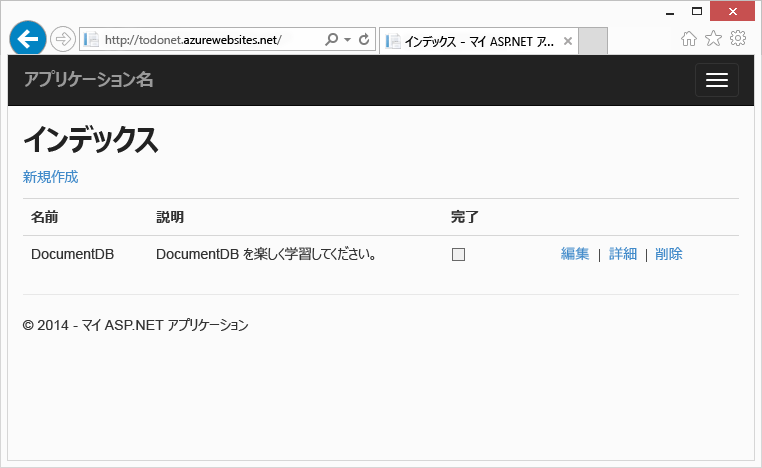
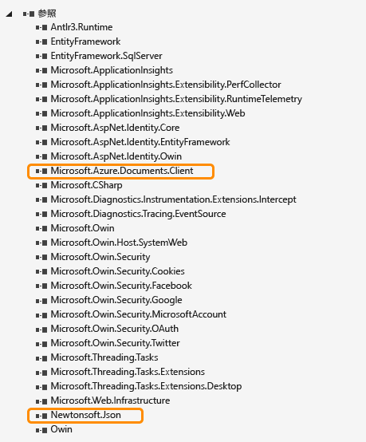
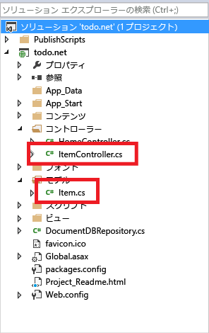
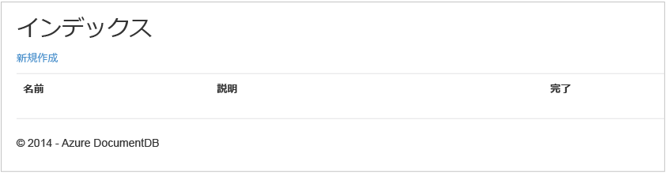
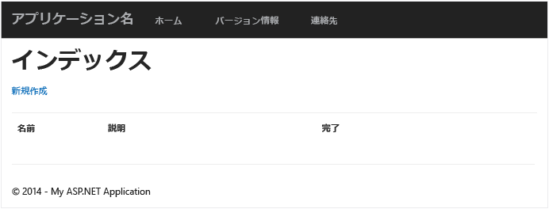
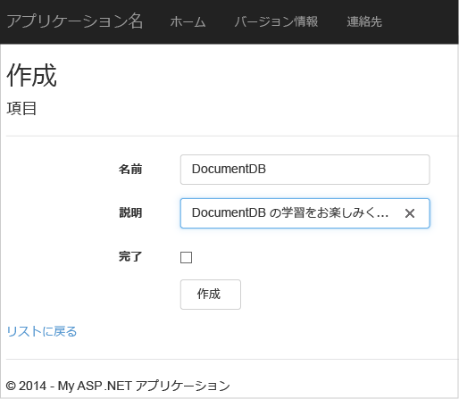
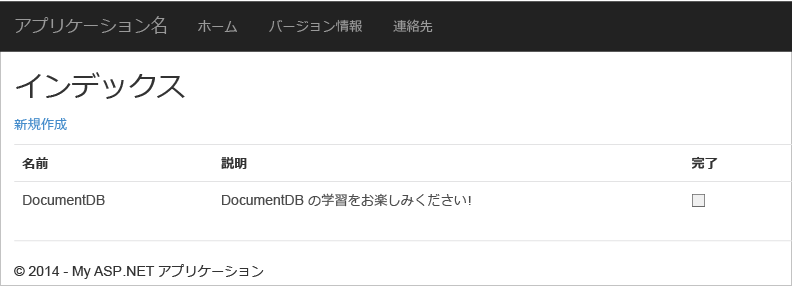

<properties 
	pageTitle="DocumentDB の ASP.NET MVC チュートリアル: Web アプリケーションの開発 | Microsoft Azure" 
	description="この ASP.NET MVC チュートリアルでは、DocumentDB を使用して MVC Web アプリケーションを作成します。JSON を格納し、Azure Websites でホストされている ToDo アプリからデータにアクセスします。" 
	keywords="ASP.NET MVC チュートリアル, Web アプリケーションの開発, MVC Web アプリケーション, ASP.NET MVC チュートリアル ステップ バイ ステップ"
	services="documentdb" 
	documentationCenter=".net" 
	authors="ryancrawcour" 
	manager="jhubbard" 
	editor="cgronlun"/>

<tags 
	ms.service="documentdb" 
	ms.workload="data-services" 
	ms.tgt_pltfrm="na" 
	ms.devlang="dotnet" 
	ms.topic="hero-article" 
	ms.date="11/18/2015" 
	ms.author="ryancraw"/>

#DocumentDB を使用した ASP.NET MVC Web アプリケーションの開発

> [AZURE.SELECTOR]
- [.NET](documentdb-dotnet-application.md)
- [Node.js](documentdb-nodejs-application.md)
- [Java](documentdb-java-application.md)
- [Python](documentdb-python-application.md) 

この記事では、Azure DocumentDB を効果的に活用して、JSON ドキュメントの保存とクエリを行う方法を説明します。ToDo アプリを Azure DocumentDB を使って構築するエンド ツー エンドの手順を説明します。対象となるタスクは、JSON ドキュメントとして Azure DocumentDB に保存するものとします。

このチュートリアルでは、Azure で提供される DocumentDB サービスを使用して、Azure にホストされている ASP.NET MVC Web アプリケーションからデータを保存したりデータにアクセスしたりする方法を説明します。

> [AZURE.TIP]このチュートリアルでは、ASP.NET MVC と Azure Websites の使用経験がある読者を想定しています。ASP.NET や[前提条件となるツール](#_Toc395637760)を初めて扱う方は、完全なサンプル プロジェクトを [GitHub][] からダウンロードして、この例の指示に従うことをお勧めします。プロジェクトをビルドした後でこの記事を見直すと、プロジェクトのコンテキストのコードについての洞察を得ることができます。

## このデータベース チュートリアルの前提条件

この記事の手順を実行する前に、次のソフトウェアがインストールされていることを確認してください。

- アクティブな Azure アカウント。アカウントがない場合は、無料試用版のアカウントを数分で作成することができます。詳細については、[Azure の無料試用版サイト](../../pricing/free-trial/)を参照してください。
- [Visual Studio 2013](http://www.visualstudio.com/) Update 4 以降。
- Azure SDK for .NET Version 2.5.1 以降 ([Microsoft Web Platform Installer][] にて提供)。

この記事に掲載されているすべてのスクリーン ショットは、Visual Studio 2013 Update 4 および Azure SDK for .NET Version 2.5.1 で撮影しました。ご利用のシステムにインストールされているバージョンと異なる場合、画面やオプション設定が一部異なる可能性もありますが、上記の前提条件を満たしていれば、アプリケーションの動作に支障はありません。

## 手順 1: DocumentDB データベース アカウントを作成する

最初に、DocumentDB アカウントを作成します。既にアカウントを持っている場合は、この手順を省略して「[新しい ASP.NET MVC アプリケーションを作成する](#_Toc395637762)」に進んでください。

[AZURE.INCLUDE [documentdb-create-dbaccount](../../includes/documentdb-create-dbaccount.md)]

[AZURE.INCLUDE [documentdb-keys](../../includes/documentdb-keys.md)]

 次のセクションで、新しい ASP.NET MVC アプリケーションをゼロから作成する方法について説明します。

## 手順 2: 新しい ASP.NET MVC アプリケーションを作成する

アカウントが用意できたので、新しい ASP.NET プロジェクトを作成します。

1. Visual Studio で、**[ファイル]** メニューの **[新規作成]** をポイントし、**[プロジェクト]** をクリックします。

   	**[新しいプロジェクト]** ダイアログ ボックスが表示されます。
2. **[プロジェクトの種類]** ウィンドウで、**[テンプレート]**、**[Visual C#]**、**[Web]** の順に展開し、**[ASP.NET Web アプリケーション]** を選択します。

  	![ASP.NET Web アプリケーション プロジェクトの種類が強調表示されている [新しいプロジェクト] ダイアログ ボックスのスクリーン ショット](./media/documentdb-dotnet-application/asp-net-mvc-tutorial-image10.png)

3. **[名前]** ボックスに、プロジェクトの名前を入力します。このチュートリアルでは、"todo" という名前を使用します。これ以外の名前を使用する場合は、このチュートリアルで todo 名前空間について言及されているすべての場所で、提供されているコード サンプルを、ここでアプリケーションに対して指定した名前に変更する必要があります。

4. **[参照]** をクリックして、プロジェクトを作成するフォルダーに移動し、**[OK]** をクリックします。

  	**[新しい ASP.NET プロジェクト]** ダイアログ ボックスが表示されます。

  	![MVC アプリケーション テンプレートが強調表示され、[クラウドでのホスト] ボックスがオンになっている、[新しい ASP.NET プロジェクト] ダイアログ ボックスのスクリーン ショット](./media/documentdb-dotnet-application/asp-net-mvc-tutorial-image11.png)

5. テンプレート ウィンドウで、**[MVC]** を選択します。

6. アプリケーションを Azure でホストする場合は、右下にある **[クラウドでホストする]** を選択してください。これで、アプリケーションをクラウドでホストすること、および Azure Web サイトでホストされるアプリケーションを実行することを選択しました。このオプションを選択すると、Azure Websites があらかじめ自動的にプロビジョニングされ、最終的に完成したアプリケーションをデプロイする作業が段違いにやりやすくなります。これを他の場所でホストする場合、または Azure を事前に構成しない場合は、**[クラウドでホストする]** を選択解除します。

7. **[OK]** をクリックすると、Visual Studio のスキャフォールディング機能によって空の ASP.NET MVC テンプレートが作成されます。

8. これをクラウドでホストすることを選択した場合、少なくとも 1 つの画面が表示され、Azure アカウントにログインして新しい Web サイトの値を指定するよう求められます。追加の値をすべて指定して続行します。

  	ここでは Azure SQL Database サーバーを使用しないため、ここで [データベース サーバー] を選択していません。後で Azure DocumentDB アカウントを Azure プレビュー ポータルで作成する予定です。

	**App Service プラン**と**リソース グループ**の選択の詳細については、「[Azure App Service プランの詳細な概要](azure-web-sites-web-hosting-plans-in-depth-overview.md)」を参照してください。

  	![[Microsoft Azure Websites を構成する] ダイアログ ボックスのスクリーン ショット](./media/documentdb-dotnet-application/image11_1.png)

9. Visual Studio によってスケルトン MVC アプリケーションが作成されると、空の ASP.NET アプリケーションをローカルに実行できる状態となります。

	読者の皆さんは、ASP.NET の "Hello World" アプリケーションで体験済みだと思いますので、プロジェクトをローカルに実行する手順は省略します。早速このプロジェクトに DocumentDB を追加して、アプリケーションを構築しましょう。

## 手順 3: DocumentDB を MVC Web アプリケーション プロジェクトに追加する

このソリューションに必要な ASP.NET MVC のほとんどの構成要素がそろったので、このチュートリアルの本来の目的である MVC Web アプリケーションへの Azure DocumentDB の追加に移ります。

1. DocumentDB .NET SDK は、NuGet パッケージの形式で配布されています。Visual Studio で NuGet パッケージを取得するには、**ソリューション エクスプローラー**でプロジェクトを右クリックし、**[NuGet パッケージの管理]** をクリックして表示される Visual Studio の NuGet パッケージ マネージャーを使用します。

  	![[NuGet パッケージの管理] が強調表示されている、ソリューション エクスプローラーでの Web アプリケーション プロジェクトの右クリック オプションのスクリーン ショット](./media/documentdb-dotnet-application/image21.png)

    **[NuGet パッケージの管理]** ダイアログ ボックスが表示されます。

2. **[オンラインで検索]** ボックスに、「***Azure DocumentDB***」と入力します。
    
    結果から、**Microsoft Azure DocumentDB クライアント ライブラリ** パッケージをインストールします。これにより、DocumentDB パッケージだけでなく、依存関係のあるすべてのコンポーネント (Newtonsoft.Json など) がダウンロードされてインストールされます。

  	![Microsoft Azure DocumentDB クライアント ライブラリが強調表示されている [NuGet パッケージの管理] ウィンドウのスクリーン ショット](./media/documentdb-dotnet-application/nuget.png)

  	または、パッケージ マネージャー コンソールを使用してパッケージをインストールすることもできます。そのためには、**[ツール]** メニューで **[NuGet パッケージ マネージャー]**、**[パッケージ マネージャー コンソール]** の順にクリックします。プロンプトで、次のように入力します。

    	Install-Package Microsoft.Azure.DocumentDB

3. パッケージがインストールされると、次のように、Microsoft.Azure.Documents.Client と Newtonsoft.Json の 2 つの新しい参照が Visual Studio ソリューションに追加されます。

  	

##手順 4: ASP.NET MVC アプリケーションをセットアップする
 
次に、モデル、ビュー、およびコントローラーをこの MVC アプリケーションに追加します。

- [モデルを追加します](#_Toc395637764)。
- [コントローラーを追加します](#_Toc395637765)。
- [ビューを追加します](#_Toc395637766)。

### JSON データ モデルを追加する

最初に作成するのは、MVC の "**M**" (モデル) です。

1. **ソリューション エクスプローラー**で、**Models** フォルダーを右クリックし、**[追加]**、**[クラス]** の順にクリックします。

  	**[新しい項目の追加]** ダイアログ ボックスが表示されます。

2. 新しいクラスに **Item.cs** という名前を設定して、**[追加]** をクリックします。

3. この新しい **Item.cs** ファイルで、最後の *using ステートメント*の後に次のコードを追加します。
		
		using Newtonsoft.Json;
	
4. 次のコード
		
		public class Item
		{
		}

	を、以下のコードに置き換えます。
		
        public class Item
        {
        	[JsonProperty(PropertyName="id")]
        	public string Id { get; set; }
		
        	[JsonProperty(PropertyName="name")]
        	public string Name { get; set; }
		
        	[JsonProperty(PropertyName = "desc")]
        	public string Description { get; set; }
		
       		[JsonProperty(PropertyName="isComplete")]
        	public bool Completed { get; set; }    
		}

	DocumentDB のすべてのデータは、JSON 形式でネットワーク越しに渡され、保存されます。JSON.NET によってオブジェクトをシリアル化または逆シリアル化する方法を制御するには、作成した **Item** クラスで示したとおり、**JsonProperty** 属性を使用できます。これを行う必要はありませんが、プロパティが JSON camelCase 名前付け規則に従っていることを確認しておきましょう。
	
	JSON に渡されるプロパティ名の形式を制御できるだけでなく、**Description** プロパティに対して行ったように、.NET プロパティの名前全体を変更することもできます。
	

### コントローラーを追加する

以上が、**M** (モデル) に相当する部分です。今度は、MVC の **C** に相当するコントローラー クラスを作成しましょう。

1. **ソリューション エクスプローラー**で、**Controllers** フォルダーを右クリックし、**[追加]**、**[コントローラー]** の順にクリックします。

    **[スキャフォールディングの追加]** ダイアログ ボックスが表示されます。

2. **[MVC 5 コントローラー - 空]** を選択し、**[追加]** をクリックします。

	![[MVC 5 コントローラー - 空] オプションが強調表示されている [スキャフォールディングの追加] ダイアログ ボックスのスクリーン ショット](./media/documentdb-dotnet-application/image14.png)

3. 新しいコントローラーに **ItemController** という名前を付けます。

	![[コントローラーの追加] ダイアログ ボックスのスクリーン ショット](./media/documentdb-dotnet-application/image15.png)

	ファイルが作成されると、Visual Studio ソリューションに新しい ItemController.cs ファイルが追加され、**ソリューション エクスプローラー**に次のように表示されます。前に作成した新しい Item.cs ファイルも表示されます。

	

	ItemController.cs は閉じてもかまいません。後でまた使用します。

### ビューを追加する

今度は、MVC の **V** (ビュー) を作成します。

- [項目のインデックス ビューを追加します](#AddItemIndexView)。
- [新しい項目を作成するためのビューを追加します](#AddNewIndexView)。
- [項目を編集するためのビューを追加します](#_Toc395888515)。

#### 項目のインデックス ビューを追加する

1. **ソリューション エクスプローラー**で、**Views** フォルダーを展開します。先ほど **ItemController** を追加したときに Visual Studio によって作成された空の **Item** フォルダーを右クリックし、**[追加]** をクリックします。次に、**[ビュー]** をクリックします。

	![[ビューの追加] コマンドが強調表示された状態の、Visual Studio で作成された Item フォルダーが示されているソリューション エクスプローラーのスクリーン ショット](./media/documentdb-dotnet-application/image17.png)

2. **[ビューの追加]** ダイアログ ボックスで、次の操作を行います。
	- **[ビュー名]** ボックスに、「***Index***」と入力します。
	- **[テンプレート]** ボックスで、***[一覧]*** を選択します。
	- **[モデル クラス]** ボックスで、***[Item (todo.Models)]*** を選択します。
	- **[データ コンテキスト クラス]** ボックスは空のままにします。 
	- レイアウト ページ ボックスに、「***~/Views/Shared/\_Layout.cshtml***」と入力します。
	
	![[ビューの追加] ダイアログ ボックスのスクリーン ショット](./media/documentdb-dotnet-application/image18.png)

3. 以上の値をすべて設定し、**[追加]** をクリックすると、Visual Studio で新しいテンプレート ビューが作成されます。完了すると、作成された cshtml ファイルが表示されます。このファイルは閉じてください。後で再度使用します。

#### 新しい項目を作成するためのビューを追加する

**項目のインデックス** ビューの作成と同様に、**項目**を新規作成するためのビューを新たに作成します。

1. **ソリューション エクスプローラー**で、**Item** フォルダーを再び右クリックし、**[追加]**、**[ビュー]** の順にクリックします。

2. **[ビューの追加]** ダイアログ ボックスで、次の操作を行います。
    - **[ビュー名]** ボックスに、「***Create***」と入力します。
    - **[テンプレート]** ボックスで、***[作成]*** を選択します。
    - **[モデル クラス]** ボックスで、***[Item (todo.Models)]*** を選択します。
    - **[データ コンテキスト クラス]** ボックスは空のままにします。
    - レイアウト ページ ボックスに、「***~/Views/Shared/\_Layout.cshtml***」と入力します。
    - **[追加]** をクリックします。

#### 項目を編集するためのビューを追加する

最後にもう 1 つ、**Item** を編集するためのビューを同じように作成します。

1. **ソリューション エクスプローラー**で、**Item** フォルダーを再び右クリックし、**[追加]**、**[ビュー]** の順にクリックします。

2. **[ビューの追加]** ダイアログ ボックスで、次の操作を行います。
    - **[ビュー名]** ボックスに、「***Edit***」と入力します。
    - **[テンプレート]** ボックスで、***[編集]*** を選択します。
    - **[モデル クラス]** ボックスで、***[Item (todo.Models)]*** を選択します。
    - **[データ コンテキスト クラス]** ボックスは空のままにします。 
    - レイアウト ページ ボックスに、「***~/Views/Shared/\_Layout.cshtml***」と入力します。
    - **[追加]** をクリックします。

この作業が済んだら、Visual Studio に表示されている cshtml ドキュメントをすべて閉じてください。これらのビューは後で使用します。

## 手順 5: DocumentDB を接続する

MVC の標準的な構成要素を準備できたので、次に DocumentDB 用のコードを追加します。

このセクションでは、次の処理を行うコードを追加します。

- [未完了項目の一覧表示](#_Toc395637770)。
- [項目の追加](#_Toc395637771)。
- [項目の編集](#_Toc395637772)。

### MVC Web アプリケーションの未完了項目の一覧表示

最初に、DocumentDB に接続して使用するためのすべてのロジックを含むクラスを追加します。このチュートリアルでは、このすべてのロジックを DocumentDBRepository という名前のリポジトリ クラスにカプセル化します。

1. **ソリューション エクスプローラー**で、プロジェクトを右クリックし、**[追加]**、**[クラス]** の順にクリックします。新しいクラスの名前として「**DocumentDBRepository**」と入力し、**[追加]** をクリックします。
 
2. 新しく作成した **DocumentDBRepository** クラスで、名前空間の宣言の上に次の using ステートメントを追加します。
		
		using Microsoft.Azure.Documents; 
	    using Microsoft.Azure.Documents.Client; 
	    using Microsoft.Azure.Documents.Linq; 
		using System.Configuration;
		using System.Linq.Expressions;
		using System.Threading.Tasks;

	次のコード

		public class DocumentDBRepository
		{
    	}

	を、以下のコードに置き換えます。

    	
		public static class DocumentDBRepository<T>
    	{
			//Use the Database if it exists, if not create a new Database
	    	private static Database ReadOrCreateDatabase()
	    	{
	        	var db = Client.CreateDatabaseQuery()
	        	                .Where(d => d.Id == DatabaseId)
	        	                .AsEnumerable()
	        	                .FirstOrDefault();
				
	        	if (db == null)
	        	{
	        	    db = Client.CreateDatabaseAsync(new Database { Id = DatabaseId }).Result;
	        	}
				
	        	return db;
	    	}
			
			//Use the DocumentCollection if it exists, if not create a new Collection
	    	private static DocumentCollection ReadOrCreateCollection(string databaseLink)
	   		{
	    	    var col = Client.CreateDocumentCollectionQuery(databaseLink)
	        	                  .Where(c => c.Id == CollectionId)
	        	                  .AsEnumerable()
	        	                  .FirstOrDefault();
		
	        	if (col == null)
	        	{
					var collectionSpec = new DocumentCollection { Id = CollectionId };
					var requestOptions = new RequestOptions {OfferType = "S1" };
					
	        	    col = Client.CreateDocumentCollectionAsync(databaseLink, collectionSpec, requestOptions).Result;
	        	}
				
	        	return col;
	    	}
			
			//Expose the "database" value from configuration as a property for internal use
     	   	private static string databaseId;
     	   	private static String DatabaseId
     	   	{
				get
				{
					if (string.IsNullOrEmpty(databaseId))
					{
						databaseId = ConfigurationManager.AppSettings["database"];
					}
				
					return databaseId;
				}
       	 	}
			
			//Expose the "collection" value from configuration as a property for internal use
    	    private static string collectionId;
    	    private static String CollectionId
    	    {
				get
				{
					if (string.IsNullOrEmpty(collectionId))
					{
						collectionId = ConfigurationManager.AppSettings["collection"];
					}
				
					return collectionId;
				}
    	    }
			
			//Use the ReadOrCreateDatabase function to get a reference to the database.
    	    private static Database database;
    	    private static Database Database
    	    {
				get
				{
					if (database == null)
					{
						database = ReadOrCreateDatabase();
					}
					
					return database;
				}
    	    }
			
			//Use the ReadOrCreateCollection function to get a reference to the collection.
    	    private static DocumentCollection collection;
    	    private static DocumentCollection Collection
    	    {
				get
				{
					if (collection == null)
					{
						collection = ReadOrCreateCollection(Database.SelfLink);
					}
					
					return collection;
				}
    	    }
			
			//This property establishes a new connection to DocumentDB the first time it is used, 
			//and then reuses this instance for the duration of the application avoiding the
			//overhead of instantiating a new instance of DocumentClient with each request
    	    private static DocumentClient client;
    	    private static DocumentClient Client
    	    {
    	        get
    	        {
    	            if (client == null)
    	            {
						string endpoint = ConfigurationManager.AppSettings["endpoint"];
						string authKey = ConfigurationManager.AppSettings["authKey"];
						Uri endpointUri = new Uri(endpoint);
						client = new DocumentClient(endpointUri, authKey);
    	            }
    	            
    	            return client;
    	        }
    	    }
    	}

	> [AZURE.TIP]新しい DocumentCollection を作成するときに、OfferType の省略可能なパラメーター RequestOptions を指定して、新しいコレクションのパフォーマンス レベルを指定できます。このパラメーターを指定しないと、既定のプランの種類が使用されます。DocumentDB のプランの種類の詳細については、「[DocumentDB Performance Levels (DocumentDB パフォーマンス レベル)](documentdb-performance-levels.md)」を参照してください。

3. 構成からいくつかの値を読み取るので、アプリケーションの **Web.config** ファイルを開き、以下の行を `<AppSettings>` セクションの下に追加します。
	
    	<add key="endpoint" value="enter the URI from the Keys blade of the Azure Preview portal"/>
    	<add key="authKey" value="enter the PRIMARY KEY, or the SECONDARY KEY, from the Keys blade of the Azure  Preview portal"/>
    	<add key="database" value="ToDoList"/>
    	<add key="collection" value="Items"/>
	
4. 次に、Azure プレビュー ポータルの [キー] ブレードを使用して、*endpoint* と *authKey* の値を更新します。[キー] ブレードの **[URI]** を endpoint 設定の値として使用し、[キー] ブレードの **[プライマリ キー]** または **[セカンダリ キー]** を authKey 設定の値として使用します。

    これで DocumentDB リポジトリは接続できるので、アプリケーション ロジックを追加してみましょう。

5. 最初に、この todo リスト アプリケーションに、未完了の項目を表示する機能を追加します。次のコード スニペットをコピーし、**DocumentDBRepository** クラス内のどこかに貼り付けます。

	    public static IEnumerable<T> GetItems(Expression<Func<T, bool>> predicate) 
	    {
			return Client.CreateDocumentQuery<T>(Collection.DocumentsLink) 
				.Where(predicate) 
				.AsEnumerable(); 
		} 

6. 前に追加した **ItemController** を開き、名前空間の宣言の上に次の using ステートメントを追加します。

		using System.Net;
		using System.Threading.Tasks;
		using todo.Models;

	プロジェクトの名前が "todo" ではない場合は、using "todo.Models"; をプロジェクトの名前に合わせて更新する必要があります。

	次のコード

		//GET: Item
		public ActionResult Index()
		{
			return View();
		}

	を、以下のコードに置き換えます。

    	public ActionResult Index()
    	{
			var items = DocumentDBRepository<Item>.GetItems(d => !d.Completed);
			return View(items);
    	}
	
この時点で、エラーなくソリューションをビルドすることは可能です。

ここで仮にアプリケーションを実行した場合は、**HomeController** とそのコントローラーの **Index** ビューが表示されます。これは、作業の開始時に選択した MVC テンプレート プロジェクトの既定の動作であって、期待していた動作ではありません。 この MVC アプリケーションのルーティングに手を加えて、この動作を変更しましょう。

***App\_Start\\RouteConfig.cs*** を開いて、"defaults:" で始まる行を見つけ、以下と同様にその行を変更します。

    	defaults: new { controller = "Item", action = "Index", id = UrlParameter.Optional }

ここでは、ルーティングの動作を制御するための値を URL に指定していない場合、**Home** の代わりに **Item** をコント ローラーとしてユーザー **インデックス**をビューとして使用するように ASP.NET MVC に指示しています。

ここでアプリケーションを実行したとすると、**ItemController** が呼び出され、さらにリポジトリ クラスが呼び出されて、GetItems メソッドを使用して **Views**\**Item**\**Index** ビューに対するすべての不完全な項目が返されます。

このプロジェクトをビルドして実行すると、次のように表示されます。

### 項目の追加

空のグリッドでは物足りないので、データベースにいくつか項目を追加してみましょう。

DocumentDBRepository および ItemController にコードを追加して、DocumentDB にレコードを保存します。

1.  次のメソッドを **DocumentDBRepository** クラスに追加します。

    	public static async Task<Document> CreateItemAsync(T item)
   	 	{
   	   		return await Client.CreateDocumentAsync(Collection.SelfLink, item);
   		}

	このメソッドは単に、渡されたオブジェクトを受け取って、DocumentDB に保存します。

2. ItemController.cs ファイルを開き、クラス内に次のコード スニペットを追加します。これにより、ASP.NET MVC は **Create** アクションに対して実行することを認識します。このケースでは、前に作成した関連する Create.cshtml ビューを指定します。

    	public ActionResult Create()
    	{ 
			return View(); 
   		}

	このコントローラーには、**[Create]** ビューから送信された内容を受け取るためのコードを追加する必要があります。

2. 次のコード ブロックを ItemController.cs クラスに追加します。このコードは、このコントローラーに対するフォームの POST で行う処理を ASP.NET MVC に伝えます。
	
    	[HttpPost]
    	[ValidateAntiForgeryToken]
   	 	public async Task<ActionResult> Create([Bind(Include = 	"Id,Name,Description,Completed")] Item item)  
  	  	{
			if (ModelState.IsValid)  
			{  
			    await DocumentDBRepository<Item>.CreateItemAsync(item);
			    return RedirectToAction("Index");  
			}   
			return View(item);   
		}
	このコードは DocumentDBRepository を呼び出し、CreateItemAsync メソッドを使用して新しい todo 項目をデータベースに保存します。
 
	**セキュリティに関する注意**: **ValidateAntiForgeryToken** 属性は、クロスサイト リクエスト フォージェリ攻撃に対してこのアプリケーションを保護するためにここで使用されます。この属性を追加するだけでなく、偽造防止トークンもビューで処理する必要があります。この詳細と正しい実装方法については、「[Preventing Cross-Site Request Forgery][]」(クロスサイト リクエスト フォージェリの防止) を参照してください。[GitHub][] で提供されるソース コードには、完全な実装が組み込まれています。

	**セキュリティに関する注意**: メソッド パラメーターの **Bind** 属性も使用して、オーバーポスティング攻撃から保護します。詳細については、「[ASP.NET MVC での基本的な CRUD 操作][]」を参照してください。

データベースに新しい項目を追加するために必要なコードは以上です。

### 項目の編集

最後に、データベース内の **Item** を編集する機能と、それらを完了済みとしてマークするための機能を実装します。編集のためのビューは既にプロジェクトに追加されています。後は、コントローラーと **DocumentDBRepository** クラスに少しのコードを追加するだけです。

1. **DocumentDBRepository** クラスに次のコードを追加します。

    	public static T GetItem(Expression<Func<T, bool>> predicate)
    	{
        	return Client.CreateDocumentQuery<T>(Collection.DocumentsLink)
                    	.Where(predicate)
                    	.AsEnumerable()
                    	.FirstOrDefault();
    	}		

    	public static async Task<Document> UpdateItemAsync(string id, T item)
    	{
        	Document doc = GetDocument(id);	
        	return await Client.ReplaceDocumentAsync(doc.SelfLink, item);
    	}

		private static Document GetDocument(string id) 
		{ 
			return Client.CreateDocumentQuery(Collection.DocumentsLink) 
				.Where(d => d.Id == id) 
				.AsEnumerable() 
				.FirstOrDefault(); 
		} 
	
	1 つ目のメソッド **GetItem** は、DocumentDB から Item を取得します。この Item が **ItemController** に戻された後、**[Edit]** ビューに渡されます。
	
	2 つ目のメソッドは、DocumentDB 内の **Document** を、**ItemController** から渡された **Document** に置き換えます。

2. **ItemController** クラスに次のコードを追加します。

		public ActionResult Edit(string id)
		{
		    if (string.IsNullOrEmpty(id))
		    {
		        return new HttpStatusCodeResult(HttpStatusCode.BadRequest);
		    }
					 
		    Item item = (Item)DocumentDBRepository<Item>.GetItem(d => d.Id == id);
		 	
		    if (item == null)
		    {
		        return HttpNotFound();
		    }
		 	
		    return View(item);
		}
		
    	[HttpPost]
   		[ValidateAntiForgeryToken]
    	public async Task<ActionResult> Edit([Bind(Include = "Id,Name,Description,Completed")] Item item)
    	{
     	   if (ModelState.IsValid)
    	    {
    	        await DocumentDBRepository<Item>.UpdateItemAsync(item.Id, item);
    	        return RedirectToAction("Index");
    	    }

  	      return View(item);
 	   	}
		
	
	1 つ目のメソッドは、ユーザーが **[Index]** ビューから **[Edit]** リンクをクリックしたときに発生する Http GET を処理します。このメソッドによって、DocumentDB から [**Document**](http://msdn.microsoft.com/library/azure/microsoft.azure.documents.document.aspx) が取得されて、**[Edit]** ビューに渡されます。

	**[Edit]** ビューは、**IndexController** に Http POST を行います。
	
	追加した 2 つ目のメソッドは、更新されたオブジェクトをデータベースに保存するために、DocumentDB への引き渡しを処理します。

以上で、アプリケーションを実行するために必要な要素はすべて整いました。不完全な **Item** を一覧表示したり、新しい **Item** を追加したり、**Item** を編集したりすることができます。

## 手順 6: ローカルでアプリケーションを実行する

ローカル コンピューターでアプリケーションをテストするには、次の操作を行います。

1. Visual Studio で F5 キーを押して、デバッグ モードでアプリケーションをビルドします。すると、アプリケーションがビルドされてブラウザーが起動し、先ほど見た空のグリッド ページが表示されます。

	

	この段階でエラーが発生する場合は、自分のコードと [GitHub][] のサンプル プロジェクトを比較してください。

2. **[Create New]** リンクをクリックし、**[Name]** フィールドと **[Description]** フィールドに値を追加します。**[Completed]** チェック ボックスはオフのままとします。オンにした場合、新しい **Item** が完了済みの状態で追加されるため、最初のリストに表示されません。

	

3. **[Create]** をクリックすると、**[Index]** ビューにリダイレクトされ、追加した **Item** がリストに表示されます。

	

	Todo リストに他にもいくつか **Item** を追加してみてください。

3. リストの **Item** の横にある **[Edit]** をクリックすると、**[Edit]** ビューが表示され、対象オブジェクトのプロパティを更新することができます。**Completed** フラグもこのビューで更新できます。**Complete** フラグをマークして **[Save]** を保存すると、**Item** は未完了タスクのリストから削除されます。

	![[Completed] ボックスがオンになっている Index ビューのスクリーン ショット](./media/documentdb-dotnet-application/image27.png)

4. アプリケーションのテストが完了したら、Ctrl キーを押しながら F5 キーを押してアプリケーションのデバッグを中止します。これで、アプリケーションをデプロイする準備が整いました。

##手順 7: Azure Websites にアプリケーションをデプロイする

以上で、DocumentDB と連携するアプリケーションが完成しました。今度は、この Web アプリケーションを Azure Websites にデプロイします。空の ASP.NET MVC プロジェクトを作成するときに **[クラウドでホストする]** を選択した場合、デプロイはごく簡単です。必要な作業の大半は自動的に行われます。

1. このアプリケーションを発行するために必要な操作は、**ソリューション エクスプローラー**でプロジェクトを右クリックし、**[発行]** を選択することだけです。

    ![ソリューション エクスプローラーの [発行] オプションのスクリーン ショット](./media/documentdb-dotnet-application/image28.png)

2. すべての設定は、資格情報に従って自動的に構成されます。実際、Web サイトは既に、Azure の **[作成先 URL]** (下図参照) に作成されており、後は **[発行]** をクリックするだけです。

    ![Visual Studio の [Web の発行] ダイアログ ボックスのスクリーン ショット - ASP NET MVC チュートリアル ステップ バイ ステップ](./media/documentdb-dotnet-application/image29.png)

数秒すると、Web アプリケーションの発行が完了し、ブラウザーが起動されます。作成したアプリケーションが Azure で実行されているようすが確認できます。

##次のステップ

ご利用ありがとうございます。 ここでは初めての方を対象に、Azure DocumentDB を使用した ASP.NET MVC Web アプリケーションを作成し、Azure Websites に発行する方法を説明しました。このチュートリアルに含まれていない詳細や削除の機能など、完全なアプリケーションのソース コードは、[GitHub][] からダウンロードまたは複製できます。これらの機能を自分のアプリケーションに追加する場合は、該当するコードを入手してアプリケーションに追加してください。

アプリケーションに機能を追加する場合は、[DocumentDB .NET ライブラリ](https://msdn.microsoft.com/library/azure/dn948556.aspx)から入手できる API を参考にしてください。[GitHub][] の DocumentDB .NET ライブラリにも気軽に投稿してください。

[*]: https://microsoft.sharepoint.com/teams/DocDB/Shared%20Documents/Documentation/Docs.LatestVersions/PicExportError
[Visual Studio Express]: http://www.visualstudio.com/products/visual-studio-express-vs.aspx
[Microsoft Web Platform Installer]: http://www.microsoft.com/web/downloads/platform.aspx
[Preventing Cross-Site Request Forgery]: http://go.microsoft.com/fwlink/?LinkID=517254
[ASP.NET MVC での基本的な CRUD 操作]: http://go.microsoft.com/fwlink/?LinkId=317598
[GitHub]: https://github.com/Azure-Samples/documentdb-net-todo-app

<!---HONumber=Nov15_HO4-->