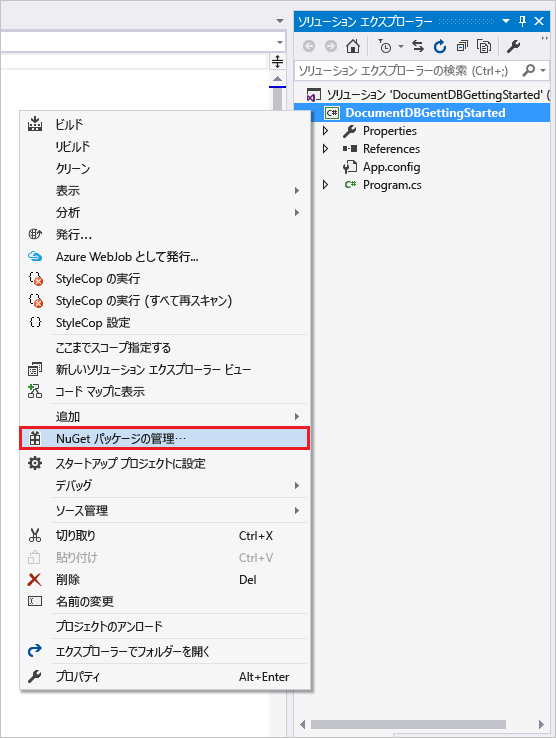
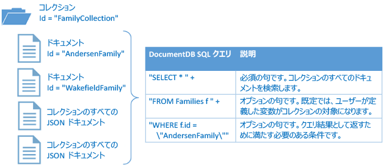

# <a name="nosql-tutorial-build-a-documentdb-c-console-application-on-net-core"></a>NoSQL チュートリアル: .NET Core での DocumentDB C# コンソール アプリケーションの作成
> [!div class="op_single_selector"]
> * [.NET](documentdb-get-started.md)
> * [.NET Core](documentdb-dotnetcore-get-started.md)
> * [MongoDB 用 Node.js](documentdb-mongodb-samples.md)
> * [Node.JS](documentdb-nodejs-get-started.md)
> * [Java](documentdb-java-get-started.md)
> * [C++](documentdb-cpp-get-started.md)
>  
> 

Azure DocumentDB .NET Core SDK の NoSQL チュートリアルへようこそ。 このチュートリアルに従うことで、DocumentDB リソースを作成し、クエリするコンソール アプリケーションを準備することができます。

ここで説明する操作は以下のとおりです。

* DocumentDB アカウントを作成して接続する
* Visual Studio ソリューションを構成する
* オンライン データベースを作成する
* コレクションを作成する
* JSON ドキュメントを作成する
* コレクションをクエリする
* ドキュメントを置換する
* ドキュメントを削除する
* データベースを削除する

時間がなくても 心配はありません。 [GitHub](https://github.com/Azure-Samples/documentdb-dotnet-core-getting-started) で完全なソリューションを入手できます。 簡単な手順については「[完全なソリューションの取得](#GetSolution)」を参照してください。

DocumentDB .NET Core SDK を使用して Xamarin iOS、Android、またはフォーム アプリケーションを作成する方法については、 [DocumentDB を使用した Xamarin モバイル アプリケーションの構築](documentdb-mobile-apps-with-xamarin.md)に関するページを参照してください。

その後で、このページの上部または下部にある投票ボタンを使用して、フィードバックをお寄せください。 マイクロソフトから直接ご連絡を差し上げて問題がなければ、コメント欄に電子メール アドレスをご記入ください。

> [!NOTE]
> このチュートリアルで使用する DocumentDB .NET Core SDK は、現在のところ、ユニバーサル Windows プラットフォーム (UWP) アプリとの互換性はありません。 UWP アプリをサポートするプレビュー バージョンの .NET Core SDK については、[askdocdb@microsoft.com](mailto:askdocdb@microsoft.com) に電子メールでお問い合わせください。

それでは始めましょう。

## <a name="prerequisites"></a>前提条件
以下のものがそろっていることを確認してください。

* アクティブな Azure アカウント。 お持ちでない場合は、 [無料アカウント](https://azure.microsoft.com/free/)にサインアップしてください。 
    * また、このチュートリアルには、[Azure DocumentDB Emulator](documentdb-nosql-local-emulator.md) を使用することもできます。
* [Visual Studio 2017](https://www.visualstudio.com/vs/) 
    * MacOS または Linux で作業している場合、選択したプラットフォーム用の [.NET Core SDK](https://www.microsoft.com/net/core#macos) をインストールすることで、コマンド ラインから .NET Core アプリを開発できます。 
    * Windows で作業している場合、[.NET Core SDK](https://www.microsoft.com/net/core#windows) をインストールすることで、コマンド ラインから .NET Core アプリを開発できます。 
    * 独自のエディターを使用するか、[Visual Studio Code](https://code.visualstudio.com/) をダウンロードできます。Visual Studio Code は無料で、Windows、Linux、MacOS で動作します。 

## <a name="step-1-create-a-documentdb-account"></a>手順 1: DocumentDB アカウントを作成する
DocumentDB アカウントを作成しましょう。 使用するアカウントが既にある場合は、「 [Visual Studio ソリューションをセットアップする](#SetupVS)」に進んでかまいません。 DocumentDB Emulator を使用する場合は、[Azure DocumentDB Emulator](documentdb-nosql-local-emulator.md) に関する記事に記載されている手順に従って、エミュレーターをセットアップし、「[Visual Studio ソリューションをセットアップする](#SetupVS)」に進んでください。

[!INCLUDE [documentdb-create-dbaccount](../../includes/documentdb-create-dbaccount.md)]

## <a id="SetupVS"></a>手順 2: Visual Studio ソリューションをセットアップする
1. コンピューターで **Visual Studio 2017** を開きます。
2. **[ファイル]** メニューで、**[新規]**、**[プロジェクト]** の順に選択します。
3. **[新しいプロジェクト]** ダイアログで、**[テンプレート]** / **[Visual C#]** / **[.NET Core]**/**[Console Application (.NET Core) (コンソール アプリケーション (.NET Core))]** の順に選択します。プロジェクトに **DocumentDBGettingStarted** という名前を付け、**[OK]** をクリックします。

   ![[新しいプロジェクト] ウィンドウのスクリーン ショット](./media/documentdb-dotnetcore-get-started/nosql-tutorial-new-project-2.png)
4. **ソリューション エクスプローラー**で、**[DocumentDBGettingStarted]** を右クリックします。
5. メニューの **[NuGet パッケージの管理]** をクリックします。

   
6. **[NuGet]** タブで、ウィンドウの上部にある **[参照]** をクリックし、検索ボックスに「**azure documentdb**」と入力します。
7. 結果で **Microsoft.Azure.DocumentDB.Core** を探し、**[インストール]** をクリックします。
   .NET Core 用の DocumentDB クライアント ライブラリのパッケージ ID は [Microsoft.Azure.DocumentDB.Core](https://www.nuget.org/packages/Microsoft.Azure.DocumentDB.Core) です。 この .NET Core NuGet パッケージでサポートされていない .NET Framework バージョン (net461 など) を対象とする場合は、.NET Framework 4.5 以降のすべての .NET Framework バージョンをサポートする [Microsoft.Azure.DocumentDB](https://www.nuget.org/packages/Microsoft.Azure.DocumentDB) を使用します。
8. プロンプトが表示されたら、NuGet パッケージのインストールと使用許諾契約に同意します。

そこで、 これでセットアップは終了です。 いくつかのコードの記述を開始しましょう。 このチュートリアルの完成したコード プロジェクトは [GitHub](https://github.com/Azure-Samples/documentdb-dotnet-core-getting-started)にあります。

## <a id="Connect"></a>手順 3: DocumentDB アカウントに接続する
まず、Program.cs ファイルで、C# アプリケーションの先頭に以下の参照を追加します。

```csharp
using System;

// ADD THIS PART TO YOUR CODE
using System.Linq;
using System.Threading.Tasks;
using System.Net;
using Microsoft.Azure.Documents;
using Microsoft.Azure.Documents.Client;
using Newtonsoft.Json;
```

> [!IMPORTANT]
> この NoSQL チュートリアルを完成させるには、上記の依存関係を追加します。

次に、これら 2 つの定数と *client* 変数をパブリック クラス *Program* の下に追加します。

```csharp
class Program
{
    // ADD THIS PART TO YOUR CODE
    private const string EndpointUri = "<your endpoint URI>";
    private const string PrimaryKey = "<your key>";
    private DocumentClient client;
```

次に、 [Azure ポータル](https://portal.azure.com) を開き、URI とプライマリ キーを取得します。 DocumentDB URI とプライマリ キーは、アプリケーションが接続先を認識し、DocumentDB がアプリケーションの接続を信頼するために必要です。

Azure Portal で DocumentDB アカウントに移動し、 **[キー]**をクリックします。

ポータルから URI をコピーし、program.cs ファイルの `<your endpoint URI>` に貼り付けます。 次に、ポータルからプライマリ キーをコピーし、 `<your key>`に貼り付けます。 Azure DocumentDB Emulator を使用している場合は、エンドポイントとして `https://localhost:8081` を使用し、[DocumentDB Emulator を使用した開発方法](documentdb-nosql-local-emulator.md)に関する記事に記載されているとおりに適切に定義された承認キーを使用します。 エンドポイントとキーを指定する際は、< と > を削除したうえで二重引用符で囲みます。

![C# コンソール アプリケーションを作成するために NoSQL チュートリアルで使用される Azure ポータルのスクリーン ショット。 アクティブなハブが強調表示され、[DocumentDB アカウント] ブレードで [キー] ボタンが強調表示され、[キー] ブレードで URI 値、プライマリ キー値、およびセカンダリ キーの値が強調表示されている DocumentDB アカウントを示します][keys]

**DocumentClient**の新しいインスタンスを作成して、作業の開始アプリケーションを起動します。

**Main** メソッドの下に、**GetStartedDemo** という新しい非同期タスクを追加します。これによって新しい **DocumentClient** はインスタンス化されます。

```csharp
static void Main(string[] args)
{
}

// ADD THIS PART TO YOUR CODE
private async Task GetStartedDemo()
{
    this.client = new DocumentClient(new Uri(EndpointUri), PrimaryKey);
}
```

次のコードを追加して、 **Main** メソッドから非同期タスクを実行します。 **Main** メソッドは例外をキャッチし、コンソールに書き込みます。

```csharp
static void Main(string[] args)
{
        // ADD THIS PART TO YOUR CODE
        try
        {
                Program p = new Program();
                p.GetStartedDemo().Wait();
        }
        catch (DocumentClientException de)
        {
                Exception baseException = de.GetBaseException();
                Console.WriteLine("{0} error occurred: {1}, Message: {2}", de.StatusCode, de.Message, baseException.Message);
        }
        catch (Exception e)
        {
                Exception baseException = e.GetBaseException();
                Console.WriteLine("Error: {0}, Message: {1}", e.Message, baseException.Message);
        }
        finally
        {
                Console.WriteLine("End of demo, press any key to exit.");
                Console.ReadKey();
        }
```

**[DocumentDBGettingStarted]** を押して、アプリケーションをビルドして実行します。

ご利用ありがとうございます。 これで、DocumentDB アカウントに接続できました。続いては、DocumentDB リソースの使用方法について説明します。  

## <a name="step-4-create-a-database"></a>手順 4: データベースを作成する
データベースを作成するコードを追加する前に、コンソールに書き込むためのヘルパー メソッドを追加します。

**WriteToConsoleAndPromptToContinue** メソッドをコピーして、**GetStartedDemo** メソッドの下に貼り付けます。

```csharp
// ADD THIS PART TO YOUR CODE
private void WriteToConsoleAndPromptToContinue(string format, params object[] args)
{
        Console.WriteLine(format, args);
        Console.WriteLine("Press any key to continue ...");
        Console.ReadKey();
}
```

DocumentDB [データベースは](documentdb-resources.md#databases)、**DocumentClient** クラスの [CreateDatabaseAsync](https://msdn.microsoft.com/library/microsoft.azure.documents.client.documentclient.createdatabaseasync.aspx) メソッドを使用して作成できます。 データベースは、コレクションに分割された JSON ドキュメント ストレージの論理上のコンテナーです。

次のコードをコピーし、**GetStartedDemo** メソッドに貼り付けます。クライアントを作成する処理のすぐ下に追加してください。 これで *FamilyDB* というデータベースが作成されます。

```csharp
private async Task GetStartedDemo()
{
    this.client = new DocumentClient(new Uri(EndpointUri), PrimaryKey);

    // ADD THIS PART TO YOUR CODE
    await this.client.CreateDatabaseIfNotExistsAsync(new Database { Id = "FamilyDB_oa" });
```

**[DocumentDBGettingStarted]** を押して、アプリケーションを実行します。

ご利用ありがとうございます。 これで、DocumentDB データベースが作成されました。  

## <a id="CreateColl"></a>手順 5: コレクションを作成する
> [!WARNING]
> **CreateDocumentCollectionAsync** は、予約済みのスループットで新しいコレクションを作成します。これによって価格に影響があります。 詳細については、[価格のページ](https://azure.microsoft.com/pricing/details/documentdb/)を参照してください。

[コレクション](documentdb-resources.md#collections)は、**DocumentClient** クラスの [CreateDocumentCollectionAsync](https://msdn.microsoft.com/library/microsoft.azure.documents.client.documentclient.createdocumentcollectionasync.aspx) メソッドを使用して作成できます。 コレクションには、JSON ドキュメントのほか、関連する JavaScript アプリケーション ロジックが格納されます。

次のコードをコピーし、**GetStartedDemo** メソッドに貼り付けます。データベースを作成する処理のすぐ下に追加してください。 これで、*FamilyCollection_oa* というドキュメント コレクションが作成されます。

```csharp
    this.client = new DocumentClient(new Uri(EndpointUri), PrimaryKey);

    await this.CreateDatabaseIfNotExists("FamilyDB_oa");

    // ADD THIS PART TO YOUR CODE
    await this.client.CreateDocumentCollectionIfNotExistsAsync(UriFactory.CreateDatabaseUri("FamilyDB_oa"), new DocumentCollection { Id = "FamilyCollection_oa" });
```

**[DocumentDBGettingStarted]** を押して、アプリケーションを実行します。

ご利用ありがとうございます。 これで、DocumentDB ドキュメント コレクションが作成されました。  

## <a id="CreateDoc"></a>手順 6: JSON ドキュメントを作成する
[ドキュメント](documentdb-resources.md#documents)は、**DocumentClient** クラスの [CreateDocumentAsync](https://msdn.microsoft.com/library/microsoft.azure.documents.client.documentclient.createdocumentasync.aspx) メソッドを使用して作成できます。 ドキュメントは、ユーザー定義の (ユーザーが自由に定義できる) JSON コンテンツです。 ここで 1 つ以上のドキュメントを挿入できます。 データベースに保存するデータが既にある場合には、DocumentDB の [データ移行ツール](documentdb-import-data.md)を使用できます。

まず、この例の DocumentDB 内に格納するオブジェクトの **Family** クラスを作成する必要があります。 さらに、**Family** 内で使用するサブクラスとして、**Parent**、**Child**、**Pet**、**Address** を作成します。 ドキュメントには、JSON で **id** としてシリアル化される **Id** プロパティが必要であることに注意してください。 **GetStartedDemo** の後に次の内部サブクラスを追加することで、これらのクラスを作成します。

**Family**、**Parent**、**Child**、**Pet**、**Address** の各クラスをコピーし、**WriteToConsoleAndPromptToContinue** メソッドの下に貼り付けます。

```csharp
private void WriteToConsoleAndPromptToContinue(string format, params object[] args)
{
    Console.WriteLine(format, args);
    Console.WriteLine("Press any key to continue ...");
    Console.ReadKey();
}

// ADD THIS PART TO YOUR CODE
public class Family
{
    [JsonProperty(PropertyName = "id")]
    public string Id { get; set; }
    public string LastName { get; set; }
    public Parent[] Parents { get; set; }
    public Child[] Children { get; set; }
    public Address Address { get; set; }
    public bool IsRegistered { get; set; }
    public override string ToString()
    {
            return JsonConvert.SerializeObject(this);
    }
}

public class Parent
{
    public string FamilyName { get; set; }
    public string FirstName { get; set; }
}

public class Child
{
    public string FamilyName { get; set; }
    public string FirstName { get; set; }
    public string Gender { get; set; }
    public int Grade { get; set; }
    public Pet[] Pets { get; set; }
}

public class Pet
{
    public string GivenName { get; set; }
}

public class Address
{
    public string State { get; set; }
    public string County { get; set; }
    public string City { get; set; }
}
```

**CreateFamilyDocumentIfNotExists** メソッドをコピーし、**CreateDocumentCollectionIfNotExists** メソッドの下に貼り付けます。

```csharp
// ADD THIS PART TO YOUR CODE
private async Task CreateFamilyDocumentIfNotExists(string databaseName, string collectionName, Family family)
{
    try
    {
        await this.client.ReadDocumentAsync(UriFactory.CreateDocumentUri(databaseName, collectionName, family.Id));
        this.WriteToConsoleAndPromptToContinue("Found {0}", family.Id);
    }
    catch (DocumentClientException de)
    {
        if (de.StatusCode == HttpStatusCode.NotFound)
        {
            await this.client.CreateDocumentAsync(UriFactory.CreateDocumentCollectionUri(databaseName, collectionName), family);
            this.WriteToConsoleAndPromptToContinue("Created Family {0}", family.Id);
        }
        else
        {
            throw;
        }
    }
}
```

さらに、2 つのドキュメントを挿入します。1 つは Andersen Family のドキュメント、もう 1 つは Wakefield Family のドキュメントです。

次のコードをコピーし、**GetStartedDemo** メソッドに貼り付けます。ドキュメント コレクションの作成処理のすぐ下に追加してください。

```csharp
await this.CreateDatabaseIfNotExists("FamilyDB_oa");

await this.CreateDocumentCollectionIfNotExists("FamilyDB_oa", "FamilyCollection_oa");

// ADD THIS PART TO YOUR CODE
Family andersenFamily = new Family
{
        Id = "Andersen.1",
        LastName = "Andersen",
        Parents = new Parent[]
        {
                new Parent { FirstName = "Thomas" },
                new Parent { FirstName = "Mary Kay" }
        },
        Children = new Child[]
        {
                new Child
                {
                        FirstName = "Henriette Thaulow",
                        Gender = "female",
                        Grade = 5,
                        Pets = new Pet[]
                        {
                                new Pet { GivenName = "Fluffy" }
                        }
                }
        },
        Address = new Address { State = "WA", County = "King", City = "Seattle" },
        IsRegistered = true
};

await this.CreateFamilyDocumentIfNotExists("FamilyDB_oa", "FamilyCollection_oa", andersenFamily);

Family wakefieldFamily = new Family
{
        Id = "Wakefield.7",
        LastName = "Wakefield",
        Parents = new Parent[]
        {
                new Parent { FamilyName = "Wakefield", FirstName = "Robin" },
                new Parent { FamilyName = "Miller", FirstName = "Ben" }
        },
        Children = new Child[]
        {
                new Child
                {
                        FamilyName = "Merriam",
                        FirstName = "Jesse",
                        Gender = "female",
                        Grade = 8,
                        Pets = new Pet[]
                        {
                                new Pet { GivenName = "Goofy" },
                                new Pet { GivenName = "Shadow" }
                        }
                },
                new Child
                {
                        FamilyName = "Miller",
                        FirstName = "Lisa",
                        Gender = "female",
                        Grade = 1
                }
        },
        Address = new Address { State = "NY", County = "Manhattan", City = "NY" },
        IsRegistered = false
};

await this.CreateFamilyDocumentIfNotExists("FamilyDB_oa", "FamilyCollection_oa", wakefieldFamily);
```

**[DocumentDBGettingStarted]** を押して、アプリケーションを実行します。

ご利用ありがとうございます。 これで、2 つの DocumentDB ドキュメントが作成されました。  


## <a id="Query"></a>手順 7: DocumentDB リソースをクエリする
DocumentDB では、各コレクションに格納された JSON ドキュメントに対するリッチ [クエリ](documentdb-sql-query.md)をサポートしています。  次のサンプル コードは、前の手順で挿入したドキュメントに対して実行できる、さまざまなクエリを示しています。DocumentDB SQL 構文と LINQ の両方が使用されています。

**ExecuteSimpleQuery** メソッドをコピーし、**CreateFamilyDocumentIfNotExists** メソッドの下に貼り付けます。

```csharp
// ADD THIS PART TO YOUR CODE
private void ExecuteSimpleQuery(string databaseName, string collectionName)
{
    // Set some common query options
    FeedOptions queryOptions = new FeedOptions { MaxItemCount = -1 };

        // Here we find the Andersen family via its LastName
        IQueryable<Family> familyQuery = this.client.CreateDocumentQuery<Family>(
                UriFactory.CreateDocumentCollectionUri(databaseName, collectionName), queryOptions)
                .Where(f => f.LastName == "Andersen");

        // The query is executed synchronously here, but can also be executed asynchronously via the IDocumentQuery<T> interface
        Console.WriteLine("Running LINQ query...");
        foreach (Family family in familyQuery)
        {
            Console.WriteLine("\tRead {0}", family);
        }

        // Now execute the same query via direct SQL
        IQueryable<Family> familyQueryInSql = this.client.CreateDocumentQuery<Family>(
                UriFactory.CreateDocumentCollectionUri(databaseName, collectionName),
                "SELECT * FROM Family WHERE Family.LastName = 'Andersen'",
                queryOptions);

        Console.WriteLine("Running direct SQL query...");
        foreach (Family family in familyQueryInSql)
        {
                Console.WriteLine("\tRead {0}", family);
        }

        Console.WriteLine("Press any key to continue ...");
        Console.ReadKey();
}
```

次のコードをコピーし、**GetStartedDemo** メソッドに貼り付けます。2 つ目のドキュメント作成処理のすぐ下に追加してください。

```csharp
await this.CreateFamilyDocumentIfNotExists("FamilyDB_oa", "FamilyCollection_oa", wakefieldFamily);

// ADD THIS PART TO YOUR CODE
this.ExecuteSimpleQuery("FamilyDB_oa", "FamilyCollection_oa");
```

**[DocumentDBGettingStarted]** を押して、アプリケーションを実行します。

ご利用ありがとうございます。 これで、DocumentDB コレクションに対するクエリが実行されました。

次の図では、作成したコレクションに対して DocumentDB SQL クエリ構文がどのように呼び出されるか、および同じロジックが LINQ クエリにも適用されることを示します。



DocumentDB クエリのスコープは既に 1 つのコレクションに設定されているので、クエリでは [FROM](documentdb-sql-query.md#FromClause) キーワードを省略できます。 したがって、"FROM Families f" は "FROM root r" または他の任意の変数名に置き換えることができます。 DocumentDB は、Families、root、または任意の変数名が、既定で現在のコレクションを参照しているものと推測します。

## <a id="ReplaceDocument"></a>手順 8: JSON ドキュメントを置換する
DocumentDB は、JSON ドキュメントの置換をサポートします。  

**ReplaceFamilyDocument** メソッドをコピーし、**ExecuteSimpleQuery** メソッドの下に貼り付けます。

```csharp
// ADD THIS PART TO YOUR CODE
private async Task ReplaceFamilyDocument(string databaseName, string collectionName, string familyName, Family updatedFamily)
{
    try
    {
        await this.client.ReplaceDocumentAsync(UriFactory.CreateDocumentUri(databaseName, collectionName, familyName), updatedFamily);
        this.WriteToConsoleAndPromptToContinue("Replaced Family {0}", familyName);
    }
    catch (DocumentClientException de)
    {
        throw;
    }
}
```

次のコードをコピーし、**GetStartedDemo** メソッドに貼り付けます。クエリを実行する処理のすぐ下に追加してください。 ドキュメントを置換した後に、同じクエリが実行され、変更されたドキュメントが表示されます。

```csharp
await this.CreateFamilyDocumentIfNotExists("FamilyDB_oa", "FamilyCollection_oa", wakefieldFamily);

this.ExecuteSimpleQuery("FamilyDB_oa", "FamilyCollection_oa");

// ADD THIS PART TO YOUR CODE
// Update the Grade of the Andersen Family child
andersenFamily.Children[0].Grade = 6;

await this.ReplaceFamilyDocument("FamilyDB_oa", "FamilyCollection_oa", "Andersen.1", andersenFamily);

this.ExecuteSimpleQuery("FamilyDB_oa", "FamilyCollection_oa");
```

**[DocumentDBGettingStarted]** を押して、アプリケーションを実行します。

ご利用ありがとうございます。 これで、DocumentDB ドキュメントが置換されました。

## <a id="DeleteDocument"></a>手順 9: JSON ドキュメントを削除する
DocumentDB は、JSON ドキュメントの削除をサポートしています。  

**DeleteFamilyDocument** メソッドをコピーし、**ReplaceFamilyDocument** メソッドの下に貼り付けます。

```csharp
// ADD THIS PART TO YOUR CODE
private async Task DeleteFamilyDocument(string databaseName, string collectionName, string documentName)
{
    try
    {
        await this.client.DeleteDocumentAsync(UriFactory.CreateDocumentUri(databaseName, collectionName, documentName));
        Console.WriteLine("Deleted Family {0}", documentName);
    }
    catch (DocumentClientException de)
    {
        throw;
    }
}
```

次のコードをコピーし、**GetStartedDemo** メソッドに貼り付けます。2 回目のクエリ実行のすぐ下に追加してください。

```cshrp
await this.ReplaceFamilyDocument("FamilyDB_oa", "FamilyCollection_oa", "Andersen.1", andersenFamily);

this.ExecuteSimpleQuery("FamilyDB_oa", "FamilyCollection_oa");

// ADD THIS PART TO CODE
await this.DeleteFamilyDocument("FamilyDB_oa", "FamilyCollection_oa", "Andersen.1");
```

**[DocumentDBGettingStarted]** を押して、アプリケーションを実行します。

ご利用ありがとうございます。 これで、DocumentDB ドキュメントが削除されました。

## <a id="DeleteDatabase"></a>手順 10: データベースを削除する
作成したデータベースを削除すると、データベースとすべての子リソース (コレクション、ドキュメントなど) が削除されます。

データベース全体とすべての子リソースを削除するために、次のコードをコピーし、**GetStartedDemo** メソッドに貼り付けます。ドキュメントの削除処理のすぐ下に追加してください。

```csharp
this.ExecuteSimpleQuery("FamilyDB_oa", "FamilyCollection_oa");

await this.DeleteFamilyDocument("FamilyDB_oa", "FamilyCollection_oa", "Andersen.1");

// ADD THIS PART TO CODE
// Clean up/delete the database
await this.client.DeleteDatabaseAsync(UriFactory.CreateDatabaseUri("FamilyDB_oa"));
```

**[DocumentDBGettingStarted]** を押して、アプリケーションを実行します。

ご利用ありがとうございます。 これで、DocumentDB データベースが作成されました。

## <a id="Run"></a>手順 11: C# コンソール アプリケーションの全体的な実行の流れ
Visual Studio で **[DocumentDBGettingStarted]** を押して、アプリケーションをデバッグ モードでビルドします。

開始したアプリケーションの出力が表示されます。 出力では追加したクエリの結果が表示されます。次の例のようなものになるはずです。

```
Created FamilyDB_oa
Press any key to continue ...
Created FamilyCollection_oa
Press any key to continue ...
Created Family Andersen.1
Press any key to continue ...
Created Family Wakefield.7
Press any key to continue ...
Running LINQ query...
    Read {"id":"Andersen.1","LastName":"Andersen","District":"WA5","Parents":[{"FamilyName":null,"FirstName":"Thomas"},{"FamilyName":null,"FirstName":"Mary Kay"}],"Children":[{"FamilyName":null,"FirstName":"Henriette Thaulow","Gender":"female","Grade":5,"Pets":[{"GivenName":"Fluffy"}]}],"Address":{"State":"WA","County":"King","City":"Seattle"},"IsRegistered":true}
Running direct SQL query...
    Read {"id":"Andersen.1","LastName":"Andersen","District":"WA5","Parents":[{"FamilyName":null,"FirstName":"Thomas"},{"FamilyName":null,"FirstName":"Mary Kay"}],"Children":[{"FamilyName":null,"FirstName":"Henriette Thaulow","Gender":"female","Grade":5,"Pets":[{"GivenName":"Fluffy"}]}],"Address":{"State":"WA","County":"King","City":"Seattle"},"IsRegistered":true}
Replaced Family Andersen.1
Press any key to continue ...
Running LINQ query...
    Read {"id":"Andersen.1","LastName":"Andersen","District":"WA5","Parents":[{"FamilyName":null,"FirstName":"Thomas"},{"FamilyName":null,"FirstName":"Mary Kay"}],"Children":[{"FamilyName":null,"FirstName":"Henriette Thaulow","Gender":"female","Grade":6,"Pets":[{"GivenName":"Fluffy"}]}],"Address":{"State":"WA","County":"King","City":"Seattle"},"IsRegistered":true}
Running direct SQL query...
    Read {"id":"Andersen.1","LastName":"Andersen","District":"WA5","Parents":[{"FamilyName":null,"FirstName":"Thomas"},{"FamilyName":null,"FirstName":"Mary Kay"}],"Children":[{"FamilyName":null,"FirstName":"Henriette Thaulow","Gender":"female","Grade":6,"Pets":[{"GivenName":"Fluffy"}]}],"Address":{"State":"WA","County":"King","City":"Seattle"},"IsRegistered":true}
Deleted Family Andersen.1
End of demo, press any key to exit.
```

ご利用ありがとうございます。 この NoSQL チュートリアルを完了し、実用的な C# コンソール アプリケーションを入手しました。

## <a id="GetSolution"></a> 完全な NoSQL チュートリアル ソリューションを入手する
この記事のすべてのサンプルを含む GetStarted ソリューションをビルドするには、以下が必要です。

* アクティブな Azure アカウント。 お持ちでない場合は、 [無料アカウント](https://azure.microsoft.com/free/)にサインアップしてください。
* [DocumentDB アカウント][documentdb-create-account]。
* GitHub で入手可能な [GetStarted](https://github.com/Azure-Samples/documentdb-dotnet-core-getting-started) ソリューション。

Visual Studio で DocumentDB .NET Core SDK への参照を復元するには、ソリューション エクスプローラーで **GetStarted** ソリューションを右クリックし、**[Enable NuGet Package Restore (NuGet パッケージの復元を有効にする)]** をクリックします。 次に、「[DocumentDB アカウントに接続する](#Connect)」の説明に従って、Program.cs ファイルの EndpointUrl と AuthorizationKey の値を更新します。

## <a name="next-steps"></a>次のステップ
* さらに複雑な ASP.NET MVC NoSQL チュートリアルが必要ですか。 「 [DocumentDB を使用した ASP.NET MVC Web アプリケーションの構築](documentdb-dotnet-application.md)」を参照してください。
* DocumentDB .NET Core SDK を使用して Xamarin iOS、Android、またはフォーム アプリケーションを作成する方法については、 [DocumentDB を使用した Xamarin モバイル アプリケーションの構築](documentdb-mobile-apps-with-xamarin.md)に関するページを参照してください。
* DocumentDB のスケールとパフォーマンスのテストを行う場合は、 「[Azure DocumentDB のパフォーマンスとスケールのテスト](documentdb-performance-testing.md)」を参照してください。
* [DocumentDB アカウントを監視する](documentdb-monitor-accounts.md)方法について学習します。
* [クエリのプレイ グラウンド](https://www.documentdb.com/sql/demo)でサンプル データセットに対してクエリを実行します。
* プログラミング モデルの詳細については、 [DocumentDB のドキュメントに関するページ](https://azure.microsoft.com/documentation/services/documentdb/)の「開発」セクションを参照してください。

[documentdb-create-account]: documentdb-create-account.md
[keys]: media/documentdb-dotnetcore-get-started/nosql-tutorial-keys.png

