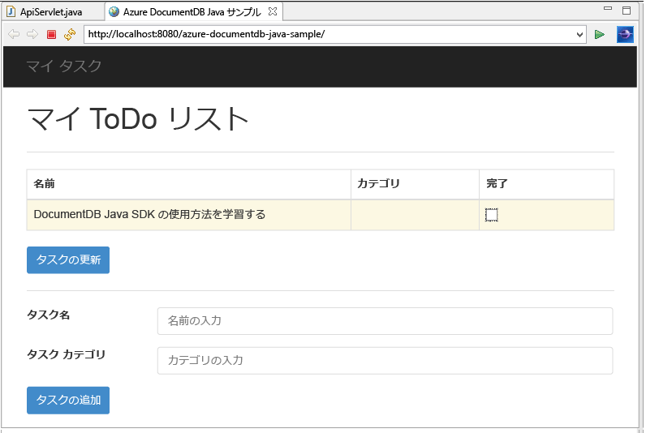
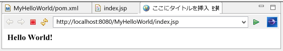

# <a name="build-a-java-web-application-using-documentdb"></a>DocumentDB を使用した Java Web アプリケーションの作成
> [!div class="op_single_selector"]
> * [.NET](documentdb-dotnet-application.md)
> * [MongoDB 用 .NET](documentdb-mongodb-application.md)
> * [Node.JS](documentdb-nodejs-application.md)
> * [Java](documentdb-java-application.md)
> * [Python](documentdb-python-application.md)
> 
> 

この Java Web アプリケーション チュートリアルでは、 [Microsoft Azure DocumentDB](https://portal.azure.com/#gallery/Microsoft.DocumentDB) サービスを使用して、Azure Websites でホストされる Java アプリケーションからデータを格納する方法やデータにアクセスする方法について説明します。 このトピックでは、次の内容を説明します。

* Eclipse で、基本的な JSP アプリケーションを作成する方法。
* [DocumentDB Java SDK](https://github.com/Azure/azure-documentdb-java)を使って Azure DocumentDB サービスを操作する方法。

この Java Web アプリケーション チュートリアルでは、次の図に示すように、タスクを作成、取得、完了済みとしてマークできる、Web ベースのタスク管理アプリケーションを作成する方法について説明します。 ToDo リストの各タスクは、JSON ドキュメントとして Azure DocumentDB に格納されます。



> [!TIP]
> このアプリケーション開発チュートリアルは、Java を使用した経験がある読者を対象としています。 Java や[前提条件となるツール](#Prerequisites)を初めて扱う方は、完全な [todo](https://github.com/Azure-Samples/documentdb-java-todo-app) プロジェクトを GitHub からダウンロードし、[この記事の最後にある手順](#GetProject)に従ってプロジェクトをビルドすることをお勧めします。 プロジェクトをビルドした後でこの記事を見直すと、プロジェクトのコンテキストのコードについての洞察を得ることができます。  
> 
> 

## <a id="Prerequisites"></a>この Java Web アプリケーション チュートリアルの前提条件
このアプリケーション開発チュートリアルを読み始める前に、次の項目を用意する必要があります。

* アクティブな Azure アカウント。 アカウントがない場合は、無料試用版のアカウントを数分で作成することができます。 詳細については、[Azure の無料試用版サイト](https://azure.microsoft.com/pricing/free-trial/)を参照してください。

    または

    [Azure DocumentDB Emulator](documentdb-nosql-local-emulator.md) のローカル インストール。
* [Java Development Kit (JDK) 7 以降](http://www.oracle.com/technetwork/java/javase/downloads/index.html)。
* [Eclipse IDE for Java EE Developers。](http://www.eclipse.org/downloads/packages/eclipse-ide-java-ee-developers/lunasr1)
* [Java ランタイム環境 (Tomcat、Jetty など) が有効な Azure Web サイト。](../app-service-web/web-sites-java-get-started.md)

これらのツールを初めてインストールする場合は、coreservlets.com の [TomCat7 のインストールと Eclipse での使用のチュートリアル](http://www.coreservlets.com/Apache-Tomcat-Tutorial/tomcat-7-with-eclipse.html) のクイック スタート セクションで、インストール プロセスの手順を参照してください。

## <a id="CreateDB"></a>手順 1: DocumentDB データベース アカウントを作成する
最初に、DocumentDB アカウントを作成します。 アカウントが既にある場合や、このチュートリアルに DocumentDB Emulator を使用する場合は、「[手順 2: Java JSP アプリケーションを作成する](#CreateJSP)」に進むことができます。

[!INCLUDE [documentdb-create-dbaccount](../../includes/documentdb-create-dbaccount.md)]

[!INCLUDE [documentdb-keys](../../includes/documentdb-keys.md)]

## <a id="CreateJSP"></a>手順 2: Java JSP アプリケーションを作成する
JSP アプリケーションを作成するには:

1. 最初に、Java プロジェクトを作成します。 Eclipse を起動し、**[File]**、**[New]**、**[Dynamic Web Project]** の順にクリックします。 使用可能なプロジェクトとして **[Dynamic Web Project]** が表示されない場合は、**[File]**、**[New]**、**[Project]**、の順にクリックし、**[Web]** を展開します。さらに、**[Dynamic Web Project]** をクリックし、**[Next]** をクリックします。
   
    
2. **[Project name]** ボックスに、プロジェクト名を入力します。必要に応じて、**[Target Runtime]** ボックスの一覧で値 (たとえば、Apache Tomcat v7.0) を選択し、**[Finish]** をクリックします。 ターゲット ランタイムを選択すると、Eclipse でプロジェクトをローカルに実行できます。
3. Eclipse の Project Explorer ビューで、プロジェクトを展開します。 **WebContent** を右クリックし、**[新規]**、**[JSP ファイル]** の順にクリックします。
4. **[New JSP File]** ダイアログ ボックスで、ファイルに **index.jsp** という名前を付けます。 次の図に示すように、親フォルダーは **WebContent** のままにしておきます。**[Next]** をクリックします。
   
    
5. **[Select JSP Template]** ダイアログ ボックスで、このチュートリアルのために **[New JSP File (html)]** を選択し、**[Finish]** をクリックします。
6. index.jsp ファイルが Eclipse で開いたら、**Hello World!** を表示するためのテキストを追加します。 既存の <body> 要素に追加します。 更新した <body> の内容は次のようになります。
   
        <body>
            <% out.println("Hello World!"); %>
        </body>
7. index.jsp ファイルを保存します。
8. 手順 2. でターゲットのランタイムを設定している場合、**[Project]** をクリックし、次に **[Run]** をクリックして、JSP アプリケーションをローカルで実行できます。
   
    

## <a id="InstallSDK"></a>手順 3: DocumentDB Java SDK をインストールする
DocumentDB Java SDK とその依存関係をインストールするには、 [Apache Maven](http://maven.apache.org/)を使用するのが最も簡単です。

そのためには、次の手順に従ってプロジェクトを maven プロジェクトに変換する必要があります。

1. Project Explorer でプロジェクトを右クリックして、**[Configure]**、**[Convert to Maven Project]** の順にクリックします。
2. **[Create new POM]** ウィンドウで、既定値を受け入れ、**[Finish]** をクリックします。
3. **Project Explorer**で、pom.xml ファイルを開きます。
4. **[Dependencies]** タブの **[Dependencies]** ウィンドウで、**[Add]** をクリックします。
5. **[Select Dependency]** ウィンドウで、次の操作を行います。
   
   * **[GroupId]** ボックスに、「com.microsoft.azure」と入力します。
   * **[Artifact Id]** ボックスに、「azure-documentdb」と入力します。
   * **[Version]** ボックスに「1.5.1」と入力します。
     
     
     
     または、テキスト エディターを使用して、GroupId および ArtifactId の依存関係 XML を 直接 pom.xml に追加します。
     
        <dependency>
            <groupId>com.microsoft.azure</groupId>
            <artifactId>azure-documentdb</artifactId>
            <version>1.9.1</version>
        </dependency>
6. **[Ok]** をクリックします。Maven によって DocumentDB Java SDK がインストールされます。
7. pom.xml ファイルを保存します。

## <a id="UseService"></a>手順 4: Java アプリケーションで DocumentDB サービスを使用する
1. まず TodoItem オブジェクトを定義します。
   
        @Data
        @Builder
        public class TodoItem {
            private String category;
            private boolean complete;
            private String id;
            private String name;
        }
   
    このプロジェクトでは、 [Project Lombok](http://projectlombok.org/) を使用して、コンストラクター、getter、setter、ビルダーを生成します。 または、手動でこのコードを記述したり、IDE で自動的に生成もできます。
2. DocumentDB サービスを呼び出すには、新しい **DocumentClient**をインスタンス化する必要があります。 一般に、後続の要求ごとに新しいクライアントを構築するのではなく、 **DocumentClient** を再利用することをお勧めします。 **DocumentClientFactory**の中にラップすることによって、クライアントを再利用できます。 ここでも、 [手順 1.](#CreateDB)でクリップボードに保存した URI 値とプライマリ キー値を貼り付ける必要があります。 [YOUR\_ENDPOINT\_HERE] を URI 値で置き換え、[YOUR\_KEY\_HERE] をプライマリ キー値で置き換えます。
   
        private static final String HOST = "[YOUR_ENDPOINT_HERE]";
        private static final String MASTER_KEY = "[YOUR_KEY_HERE]";
   
        private static DocumentClient documentClient = new DocumentClient(HOST, MASTER_KEY,
                        ConnectionPolicy.GetDefault(), ConsistencyLevel.Session);
   
        public static DocumentClient getDocumentClient() {
            return documentClient;
        }
3. ここで、持続的な ToDo アイテムを DocumentDB に抽出するためのデータ アクセス オブジェクト (DAO) を作成します。
   
    ToDo 項目をコレクションに保存するために、クライアントはどのデータベースとコレクションが永続化するかを知っている必要があります (自己リンクによって参照されます)。 一般に、データベースへの追加のラウンドト リップを回避するために、可能な場合は、データベースとコレクションをキャッシュすることをお勧めします。
   
    次のコードは、データベースとコレクションが存在する場合に取得する方法、または存在しない場合に新規作成する方法を示します。
   
        public class DocDbDao implements TodoDao {
            // The name of our database.
            private static final String DATABASE_ID = "TodoDB";
   
            // The name of our collection.
            private static final String COLLECTION_ID = "TodoCollection";
   
            // The DocumentDB Client
            private static DocumentClient documentClient = DocumentClientFactory
                    .getDocumentClient();
   
            // Cache for the database object, so we don't have to query for it to
            // retrieve self links.
            private static Database databaseCache;
   
            // Cache for the collection object, so we don't have to query for it to
            // retrieve self links.
            private static DocumentCollection collectionCache;
   
            private Database getTodoDatabase() {
                if (databaseCache == null) {
                    // Get the database if it exists
                    List<Database> databaseList = documentClient
                            .queryDatabases(
                                    "SELECT * FROM root r WHERE r.id='" + DATABASE_ID
                                            + "'", null).getQueryIterable().toList();
   
                    if (databaseList.size() > 0) {
                        // Cache the database object so we won't have to query for it
                        // later to retrieve the selfLink.
                        databaseCache = databaseList.get(0);
                    } else {
                        // Create the database if it doesn't exist.
                        try {
                            Database databaseDefinition = new Database();
                            databaseDefinition.setId(DATABASE_ID);
   
                            databaseCache = documentClient.createDatabase(
                                    databaseDefinition, null).getResource();
                        } catch (DocumentClientException e) {
                            // TODO: Something has gone terribly wrong - the app wasn't
                            // able to query or create the collection.
                            // Verify your connection, endpoint, and key.
                            e.printStackTrace();
                        }
                    }
                }
   
                return databaseCache;
            }
   
            private DocumentCollection getTodoCollection() {
                if (collectionCache == null) {
                    // Get the collection if it exists.
                    List<DocumentCollection> collectionList = documentClient
                            .queryCollections(
                                    getTodoDatabase().getSelfLink(),
                                    "SELECT * FROM root r WHERE r.id='" + COLLECTION_ID
                                            + "'", null).getQueryIterable().toList();
   
                    if (collectionList.size() > 0) {
                        // Cache the collection object so we won't have to query for it
                        // later to retrieve the selfLink.
                        collectionCache = collectionList.get(0);
                    } else {
                        // Create the collection if it doesn't exist.
                        try {
                            DocumentCollection collectionDefinition = new DocumentCollection();
                            collectionDefinition.setId(COLLECTION_ID);
   
                            collectionCache = documentClient.createCollection(
                                    getTodoDatabase().getSelfLink(),
                                    collectionDefinition, null).getResource();
                        } catch (DocumentClientException e) {
                            // TODO: Something has gone terribly wrong - the app wasn't
                            // able to query or create the collection.
                            // Verify your connection, endpoint, and key.
                            e.printStackTrace();
                        }
                    }
                }
   
                return collectionCache;
            }
        }
4. 次の手順では、いくつかのコードを記述して、コレクションに TodoItems を持続的にアクセスさせます。 この例では、 [Gson](https://code.google.com/p/google-gson/) を使用して、TodoItem Plain Old Java Objects (POJO) を JSON ドキュメントにシリアル化およびシリアル化解除します。 [Jackson](http://jackson.codehaus.org/) または独自のカスタム シリアライザーも POJO をシリアル化するための優れた代替手段です。
   
        // We'll use Gson for POJO <=> JSON serialization for this example.
        private static Gson gson = new Gson();
   
        @Override
        public TodoItem createTodoItem(TodoItem todoItem) {
            // Serialize the TodoItem as a JSON Document.
            Document todoItemDocument = new Document(gson.toJson(todoItem));
   
            // Annotate the document as a TodoItem for retrieval (so that we can
            // store multiple entity types in the collection).
            todoItemDocument.set("entityType", "todoItem");
   
            try {
                // Persist the document using the DocumentClient.
                todoItemDocument = documentClient.createDocument(
                        getTodoCollection().getSelfLink(), todoItemDocument, null,
                        false).getResource();
            } catch (DocumentClientException e) {
                e.printStackTrace();
                return null;
            }
   
            return gson.fromJson(todoItemDocument.toString(), TodoItem.class);
        }
5. DocumentDB データベースおよびコレクションのように、ドキュメントも自己リンクにより参照されます。 次のヘルパー関数は、自己リンクではなく別の属性 ("id" など) によりドキュメントを取得します。
   
        private Document getDocumentById(String id) {
            // Retrieve the document using the DocumentClient.
            List<Document> documentList = documentClient
                    .queryDocuments(getTodoCollection().getSelfLink(),
                            "SELECT * FROM root r WHERE r.id='" + id + "'", null)
                    .getQueryIterable().toList();
   
            if (documentList.size() > 0) {
                return documentList.get(0);
            } else {
                return null;
            }
        }
6. 手順 5. のヘルパー メソッドを使用して、id により TodoItem の JSON ドキュメントを取得し、POJO に逆シリアル化できます。
   
        @Override
        public TodoItem readTodoItem(String id) {
            // Retrieve the document by id using our helper method.
            Document todoItemDocument = getDocumentById(id);
   
            if (todoItemDocument != null) {
                // De-serialize the document in to a TodoItem.
                return gson.fromJson(todoItemDocument.toString(), TodoItem.class);
            } else {
                return null;
            }
        }
7. DocumentClient を使用して、DocumentDB SQL により、TodoItems のコレクションまたはリストを取得することも可能です。
   
        @Override
        public List<TodoItem> readTodoItems() {
            List<TodoItem> todoItems = new ArrayList<TodoItem>();
   
            // Retrieve the TodoItem documents
            List<Document> documentList = documentClient
                    .queryDocuments(getTodoCollection().getSelfLink(),
                            "SELECT * FROM root r WHERE r.entityType = 'todoItem'",
                            null).getQueryIterable().toList();
   
            // De-serialize the documents in to TodoItems.
            for (Document todoItemDocument : documentList) {
                todoItems.add(gson.fromJson(todoItemDocument.toString(),
                        TodoItem.class));
            }
   
            return todoItems;
        }
8. DocumentClient を使用してドキュメントを更新する方法は多数あります。 Todo リスト アプリケーションでは、TodoItem が完了しているかどうかを切り替える機能が求められることがあります。 これは、ドキュメント内の "complete" 属性を更新することで実現できます。
   
        @Override
        public TodoItem updateTodoItem(String id, boolean isComplete) {
            // Retrieve the document from the database
            Document todoItemDocument = getDocumentById(id);
   
            // You can update the document as a JSON document directly.
            // For more complex operations - you could de-serialize the document in
            // to a POJO, update the POJO, and then re-serialize the POJO back in to
            // a document.
            todoItemDocument.set("complete", isComplete);
   
            try {
                // Persist/replace the updated document.
                todoItemDocument = documentClient.replaceDocument(todoItemDocument,
                        null).getResource();
            } catch (DocumentClientException e) {
                e.printStackTrace();
                return null;
            }
   
            return gson.fromJson(todoItemDocument.toString(), TodoItem.class);
        }
9. 最後に、リストから TodoItem を削除する機能が求められる場合があります。 そのためには、前に作成したヘルパー メソッドを使用して、自己リンクを取得し、次にクライアントに削除を指示できます。
   
        @Override
        public boolean deleteTodoItem(String id) {
            // DocumentDB refers to documents by self link rather than id.
   
            // Query for the document to retrieve the self link.
            Document todoItemDocument = getDocumentById(id);
   
            try {
                // Delete the document by self link.
                documentClient.deleteDocument(todoItemDocument.getSelfLink(), null);
            } catch (DocumentClientException e) {
                e.printStackTrace();
                return false;
            }
   
            return true;
        }

## <a id="Wire"></a>手順 5: Java アプリケーション開発プロジェクトの残りの部分を接続する
これで、楽しい作業が終わりました。残っているのは簡単なユーザー インターフェイスの作成と DAO への連結です。

1. まず、DAO を呼び出すためのコントローラーの作成から始めましょう。
   
        public class TodoItemController {
            public static TodoItemController getInstance() {
                if (todoItemController == null) {
                    todoItemController = new TodoItemController(TodoDaoFactory.getDao());
                }
                return todoItemController;
            }
   
            private static TodoItemController todoItemController;
   
            private final TodoDao todoDao;
   
            TodoItemController(TodoDao todoDao) {
                this.todoDao = todoDao;
            }
   
            public TodoItem createTodoItem(@NonNull String name,
                    @NonNull String category, boolean isComplete) {
                TodoItem todoItem = TodoItem.builder().name(name).category(category)
                        .complete(isComplete).build();
                return todoDao.createTodoItem(todoItem);
            }
   
            public boolean deleteTodoItem(@NonNull String id) {
                return todoDao.deleteTodoItem(id);
            }
   
            public TodoItem getTodoItemById(@NonNull String id) {
                return todoDao.readTodoItem(id);
            }
   
            public List<TodoItem> getTodoItems() {
                return todoDao.readTodoItems();
            }
   
            public TodoItem updateTodoItem(@NonNull String id, boolean isComplete) {
                return todoDao.updateTodoItem(id, isComplete);
            }
        }
   
    より複雑なアプリケーションでは、コントローラーは、DAO の上に複雑なビジネス ロジックを格納することがあります。
2. 次に、サーブレットを作成して HTTP 要求をコントローラーにルーティングします。
   
        public class TodoServlet extends HttpServlet {
            // API Keys
            public static final String API_METHOD = "method";
   
            // API Methods
            public static final String CREATE_TODO_ITEM = "createTodoItem";
            public static final String GET_TODO_ITEMS = "getTodoItems";
            public static final String UPDATE_TODO_ITEM = "updateTodoItem";
   
            // API Parameters
            public static final String TODO_ITEM_ID = "todoItemId";
            public static final String TODO_ITEM_NAME = "todoItemName";
            public static final String TODO_ITEM_CATEGORY = "todoItemCategory";
            public static final String TODO_ITEM_COMPLETE = "todoItemComplete";
   
            public static final String MESSAGE_ERROR_INVALID_METHOD = "{'error': 'Invalid method'}";
   
            private static final long serialVersionUID = 1L;
            private static final Gson gson = new Gson();
   
            @Override
            protected void doGet(HttpServletRequest request,
                    HttpServletResponse response) throws ServletException, IOException {
   
                String apiResponse = MESSAGE_ERROR_INVALID_METHOD;
   
                TodoItemController todoItemController = TodoItemController
                        .getInstance();
   
                String id = request.getParameter(TODO_ITEM_ID);
                String name = request.getParameter(TODO_ITEM_NAME);
                String category = request.getParameter(TODO_ITEM_CATEGORY);
                boolean isComplete = StringUtils.equalsIgnoreCase("true",
                        request.getParameter(TODO_ITEM_COMPLETE)) ? true : false;
   
                switch (request.getParameter(API_METHOD)) {
                case CREATE_TODO_ITEM:
                    apiResponse = gson.toJson(todoItemController.createTodoItem(name,
                            category, isComplete));
                    break;
                case GET_TODO_ITEMS:
                    apiResponse = gson.toJson(todoItemController.getTodoItems());
                    break;
                case UPDATE_TODO_ITEM:
                    apiResponse = gson.toJson(todoItemController.updateTodoItem(id,
                            isComplete));
                    break;
                default:
                    break;
                }
   
                response.getWriter().println(apiResponse);
            }
   
            @Override
            protected void doPost(HttpServletRequest request,
                    HttpServletResponse response) throws ServletException, IOException {
                doGet(request, response);
            }
        }
3. ユーザーに表示する Web ユーザー インターフェイスが必要になります。 前に作成した index.jsp を書き換えてみましょう。
    ```html
        <html>
        <head>
          <meta http-equiv="Content-Type" content="text/html; charset=ISO-8859-1">
          <meta http-equiv="X-UA-Compatible" content="IE=edge;" />
          <title>Azure DocumentDB Java Sample</title>
   
          <!-- Bootstrap -->
          <link href="//ajax.aspnetcdn.com/ajax/bootstrap/3.2.0/css/bootstrap.min.css" rel="stylesheet">
   
          <style>
            /* Add padding to body for fixed nav bar */
            body {
              padding-top: 50px;
            }
          </style>
        </head>
        <body>
          <!-- Nav Bar -->
          <div class="navbar navbar-inverse navbar-fixed-top" role="navigation">
            <div class="container">
              <div class="navbar-header">
                <a class="navbar-brand" href="#">My Tasks</a>
              </div>
            </div>
          </div>
   
          <!-- Body -->
          <div class="container">
            <h1>My ToDo List</h1>
   
            <hr/>
   
            <!-- The ToDo List -->
            <div class = "todoList">
              <table class="table table-bordered table-striped" id="todoItems">
                <thead>
                  <tr>
                    <th>Name</th>
                    <th>Category</th>
                    <th>Complete</th>
                  </tr>
                </thead>
                <tbody>
                </tbody>
              </table>
   
              <!-- Update Button -->
              <div class="todoUpdatePanel">
                <form class="form-horizontal" role="form">
                  <button type="button" class="btn btn-primary">Update Tasks</button>
                </form>
              </div>
   
            </div>
   
            <hr/>
   
            <!-- Item Input Form -->
            <div class="todoForm">
              <form class="form-horizontal" role="form">
                <div class="form-group">
                  <label for="inputItemName" class="col-sm-2">Task Name</label>
                  <div class="col-sm-10">
                    <input type="text" class="form-control" id="inputItemName" placeholder="Enter name">
                  </div>
                </div>
   
                <div class="form-group">
                  <label for="inputItemCategory" class="col-sm-2">Task Category</label>
                  <div class="col-sm-10">
                    <input type="text" class="form-control" id="inputItemCategory" placeholder="Enter category">
                  </div>
                </div>
   
                <button type="button" class="btn btn-primary">Add Task</button>
              </form>
            </div>
   
          </div>
   
          <!-- Placed at the end of the document so the pages load faster -->
          <script src="//ajax.aspnetcdn.com/ajax/jQuery/jquery-2.1.1.min.js"></script>
          <script src="//ajax.aspnetcdn.com/ajax/bootstrap/3.2.0/bootstrap.min.js"></script>
          <script src="assets/todo.js"></script>
        </body>
        </html>
    ```
4. 最後に、Web ユーザー インターフェイスとサーブレットを結びつけるためにクライアント側の Javascript を記述します。
   
        var todoApp = {
          /*
           * API methods to call Java backend.
           */
          apiEndpoint: "api",
   
          createTodoItem: function(name, category, isComplete) {
            $.post(todoApp.apiEndpoint, {
                "method": "createTodoItem",
                "todoItemName": name,
                "todoItemCategory": category,
                "todoItemComplete": isComplete
              },
              function(data) {
                var todoItem = data;
                todoApp.addTodoItemToTable(todoItem.id, todoItem.name, todoItem.category, todoItem.complete);
              },
              "json");
          },
   
          getTodoItems: function() {
            $.post(todoApp.apiEndpoint, {
                "method": "getTodoItems"
              },
              function(data) {
                var todoItemArr = data;
                $.each(todoItemArr, function(index, value) {
                  todoApp.addTodoItemToTable(value.id, value.name, value.category, value.complete);
                });
              },
              "json");
          },
   
          updateTodoItem: function(id, isComplete) {
            $.post(todoApp.apiEndpoint, {
                "method": "updateTodoItem",
                "todoItemId": id,
                "todoItemComplete": isComplete
              },
              function(data) {},
              "json");
          },
   
          /*
           * UI Methods
           */
          addTodoItemToTable: function(id, name, category, isComplete) {
            var rowColor = isComplete ? "active" : "warning";
   
            todoApp.ui_table().append($("<tr>")
              .append($("<td>").text(name))
              .append($("<td>").text(category))
              .append($("<td>")
                .append($("<input>")
                  .attr("type", "checkbox")
                  .attr("id", id)
                  .attr("checked", isComplete)
                  .attr("class", "isComplete")
                ))
              .addClass(rowColor)
            );
          },
   
          /*
           * UI Bindings
           */
          bindCreateButton: function() {
            todoApp.ui_createButton().click(function() {
              todoApp.createTodoItem(todoApp.ui_createNameInput().val(), todoApp.ui_createCategoryInput().val(), false);
              todoApp.ui_createNameInput().val("");
              todoApp.ui_createCategoryInput().val("");
            });
          },
   
          bindUpdateButton: function() {
            todoApp.ui_updateButton().click(function() {
              // Disable button temporarily.
              var myButton = $(this);
              var originalText = myButton.text();
              $(this).text("Updating...");
              $(this).prop("disabled", true);
   
              // Call api to update todo items.
              $.each(todoApp.ui_updateId(), function(index, value) {
                todoApp.updateTodoItem(value.name, value.value);
                $(value).remove();
              });
   
              // Re-enable button.
              setTimeout(function() {
                myButton.prop("disabled", false);
                myButton.text(originalText);
              }, 500);
            });
          },
   
          bindUpdateCheckboxes: function() {
            todoApp.ui_table().on("click", ".isComplete", function(event) {
              var checkboxElement = $(event.currentTarget);
              var rowElement = $(event.currentTarget).parents('tr');
              var id = checkboxElement.attr('id');
              var isComplete = checkboxElement.is(':checked');
   
              // Toggle table row color
              if (isComplete) {
                rowElement.addClass("active");
                rowElement.removeClass("warning");
              } else {
                rowElement.removeClass("active");
                rowElement.addClass("warning");
              }
   
              // Update hidden inputs for update panel.
              todoApp.ui_updateForm().children("input[name='" + id + "']").remove();
   
              todoApp.ui_updateForm().append($("<input>")
                .attr("type", "hidden")
                .attr("class", "updateComplete")
                .attr("name", id)
                .attr("value", isComplete));
   
            });
          },
   
          /*
           * UI Elements
           */
          ui_createNameInput: function() {
            return $(".todoForm #inputItemName");
          },
   
          ui_createCategoryInput: function() {
            return $(".todoForm #inputItemCategory");
          },
   
          ui_createButton: function() {
            return $(".todoForm button");
          },
   
          ui_table: function() {
            return $(".todoList table tbody");
          },
   
          ui_updateButton: function() {
            return $(".todoUpdatePanel button");
          },
   
          ui_updateForm: function() {
            return $(".todoUpdatePanel form");
          },
   
          ui_updateId: function() {
            return $(".todoUpdatePanel .updateComplete");
          },
   
          /*
           * Install the TodoApp
           */
          install: function() {
            todoApp.bindCreateButton();
            todoApp.bindUpdateButton();
            todoApp.bindUpdateCheckboxes();
   
            todoApp.getTodoItems();
          }
        };
   
        $(document).ready(function() {
          todoApp.install();
        });
5. これで完成です。 後はアプリケーションをテストするだけです。 アプリケーションをローカルで実行し、項目の名前とカテゴリを入力して、 **[Add Task]**をクリックして、いくつかの Todo 項目を追加します。
6. 項目が表示されたら、チェック ボックスを切り替え、 **[Update Tasks]**をクリックすることで、その項目が完了しているかどうかを確認できます。

## <a id="Deploy"></a>手順 6: Azure Websites に Java アプリケーションをデプロイする
Azure Websites での Java アプリケーションのデプロイは簡単です。アプリケーションを WAR ファイルとしてエクスポートし、ソース管理 (例: GIT) または FTP のいずれかを使用してアップロードするだけです。

1. アプリケーションを WAR としてエクスポートするには、**Project Explorer** でプロジェクトを右クリックし、**[Export]**、**[WAR File]** の順にクリックします。
2. **[WAR Export]** ウィンドウで、次の操作を行います。
   
   * [Web project] ボックスに、「azure-documentdb-java-sample」と入力します。
   * [Destination] ボックスでエクスポート先を選択し、WAR ファイルを保存します。
   * **[完了]**をクリックします。
3. これで WAR ファイルを Azure Web サイトの **webapps** ディレクトリにアップロードできます。 ファイルのアップロード方法については、「 [Azure の Java Web サイトへのアプリケーションの追加](../app-service-web/web-sites-java-add-app.md)」を参照してください。
   
    WAR ファイルを webapps ディレクトリにアップロードすると、ランタイム環境により WAR ファイルの追加が検出され、WAR ファイルが自動的に読み込まれます。
4. 完成したアプリケーションの動作を確認するには、http://YOUR\_SITE\_NAME.azurewebsites.net/azure-documentdb-java-sample/ にアクセスして、タスクを追加します。

## <a id="GetProject"></a>GitHub からのプロジェクトの入手
このチュートリアルのサンプルはすべて、GitHub の [todo](https://github.com/Azure-Samples/documentdb-java-todo-app) プロジェクトに含まれています。 todo プロジェクトを Eclipse にインポートするには、「 [前提条件](#Prerequisites) 」セクションに記載されているソフトウェアおよびリソースがあることを確認したうえで、以下の手順に従います。

1. [Project Lombok](http://projectlombok.org/)をインストールします。 Lombok は、プロジェクトのコンストラクター、getter、setter の生成に使用します。 lombok.jar ファイルをダウンロードしたら、ファイルをダブルクリックしてコマンド ラインからインストールします。
2. Eclipse が開いている場合は、いったん終了してから再起動して Lombok を読み込みます。
3. Eclipse で、**[File]** メニューの **[Import]** をクリックします。
4. **[Import]** ウィンドウで、**[Git]**、**[Projects from Git]**、**[Next]** の順にクリックします。
5. **[Select Repository Source]** 画面で、**[Clone URI]** をクリックします。
6. **[Source Git Repository]** 画面の **[URI]** ボックスに「https://github.com/Azure-Samples/documentdb-java-todo-app.git」と入力し、**[Next]** をクリックします。
7. **[Branch Selection]** 画面で、**[master]** が選択されていることを確認し、**[Next]** をクリックします。
8. **[Local Destination]** 画面で、**[Browse]** をクリックしてリポジトリをコピーするフォルダーを選択し、**[Next]** をクリックします。
9. **[Select a wizard to use for importing projects]** 画面で、**[Import existing projects]** が選択されていることを確認し、**[Next]** をクリックします。
10. **[Import Projects]** 画面で、**DocumentDB** プロジェクトを選択解除し、**[Finish]** をクリックします。 DocumentDB プロジェクトには、依存関係として追加される DocumentDB Java SDK が含まれています。
11. **Project Explorer** で、azure-documentdb-java-sample\src\com.microsoft.azure.documentdb.sample.dao\DocumentClientFactory.java を表示し、[HOST] 値と [MASTER_KEY] 値を DocumentDB アカウントの URI とプライマリ キーで置き換え、ファイルを保存します。 詳細については、「[手順 1:DocumentDB データベース アカウントを作成する](#CreateDB)」を参照してください。
12. **Project Explorer** で、**azure-documentdb-java-sample** を右クリックし、**[Build Path]**、**[Configure Build Path]** の順にクリックします。
13. **[Java Build Path]** 画面の右ウィンドウで **[Libraries]** タブを選択し、**[Add External JARs]** をクリックします。 lombok.jar ファイルの場所を参照し、**[Open]**、**[OK]** の順にクリックします。
14. 手順 12. の手順を使用してもう一度 **[Properties]** ウィンドウを開き、左ウィンドウの **[Targeted Runtimes]** をクリックします。
15. **[Targeted Runtimes]** 画面で、**[New]** をクリックします。**[Apache Tomcat v7.0]** を選択し、**[OK]** をクリックします。
16. 手順 12. の手順を使用してもう一度 **[Properties]** ウィンドウを開き、左ウィンドウの **[Project Facets]** をクリックします。
17. **[Project Facets]** 画面で、**[Dynamic Web Module]** と **[Java]** を選択し、**[OK]** をクリックします。
18. 画面の下部の **[Servers]** タブで、**[Tomcat v7.0 Server at localhost]** を右クリックし、**[Add and Remove]** をクリックします。
19. **[Add and Remove]** ウィンドウで、**[azure-documentdb-java-sample]** を **[Configured]** ボックスに移動し、**[Finish]** をクリックします。
20. **[Server]** タブで、**[Tomcat v7.0 Server at localhost]** を右クリックし、**[Restart]** をクリックします。
21. ブラウザーで http://localhost:8080/azure-documentdb-java-sample/ にアクセスして、タスク リストに項目を追加します。 既定のポート値を変更している場合は、8080 に代えて、使用している値を指定してください。
22. プロジェクトを Azure Web サイトにデプロイする方法については、「[手順 6: Azure Websites にアプリケーションをデプロイする](#Deploy)」を参照してください。

[1]: media/documentdb-java-application/keys.png

