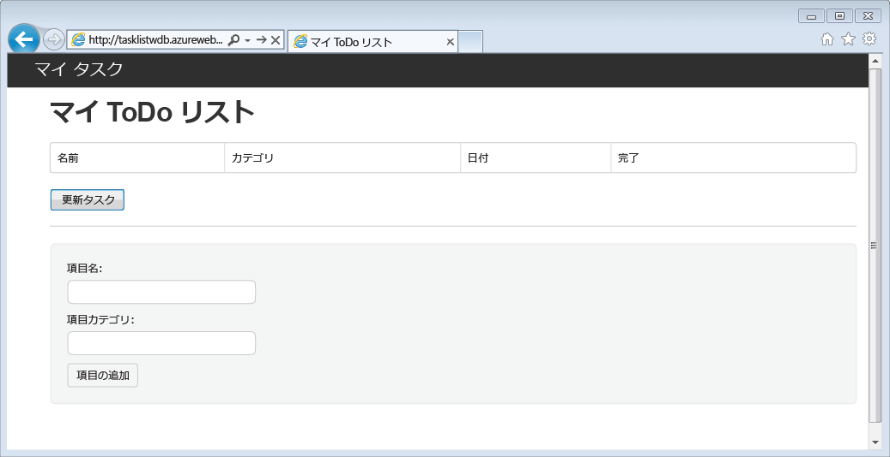
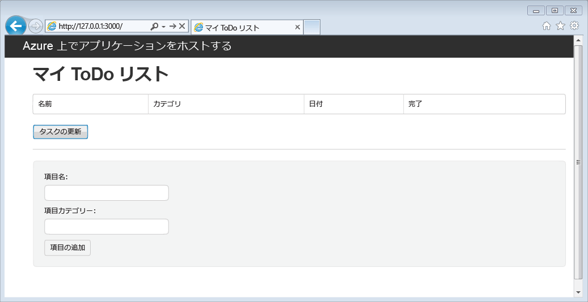
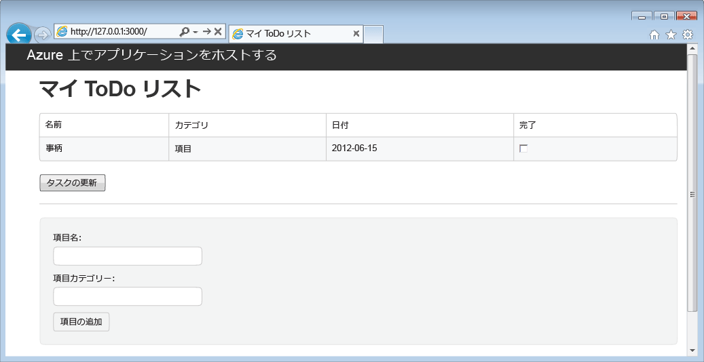

# DocumentDB を使用した Node.js Web アプリケーションの作成
> [!div class="op_single_selector"]
> * [.NET](documentdb-dotnet-application.md)
> * [MongoDB 用 .NET](documentdb-mongodb-application.md)
> * [Node.JS](documentdb-nodejs-application.md)
> * [Java](documentdb-java-application.md)
> * [Python](documentdb-python-application.md)
> 
> 

この Node.js チュートリアルでは、Azure DocumentDB を使用して、Azure Websites にホストされた Node.js Express アプリケーションからデータを格納する方法やデータにアクセスする方法について説明します。 タスクを作成、取得、完了する機能を備えた、単純な Web ベースのタスク管理アプリケーション (ToDo アプリ) を作成します。 対象となるタスクは、JSON ドキュメントとして Azure DocumentDB に保存するものとします。 このチュートリアルでは、アプリの作成とデプロイの手順を示し、各スニペットの動作を説明します。

チュートリアルを最後まで実施する時間はないが、完成済みのソリューションが必要な場合は、 [GitHub][GitHub] から完全なサンプル ソリューションを入手できます。 アプリケーションを実行する手順については、[Readme](https://github.com/Azure-Samples/documentdb-node-todo-app/blob/master/README.md) ファイルを参照してください。

## 前提条件
> [!TIP]
> このs Node.js チュートリアルは、Node.js と Azure Websites の使用経験がある読者を対象としています。
> 
> 

この記事の手順を実行する前に、次のソフトウェアがインストールされていることを確認してください。

* アクティブな Azure アカウント。 アカウントがない場合は、無料試用版のアカウントを数分で作成することができます。 詳細については、 [Azure の無料試用版サイト](https://azure.microsoft.com/pricing/free-trial/)を参照してください。

   または

   [Azure DocumentDB Emulator](documentdb-nosql-local-emulator.md) のローカル インストール。
* [Node.js][Node.js] バージョン v0.10.29 以降
* [Express ジェネレーター](http://www.expressjs.com/starter/generator.html) (`npm install express-generator -g` によってこれをインストールできます)
* [Git][Git]。

## 手順 1: DocumentDB データベース アカウントを作成する
最初に、DocumentDB アカウントを作成します。 アカウントが既にある場合や、このチュートリアルに DocumentDB Emulator を使用する場合は、「[手順 2: 新しい Node.js アプリケーションを作成する](#_Toc395783178)」に進むことができます。

[!INCLUDE [documentdb-create-dbaccount](../../includes/documentdb-create-dbaccount.md)]

[!INCLUDE [documentdb-keys](../../includes/documentdb-keys.md)]

## 手順 2: 新しい Node.js アプリケーションを作成する
それでは、 [Express](http://expressjs.com/) フレームワークを使用して、基本的な Hello World Node.js プロジェクトを作成する方法を学習しましょう。

1. Node.js のコマンド プロンプトなどのお好きなターミナルを開きます。
2. 新しいアプリケーションを保存するディレクトリに移動します。
3. Express ジェネレーターを使用し、 **todo**という名前の新しいアプリケーションを作成します。
   
        express todo
4. 新しい **todo** ディレクトリを開き、依存関係をインストールします。
   
        cd todo
        npm install
5. 新しいアプリケーションを実行します。
   
        npm start
6. ブラウザーで [http://localhost:3000](http://localhost:3000) に移動すると、新しいアプリケーションを表示できます。
   
    

    次に、アプリケーションを停止するために、ターミナル ウィンドウで Ctrl + C キーを押し、**[y]** をクリックして、バッチ ジョブを終了します。

## 手順 3: 追加モジュールのインストール
**package.json** ファイルは、プロジェクトのルートに作成されるファイルの&1; つです。 このファイルには、Node.js アプリケーションで必要な追加モジュールのリストが含まれます。 このファイルは、後でこのアプリケーションを Azure Websites にデプロイするときに、アプリケーションのサポートのために Azure にインストールする必要があるモジュールを判断するために使用されます。 このチュートリアルでは、追加で&2; つのパッケージをインストールする必要があります。

1. ターミナルに戻り、npm で **async** モジュールをインストールします。
   
        npm install async --save
2. npm で **documentdb** モジュールをインストールします。 このモジュールで、DocumentDB のすべての操作を行います。
   
        npm install documentdb --save
3. アプリケーションの **package.json** ファイルを簡単に確認すると、追加モジュールが表示されます。 このファイルは、アプリケーションの実行時にどのパッケージをダウンロードし、インストールする必要があるかを Azure に伝えます。 表示される内容は以下の例のようになります。
   
        {
          "name": "todo",
          "version": "0.0.0",
          "private": true,
          "scripts": {
            "start": "node ./bin/www"
          },
          "dependencies": {
            "async": "^2.1.4",
            "body-parser": "~1.15.2",
            "cookie-parser": "~1.4.3",
            "debug": "~2.2.0",
            "documentdb": "^1.10.0",
            "express": "~4.14.0",
            "jade": "~1.11.0",
            "morgan": "~1.7.0",
            "serve-favicon": "~2.3.0"
          }
        }
   
    これにより、アプリケーションがこれらの追加モジュールに依存していることが Node に (後で Azure にも) 通知されます。

## 手順 4: ノード アプリケーションでの DocumentDB サービスの使用
最初の設定と構成を行った後は、いよいよ Azure DocumentDB を使ってコードを作成する作業に入ります。

### モデルの作成
1. プロジェクト ディレクトリで、package.json ファイルと同じディレクトリ内に、**models** という名前の新しいディレクトリを作成します。
2. **models** ディレクトリ内に、**taskDao.js** という名前の新しいファイルを作成します。 このファイルには、アプリケーションで作成されるタスクのモデルが格納されます。
3. 同じ **models** ディレクトリ内に、**docdbUtils.js** という名前の別の新しいファイルを作成します。 このファイルには、アプリケーション全体で使用する、いくつかの便利で再利用可能なコードが含まれます。 
4. 次のコードを **docdbUtils.js**
   
        var DocumentDBClient = require('documentdb').DocumentClient;
   
        var DocDBUtils = {
            getOrCreateDatabase: function (client, databaseId, callback) {
                var querySpec = {
                    query: 'SELECT * FROM root r WHERE r.id= @id',
                    parameters: [{
                        name: '@id',
                        value: databaseId
                    }]
                };
   
                client.queryDatabases(querySpec).toArray(function (err, results) {
                    if (err) {
                        callback(err);
   
                    } else {
                        if (results.length === 0) {
                            var databaseSpec = {
                                id: databaseId
                            };
   
                            client.createDatabase(databaseSpec, function (err, created) {
                                callback(null, created);
                            });
   
                        } else {
                            callback(null, results[0]);
                        }
                    }
                });
            },
   
            getOrCreateCollection: function (client, databaseLink, collectionId, callback) {
                var querySpec = {
                    query: 'SELECT * FROM root r WHERE r.id=@id',
                    parameters: [{
                        name: '@id',
                        value: collectionId
                    }]
                };               
   
                client.queryCollections(databaseLink, querySpec).toArray(function (err, results) {
                    if (err) {
                        callback(err);
   
                    } else {        
                        if (results.length === 0) {
                            var collectionSpec = {
                                id: collectionId
                            };
   
                            client.createCollection(databaseLink, collectionSpec, function (err, created) {
                                callback(null, created);
                            });
   
                        } else {
                            callback(null, results[0]);
                        }
                    }
                });
            }
        };
   
        module.exports = DocDBUtils;
   
   > [!TIP]
   > createCollection が受け取る省略可能な requestOptions パラメーターを使用すると、コレクションのプランの種類を指定できます。 requestOptions.offerType の値を指定しないと、コレクションは既定のプランの種類を使用して作成されます。
   > 
   > DocumentDB のプランの種類の詳細については、「 [DocumentDB のパフォーマンス レベル](documentdb-performance-levels.md) 
   > 
   > 
5. **docdbUtils.js** ファイルを保存して閉じます。
6. **taskDao.js** ファイルの先頭に、**DocumentDBClient** と、上の手順で作成した **docdbUtils.js** を参照する次のコードを追加します。
   
        var DocumentDBClient = require('documentdb').DocumentClient;
        var docdbUtils = require('./docdbUtils');
7. 次に、Task オブジェクトを定義およびエクスポートするコードを追加します。 これにより、Task オブジェクトの初期化と、使用するデータベースおよびドキュメント コレクションのセット アップ.が実行されます。
   
        function TaskDao(documentDBClient, databaseId, collectionId) {
          this.client = documentDBClient;
          this.databaseId = databaseId;
          this.collectionId = collectionId;
   
          this.database = null;
          this.collection = null;
        }
   
        module.exports = TaskDao;
8. 次に、Task オブジェクトの追加のメソッドを定義する次のコードを追加します。このメソッドによって、DocumentDB に格納されたデータを操作できます。
   
        TaskDao.prototype = {
            init: function (callback) {
                var self = this;
   
                docdbUtils.getOrCreateDatabase(self.client, self.databaseId, function (err, db) {
                    if (err) {
                        callback(err);
                    } else {
                        self.database = db;
                        docdbUtils.getOrCreateCollection(self.client, self.database._self, self.collectionId, function (err, coll) {
                            if (err) {
                                callback(err);
   
                            } else {
                                self.collection = coll;
                            }
                        });
                    }
                });
            },
   
            find: function (querySpec, callback) {
                var self = this;
   
                self.client.queryDocuments(self.collection._self, querySpec).toArray(function (err, results) {
                    if (err) {
                        callback(err);
   
                    } else {
                        callback(null, results);
                    }
                });
            },
   
            addItem: function (item, callback) {
                var self = this;
   
                item.date = Date.now();
                item.completed = false;
   
                self.client.createDocument(self.collection._self, item, function (err, doc) {
                    if (err) {
                        callback(err);
   
                    } else {
                        callback(null, doc);
                    }
                });
            },
   
            updateItem: function (itemId, callback) {
                var self = this;
   
                self.getItem(itemId, function (err, doc) {
                    if (err) {
                        callback(err);
   
                    } else {
                        doc.completed = true;
   
                        self.client.replaceDocument(doc._self, doc, function (err, replaced) {
                            if (err) {
                                callback(err);
   
                            } else {
                                callback(null, replaced);
                            }
                        });
                    }
                });
            },
   
            getItem: function (itemId, callback) {
                var self = this;
   
                var querySpec = {
                    query: 'SELECT * FROM root r WHERE r.id = @id',
                    parameters: [{
                        name: '@id',
                        value: itemId
                    }]
                };
   
                self.client.queryDocuments(self.collection._self, querySpec).toArray(function (err, results) {
                    if (err) {
                        callback(err);
   
                    } else {
                        callback(null, results[0]);
                    }
                });
            }
        };
9. **taskDao.js** ファイルを保存して閉じます。 

### コントローラーの作成
1. プロジェクトの **routes** ディレクトリ内に、**tasklist.js** という名前の新しいファイルを作成します。 
2. 次のコードを **tasklist.js** に追加します。 これによって、**tasklist.js** で使用される　DocumentDBClient および async モジュールが読み込まれます。 また、これで **TaskList** 関数が定義されました。先ほど定義した **Task** オブジェクトのインスタンスがこの関数に渡されます。
   
        var DocumentDBClient = require('documentdb').DocumentClient;
        var async = require('async');
   
        function TaskList(taskDao) {
          this.taskDao = taskDao;
        }
   
        module.exports = TaskList;
3. **tasklist.js** ファイルへのコードの追加を続行し、タスクの表示、追加、完了に使われる、**showTasks、addTask**、および **completeTasks** の各メソッドを追加します。
   
        TaskList.prototype = {
            showTasks: function (req, res) {
                var self = this;
   
                var querySpec = {
                    query: 'SELECT * FROM root r WHERE r.completed=@completed',
                    parameters: [{
                        name: '@completed',
                        value: false
                    }]
                };
   
                self.taskDao.find(querySpec, function (err, items) {
                    if (err) {
                        throw (err);
                    }
   
                    res.render('index', {
                        title: 'My ToDo List ',
                        tasks: items
                    });
                });
            },
   
            addTask: function (req, res) {
                var self = this;
                var item = req.body;
   
                self.taskDao.addItem(item, function (err) {
                    if (err) {
                        throw (err);
                    }
   
                    res.redirect('/');
                });
            },
   
            completeTask: function (req, res) {
                var self = this;
                var completedTasks = Object.keys(req.body);
   
                async.forEach(completedTasks, function taskIterator(completedTask, callback) {
                    self.taskDao.updateItem(completedTask, function (err) {
                        if (err) {
                            callback(err);
                        } else {
                            callback(null);
                        }
                    });
                }, function goHome(err) {
                    if (err) {
                        throw err;
                    } else {
                        res.redirect('/');
                    }
                });
            }
        };
4. **tasklist.js** ファイルを保存して閉じます。

### config.js の追加
1. プロジェクト ディレクトリ内に、 **config.js**という名前の新しいファイルを作成します。
2. 次のコードを **config.js**に追加します。 これにより、アプリケーションに必要な値と構成設定が定義されます。
   
        var config = {}
   
        config.host = process.env.HOST || "[the URI value from the DocumentDB Keys blade on http://portal.azure.com]";
        config.authKey = process.env.AUTH_KEY || "[the PRIMARY KEY value from the DocumentDB Keys blade on http://portal.azure.com]";
        config.databaseId = "ToDoList";
        config.collectionId = "Items";
   
        module.exports = config;
3. [Microsoft Azure Portal](https://portal.azure.com) の DocumentDB アカウントの [キー] ブレードにある値を使用して、**config.js** ファイルの HOST および AUTH_KEY の値を更新します。
4. **config.js** ファイルを保存して閉じます。

### app.js の変更
1. プロジェクト ディレクトリ内の **app.js** ファイルを開きます。 これは、先ほどの Express Web アプリケーション作成時に作成されたファイルです。
2. **app.js** の先頭に次のコードを追加します。
   
        var DocumentDBClient = require('documentdb').DocumentClient;
        var config = require('./config');
        var TaskList = require('./routes/tasklist');
        var TaskDao = require('./models/taskDao');
3. このコードは、使用する構成ファイルを定義し、さらにこのファイルから値を読み取り、それをこれから使用するいくつかの変数に代入します。
4. **app.js** ファイル内にある次の&2; 行を、
   
        app.use('/', index);
        app.use('/users', users); 
   
      次のコードに置き換えます。
   
        var docDbClient = new DocumentDBClient(config.host, {
            masterKey: config.authKey
        });
        var taskDao = new TaskDao(docDbClient, config.databaseId, config.collectionId);
        var taskList = new TaskList(taskDao);
        taskDao.init();
   
        app.get('/', taskList.showTasks.bind(taskList));
        app.post('/addtask', taskList.addTask.bind(taskList));
        app.post('/completetask', taskList.completeTask.bind(taskList));
        app.set('view engine', 'jade');
5. これらの行は、**TaskDao** オブジェクトの新しいインスタンスを DocumentDB への新しい接続によって定義し (**config.js** から読み取った値を使用して)、タスク オブジェクトを初期化して、その後フォーム アクションを **TaskList** コントローラー上のメソッドにバインドします。 
6. 最後に、 **app.js** ファイルを保存して閉じると、これでほぼ完了です。

## 手順 5: ユーザー インターフェイスの構築
次に、ユーザーがアプリケーションとやり取りするためのユーザー インターフェイスを作成します。 作成した Express アプリケーションでは、ビュー エンジンとして **Jade** を使用しています。 Jade の詳細については、 [http://jade-lang.com/](http://jade-lang.com/)を参照してください。

1. **views** ディレクトリ内の **layout.jade** ファイルは、他の **.jade** ファイルのグローバル テンプレートとして使われます。 この手順では、[Twitter Bootstrap](https://github.com/twbs/bootstrap) を使うようにこのファイルを変更します。Twitter Bootstrap は、見栄えのよい Web サイトを簡単にデザインできるツールキットです。 
2. **views** フォルダーにある **layout.jade** ファイルを開き、その内容を次のコードで置き換えます。
   
        doctype html
        html
           head
             title= title
             link(rel='stylesheet', href='//ajax.aspnetcdn.com/ajax/bootstrap/3.3.2/css/bootstrap.min.css')
             link(rel='stylesheet', href='/stylesheets/style.css')
           body
             nav.navbar.navbar-inverse.navbar-fixed-top
               div.navbar-header
                 a.navbar-brand(href='#') My Tasks
             block content
             script(src='//ajax.aspnetcdn.com/ajax/jQuery/jquery-1.11.2.min.js')
             script(src='//ajax.aspnetcdn.com/ajax/bootstrap/3.3.2/bootstrap.min.js')

    このコードでは、アプリケーションの特定の HTML を描画し、コンテンツ ページのレイアウトを指定するための、**content** という名前の**ブロック (block)** を作成することを **Jade** エンジンに指示しています。
    **layout.jade** ファイルを保存して閉じます。

3. アプリケーションが使用するビューである **index.jade** ファイルを開き、そのファイルの中身を次のコードに置き換えます。
   
        extends layout
        block content
           h1 #{title}
           br
        
           form(action="/completetask", method="post")
             table.table.table-striped.table-bordered
               tr
                 td Name
                 td Category
                 td Date
                 td Complete
               if (typeof tasks === "undefined")
                 tr
                   td
               else
                 each task in tasks
                   tr
                     td #{task.name}
                     td #{task.category}
                     - var date  = new Date(task.date);
                     - var day   = date.getDate();
                     - var month = date.getMonth() + 1;
                     - var year  = date.getFullYear();
                     td #{month + "/" + day + "/" + year}
                     td
                       input(type="checkbox", name="#{task.id}", value="#{!task.completed}", checked=task.completed)
             button.btn(type="submit") Update tasks
           hr
           form.well(action="/addtask", method="post")
             label Item Name:
             input(name="name", type="textbox")
             label Item Category:
             input(name="category", type="textbox")
             br
             button.btn(type="submit") Add item
   
    これはレイアウトを拡張するためのコードで、前述の **layout.jade** ファイル内の **content** プレースホルダーの内容を定義します。
   
    このレイアウトでは、2 つの HTML フォームを作成しています。 
    1 つ目のフォームは、データ用のテーブルと、コントローラーの **/completetask** メソッドに対するポストによって項目の更新ができるボタンを含みます。
    2 つ目のフォームは、2 つの入力フィールドと、コントローラーの **/addtask** メソッドに対するポストによって新しい項目を作成できるボタンを含みます。
   
    アプリケーションが動作するために必要なコードはこれですべてです。
4. **public\stylesheets** ディレクトリ内の **style.css** ファイルを開き、そのコードを次のコードに置き換えます。
   
        body {
          padding: 50px;
          font: 14px "Lucida Grande", Helvetica, Arial, sans-serif;
        }
        a {
          color: #00B7FF;
        }
        .well label {
          display: block;
        }
        .well input {
          margin-bottom: 5px;
        }
        .btn {
          margin-top: 5px;
          border: outset 1px #C8C8C8;
        }
   
    この **style.css** ファイルを保存して閉じます。

## 手順 6: ローカルでのアプリケーションの実行
1. ローカル コンピューターでアプリケーションをテストするには、ターミナルで `npm start` を実行してアプリケーションを起動し、[http://localhost:3000](http://localhost:3000) ブラウザー ページを更新します。 ページは、次の画像のようになります。
   
    

    > [!TIP]
    > layout.jade ファイルまたは index.jade ファイルのインデントについてのエラーが表示される場合は、両方のファイルの最初の&2; 行がスペースなしで左揃えになっていることを確認してください。 最初の&2; 行の前にスペースがある場合は、そのスペースを削除し、両方のファイルを保存してから、ブラウザー ウィンドウを更新します。 

2. [Item]、[Item Name]、[Category] フィールドを使用して新しいタスクを入力し、**[Add Item]** をクリックします。 これらのプロパティに基づいて、DocumentDB にドキュメントが作成されます。 
3. ページが更新され、ToDo リストに新しく作成された項目が表示されます。
   
    
4. タスクを完了するには、[Complete] 列のチェック ボックスをオンにし、 **[Update tasks]**をクリックします。 既に作成したドキュメントが更新されます。

5. アプリケーションを停止するために、ターミナル ウィンドウで Ctrl キーを押しながら C キーを押し、**[Y]** をクリックしてバッチ ジョブを終了します。

## 手順 7: Azure Websites へのアプリケーション開発プロジェクトのデプロイ
1. まだデプロイを実施していない場合、Azure Web サイトの Git リポジトリを有効にします。 この手順については、「 [Azure App Service へのローカル Git デプロイ](../app-service-web/app-service-deploy-local-git.md) 」を参照してください。
2. Git リモートとして Azure Web サイトを追加します。
   
        git remote add azure https://username@your-azure-website.scm.azurewebsites.net:443/your-azure-website.git
3. リモートにプッシュすることでデプロイを実施します。
   
        git push azure master
4. 数秒すると、Git による Web アプリケーションの発行が完了し、ブラウザーが起動します。作成したアプリケーションが Azure で動作しているようすを確認できます。

    お疲れさまでした。 ここでは初めての方を対象に、Azure DocumentDB を使用した Node.js Express Web アプリケーションを作成し、Azure Websites に発行する方法を説明しました。

    このチュートリアルの完全な参照アプリケーションをダウンロードするか参照する場合は、[GitHub][GitHub] からダウンロードできます。

## 次のステップ

* DocumentDB のスケールとパフォーマンスのテストを行う場合は、 「[Azure DocumentDB のパフォーマンスとスケールのテスト](documentdb-performance-testing.md)」を参照してください。
* [DocumentDB アカウントを監視する](documentdb-monitor-accounts.md)方法について学習します。
* [クエリのプレイ グラウンド](https://www.documentdb.com/sql/demo)でサンプル データセットに対してクエリを実行します。
* [DocumentDB のドキュメント](https://docs.microsoft.com/en-us/azure/documentdb/)を参照します。

[Node.js]: http://nodejs.org/
[Git]: http://git-scm.com/
[GitHub]: https://github.com/Azure-Samples/documentdb-node-todo-app

