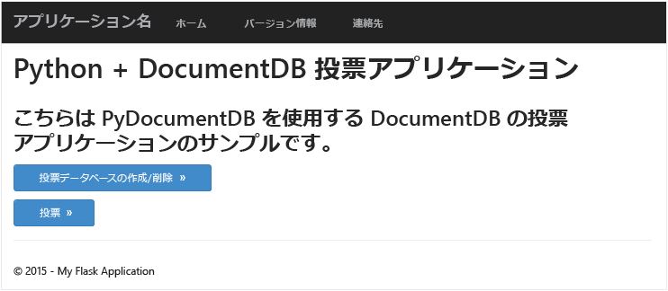
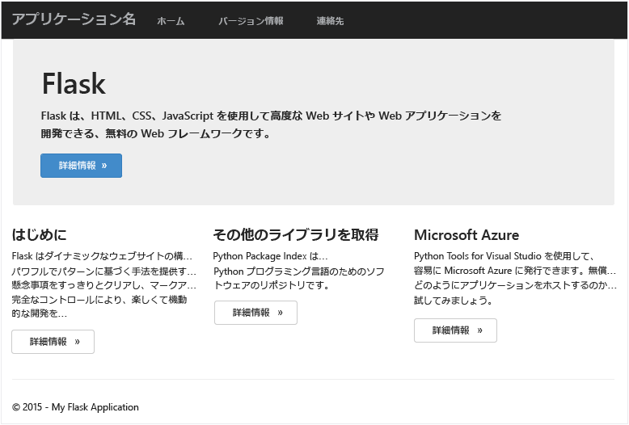
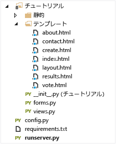
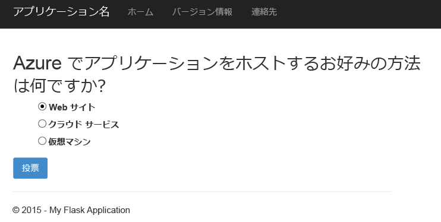
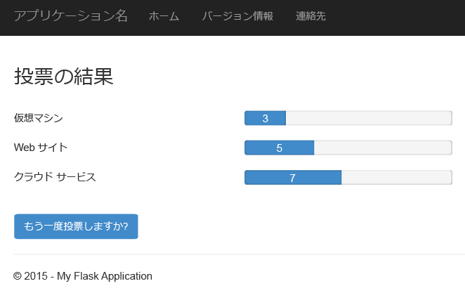

# <a name="build-a-python-flask-web-application-using-documentdb"></a>DocumentDB を使用した Python Flask Web アプリケーションの作成
> [!div class="op_single_selector"]
> * [.NET](documentdb-dotnet-application.md)
> * [MongoDB 用 .NET](documentdb-mongodb-application.md)
> * [Node.JS](documentdb-nodejs-application.md)
> * [Java](documentdb-java-application.md)
> * [Python](documentdb-python-application.md)
> 
> 

このチュートリアルでは、Azure DocumentDB を使用して、Azure にホストされている Python Web アプリケーションからデータを保存する方法や、データにアクセスする方法を説明します。Python と Azure Websites の使用経験がある読者を想定しています。

このデータベース チュートリアルの内容:

1. DocumentDB アカウントを作成してプロビジョニングする
2. Python MVC アプリケーションを作成する
3. Web アプリケーションから Azure DocumentDB に接続して使用する
4. Web アプリケーションを Azure Websites にデプロイする

このチュートリアルの手順を実行すると、アンケートに回答する単純な投票アプリケーションを作成できます。



## <a name="database-tutorial-prerequisites"></a>データベース チュートリアルの前提条件
この記事の手順を実行する前に、次のソフトウェアがインストールされていることを確認してください。

* アクティブな Azure アカウント。 アカウントがない場合は、無料試用版のアカウントを数分で作成することができます。 詳細については、 [Azure の無料試用版サイト](https://azure.microsoft.com/pricing/free-trial/)を参照してください。
 
    または 

    [Azure DocumentDB Emulator](documentdb-nosql-local-emulator.md) のローカル インストール。
* [Visual Studio 2013](http://www.visualstudio.com/) 以降、またはその無償版の [Visual Studio Express]()。 このチュートリアルの手順は、Visual Studio 2015 を想定して作成されています。 
* Python Tools for Visual Studio ( [GitHub](http://microsoft.github.io/PTVS/)から入手できます)。 このチュートリアルでは、Python Tools for VS 2015 を使用します。 
* Azure Python SDK for Visual Studio Version 2.4 以降 ( [azure.com](https://azure.microsoft.com/downloads/)から入手できます)。 ここでは、Microsoft Azure SDK for Python 2.7 を使用しました。
* Python 2.7 ([python.org][2] から入手できます)。 ここでは、Python 2.7.11 を使用しました。 

> [!IMPORTANT]
> 初めて Python 2.7 をインストールする場合は、[Customize Python 2.7.11] 画面で必ず **[Add python.exe to Path]**を選択してください。
> 
> 
> 
> 

* Microsoft Visual C++ Compiler for Python 2.7 ([Microsoft ダウンロード センター][3]から入手できます)。

## <a name="step-1-create-a-documentdb-database-account"></a>手順 1: DocumentDB データベース アカウントを作成する
最初に、DocumentDB アカウントを作成します。 アカウントが既にある場合や、このチュートリアルに DocumentDB Emulator を使用する場合は、「[手順 2. 新しい Python Flask Web アプリケーションを作成する](#step-2:-create-a-new-python-flask-web-application)」に進むことができます。

[!INCLUDE [documentdb-create-dbaccount](../../includes/documentdb-create-dbaccount.md)]

<br/>
次のセクションでは、新しい Python Flask Web アプリケーションをゼロから作成する方法について説明します。

## <a name="step-2-create-a-new-python-flask-web-application"></a>手順 2. 新しい Python Flask Web アプリケーションを作成する
1. Visual Studio で、**[ファイル]** メニューの **[新規作成]** をポイントし、**[プロジェクト]** をクリックします。
   
    **[新しいプロジェクト]** ダイアログ ボックスが表示されます。
2. 左側のウィンドウで、**[テンプレート]**、**[Python]**、**[Web]** の順に展開します。 
3. 中央のウィンドウで、**[Flask Web Project]** を選択し、**[名前]** ボックスに「**tutorial**」と入力して、**[OK]** をクリックします。 [Python コードのスタイル ガイド](https://www.python.org/dev/peps/pep-0008/#package-and-module-names)に関するページで説明されているように、Python パッケージの名前はすべて小文字にする必要があることに注意してください。
   
    Python Flask は、Python で Web アプリケーションを短時間で作成するための Web アプリケーション開発フレームワークです。
   
    ![Visual Studio の [新しいプロジェクト] ウィンドウのスクリーン ショット。左側で [Python] が強調表示され、中央で [Python Flask Web プロジェクト] が選択され、[名前] ボックスに tutorial という名前が入力されている](./media/documentdb-python-application/image9.png)
4. **[Python Tools for Visual Studio]** ウィンドウで、**[Install into a virtual environment]** をクリックします。 
   
    ![[database tutorial - Python Tools for Visual Studio] ウィンドウのスクリーン ショット](./media/documentdb-python-application/image10.png)
5. 現時点では PyDocumentDB は Python 3.x をサポートしていないため、**[Add Virtual Environment]** ウィンドウで、既定の設定をそのまま使用し、ベース環境として Python 2.7 を使用します。**[Create]** をクリックします。 これで、プロジェクトに必要な Python 仮想環境が設定されます。
   
    ![[database tutorial - Python Tools for Visual Studio] ウィンドウのスクリーン ショット](./media/documentdb-python-application/image10_A.png)
   
    環境が正常にインストールされると、出力ウィンドウに " `Successfully installed Flask-0.10.1 Jinja2-2.8 MarkupSafe-0.23 Werkzeug-0.11.5 itsdangerous-0.24 'requirements.txt' was installed successfully.` " と表示されます。

## <a name="step-3-modify-the-python-flask-web-application"></a>手順 3: Python Flask Web アプリケーションを変更する
### <a name="add-the-python-flask-packages-to-your-project"></a>プロジェクトへの Python Flask パッケージの追加
プロジェクトを設定した後は、プロジェクトに必要な Flask パッケージ (DocumentDB 用の Python パッケージ pydocumentdb など) を追加する必要があります。

1. ソリューション エクスプローラーで、 **requirements.txt** という名前のファイルを開き、既存のコードを次のコードに置き換えます。
   
        flask==0.9
        flask-mail==0.7.6
        sqlalchemy==0.7.9
        flask-sqlalchemy==0.16
        sqlalchemy-migrate==0.7.2
        flask-whooshalchemy==0.55a
        flask-wtf==0.8.4
        pytz==2013b
        flask-babel==0.8
        flup
        pydocumentdb>=1.0.0
2. **requirements.txt** ファイルを保存します。 
3. ソリューション エクスプローラーで、**[env]** を右クリックし、**[Install from requirements.txt]** をクリックします。
   
    ![[env (Python 2.7)] を示すスクリーン ショット。リストで [requirements.txt からインストール] が選択されている](./media/documentdb-python-application/image11.png)
   
    正常にインストールされると、出力ウィンドウに次のメッセージが表示されます。
   
        Successfully installed Babel-2.3.2 Tempita-0.5.2 WTForms-2.1 Whoosh-2.7.4 blinker-1.4 decorator-4.0.9 flask-0.9 flask-babel-0.8 flask-mail-0.7.6 flask-sqlalchemy-0.16 flask-whooshalchemy-0.55a0 flask-wtf-0.8.4 flup-1.0.2 pydocumentdb-1.6.1 pytz-2013b0 speaklater-1.3 sqlalchemy-0.7.9 sqlalchemy-migrate-0.7.2
   
   > [!NOTE]
   > まれに、出力ウィンドウにエラーが表示されることがあります。 その場合は、エラーがクリーンアップに関連しているかどうか確認してください。 クリーンアップには失敗しても、インストールは正常に行われる場合があります (出力ウィンドウを上方向へスクロールして確認してください)。 [仮想環境を確認する](#verify-the-virtual-environment)ことで、インストールを確認できます。 インストールに失敗しても、確認に成功した場合は、続行してかまいません。
   > 
   > 

### <a name="verify-the-virtual-environment"></a>仮想環境の確認
すべてが正しくインストールされているかどうかを確認してみましょう。

1. **Ctrl** + **Shift** + **B** キーを押して、ソリューションをビルドします。
2. ビルドが成功したら、 **F5**キーを押して、Web サイトを開きます。 Flask 開発サーバーが起動し、Web ブラウザーが開きます。 次のページが表示されます。
   
    
3. Visual Studio で **Shift** + **F5** キーを押して、Web サイトのデバッグを停止します。

### <a name="create-database-collection-and-document-definitions"></a>データベース、コレクション、およびドキュメント定義の作成
これで、新しいファイルを追加し、既存のファイルを更新して、投票アプリケーションを作成できます。

1. ソリューション エクスプローラーで、**tutorial** プロジェクトを右クリックし、**[追加]**、**[新しい項目]** の順にクリックします。 **[Empty Python File]** を選択し、ファイルに **forms.py** という名前を付けます。  
2. forms.py ファイルに次のコードを追加し、ファイルを保存します。

```python
from flask.ext.wtf import Form
from wtforms import RadioField

class VoteForm(Form):
    deploy_preference  = RadioField('Deployment Preference', choices=[
        ('Web Site', 'Web Site'),
        ('Cloud Service', 'Cloud Service'),
        ('Virtual Machine', 'Virtual Machine')], default='Web Site')
```


### <a name="add-the-required-imports-to-viewspy"></a>views.py への必要な import ステートメントの追加
1. ソリューション エクスプローラーで、**tutorial** フォルダーを展開し、**views.py** ファイルを開きます。 
2. 次の import ステートメントを **views.py** ファイルの先頭に追加し、ファイルを保存します。 これらのステートメントにより、DocumentDB の PythonSDK および Flask パッケージがインポートされます。
   
    ```python
    from forms import VoteForm
    import config
    import pydocumentdb.document_client as document_client
    ```

### <a name="create-database-collection-and-document"></a>データベース、コレクション、およびドキュメントの作成
* 引き続き **views.py**で、次のコードをファイルの末尾に追加します。 これにより、フォームで使用されるデータベースの作成が処理されます。 **views.py**内の既存のコードを削除しないように注意してください。 単にこのコードを末尾に追加してください。

```python
@app.route('/create')
def create():
    """Renders the contact page."""
    client = document_client.DocumentClient(config.DOCUMENTDB_HOST, {'masterKey': config.DOCUMENTDB_KEY})

    # Attempt to delete the database.  This allows this to be used to recreate as well as create
    try:
        db = next((data for data in client.ReadDatabases() if data['id'] == config.DOCUMENTDB_DATABASE))
        client.DeleteDatabase(db['_self'])
    except:
        pass

    # Create database
    db = client.CreateDatabase({ 'id': config.DOCUMENTDB_DATABASE })

    # Create collection
    collection = client.CreateCollection(db['_self'],{ 'id': config.DOCUMENTDB_COLLECTION })

    # Create document
    document = client.CreateDocument(collection['_self'],
        { 'id': config.DOCUMENTDB_DOCUMENT,
          'Web Site': 0,
          'Cloud Service': 0,
          'Virtual Machine': 0,
          'name': config.DOCUMENTDB_DOCUMENT 
        })

    return render_template(
       'create.html',
        title='Create Page',
        year=datetime.now().year,
        message='You just created a new database, collection, and document.  Your old votes have been deleted')
```

> [!TIP]
> **CreateCollection** メソッドは、省略可能な&3; 番目のパラメーター **RequestOptions** を受け取ります。 これを使用すると、コレクションのプランの種類を指定することができます。 offerType の値を指定しないと、コレクションは既定のプランの種類を使用して作成されます。 DocumentDB のプランの種類の詳細については、「 [DocumentDB のパフォーマンス レベル](documentdb-performance-levels.md)」を参照してください。
> 
> 

### <a name="read-database-collection-document-and-submit-form"></a>データベース、コレクション、およびドキュメントの読み取りとフォームの送信
* 引き続き **views.py**で、次のコードをファイルの末尾に追加します。 このコードでは、フォームの設定と、データベース、コレクション、およびドキュメントの読み取りを行っています。 **views.py**内の既存のコードを削除しないように注意してください。 単にこのコードを末尾に追加してください。

```python
@app.route('/vote', methods=['GET', 'POST'])
def vote(): 
    form = VoteForm()
    replaced_document ={}
    if form.validate_on_submit(): # is user submitted vote  
        client = document_client.DocumentClient(config.DOCUMENTDB_HOST, {'masterKey': config.DOCUMENTDB_KEY})

        # Read databases and take first since id should not be duplicated.
        db = next((data for data in client.ReadDatabases() if data['id'] == config.DOCUMENTDB_DATABASE))

        # Read collections and take first since id should not be duplicated.
        coll = next((coll for coll in client.ReadCollections(db['_self']) if coll['id'] == config.DOCUMENTDB_COLLECTION))

        # Read documents and take first since id should not be duplicated.
        doc = next((doc for doc in client.ReadDocuments(coll['_self']) if doc['id'] == config.DOCUMENTDB_DOCUMENT))

        # Take the data from the deploy_preference and increment our database
        doc[form.deploy_preference.data] = doc[form.deploy_preference.data] + 1
        replaced_document = client.ReplaceDocument(doc['_self'], doc)

        # Create a model to pass to results.html
        class VoteObject:
            choices = dict()
            total_votes = 0

        vote_object = VoteObject()
        vote_object.choices = {
            "Web Site" : doc['Web Site'],
            "Cloud Service" : doc['Cloud Service'],
            "Virtual Machine" : doc['Virtual Machine']
        }
        vote_object.total_votes = sum(vote_object.choices.values())

        return render_template(
            'results.html', 
            year=datetime.now().year, 
            vote_object = vote_object)

    else :
        return render_template(
            'vote.html', 
            title = 'Vote',
            year=datetime.now().year,
            form = form)
```


### <a name="create-the-html-files"></a>HTML ファイルの作成
1. ソリューション エクスプローラーで、**tutorial** フォルダー内の **templates** フォルダーを右クリックし、**[追加]**、**[新しい項目]** の順にクリックします。 
2. **[HTML ページ]** を選択し、[名前] ボックスに「**create.html**」と入力します。 
3. 手順 1. と 2. を繰り返して、results.html と vote.html という 2 つの追加の HTML ファイルを作成します。
4. 次のコードを **create.html** in the `<body>` 要素に追加します。 このコードは、新しいデータベース、コレクション、およびドキュメントを作成したことを示すメッセージを表示します。
   
    ```html
    
    
    <h2>{{ title }}.</h2>
    <h3>{{ message }}</h3>
    <p><a href="{{ url_for('vote') }}" class="btn btn-primary btn-large">Vote &raquo;</a></p>
    
    ```
5. 次のコードを **results.html** の `<body`> 要素に追加します。 このコードは、投票の結果を表示します。
   
    ```html
    
    
    <h2>Results of the vote</h2>
        <br />
   
    
    <div class="row">
        <div class="col-sm-5">{{choice}}</div>
            <div class="col-sm-5">
                <div class="progress">
                    <div class="progress-bar" role="progressbar" aria-valuenow="{{vote_object.choices[choice]}}" aria-valuemin="0" aria-valuemax="{{vote_object.total_votes}}" style="width: {{(vote_object.choices[choice]/vote_object.total_votes)*100}}%;">
                                {{vote_object.choices[choice]}}
                </div>
            </div>
            </div>
    </div>
    
   
    <br />
    <a class="btn btn-primary" href="{{ url_for('vote') }}">Vote again?</a>
    
    ```
6. 次のコードを **vote.html** の `<body`> 要素に追加します。 このコードは、アンケートを表示し、投票を受け付けます。 投票が登録されると、制御が views.py に渡されます。これにより、投票が行われたことを確認して、ドキュメントを適宜追加できます。
   
    ```html
    
    
    <h2>What is your favorite way to host an application on Azure?</h2>
    <form action="" method="post" name="vote">
        {{form.hidden_tag()}}
            {{form.deploy_preference}}
            <button class="btn btn-primary" type="submit">Vote</button>
    </form>
    
    ```
7. **templates** フォルダーの **index.html** の内容を次の内容に置き換えます。 これが、アプリケーションのランディング ページとなります。
   
    ```html
    
    
    <h2>Python + DocumentDB Voting Application.</h2>
    <h3>This is a sample DocumentDB voting application using PyDocumentDB</h3>
    <p><a href="{{ url_for('create') }}" class="btn btn-primary btn-large">Create/Clear the Voting Database &raquo;</a></p>
    <p><a href="{{ url_for('vote') }}" class="btn btn-primary btn-large">Vote &raquo;</a></p>
    
    ```

### <a name="add-a-configuration-file-and-change-the-initpy"></a>構成ファイルの追加と、\_\_init\_\_.py の変更
1. ソリューション エクスプローラーで、**tutorial** プロジェクトを右クリックし、**[追加]**、**[新しい項目]** の順にクリックして、**[Empty Python File]** を選択し、ファイルに **config.py** という名前を付けます。 この構成ファイルは、Flask のフォームで必要になります。 これを使用して秘密キーを指定することもできます。 このチュートリアルではこのキーは不要です。
2. 次のコードを config.py に追加します。次の手順で **DOCUMENTDB\_HOST** と **DOCUMENTDB\_KEY** の値を変更する必要があります。
   
    ```python
    CSRF_ENABLED = True
    SECRET_KEY = 'you-will-never-guess'
   
    DOCUMENTDB_HOST = 'https://YOUR_DOCUMENTDB_NAME.documents.azure.com:443/'
    DOCUMENTDB_KEY = 'YOUR_SECRET_KEY_ENDING_IN_=='
   
    DOCUMENTDB_DATABASE = 'voting database'
    DOCUMENTDB_COLLECTION = 'voting collection'
    DOCUMENTDB_DOCUMENT = 'voting document'
    ```
3. [Azure ポータル](https://portal.azure.com/)で、**[参照]**、**[DocumentDB アカウント]** の順にクリックして、**[キー]** ブレードに移動します。使用するアカウントの名前をダブルクリックし、**[Essentials]** 領域で **[キー]** ボタンをクリックします。 **[キー]** ブレードで、**[URI]** の値をコピーし、**config.py** ファイルに **DOCUMENTDB\_HOST** プロパティの値として貼り付けます。 
4. Azure ポータルに戻り、**[キー]** ブレードで、**[プライマリ キー]** または **[セカンダリ キー]** の値をコピーし、**config.py** ファイルに **DOCUMENTDB\_KEY** プロパティの値として貼り付けます。
5. **\_\_init\_\_.py** ファイルに次の行を追加します。 
   
        app.config.from_object('config')
   
    ファイルの内容は次のようになります。
   
    ```python
    from flask import Flask
    app = Flask(__name__)
    app.config.from_object('config')
    import tutorial.views
    ```
6. すべてのファイルを追加すると、ソリューション エクスプローラーは次のようになります。
   
    

## <a name="step-4-run-your-web-application-locally"></a>手順 4: ローカルで Web アプリケーションを実行する
1. **Ctrl** + **Shift** + **B** キーを押して、ソリューションをビルドします。
2. ビルドが成功したら、 **F5**キーを押して、Web サイトを開きます。 次の画面が表示されます。
   
    ![Web ブラウザーに表示される [Python + DocumentDB Voting Application] のスクリーンショット](./media/documentdb-python-application/image16.png)
3. **[投票データベースの作成/クリア]** をクリックして、データベースを生成します。
   
    ![Web アプリケーションの [Create Page] ページのスクリーン ショット - 開発詳細](./media/documentdb-python-application/image17.png)
4. 次に、 **[投票]** をクリックし、回答を選択します。
   
    
5. 回答を投票するごとに、該当するカウンターの値が増加します。
   
    
6. Shift + F5 キーを押して、プロジェクトのデバッグを停止します。

## <a name="step-5-deploy-the-web-application-to-azure-websites"></a>手順 5: Web アプリケーションを Azure Websites にデプロイする
以上で、DocumentDB と連携するアプリケーションが完成しました。今度は、このアプリケーションを Azure Websites にデプロイします。

1. ソリューション エクスプローラーでプロジェクトを右クリックし (ローカル実行したままになっていないことを確認してください)、 **[発行]**を選択します。  
   
     ![tutorial が選択されたソリューション エクスプローラーのスクリーンショット。[発行] オプションが強調表示されている](./media/documentdb-python-application/image20.png)
2. **[Web の発行]** ウィンドウで **[Microsoft Azure Web Apps]** を選択し、**[次へ]** をクリックします。
   
    ![Microsoft Azure Web Apps が強調表示されている [Web の発行] ウィンドウのスクリーン ショット](./media/documentdb-python-application/image21.png)
3. **[Microsoft Azure Web Apps]** ウィンドウで、**[新規]** をクリックします。
   
    ![[Microsoft Azure Web Apps] ウィンドウのスクリーン ショット](./media/documentdb-python-application/select-existing-website.png)
4. **[Microsoft Azure でのサイトの作成]** ウィンドウで、**[Web アプリ名]**、**[App Service プラン]**、**[リソース グループ]**、および **[リージョン]** を入力し、**[作成]** をクリックします。
   
    
5. **[Web の発行]** ウィンドウで、**[発行]** をクリックします。
   
    
6. 数秒すると、Web アプリケーションの発行が完了し、ブラウザーが起動されます。作成したアプリケーションが Azure で実行されているようすが確認できます。

## <a name="troubleshooting"></a>トラブルシューティング
これがコンピューターで実行した最初の Python アプリの場合は、PATH 変数に次のフォルダー (または同等のインストールの場所) が含まれていることを確認します。

    C:\Python27\site-packages;C:\Python27\;C:\Python27\Scripts;

プロジェクトに **tutorial** 以外の名前を付けた場合に、投票ページでエラーが発生したときは、**\_\_init\_\_.py** の `import tutorial.view` 行で正しいプロジェクト名を参照していることを確認してください。

## <a name="next-steps"></a>次のステップ
ご利用ありがとうございます。 ここでは初めての方を対象に、Azure DocumentDB を使用して Python Web アプリケーションを作成し、Azure Websites に発行する方法を説明しました。

マイクロソフトでは、このトピックをお客様からのフィードバックに基づいて頻繁に更新、改善しています。  チュートリアルを終了したら、このページの上部と下部にある投票ボタンを使用し、希望される改善内容についてのフィードバックをお寄せください。 マイクロソフトから直接ご連絡を差し上げて問題がなければ、コメント欄に電子メール アドレスをご記入ください。

Web アプリケーションに機能を追加する場合は、 [DocumentDB Python SDK](documentdb-sdk-python.md)から入手できる API を参考にしてください。

Azure、Visual Studio、Python の詳細については、「 [Python デベロッパー センター](https://azure.microsoft.com/develop/python/)」を参照してください。 

Python Flask の追加のチュートリアルについては、 [Flask メガ チュートリアルのパート&1;: Hello, World!](http://blog.miguelgrinberg.com/post/the-flask-mega-tutorial-part-i-hello-world)というブログ記事を参照してください。 

[Visual Studio Express]: http://www.visualstudio.com/products/visual-studio-express-vs.aspx
[2]: https://www.python.org/downloads/windows/
[3]: https://www.microsoft.com/download/details.aspx?id=44266
[Microsoft Web Platform Installer]: http://www.microsoft.com/web/downloads/platform.aspx
[Azure portal]: http://portal.azure.com

