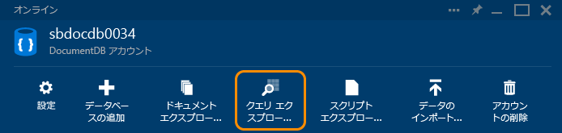
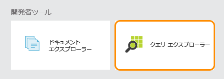
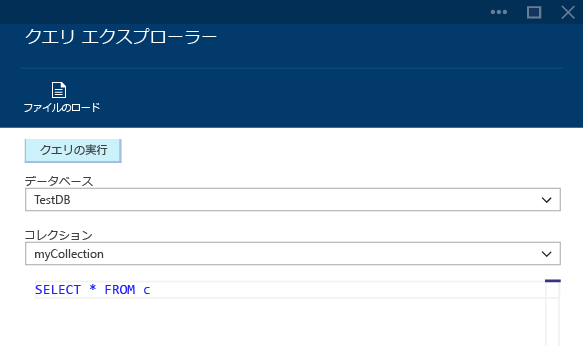
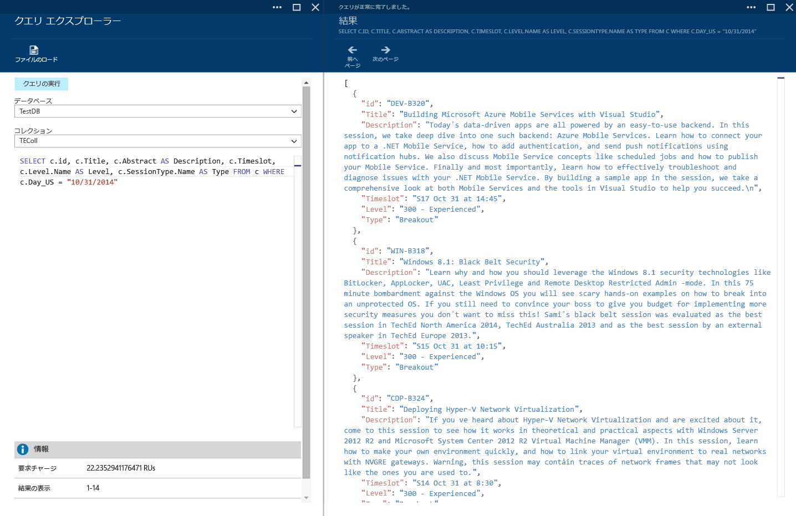
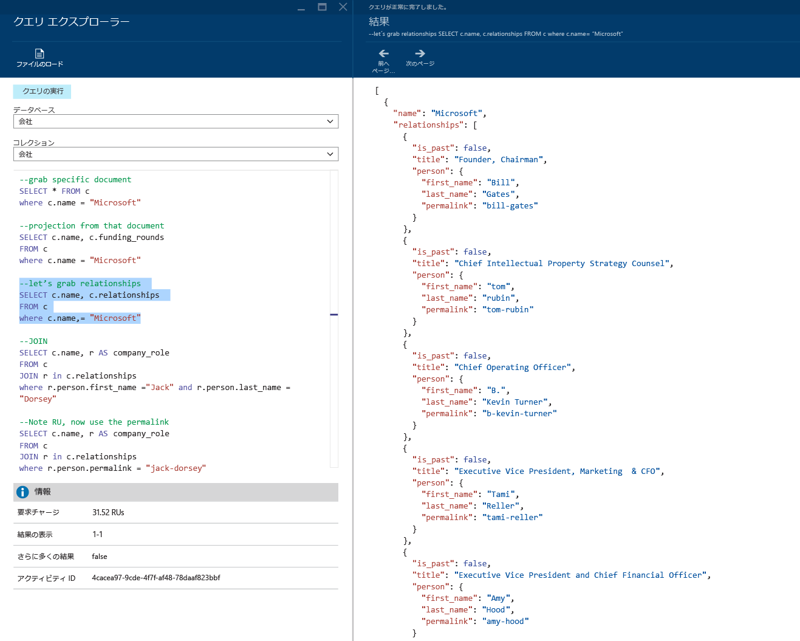
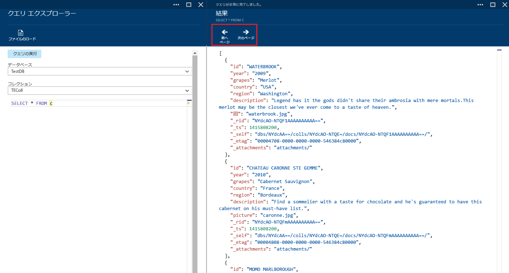
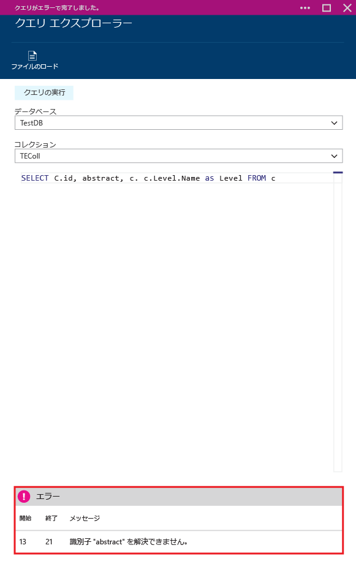

<properties 
	pageTitle="クエリ エクスプローラーを使用した、DocumentDB コレクションに対する SQL クエリの作成、編集、実行 | Microsoft Azure" 
	description="DocumentDB コレクションに対する SQL クエリを作成、編集、実行するための Azure ポータル ツールである DocumentDB クエリ エクスプローラーについて説明します。" 
	services="documentdb" 
	authors="AndrewHoh" 
	manager="jhubbard" 
	editor="monicar" 
	documentationCenter=""/>

<tags 
	ms.service="documentdb" 
	ms.workload="data-services" 
	ms.tgt_pltfrm="na" 
	ms.devlang="na" 
	ms.topic="get-started-article"
	ms.date="12/01/2015" 
	ms.author="anhoh"/>

# クエリ エクスプローラーを使用した、DocumentDB コレクションに対する SQL クエリの作成、編集、実行 #

この記事では、[Microsoft Azure DocumentDB](http://azure.microsoft.com/services/documentdb/) クエリ エクスプローラーの概要について説明します。これは、DocumentDB コレクションに対するクエリを作成、編集、実行できる Microsoft Azure ポータル ツールです。

このチュートリアルを完了すると、次の質問に回答できるようになります。

-	Web ブラウザーを使用して DocumentDB コレクションに対するクエリを簡単に作成、編集、実行するにはどうすればよいか。
-	Web ブラウザーを使用して DocumentDB のクエリ結果ページ間を簡単に移動するにはどうすればよいか。
-	DocumentDB クエリの構文エラーをトラブルシューティングするにはどうすればよいか。 

##クエリ エクスプローラーの起動と移動##

クエリ エクスプローラーは、DocumentDB のアカウント、データベース、コレクションのいずれかのブレードから起動することができます。
  
1. DocumentDB アカウントまたはデータベース ブレードの上部で、**クエリ エクスプローラー** コマンドをクリックします。

	

2. または、各ブレードの下部には **[開発者ツール]** レンズがあり、その中に **[クエリ エクスプローラー]** タイルがあります。
	
	

2. このタイルをクリックすると、クエリ エクスプローラーが起動します。

	**[データベース]** と **[コレクション]** の各ドロップダウン リスト ボックスには、クエリ エクスプローラーを起動したコンテキストに応じて値が設定されています。たとえば、データベース ブレードから起動した場合には、現在のデータベースが設定されます。コレクション ブレードから起動した場合には、現在のコレクションが設定されます。

	

##クエリ エクスプローラーを使用したクエリの作成、編集、実行##

クエリ エクスプローラーを使用すると、DocumentDB コレクションに対するクエリを簡単に作成、編集、実行することができ、基本的なキーワードや値を含めて強調表示できるので、クエリの作成エクスペリエンスが向上します。

- 最初にクエリ エクスプローラーを開くと、既定のクエリ SELECT * FROM 句が表示されます。既定のクエリをそのまま使用するか、独自のクエリを作成して、**[クエリの実行]** ボタンをクリックすると、結果が表示されます。「[DocumentDB のクエリ](documentdb-sql-query.md)」で説明されているように、クエリ エクスプローラーは DocumentDB SQL クエリ言語をサポートしています。

	

- また、複数のクエリを入力し、実行するクエリを強調表示して **[クエリの実行]** ボタンをクリックすると、結果が表示されます。

	

- **[ファイルの読み込み]** コマンドを使用して、既存のファイルの内容を読み込むことができます。

	![クエリ エクスプローラーの [ファイルの読み込み] のスクリーンショット](./media/documentdb-query-collections-query-explorer/loadqueryfile.png)

- 既定では、クエリ エクスプローラーは 100 個ずつ結果を返します。クエリの結果が 100 個を超える場合は、**[次のページ]** と **[前のページ]** のコマンドを使用して結果セット間を移動できます。

	

- クエリが成功すると、ここに示すように、要求の課金などの情報が表示されます。さらに多くの結果がある場合は、先ほど説明したように **[次のページ]** コマンドを使用してアクセスすることができます。

	

- 同様に、クエリがエラーになった場合には、トラブルシューティングに役立つようなエラーの一覧がクエリ エクスプローラーに表示されます。

	

##次のステップ

- DocumentDB の詳細については、[ここ](http://azure.com/docdb)をクリックしてください。
- クエリ エクスプローラーでサポートされている DocumentDB SQL の文法の詳細については、[ここ](documentdb-sql-query.md)をクリックしてください。
 

<!---HONumber=AcomDC_1203_2015-->