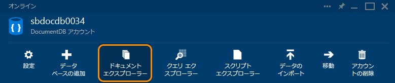
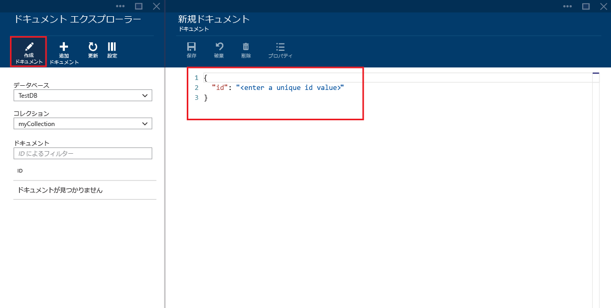
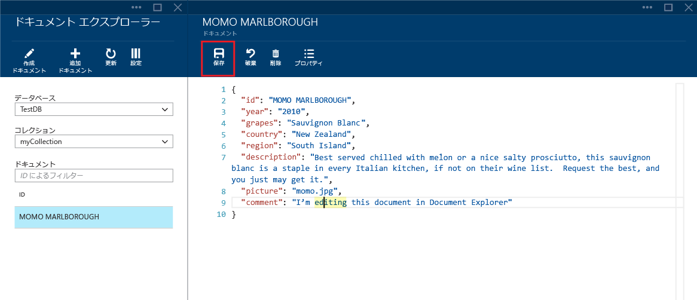
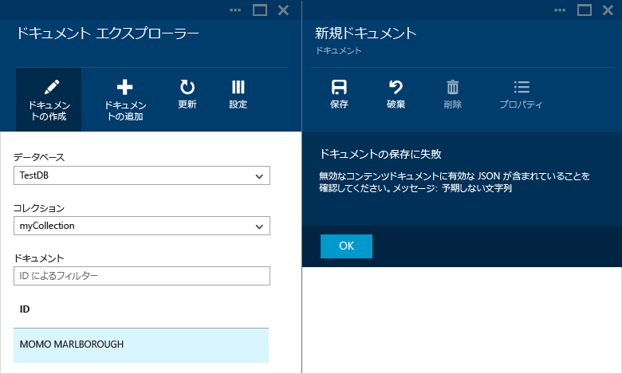
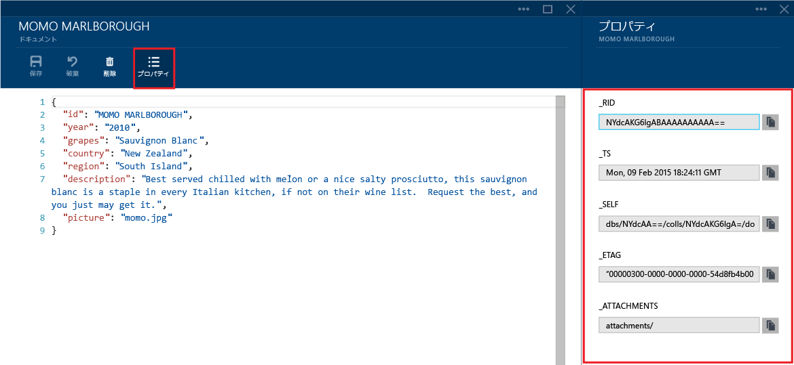
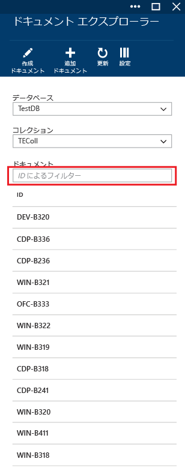
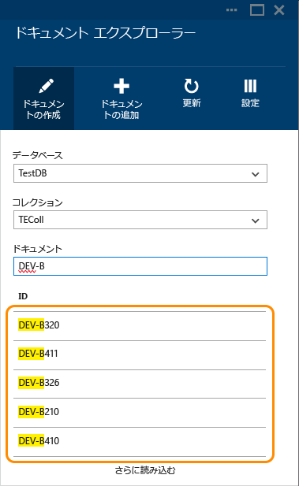

# DocumentDB ドキュメント エクスプローラーを使用して JSON ドキュメントを表示、編集、作成、アップロードする
この記事では、[Microsoft Azure DocumentDB](https://azure.microsoft.com/services/documentdb/) ドキュメント エクスプローラーの概要を説明します。これは、DocumentDB を使用して JSON ドキュメントを表示、編集、作成、アップロード、およびフィルター処理する Azure Portal のツールです。 

> [!NOTE]
> ドキュメント エクスプローラーは、MongoDB のプロトコル対応の DocumentDB アカウントでは有効になっていません。 この機能が有効になった場合は、このページも更新されます。

## Azure Portal でドキュメント エクスプローラーを起動する
1. [Azure Portal](https://portal.azure.com) の左側のナビゲーションで、 **[NoSQL (DocumentDB)]** をクリックします。 

    **[NoSQL (DocumentDB)]** が表示されない場合は、下にある **[その他のサービス]** をクリックしてから、 **[NoSQL (DocumentDB)]** をクリックします。
2. アカウント名を選択します。 
3. リソース メニューの **[ドキュメント エクスプローラー]**をクリックします。 
   
    
   
    **[ドキュメント エクスプローラー]** ブレードの **[データベース]** と **[コレクション]** の各ドロップダウン リストには、ドキュメント エクスプローラーを起動したコンテキストに応じて値が設定されます。 

## JSON ドキュメントを作成する
1. [ドキュメント エクスプローラーを起動](#launch-document-explorer)します。
2. **[ドキュメント エクスプローラー]** ブレードの **[ドキュメントの作成]** をクリックします。 
   
    **[ドキュメント]** ブレードには、最小限の JSON スニペットが入力されています。
   
    
3. **[ドキュメント]** ブレードで、作成する JSON ドキュメントの内容を入力するか貼り付けて、**[保存]** をクリックし、**[ドキュメント エクスプローラー]** ブレードで指定したデータベースおよびコレクションにドキュメントをコミットします。
   
    ![Document Explorer の [保存] コマンドのスクリーンショット](./media/documentdb-view-JSON-document-explorer/savedocument1.png)
   
   > [!NOTE]
   > "ID" プロパティを指定していない場合は、Document Explorer によって自動的に ID プロパティが追加され、ID 値として GUID が生成されます。
   > 
   > 
   
    JSON ファイル、MongoDB、SQL Server、CSV ファイル、Azure Table Storage、Amazon DynamoDB、HBase、またはその他の DocumentDB コレクションのデータが既にある場合は、DocumentDB の [データ移行ツール](documentdb-import-data.md) を使用して、データをすばやくインポートできます。

## JSON ドキュメントを編集する
1. [ドキュメント エクスプローラーを起動](#launch-document-explorer)します。
2. 既存のドキュメントを編集するには、**[ドキュメント エクスプローラー]** ブレードでドキュメントを選択し、**[ドキュメント]** ブレードで編集して、**[保存]** をクリックします。
   
    
   
    ドキュメントの編集中に現在の編集内容を破棄する必要がある場合は、**[ドキュメント]** ブレードの **[破棄]** をクリックして破棄アクションに同意するたけで、前の状態のドキュメントが再度読み込まれます。
   
    ![Document Explorer の [破棄] コマンドのスクリーンショット](./media/documentdb-view-JSON-document-explorer/discardedit.png)

## DocumentDB からドキュメントを削除する
1. [ドキュメント エクスプローラーを起動](#launch-document-explorer)します。
2. **ドキュメント エクスプローラー**でドキュメントを選択し、**[削除]** をクリックして、削除を確定します。 確定後、そのドキュメントはドキュメント エクスプローラーの一覧から即座に削除されます。
   
    ![Document Explorer の [削除] コマンドのスクリーンショット](./media/documentdb-view-JSON-document-explorer/deletedocument.png)

## JSON ドキュメントの操作
ドキュメント エクスプローラーでは、新規または編集されたドキュメントに有効な JSON が含まれているかどうかが検証されます。  エラーがあったセクションをマウスでポイントして、検証エラーの詳細を表示することによって、JSON エラーを確認することもできます。

また、Document Explorer では、無効な JSON コンテンツを含むドキュメントを保存できません。

最後に、Document Explorer で **[プロパティ]** をクリックすると、現在読み込まれているドキュメントのシステム プロパティを表示することができます。

> [!NOTE]
> タイムスタンプ (_ts) プロパティは内部ではエポック時間として表現されますが、Document Explorer では、人間が読むことができる GMT 形式で値が表示されます。
> 
> 

## ドキュメントのフィルター処理
Document Explorer はさまざまなナビゲーション オプションと高度な設定を備えています。

既定では、Document Explorer は選択されたコレクション内の最初の最大 100 個 (作成日が早いもの順) のドキュメントを読み込みます。  Document Explorer ブレードの下部にある **[さらに読み込む]** オプションをクリックすることで、(100 個単位で) 別のドキュメントを読み込むことができます。 **[フィルター]** コマンドを使用して、どのドキュメントを読み込むかを選択できます。

1. [ドキュメント エクスプローラーを起動](#launch-document-explorer)します。
2. **[ドキュメント エクスプローラー]** ブレードの上部にある **[フィルター]** をクリックします。  
   
    
3. コマンド バーの下に、フィルターの設定が表示されます。 フィルターの設定で、WHERE 句や ORDER BY 句を指定し、 **[フィルター]**をクリックします。
   
   
   
   ドキュメント エクスプローラーでは、結果が自動的に更新され、フィルター クエリに一致するドキュメントが表示されます。 DocumentDB の SQL 文法の詳細については、[SQL クエリと SQL 構文](documentdb-sql-query.md)に関するページを参照するか、[SQL クエリのチート シート](documentdb-sql-query-cheat-sheet.md)を印刷してください。
   
   **[データベース]** ボックスと **[コレクション]** ボックスを使用すると、Document Explorer を閉じて再度起動することなく、現在表示されているドキュメントが含まれるコレクションを簡単に変更できます。  
   
   Document Explorer では、現在読み込まれているドキュメントのセットを ID プロパティでフィルター処理することもできます。  [ドキュメント] ボックスに ID を入力するだけです。
   
   
   
   ドキュメント エクスプローラーの一覧の結果は、指定された条件に基づいてフィルター処理されます。
   
   
   
   > [!IMPORTANT]
   > Document Explorer のフィルター機能では、***現在***読み込まれているドキュメントのみがフィルター処理されます。現在選択されているコレクションに対してクエリが実行されることはありません。
   > 
   > 
4. ドキュメント エクスプローラーに読み込まれたドキュメントの一覧を更新するには、ブレードの上部にある **[更新]** をクリックします。
   
    ![Document Explorer の [最新の情報に更新] コマンドのスクリーンショット](./media/documentdb-view-JSON-document-explorer/documentexplorerrefresh.png)

## ドキュメントの一括追加
ドキュメント エクスプローラーでは、1 つ以上の既存の JSON ドキュメントの一括インジェストをサポートしています。1 回のアップロード操作につき、最大で 100 個の JSON ファイルを処理できます。  

1. [ドキュメント エクスプローラーを起動](#launch-document-explorer)します。
2. アップロード処理を開始するには、 **[ドキュメントのアップロード]**をクリックします。
   
    
   
    **[ドキュメントのアップロード]** ブレードが開きます。 
3. [参照] をクリックしてエクスプローラー ウィンドウを開き、アップロードする JSON ドキュメントを&1; つ以上選択して、 **[開く]**をクリックします。
   
    
   
   > [!NOTE]
   > Document Explorer では、現在、アップロード処理ごとに最大 100 個の JSON ドキュメントをサポートしています。
   > 
   > 
4. 選択したら、**[アップロード]** をクリックします。  ドキュメントが自動的に Document Explorer グリッドに追加されます。操作の進捗状況に合わせてアップロード結果が表示されます。 インポートが失敗すると、ファイルごとに報告されます。
   
    
5. この操作が完了すると、アップロードするドキュメントをさらに最大 100 個選択することができます。

## ポータル外での JSON ドキュメントの操作
Azure ポータルのドキュメント エクスプローラーは、DocumentDB のドキュメントを操作するための&1; つの手段にすぎません。 [REST API](https://msdn.microsoft.com/library/azure/mt489082.aspx) や[クライアント SDK](documentdb-sdk-dotnet.md) を使用してドキュメントを操作することもできます。 コード例については、[.NET SDK のドキュメントの例](documentdb-dotnet-samples.md#document-examples)と [Node.js SDK のドキュメントの例](documentdb-nodejs-samples.md#document-examples)を参照してください。

他のソース (JSON ファイル、MongoDB、SQL Server、CSV ファイル、Azure Table Storage、Amazon DynamoDB、HBase) からファイルをインポートまたは移行する必要がある場合は、DocumentDB の [データ移行ツール](documentdb-import-data.md) を使用すると、データを DocumentDB にすばやくインポートできます。

## トラブルシューティング
**症状**: Document Explorer から "**ドキュメントが見つかりません**" というメッセージが返されます。

**ソリューション**: ドキュメントが挿入された適切なサブスクリプション、データベース、およびコレクションが選択されていることを確認します。 また、スループット クォータ内で操作していることを確認します。 最大のスループット レベルで運用していて調整が行われている場合は、コレクションのスループットの最大クォータの範囲で動作するように、アプリケーションの使用量を削減します。

**説明**: ポータルは、他のアプリケーションと同様に、DocumentDB データベースおよびコレクションの呼び出しを行います。 別のアプリケーションから行われる呼び出しのために要求が調整中の場合は、ポータルも調整され、リソースがポータルに表示されなくなる可能性があります。 問題を解決するには、スループットの使用量が高くなる原因に対処して、ポータルのブレードを最新の状態に更新します。 スループットの使用量の測定方法と削減方法の詳細については、[パフォーマンスに関するヒント](documentdb-performance-tips.md)の記事の「[スループット](documentdb-performance-tips.md#throughput)」のセクションを参照してください。

## 次のステップ
ドキュメント エクスプローラーでサポートされている DocumentDB SQL 文法の詳細については、[SQL クエリと SQL 構文](documentdb-sql-query.md)に関する記事を参照するか、[SQL クエリのチート シート](documentdb-sql-query-cheat-sheet.md)を印刷してください。

