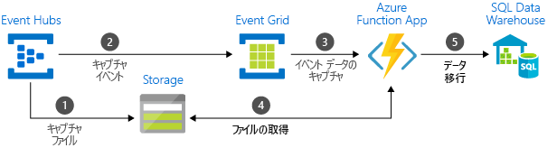

# Azure メッセージング サービスの中から選択する - Azure Event Grid、Event Hubs、および Service Bus

Azure には、ソリューション全体にわたるイベント メッセージの配信を支援する 3 つのサービスがあります。 これらのサービスを次に示します。

* [Event Grid](/azure/event-grid/)
* [Event Hubs](/azure/event-hubs/)
* [Service Bus](/azure/service-bus-messaging/)

いくつかの類似点もありますが、各サービスはそれぞれ、特定のシナリオ向けに設計されています。 この記事では、これらのサービスの相違点について説明し、アプリケーションでどのサービスを選択すればよいかを把握しやすくします。 多くの場合、メッセージング サービスは補完的で、組み合わせて使用することができます。

## イベント サービスとメッセージ サービス

イベント配信サービスとメッセージ配信サービスの間には、注意が必要な重要な相違点があります。

### Event

イベントは、状態または状態変更の軽量の通知です。 イベントの発行元は、イベントの処理方法に関して何も予測していません。 通知の処理方法はイベントの処理者が決定します。 イベントは、個別の単位またはシリーズの一部になることができます。

個別のイベントは、状態の変更を報告し、対応可能です。 処理者が次の手順を実行するために必要なのは、何かが起こったことを知ることだけです。 イベント データには、発生した事象に関する情報は含まれますが、イベントをトリガーしたデータは含まれていません。 たとえば、あるイベントは、ファイルが作成されたことを処理者に通知します。 このイベントにファイルに関する一般情報が含まれることはありますが、ファイル自体は含まれません。 個別のイベントは、スケーリングする必要がある[サーバーレス](http://azure.com/serverless) ソリューションに最適です。

一連のイベントは、状態を報告し、分析可能です。 イベントは、時間順に並べられ、相互に関連付けられています。 処理者は、一連のイベントを分析して、何が起こったかを知る必要があります。

### Message

メッセージは、サービスによって生成される生データで、別の場所で使用または格納されます。 メッセージには、メッセージ パイプラインをトリガーしたデータが含まれています。 メッセージの発行元は、処理者によるメッセージの処理方法を予測しています。 両者の間には協定が存在します。 たとえば、発行元は、メッセージを生データで送信し、処理者がそのデータからファイルを作成し、作業が終わったときに応答を送信すると予測しています。

## サービスの比較

| Service | 目的 | type | いつ使用するか |
| ------- | ------- | ---- | ----------- |
| Event Grid | リアクティブ プログラミング | イベントの配信 (個別) | 状態の変更に反応する |
| Event Hubs | ビッグ データのパイプライン | イベントのストリーミング (シリーズ) | テレメトリと分散データ ストリーミング |
| Service Bus | 高価値のエンタープライズ メッセージング | Message | 注文処理や金融取引 |

### Event Grid

Event Grid は、イベント駆動のリアクティブ プログラミングを可能にするイベント バックプレーンです。 発行-サブスクライブ モデルを使用します。 発行元はイベントを発行しますが、どのイベントが処理されるかは想定していません。 サブスクライバーが、どのイベントを処理するかを決定します。

Event Grid は Azure サービスと緊密に統合されており、サード パーティのサービスと統合することもできます。 イベントの使用が簡略化され、定期的にポーリングする必要がなくなるためコストも削減できます。 Event Grid は、Azure および Azure 以外のリソースからのイベントを効率的かつ確実にルーティングします。 イベントは、登録されたサブスクライバーのエンドポイントに配信されます。 イベント メッセージには、サービスやアプリケーションの変更に対応するために必要な情報が含まれています。 Event Grid は、データ パイプラインではないため、更新された実際のオブジェクトは配信しません。

Event Grid は、エンドポイントに配信されないイベントの配信不能処理をサポートしています。

次の特性があります。

* 動的にスケーラブル
* 低コスト
* サーバーレス
* 1 回以上の配信

### Event Hubs

Azure Event Hubs は、ビッグ データのパイプラインです。 テレメトリおよびイベント ストリーム データのキャプチャ、保持、再生を容易にします。 データは多数のソースから同時に取得できます。 Event Hubs を使用すると、テレメトリとイベントのデータをさまざまなストリーム処理インフラストラクチャや分析サービスで使用できるようになります。 データ ストリームとしても、バンドルされているイベント バッチとしても使用できます。 このサービスは 1 つのソリューションで、リアルタイム処理用の高速なデータ取得と、格納された生データの繰り返し再生の両方を可能にします。 ストリーミング データをファイルにキャプチャして、処理と分析で使用できます。

次の特性があります。

* 待ち時間の短縮
* 1 秒あたり数百万のイベントを受信および処理可能
* 1 回以上の配信

### Service Bus

Service Bus は、従来のエンタープライズ アプリケーションを対象としています。 これらのエンタープライズ アプリケーションは、トランザクション、順序付け、重複の検出、瞬間的な整合性を必要とします。 Service Bus を使用すると、クラウドネイティブ アプリケーションでビジネス プロセスに対する信頼性の高い状態遷移管理を実現できます。 損失や重複が許されない高価値のメッセージを処理する場合は、Azure Service Bus を使用してください。 Service Bus は、ハイブリッド クラウド ソリューション全体で安全性の高い通信を容易にします。そして、既存のオンプレミス システムをクラウド ソリューションに接続できます。

Service Bus はブローカー メッセージング システムです。 使用側がメッセージを受信する準備ができるまで、メッセージを "ブローカー" (キューなど) に格納します。

次の特性があります。

* ポーリングが必要な信頼性の高い非同期メッセージ配信 (サービスとしてのエンタープライズ メッセージング)
* 高度なメッセージング機能 (FIFO、バッチ処理/セッション、トランザクション、配信不能処理、一時的制御、ルーティングとフィルタリング、重複検出など)
* 1 回以上の配信
* 順次配信 (オプション)

## サービスを組み合わせて使用する

場合によっては、異なる役割を実行するために複数のサービスを並行して使用します。 たとえば、eコマース サイトでは、注文の処理に Service Bus、サイトのテレメトリのキャプチャに Event Hubs、イベント (アイテムの出荷など) への応答に Event Grid を使用できます。

別のケースでは、これらのサービスをリンクしてイベントとデータのパイプラインを形成することもできます。 Event Grid を使用して、他のサービスのイベントに応答することもできます。 Event Grid と Event Hubs を使用してデータをデータ ウェアハウスに移行する例については、「[ビッグ データをデータ ウェアハウスにストリーミングする](event-grid-event-hubs-integration.md)」を参照してください。 次の図は、データ ストリーミングのワークフローを示しています。

## 次の手順

* Azure のメッセージング サービスの詳細については、ブログ記事「[Events, Data Points, and Messages - Choosing the right Azure messaging service for your data (イベント、データ ポイント、メッセージ - データに適した Azure メッセージング サービスの選択)](https://azure.microsoft.com/blog/events-data-points-and-messages-choosing-the-right-azure-messaging-service-for-your-data/)」を参照してください。
* Event Grid の概要については、[Event Grid の紹介](overview.md)に関する記事を参照してください。
* Event Grid の概要については、[Event Grid を使用したカスタム イベントの作成とルーティング](custom-event-quickstart.md)に関するページを参照してください。
* Event Hubs の概要については、「[Azure Portal を使用して Event Hubs 名前空間とイベント ハブを作成する](../event-hubs/event-hubs-create.md)」を参照してください。
* Service Bus の概要については、「[Azure Portal を使用して Service Bus 名前空間を作成する](../service-bus-messaging/service-bus-create-namespace-portal.md)」を参照してください。
