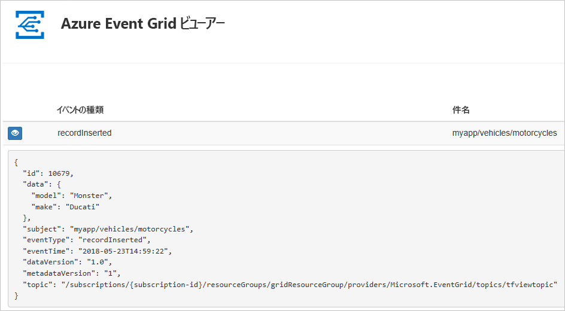
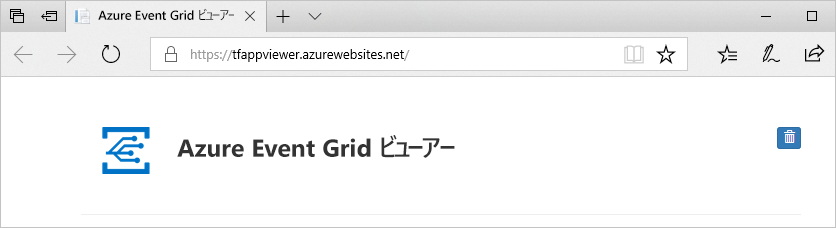
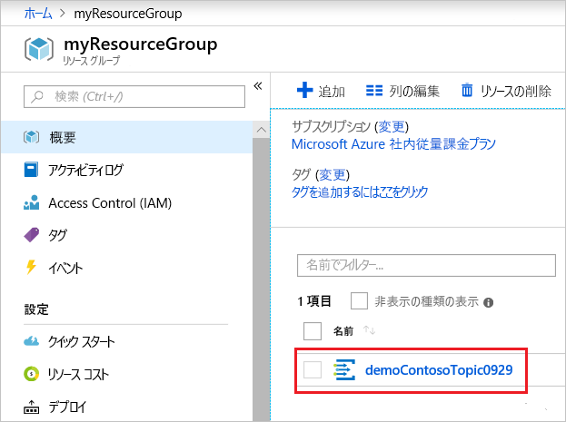
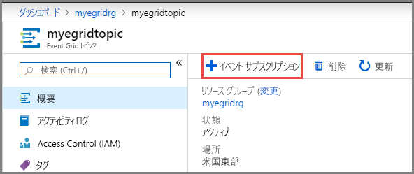
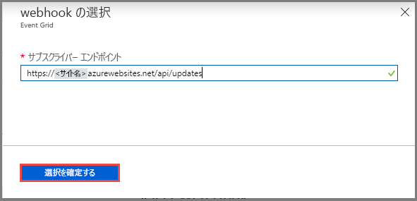

# <a name="quickstart-route-custom-events-to-web-endpoint-with-the-azure-portal-and-event-grid"></a>クイック スタート: Azure portal と Event Grid を使ったカスタム イベントの Web エンドポイントへのルーティング

Azure Event Grid は、クラウドのイベント処理サービスです。 この記事では、Azure portal を使用し、カスタム トピックを作成してそのトピックをサブスクライブし、イベントをトリガーして結果を表示します。 通常は、イベント データを処理し、アクションを実行するエンドポイントにイベントを送信します。 ただし、この記事では、単純化するために、メッセージを収集して表示する Web アプリにイベントを送信します。

最後に、イベント データが Web アプリに送信されたことを確認します。



[!INCLUDE [quickstarts-free-trial-note.md](../../includes/quickstarts-free-trial-note.md)]

[!INCLUDE [event-grid-register-provider-portal.md](../../includes/event-grid-register-provider-portal.md)]

## <a name="create-a-custom-topic"></a>カスタム トピックの作成

Event Grid のトピックは、イベントの送信先となるユーザー定義のエンドポイントになります。 

1. [Azure ポータル](https://portal.azure.com/)にサインインします。

1. カスタム トピックを作成するには、**[リソースの作成]** を選択します。 

   

1. "*Event Grid トピック*" を検索して、使用可能なオプションから選択します。

   

1. **作成**を選択します。

   

1. カスタム トピックの一意の名前を指定します。 トピック名は、DNS エントリによって表されるため、一意である必要があります。 画像に示されている名前は使用しないでください。 代わりに、必ず 3 - 50 文字以内で、a - z、A - Z、0 - 9、および "-" のみを含む独自の名前を作成します。 リソース グループの名前を指定します。 **作成**を選択します。

   

1. カスタム トピックが作成されると、成功の通知が表示されます。

   

   デプロイに成功しなかった場合は、エラーの原因を特定します。 **[デプロイできませんでした]** を選択します。

   ![[デプロイできませんでした] を選択](./media/custom-event-quickstart-portal/select-failed.png)

   エラー メッセージを選択します。

   ![[デプロイできませんでした] を選択](./media/custom-event-quickstart-portal/failed-details.png)

   次の画像は、カスタム トピックの名前が既に使用されているために失敗したデプロイを示しています。 このエラーが表示された場合は、別の名前でデプロイを再試行してください。

   

## <a name="create-a-message-endpoint"></a>メッセージ エンドポイントの作成

カスタム トピックをサブスクライブする前に、イベント メッセージ用のエンドポイントを作成しましょう。 通常、エンドポイントは、イベント データに基づくアクションを実行します。 このクイック スタートを簡素化するために、イベント メッセージを表示する[構築済みの Web アプリ](https://github.com/Azure-Samples/azure-event-grid-viewer)をデプロしします。 デプロイされたソリューションには、App Service プラン、App Service Web アプリ、および GitHub からのソース コードが含まれています。

1. **[Deploy to Azure]\(Azure にデプロイ\)** を選択して、ソリューションをサブスクリプションにデプロイします。 Azure portal で、パラメーターの値を指定します。

   <a href="https://portal.azure.com/#create/Microsoft.Template/uri/https%3A%2F%2Fraw.githubusercontent.com%2FAzure-Samples%2Fazure-event-grid-viewer%2Fmaster%2Fazuredeploy.json" target="_blank"></a>

1. デプロイが完了するまでに数分かかる場合があります。 デプロイが成功した後で、Web アプリを表示して、実行されていることを確認します。 Web ブラウザーで `https://<your-site-name>.azurewebsites.net` にアクセスします

1. サイトは表示されますが、イベントはまだ送信されていません。

   

## <a name="subscribe-to-custom-topic"></a>カスタム トピックのサブスクライブ

どのイベントを追跡し、どこにイベントを送信するかは、イベント グリッド トピックをサブスクライブすることによって Event Grid に伝えます。

1. ポータルでカスタム トピックを選択します。

   

1. **[+ イベント サブスクリプション]** を選択します。

   

1. エンドポイントの種類には **Web hook** を選択します。 イベント サブスクリプションの名前を指定します。

   

1. **[エンドポイントの選択]** を選択します。 

1. Web hook エンドポイントに対して、Web アプリの URL を入力し、ホーム ページの URL に `api/updates` を追加します。 **[選択の確認]** を選択します。

   

1. イベント サブスクリプションの値を指定したら、**[作成]** を選択します。

Web アプリをもう一度表示し、その Web アプリにサブスクリプションの検証イベントが送信されたことに注目します。 目のアイコンを選択してイベント データを展開します。 Event Grid は検証イベントを送信するので、エンドポイントはイベント データを受信することを確認できます。 Web アプリには、サブスクリプションを検証するコードが含まれています。


## <a name="send-an-event-to-your-topic"></a>トピックへのイベントの送信

では、イベントをトリガーして、Event Grid がメッセージをエンドポイントに配信するようすを見てみましょう。 Azure CLI または PowerShell を使用して、テスト イベントをカスタム トピックに送信します。 通常はイベント データをアプリケーションまたは Azure サービスから送信することになります。

最初の例では、Azure CLI を使用しています。 この例では、カスタム トピックの URL とキー、およびサンプル イベント データを取得します。 `<topic_name>` には、実際のカスタム トピック名を使用してください。 これによりサンプルのイベント データが作成されます。 JSON の `data` 要素がイベントのペイロードです。 このフィールドには、適切な形式の JSON であればどのようなものでも格納することができます。 また、高度なルーティングやフィルタリングを行う場合には、subject フィールドを使用することもできます。 CURL は、HTTP 要求を送信するユーティリティです。

```azurecli-interactive
endpoint=$(az eventgrid topic show --name <topic_name> -g myResourceGroup --query "endpoint" --output tsv)
key=$(az eventgrid topic key list --name <topic_name> -g myResourceGroup --query "key1" --output tsv)

event='[ {"id": "'"$RANDOM"'", "eventType": "recordInserted", "subject": "myapp/vehicles/motorcycles", "eventTime": "'`date +%Y-%m-%dT%H:%M:%S%z`'", "data":{ "make": "Ducati", "model": "Monster"},"dataVersion": "1.0"} ]'

curl -X POST -H "aeg-sas-key: $key" -d "$event" $endpoint
```

2 番目の例では、PowerShell を使用して、同様の手順を実行します。

```azurepowershell-interactive
$endpoint = (Get-AzureRmEventGridTopic -ResourceGroupName gridResourceGroup -Name <topic-name>).Endpoint
$keys = Get-AzureRmEventGridTopicKey -ResourceGroupName gridResourceGroup -Name <topic-name>

$eventID = Get-Random 99999

#Date format should be SortableDateTimePattern (ISO 8601)
$eventDate = Get-Date -Format s

#Construct body using Hashtable
$htbody = @{
    id= $eventID
    eventType="recordInserted"
    subject="myapp/vehicles/motorcycles"
    eventTime= $eventDate   
    data= @{
        make="Ducati"
        model="Monster"
    }
    dataVersion="1.0"
}

#Use ConvertTo-Json to convert event body from Hashtable to JSON Object
#Append square brackets to the converted JSON payload since they are expected in the event's JSON payload syntax
$body = "["+(ConvertTo-Json $htbody)+"]"

Invoke-WebRequest -Uri $endpoint -Method POST -Body $body -Headers @{"aeg-sas-key" = $keys.Key1}
```

以上でイベントがトリガーされ、そのメッセージが、Event Grid によってサブスクライブ時に構成したエンドポイントに送信されました。 Web アプリを表示して、送信したイベント確認します。

```json
[{
  "id": "1807",
  "eventType": "recordInserted",
  "subject": "myapp/vehicles/motorcycles",
  "eventTime": "2017-08-10T21:03:07+00:00",
  "data": {
    "make": "Ducati",
    "model": "Monster"
  },
  "dataVersion": "1.0",
  "metadataVersion": "1",
  "topic": "/subscriptions/{subscription-id}/resourceGroups/{resource-group}/providers/Microsoft.EventGrid/topics/{topic}"
}]
```


## <a name="clean-up-resources"></a>リソースのクリーンアップ

引き続きこのイベントを使用する場合は、この記事で作成したリソースをクリーンアップしないでください。 それ以外の場合は、この記事で作成したリソースを削除してください。

リソース グループを選択し、**[リソース グループの削除]** を選択します。

## <a name="next-steps"></a>次の手順

カスタム トピックを作成し、イベントをサブスクライブする方法がわかったら、Event Grid でできることについて、さらに情報を収集しましょう。

- [Event Grid について](overview.md)
- [Blob Storage のイベントをカスタム Web エンドポイントにルーティングする](../storage/blobs/storage-blob-event-quickstart.md?toc=%2fazure%2fevent-grid%2ftoc.json)
- [Azure Event Grid と Logic Apps で仮想マシンの変更を監視する](monitor-virtual-machine-changes-event-grid-logic-app.md)
- [ビッグ データをデータ ウェアハウスにストリーミングする](event-grid-event-hubs-integration.md)
