# <a name="create-and-route-custom-events-with-the-azure-portal-and-event-grid"></a>Azure Portal と Event Grid を使ったカスタム イベントの作成とルーティング

Azure Event Grid は、クラウドのイベント処理サービスです。 この記事では、Azure Portal を使用して、カスタム トピックを作成してそのトピックをサブスクライブし、イベントをトリガーして結果を表示します。 イベントは、イベント データを記録する Azure Functions に対して送信します。 最後に、イベント データがエンドポイントに送信され、記録されたことを確認します。

[!INCLUDE [quickstarts-free-trial-note.md](../../includes/quickstarts-free-trial-note.md)]

[!INCLUDE [event-grid-register-provider-portal.md](../../includes/event-grid-register-provider-portal.md)]

## <a name="create-a-custom-topic"></a>カスタム トピックの作成

Event Grid のトピックは、イベントの送信先となるユーザー定義のエンドポイントになります。 

1. [Azure Portal](https://portal.azure.com/) にログインします。

1. カスタム トピックを作成するには、**[リソースの作成]** を選択します。 

   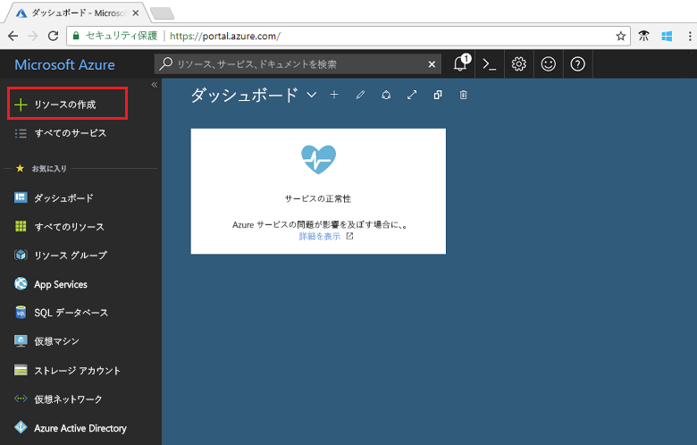

1. "*Event Grid トピック*" を検索して、使用可能なオプションから選択します。

   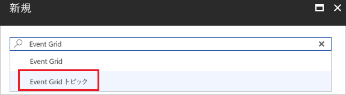

1. **作成**を選択します。

   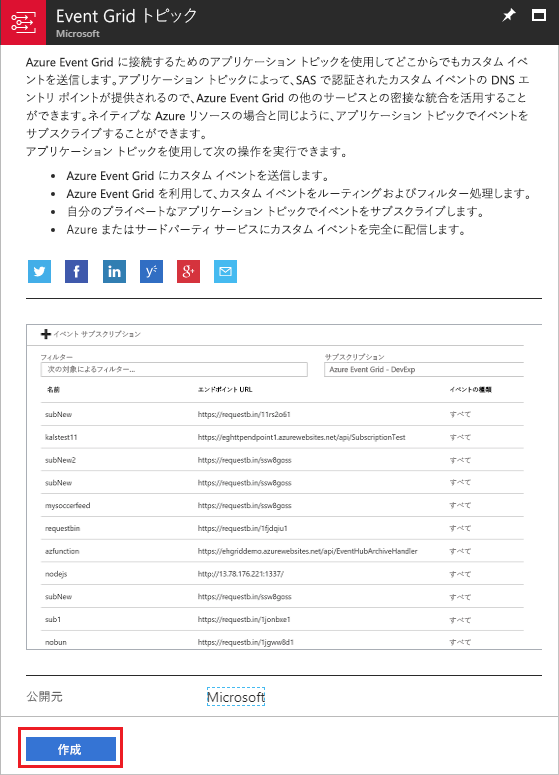

1. カスタム トピックの一意の名前を指定します。 トピック名は、DNS エントリによって表されるため、一意である必要があります。 画像に示されている名前は使用しないでください。 独自の名前を作成してください。 リソース グループの名前を指定します。 **作成**を選択します。

   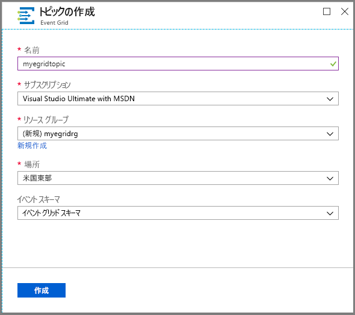

1. カスタム トピックが作成されると、成功の通知が表示されます。

   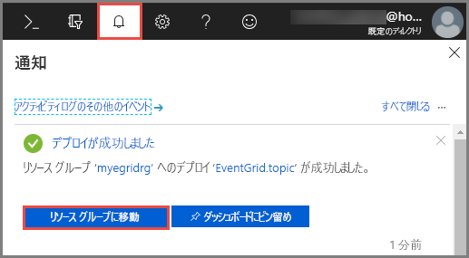

   デプロイに成功しなかった場合は、エラーの原因を特定します。 **[デプロイできませんでした]** を選択します。

   ![[デプロイできませんでした] を選択](./media/custom-event-quickstart-portal/select-failed.png)

   エラー メッセージを選択します。

   ![[デプロイできませんでした] を選択](./media/custom-event-quickstart-portal/failed-details.png)

   次の画像は、カスタム トピックの名前が既に使用されているために失敗したデプロイを示しています。 このエラーが表示された場合は、別の名前でデプロイを再試行してください。

   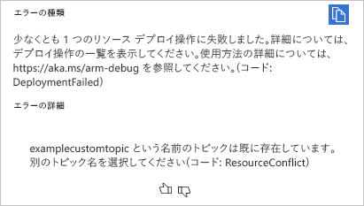

## <a name="create-an-azure-function"></a>Azure 関数の作成

トピックをサブスクライブする前に、イベント メッセージ用のエンドポイントを作成しましょう。 この記事では、Azure Functions を使用してエンドポイントの関数アプリを作成します。

1. 関数を作成するには、**[リソースの作成]** を選択します。

   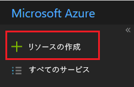

1. **[Compute]** と **[Function App]** を選択します。

   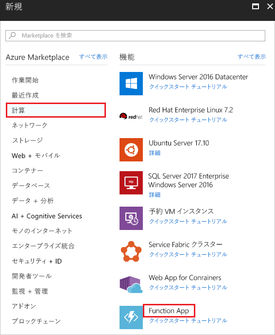

1. Azure Functions の一意の名前を指定します。 画像に示されている名前は使用しないでください。 この記事で作成したリソース グループを選択します ホスティング プランには、**[従量課金プラン]** を使用します。 提示された新しいストレージ アカウントを使用してください。 ユーザーは Application Insights を無効にできます。 連の値を指定したら、**[作成]** をクリックします

   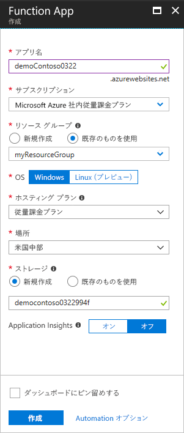

1. デプロイが完了したら、**[リソースに移動]** を選択します。

   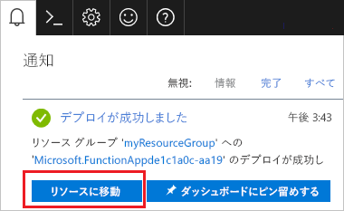

1. **[関数]** の横の **+** を選択します。

   

1. 表示されたオプションから、**[カスタム関数]** を選択します。

   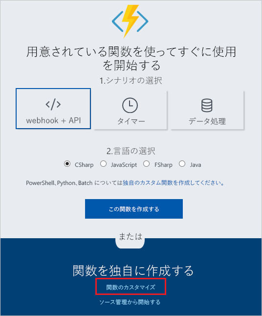

1. **[イベント グリッド トリガー]** が表示されるまで下へスクロールします。 **[C#]** を選択します。

   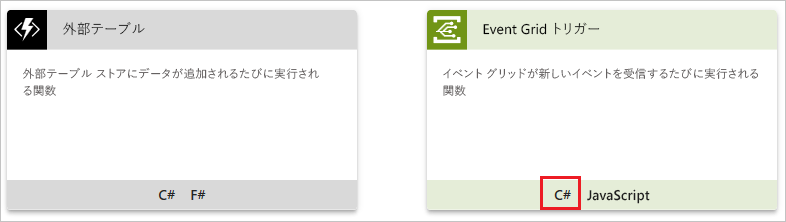

1. 既定値のままにして **[作成]** を選択します。

   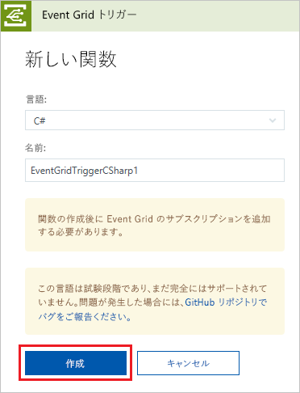

関数でイベントを受信する準備が整いました。

## <a name="subscribe-to-a-topic"></a>トピックのサブスクライブ

どのイベントを追跡し、どこにイベントを送信するかは、トピックを購読することによって Event Grid に伝えます。

1. 対象の Azure 関数で、**[Event Grid サブスクリプションの追加]** を選択します。

   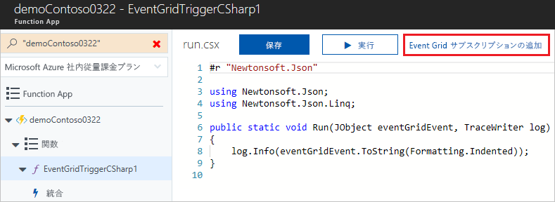

1. サブスクリプションの値を指定します。 トピックの種類には、**[Event Grid トピック]** を選択します。 サブスクリプションとリソース グループには、カスタム トピックを作成したサブスクリプションとリソース グループを選択してください。 たとえば、カスタム トピックの名前を選択します。 サブスクライバー エンドポイントには、関数の URL が事前設定されています。

   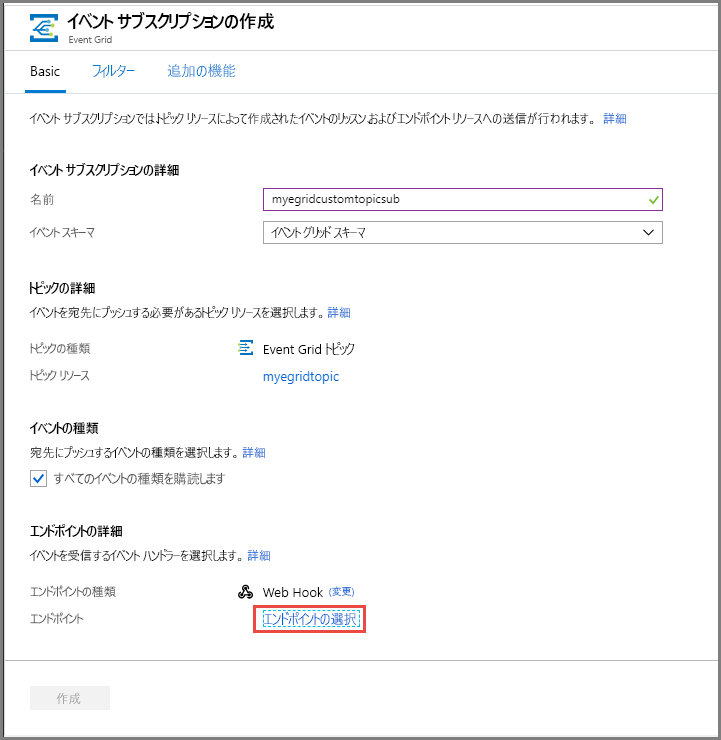

1. イベント データが送信されたときに確認できるよう、イベントをトリガーする前に関数のログを開いておきます。 該当する Azure関数の一番下にある **[ログ]** を選択します。

   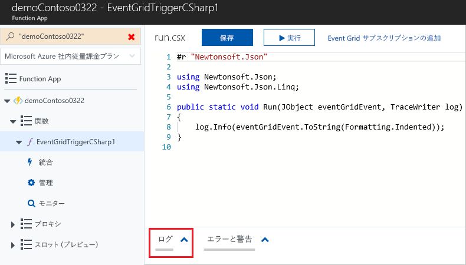

では、イベントをトリガーして、Event Grid がメッセージをエンドポイントに配信するようすを見てみましょう。 この記事では、単純化するために、Cloud Shell を使用してサンプルのイベント データをカスタム トピックに送信します。 通常はイベント データをアプリケーションまたは Azure サービスから送信することになります。

[!INCLUDE [cloud-shell-try-it.md](../../includes/cloud-shell-try-it.md)]

## <a name="send-an-event-to-your-topic"></a>トピックへのイベントの送信

Azure CLI または PowerShell を使用して、テスト イベントをカスタム トピックに送信します。

最初の例では、Azure CLI を使用しています。 この例では、トピックの URL とキー、およびサンプル イベント データを取得します。 `<topic_name>` には、実際のトピック名を使用します。 イベント全体を確認するには、`echo "$body"` を使用します。 JSON の `data` 要素がイベントのペイロードです。 このフィールドには、適切な形式の JSON であればどのようなものでも格納することができます。 また、高度なルーティングやフィルタリングを行う場合には、subject フィールドを使用することもできます。 CURL は、HTTP 要求を送信するユーティリティです。

```azurecli-interactive
endpoint=$(az eventgrid topic show --name <topic_name> -g myResourceGroup --query "endpoint" --output tsv)
key=$(az eventgrid topic key list --name <topic_name> -g myResourceGroup --query "key1" --output tsv)

body=$(eval echo "'$(curl https://raw.githubusercontent.com/Azure/azure-docs-json-samples/master/event-grid/customevent.json)'")

curl -X POST -H "aeg-sas-key: $key" -d "$body" $endpoint
```

2 番目の例では、PowerShell を使用して、同様の手順を実行します。

```azurepowershell-interactive
$endpoint = (Get-AzureRmEventGridTopic -ResourceGroupName gridResourceGroup -Name <topic-name>).Endpoint
$keys = Get-AzureRmEventGridTopicKey -ResourceGroupName gridResourceGroup -Name <topic-name>

$eventID = Get-Random 99999

#Date format should be SortableDateTimePattern (ISO 8601)
$eventDate = Get-Date -Format s

#Construct body using Hashtable
$htbody = @{
    id= $eventID
    eventType="recordInserted"
    subject="myapp/vehicles/motorcycles"
    eventTime= $eventDate   
    data= @{
        make="Ducati"
        model="Monster"
    }
    dataVersion="1.0"
}

#Use ConvertTo-Json to convert event body from Hashtable to JSON Object
#Append square brackets to the converted JSON payload since they are expected in the event's JSON payload syntax
$body = "["+(ConvertTo-Json $htbody)+"]"

Invoke-WebRequest -Uri $endpoint -Method POST -Body $body -Headers @{"aeg-sas-key" = $keys.Key1}
```

以上でイベントがトリガーされ、そのメッセージが、Event Grid によってサブスクライブ時に構成したエンドポイントに送信されました。 ログを見てイベント データを確認してください。

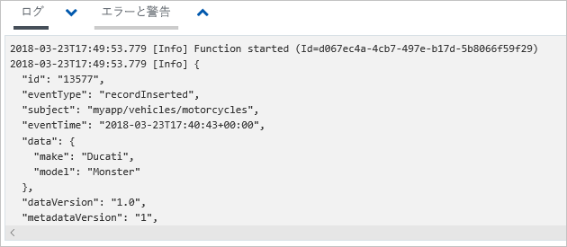

## <a name="clean-up-resources"></a>リソースのクリーンアップ

引き続きこのイベントを使用する場合は、この記事で作成したリソースをクリーンアップしないでください。 それ以外の場合は、この記事で作成したリソースを削除してください。

リソース グループを選択し、**[リソース グループの削除]** を選択します。

## <a name="next-steps"></a>次の手順

カスタム トピックを作成し、イベントをサブスクライブする方法がわかったら、Event Grid でできることについて、さらに情報を収集しましょう。

- [Event Grid について](overview.md)
- [Blob Storage のイベントをカスタム Web エンドポイントにルーティングする](../storage/blobs/storage-blob-event-quickstart.md?toc=%2fazure%2fevent-grid%2ftoc.json)
- [Azure Event Grid と Logic Apps で仮想マシンの変更を監視する](monitor-virtual-machine-changes-event-grid-logic-app.md)
- [ビッグ データをデータ ウェアハウスにストリーミングする](event-grid-event-hubs-integration.md)
