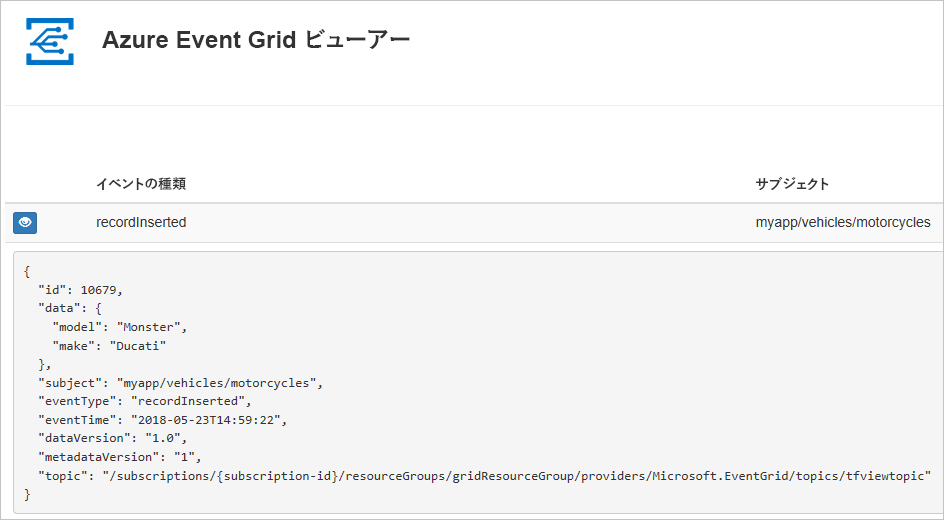
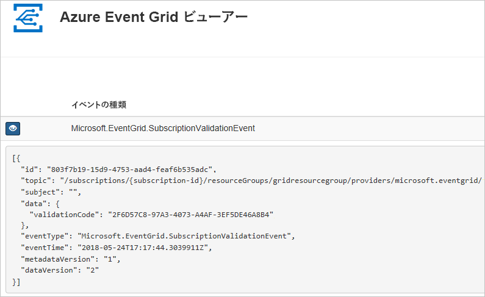

# <a name="create-and-route-custom-events-with-azure-powershell-and-event-grid"></a>Azure PowerShell と Event Grid を使用したカスタム イベントの作成とルーティング

Azure Event Grid は、クラウドのイベント処理サービスです。 この記事では、Azure PowerShell を使用してカスタム トピックを作成してそのトピックをサブスクライブし、イベントをトリガーして結果を表示します。 通常は、イベント データを処理し、アクションを実行するエンドポイントにイベントを送信します。 ただし、この記事では、単純化するために、メッセージを収集して表示する Web アプリにイベントを送信します。

最後に、イベント データが Web アプリに送信されたことを確認します。



[!INCLUDE [quickstarts-free-trial-note.md](../../includes/quickstarts-free-trial-note.md)]

この記事では、Azure PowerShell の最新バージョンを実行していることを前提にしています。 インストールまたはアップグレードする必要がある場合は、[Azure PowerShell モジュールのインストールと構成](/powershell/azure/install-azurerm-ps)に関するページを参照してください。

## <a name="create-a-resource-group"></a>リソース グループの作成

Event Grid のトピックは Azure リソースであり、Azure リソース グループに配置する必要があります。 リソース グループは、Azure リソースをまとめてデプロイして管理するための論理上のコレクションです。

[New-AzureRmResourceGroup](/powershell/module/azurerm.resources/new-azurermresourcegroup) コマンドでリソース グループを作成します。

次の例では、*gridResourceGroup* という名前のリソース グループを *westus2* の場所に作成します。

```powershell-interactive
New-AzureRmResourceGroup -Name gridResourceGroup -Location westus2
```

[!INCLUDE [event-grid-register-provider-powershell.md](../../includes/event-grid-register-provider-powershell.md)]

## <a name="create-a-custom-topic"></a>カスタム トピックの作成

Event Grid のトピックは、イベントの送信先となるユーザー定義のエンドポイントになります。 次の例では、リソース グループにカスタム トピックを作成します。 `<your-topic-name>` は、トピックの一意の名前に置き換えてください。 トピック名は、DNS エントリの一部であるため、一意である必要があります。

```powershell-interactive
$topicname="<your-topic-name>"

New-AzureRmEventGridTopic -ResourceGroupName gridResourceGroup -Location westus2 -Name $topicname
```

## <a name="create-a-message-endpoint"></a>メッセージ エンドポイントの作成

トピックをサブスクライブする前に、イベント メッセージ用のエンドポイントを作成しましょう。 通常、エンドポイントは、イベント データに基づくアクションを実行します。 このクイック スタートを簡素化するために、イベント メッセージを表示する[構築済みの Web アプリ](https://github.com/dbarkol/azure-event-grid-viewer)をデプロしします。 デプロイされたソリューションには、App Service プラン、App Service Web アプリ、および GitHub からのソース コードが含まれています。

`<your-site-name>` は、Web アプリの一意の名前に置き換えてください。 Web アプリ名は、DNS エントリの一部であるため、一意である必要があります。

```powershell-interactive
$sitename="<your-site-name>"

New-AzureRmResourceGroupDeployment `
  -ResourceGroupName gridResourceGroup `
  -TemplateUri "https://raw.githubusercontent.com/dbarkol/azure-event-grid-viewer/master/azuredeploy.json" `
  -siteName $sitename `
  -hostingPlanName viewerhost
```

デプロイが完了するまでに数分かかる場合があります。 デプロイが成功した後で、Web アプリを表示して、実行されていることを確認します。 Web ブラウザーで `https://<your-site-name>.azurewebsites.net` にアクセスします

現在表示されているメッセージがないサイトが表示されます。

## <a name="subscribe-to-a-topic"></a>トピックのサブスクライブ

どのイベントを追跡し、どこにイベントを送信するかは、トピックをサブスクライブすることによって Event Grid に伝えます。 次の例では、作成したトピックをサブスクライブし、Web アプリからの URL をイベント通知のエンドポイントとして渡しています。

Web アプリのエンドポイントには、サフィックス `/api/updates/` が含まれている必要があります。

```powershell-interactive
$endpoint="https://$sitename.azurewebsites.net/api/updates"

New-AzureRmEventGridSubscription `
  -EventSubscriptionName demoViewerSub `
  -Endpoint $endpoint `
  -ResourceGroupName gridResourceGroup `
  -TopicName $topicname
```

Web アプリをもう一度表示し、その Web アプリにサブスクリプションの検証イベントが送信されたことに注目します。 目のアイコンを選択してイベント データを展開します。 Event Grid は検証イベントを送信するので、エンドポイントはイベント データを受信することを確認できます。 Web アプリには、サブスクリプションを検証するコードが含まれています。



## <a name="send-an-event-to-your-topic"></a>トピックへのイベントの送信

イベントをトリガーして、Event Grid がメッセージをエンドポイントに配信するようすを見てみましょう。 まず、トピックの URL とキーを取得します。

```powershell-interactive
$endpoint = (Get-AzureRmEventGridTopic -ResourceGroupName gridResourceGroup -Name $topicname).Endpoint
$keys = Get-AzureRmEventGridTopicKey -ResourceGroupName gridResourceGroup -Name $topicname
```

この記事では、単純化するために、カスタム トピックに送信するサンプル イベント データを設定します。 通常はイベント データをアプリケーションまたは Azure サービスから送信することになります。 次の例では、Hashtable を使用してイベントのデータ `htbody` を構築し、それを整形式の JSON ペイロード オブジェクト `$body` に変換しています。

```powershell-interactive
$eventID = Get-Random 99999

#Date format should be SortableDateTimePattern (ISO 8601)
$eventDate = Get-Date -Format s

#Construct body using Hashtable
$htbody = @{
    id= $eventID
    eventType="recordInserted"
    subject="myapp/vehicles/motorcycles"
    eventTime= $eventDate   
    data= @{
        make="Ducati"
        model="Monster"
    }
    dataVersion="1.0"
}

#Use ConvertTo-Json to convert event body from Hashtable to JSON Object
#Append square brackets to the converted JSON payload since they are expected in the event's JSON payload syntax
$body = "["+(ConvertTo-Json $htbody)+"]"
```

`$body` を見ると、イベント全体を理解できます。 JSON の `data` 要素がイベントのペイロードです。 このフィールドには、適切な形式の JSON であればどのようなものでも格納することができます。 また、高度なルーティングやフィルタリングを行う場合には、subject フィールドを使用することもできます。

次に、イベントをトピックに送信します。

```powershell-interactive
Invoke-WebRequest -Uri $endpoint -Method POST -Body $body -Headers @{"aeg-sas-key" = $keys.Key1}
```

以上でイベントがトリガーされ、そのメッセージが、Event Grid によってサブスクライブ時に構成したエンドポイントに送信されました。 Web アプリを表示して、送信したイベント確認します。

```json
[{
  "id": "1807",
  "eventType": "recordInserted",
  "subject": "myapp/vehicles/motorcycles",
  "eventTime": "2018-01-25T15:58:13",
  "data": {
    "make": "Ducati",
    "model": "Monster"
  },
  "dataVersion": "1.0",
  "metadataVersion": "1",
  "topic": "/subscriptions/{subscription-id}/resourceGroups/{resource-group}/providers/Microsoft.EventGrid/topics/{topic}"
}]
```

## <a name="clean-up-resources"></a>リソースのクリーンアップ

引き続きこのイベントまたはイベント ビューアー アプリを使用する場合は、この記事で作成したリソースをクリーンアップしないでください。 それ以外の場合は、次のコマンドを使用して、この記事で作成したリソースを削除します。

```powershell
Remove-AzureRmResourceGroup -Name gridResourceGroup
```

## <a name="next-steps"></a>次の手順

トピックを作成し、イベントをサブスクライブする方法がわかったら、Event Grid でできることについて、さらに情報を収集しましょう。

- [Event Grid について](overview.md)
- [Blob Storage のイベントをカスタム Web エンドポイントにルーティングする](../storage/blobs/storage-blob-event-quickstart.md?toc=%2fazure%2fevent-grid%2ftoc.json)
- [Azure Event Grid と Logic Apps で仮想マシンの変更を監視する](monitor-virtual-machine-changes-event-grid-logic-app.md)
- [ビッグ データをデータ ウェアハウスにストリーミングする](event-grid-event-hubs-integration.md)
