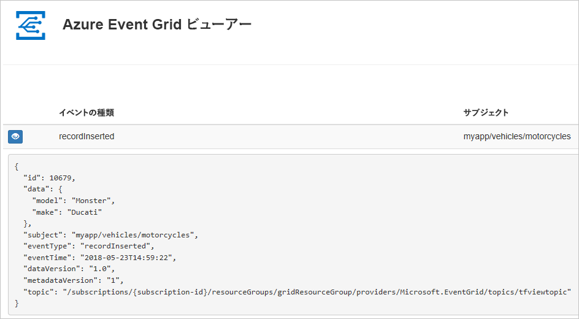
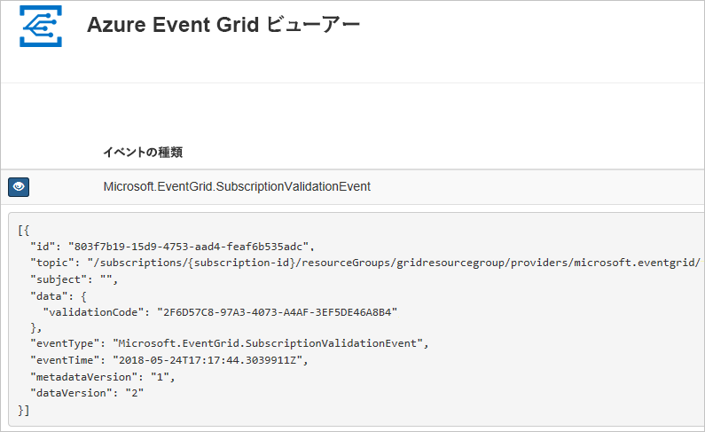

# <a name="quickstart-route-custom-events-to-web-endpoint-with-azure-cli-and-event-grid"></a>クイック スタート: Azure CLI と Event Grid を使ったカスタム イベントの Web エンドポイントへのルーティング

Azure Event Grid は、クラウドのイベント処理サービスです。 この記事では、Azure CLI からカスタム トピックを作成してカスタム トピックにサブスクライブし、イベントをトリガーして結果を表示します。 通常は、イベント データを処理し、アクションを実行するエンドポイントにイベントを送信します。 ただし、この記事では、単純化するために、メッセージを収集して表示する Web アプリにイベントを送信します。

最後に、イベント データが Web アプリに送信されたことを確認します。



[!INCLUDE [quickstarts-free-trial-note.md](../../includes/quickstarts-free-trial-note.md)]

[!INCLUDE [cloud-shell-try-it.md](../../includes/cloud-shell-try-it.md)]

CLI をローカルにインストールして使用することを選択した場合、この記事では、最新バージョンの Azure CLI (2.0.24 以降) が実行されている必要があります。 バージョンを確認するには、`az --version` を実行します。 インストールまたはアップグレードする必要がある場合は、[Azure CLI のインストール](/cli/azure/install-azure-cli)に関するページを参照してください。

Cloud Shell を使用していない場合は、先に `az login` でサインインする必要があります。

## <a name="create-a-resource-group"></a>リソース グループの作成

Event Grid のトピックは Azure リソースであり、Azure リソース グループに配置する必要があります。 リソース グループは、Azure リソースをまとめてデプロイして管理するための論理上のコレクションです。

[az group create](/cli/azure/group#az-group-create) コマンドでリソース グループを作成します。 

次の例では、*gridResourceGroup* という名前のリソース グループを *westus2* の場所に作成します。

```azurecli-interactive
az group create --name gridResourceGroup --location westus2
```

[!INCLUDE [event-grid-register-provider-cli.md](../../includes/event-grid-register-provider-cli.md)]

## <a name="create-a-custom-topic"></a>カスタム トピックの作成

Event Grid のトピックは、イベントの送信先となるユーザー定義のエンドポイントになります。 次の例では、リソース グループにカスタム トピックを作成します。 `<your-topic-name>` は、トピックの一意の名前に置き換えてください。 カスタム トピック名は、DNS エントリの一部であるため、一意である必要があります。 さらに、必ず 3 - 50 文字以内で、a - z、A - Z、0 - 9、および "-" のみを含めます。

```azurecli-interactive
topicname=<your-topic-name>

az eventgrid topic create --name $topicname -l westus2 -g gridResourceGroup
```

## <a name="create-a-message-endpoint"></a>メッセージ エンドポイントの作成

カスタム トピックをサブスクライブする前に、イベント メッセージ用のエンドポイントを作成しましょう。 通常、エンドポイントは、イベント データに基づくアクションを実行します。 このクイック スタートを簡素化するために、イベント メッセージを表示する[構築済みの Web アプリ](https://github.com/Azure-Samples/azure-event-grid-viewer)をデプロしします。 デプロイされたソリューションには、App Service プラン、App Service Web アプリ、および GitHub からのソース コードが含まれています。

`<your-site-name>` は、Web アプリの一意の名前に置き換えてください。 Web アプリ名は、DNS エントリの一部であるため、一意である必要があります。

```azurecli-interactive
sitename=<your-site-name>

az group deployment create \
  --resource-group gridResourceGroup \
  --template-uri "https://raw.githubusercontent.com/Azure-Samples/azure-event-grid-viewer/master/azuredeploy.json" \
  --parameters siteName=$sitename hostingPlanName=viewerhost
```

デプロイが完了するまでに数分かかる場合があります。 デプロイが成功した後で、Web アプリを表示して、実行されていることを確認します。 Web ブラウザーで `https://<your-site-name>.azurewebsites.net` にアクセスします

現在表示されているメッセージがないサイトが表示されます。

## <a name="subscribe-to-a-custom-topic"></a>カスタム トピックへのサブスクライブ

どのイベントを追跡し、どこにイベントを送信するかは、イベント グリッド トピックにサブスクライブすることによって Event Grid に伝えます。 次の例では、作成したカスタム トピックにサブスクライブし、Web アプリの URL をイベント通知のエンドポイントとして渡しています。

Web アプリのエンドポイントには、サフィックス `/api/updates/` が含まれている必要があります。

```azurecli-interactive
endpoint=https://$sitename.azurewebsites.net/api/updates

az eventgrid event-subscription create \
  -g gridResourceGroup \
  --topic-name $topicname \
  --name demoViewerSub \
  --endpoint $endpoint
```

Web アプリをもう一度表示し、その Web アプリにサブスクリプションの検証イベントが送信されたことに注目します。 目のアイコンを選択してイベント データを展開します。 Event Grid は検証イベントを送信するので、エンドポイントはイベント データを受信することを確認できます。 Web アプリには、サブスクリプションを検証するコードが含まれています。



## <a name="send-an-event-to-your-custom-topic"></a>カスタム トピックへのイベントの送信

イベントをトリガーして、Event Grid がメッセージをエンドポイントに配信するようすを見てみましょう。 まず、カスタム トピックの URL とキーを取得します。

```azurecli-interactive
endpoint=$(az eventgrid topic show --name $topicname -g gridResourceGroup --query "endpoint" --output tsv)
key=$(az eventgrid topic key list --name $topicname -g gridResourceGroup --query "key1" --output tsv)
```

この記事では、単純化するために、サンプル イベント データをカスタム トピックに送信します。 通常はイベント データをアプリケーションまたは Azure サービスから送信することになります。 次の例では、サンプルのイベント データを作成します。

```azurecli-interactive
event='[ {"id": "'"$RANDOM"'", "eventType": "recordInserted", "subject": "myapp/vehicles/motorcycles", "eventTime": "'`date +%Y-%m-%dT%H:%M:%S%z`'", "data":{ "make": "Ducati", "model": "Monster"},"dataVersion": "1.0"} ]'
```

JSON の `data` 要素がイベントのペイロードです。 このフィールドには、適切な形式の JSON であればどのようなものでも格納することができます。 また、高度なルーティングやフィルタリングを行う場合には、subject フィールドを使用することもできます。

CURL は、HTTP 要求を送信するユーティリティです。 この記事では、CURL を使用して、イベントをトピックに送信します。 

```azurecli-interactive
curl -X POST -H "aeg-sas-key: $key" -d "$event" $endpoint
```

以上でイベントがトリガーされ、そのメッセージが、Event Grid によってサブスクライブ時に構成したエンドポイントに送信されました。 Web アプリを表示して、送信したイベント確認します。

```json
[{
  "id": "1807",
  "eventType": "recordInserted",
  "subject": "myapp/vehicles/motorcycles",
  "eventTime": "2017-08-10T21:03:07+00:00",
  "data": {
    "make": "Ducati",
    "model": "Monster"
  },
  "dataVersion": "1.0",
  "metadataVersion": "1",
  "topic": "/subscriptions/{subscription-id}/resourceGroups/{resource-group}/providers/Microsoft.EventGrid/topics/{topic}"
}]
```

## <a name="clean-up-resources"></a>リソースのクリーンアップ
引き続きこのイベントまたはイベント ビューアー アプリを使用する場合は、この記事で作成したリソースをクリーンアップしないでください。 それ以外の場合は、次のコマンドを使用して、この記事で作成したリソースを削除します。

```azurecli-interactive
az group delete --name gridResourceGroup
```

## <a name="next-steps"></a>次の手順

トピックを作成し、イベントをサブスクライブする方法がわかったら、Event Grid でできることについて、さらに情報を収集しましょう。

- [Event Grid について](overview.md)
- [Blob Storage のイベントをカスタム Web エンドポイントにルーティングする](../storage/blobs/storage-blob-event-quickstart.md?toc=%2fazure%2fevent-grid%2ftoc.json)
- [Azure Event Grid と Logic Apps で仮想マシンの変更を監視する](monitor-virtual-machine-changes-event-grid-logic-app.md)
- [ビッグ データをデータ ウェアハウスにストリーミングする](event-grid-event-hubs-integration.md)
