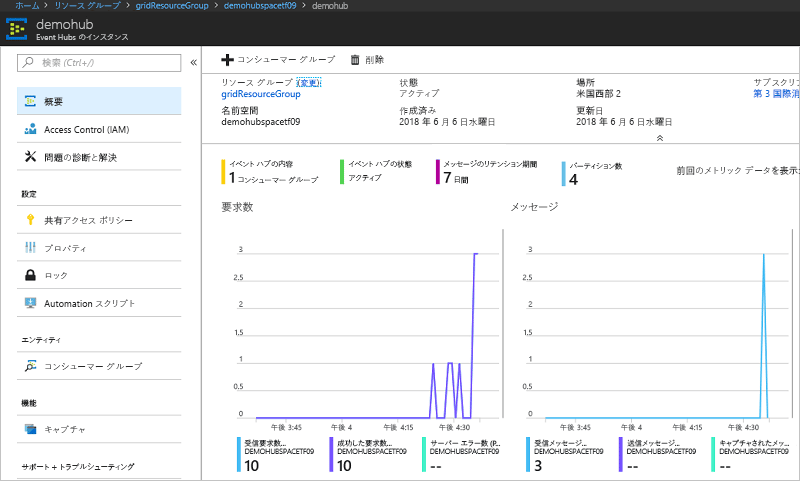

# <a name="quickstart-route-custom-events-to-azure-event-hubs-with-azure-cli-and-event-grid"></a>クイック スタート: Azure CLI と Event Grid を使用してカスタム イベントを Azure Event Hubs にルーティングする

Azure Event Grid は、クラウドのイベント処理サービスです。 Azure Event Hubs は、サポートされているイベント ハンドラーの 1 つです。 この記事では、Azure CLI からカスタム トピックを作成してカスタム トピックにサブスクライブし、イベントをトリガーして結果を表示します。 イベント ハブにイベントを送信します。

[!INCLUDE [quickstarts-free-trial-note.md](../../includes/quickstarts-free-trial-note.md)]

## <a name="create-a-resource-group"></a>リソース グループの作成

Event Grid のトピックは Azure リソースであり、Azure リソース グループに配置する必要があります。 リソース グループは、Azure リソースをまとめてデプロイして管理するための論理上のコレクションです。

[az group create](/cli/azure/group#az-group-create) コマンドでリソース グループを作成します。 

次の例では、*gridResourceGroup* という名前のリソース グループを *westus2* の場所に作成します。

```azurecli-interactive
az group create --name gridResourceGroup --location westus2
```

[!INCLUDE [event-grid-register-provider-cli.md](../../includes/event-grid-register-provider-cli.md)]

## <a name="create-a-custom-topic"></a>カスタム トピックの作成

Event Grid のトピックは、イベントの送信先となるユーザー定義のエンドポイントになります。 次の例では、リソース グループにカスタム トピックを作成します。 `<your-topic-name>` は、カスタム トピックの一意の名前に置き換えてください。 カスタム トピック名は、DNS エントリによって表されるため、一意である必要があります。

```azurecli-interactive
topicname=<your-topic-name>
az eventgrid topic create --name $topicname -l westus2 -g gridResourceGroup
```

## <a name="create-event-hub"></a>イベント ハブの作成

カスタム トピックをサブスクライブする前に、イベント メッセージ用のエンドポイントを作成しましょう。 イベントを収集するためのイベント ハブを作成します。

```azurecli-interactive
namespace=<unique-namespace-name>
hubname=demohub

az eventhubs namespace create --name $namespace --resource-group gridResourceGroup
az eventhubs eventhub create --name $hubname --namespace-name $namespace --resource-group gridResourceGroup
```

## <a name="subscribe-to-a-custom-topic"></a>カスタム トピックへのサブスクライブ

どのイベントを追跡するかは、イベント グリッド トピックにサブスクライブすることによって Event Grid に伝えます。次の例では、作成したカスタム トピックにサブスクライブし、エンドポイントのイベント ハブのリソース ID を渡します。 エンドポイントの形式は次のとおりです。

`/subscriptions/<subscription-id>/resourceGroups/<resource-group-name>/providers/Microsoft.EventHub/namespaces/<namespace-name>/eventhubs/<hub-name>`

次のスクリプトは、イベント ハブのリソース ID を取得し、イベント グリッド トピックをサブスクライブします。 エンドポイントの種類を `eventhub` に設定し、エンドポイントのイベント ハブ ID を使用します。

```azurecli-interactive
hubid=$(az eventhubs eventhub show --name $hubname --namespace-name $namespace --resource-group gridResourceGroup --query id --output tsv)

az eventgrid event-subscription create \
  --topic-name $topicname \
  -g gridResourceGroup \
  --name subtoeventhub \
  --endpoint-type eventhub \
  --endpoint $hubid
```

イベント サブスクリプションを作成するアカウントは、イベント ハブへの書き込みアクセス権を持っている必要があります。

## <a name="send-an-event-to-your-custom-topic"></a>カスタム トピックへのイベントの送信

イベントをトリガーして、Event Grid がメッセージをエンドポイントに配信するようすを見てみましょう。 まず、カスタム トピックの URL とキーを取得します。

```azurecli-interactive
endpoint=$(az eventgrid topic show --name $topicname -g gridResourceGroup --query "endpoint" --output tsv)
key=$(az eventgrid topic key list --name $topicname -g gridResourceGroup --query "key1" --output tsv)
```

この記事では、単純化するために、サンプル イベント データをカスタム トピックに送信します。 通常はイベント データをアプリケーションまたは Azure サービスから送信することになります。 CURL は、HTTP 要求を送信するユーティリティです。 この記事では、CURL を使用して、イベントをカスタム トピックに送信します。  次の例では、3 つのイベントをイベント グリッド トピックに送信します。

```azurecli-interactive
for i in 1 2 3
do
   event='[ {"id": "'"$RANDOM"'", "eventType": "recordInserted", "subject": "myapp/vehicles/motorcycles", "eventTime": "'`date +%Y-%m-%dT%H:%M:%S%z`'", "data":{ "make": "Ducati", "model": "Monster"},"dataVersion": "1.0"} ]'
   curl -X POST -H "aeg-sas-key: $key" -d "$event" $endpoint
done
```

ポータルでイベント ハブに移動し、Event Grid によって 3 つのイベントがイベント ハブに送信されたことを確認します。



通常は、イベント ハブからイベントを取得するアプリケーションを作成します。 イベント ハブからメッセージを取得するアプリケーションを作成するには、以下を参照してください。

* .[NET Standard で イベント プロセッサ ホストを使用したメッセージ受信を開始する](../event-hubs/event-hubs-dotnet-standard-getstarted-receive-eph.md)
* [Java を使用して Azure Event Hubs からイベントを受信する](../event-hubs/event-hubs-java-get-started-receive-eph.md)
* [Apache Storm を使用して Azure Event Hubs からイベントを受信する](../event-hubs/event-hubs-storm-getstarted-receive.md)

## <a name="clean-up-resources"></a>リソースのクリーンアップ
引き続きこのイベントを使用する場合は、この記事で作成したリソースをクリーンアップしないでください。 それ以外の場合は、次のコマンドを使用して、この記事で作成したリソースを削除します。

```azurecli-interactive
az group delete --name gridResourceGroup
```

## <a name="next-steps"></a>次の手順

トピックを作成し、イベントをサブスクライブする方法がわかったら、Event Grid でできることについて、さらに情報を収集しましょう。

- [Event Grid について](overview.md)
- [Blob Storage のイベントをカスタム Web エンドポイントにルーティングする](../storage/blobs/storage-blob-event-quickstart.md?toc=%2fazure%2fevent-grid%2ftoc.json)
- [Azure Event Grid と Logic Apps で仮想マシンの変更を監視する](monitor-virtual-machine-changes-event-grid-logic-app.md)
- [ビッグ データをデータ ウェアハウスにストリーミングする](event-grid-event-hubs-integration.md)
