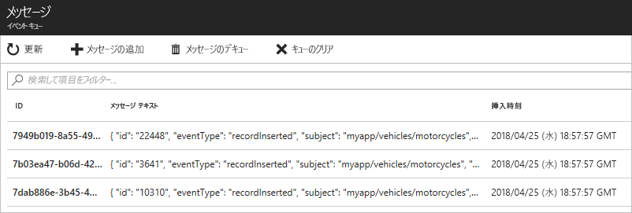

# <a name="quickstart-route-custom-events-to-azure-queue-storage-with-azure-cli-and-event-grid"></a>クイック スタート:Azure CLI と Event Grid を使ってカスタム イベントを Azure Queue Storage にルーティングする

Azure Event Grid は、クラウドのイベント処理サービスです。 Azure Queue Storage は、サポートされているイベント ハンドラーの 1 つです。 この記事では、Azure CLI からカスタム トピックを作成してカスタム トピックにサブスクライブし、イベントをトリガーして結果を表示します。 イベントを Queue Storage に送信します。

[!INCLUDE [quickstarts-free-trial-note.md](../../includes/quickstarts-free-trial-note.md)]

[!INCLUDE [cloud-shell-try-it.md](../../includes/cloud-shell-try-it.md)]

Azure portal で Cloud Shell を使用する代わりに、ローカル コンピューターで Azure CLI または Azure PowerShell を使用している場合は、Azure CLI と Azure PowerShell が以下のバージョンであることを確認してください。 

- Azure CLI バージョン 2.0.56 以降。 Azure CLI の最新バージョンをインストールする手順については、「[Azure CLI のインストール](/cli/azure/install-azure-cli)」を参照してください。 
- Azure PowerShell バージョン 1.1.0 以降。 [Azure のダウンロード - コマンド ライン ツール](https://azure.microsoft.com/downloads/)に関するページから Windows マシンに、Azure PowerShell の最新バージョンをダウンロードします。 

この記事では、Azure CLI を使用するためのコマンドについて説明します。 

## <a name="create-a-resource-group"></a>リソース グループを作成する

Event Grid のトピックは Azure リソースであり、Azure リソース グループに配置する必要があります。 リソース グループは、Azure リソースをまとめてデプロイして管理するための論理上のコレクションです。

[az group create](/cli/azure/group#az-group-create) コマンドを使用して、リソース グループを作成します。 

次の例では、*gridResourceGroup* という名前のリソース グループを *westus2* の場所に作成します。

```azurecli-interactive
az group create --name gridResourceGroup --location westus2
```

[!INCLUDE [event-grid-register-provider-cli.md](../../includes/event-grid-register-provider-cli.md)]

## <a name="create-a-custom-topic"></a>カスタム トピックの作成

Event Grid のトピックは、イベントの送信先となるユーザー定義のエンドポイントになります。 次の例では、リソース グループにカスタム トピックを作成します。 `<topic_name>` は、カスタム トピックの一意の名前に置き換えてください。 イベント グリッド トピック名は、DNS エントリによって表されるため、一意である必要があります。

```azurecli-interactive
az eventgrid topic create --name <topic_name> -l westus2 -g gridResourceGroup
```

## <a name="create-queue-storage"></a>キュー ストレージを作成する

カスタム トピックをサブスクライブする前に、イベント メッセージ用のエンドポイントを作成しましょう。 イベントを収集するためのキュー ストレージを作成します。

```azurecli-interactive
storagename="<unique-storage-name>"
queuename="eventqueue"

az storage account create -n $storagename -g gridResourceGroup -l westus2 --sku Standard_LRS
az storage queue create --name $queuename --account-name $storagename
```

## <a name="subscribe-to-a-custom-topic"></a>カスタム トピックへのサブスクライブ

どのイベントを追跡するかは、カスタム トピックをサブスクライブすることによって Event Grid に伝えます。次の例では、作成したカスタム トピックをサブスクライブし、エンドポイントのキュー ストレージのリソース ID を渡します。 Azure CLI では、エンドポイントとしてキュー ストレージの ID を渡します。 エンドポイントの形式は次のとおりです。

`/subscriptions/<subscription-id>/resourcegroups/<resource-group-name>/providers/Microsoft.Storage/storageAccounts/<storage-name>/queueservices/default/queues/<queue-name>`

次のスクリプトは、キューのストレージ アカウントのリソース ID を取得します。 キュー ストレージの ID を作成して、イベント グリッドのトピックをサブスクライブします。 エンドポイントの種類を `storagequeue` に設定し、エンドポイントのキュー ID を使います。

```azurecli-interactive
storageid=$(az storage account show --name $storagename --resource-group gridResourceGroup --query id --output tsv)
queueid="$storageid/queueservices/default/queues/$queuename"
topicid=$(az eventgrid topic show --name <topic_name> -g gridResourceGroup --query id --output tsv)

az eventgrid event-subscription create \
  --source-resource-id $topicid \
  --name <event_subscription_name> \
  --endpoint-type storagequeue \
  --endpoint $queueid \
  --expiration-date "<yyyy-mm-dd>"
```

イベント サブスクリプションを作成するアカウントは、キュー ストレージへの書き込みアクセス権を持っている必要があります。 サブスクリプションに[有効期限の日付](concepts.md#event-subscription-expiration)が設定されていることに注意してください。

サブスクリプションの作成に REST API を使用する場合には、ストレージ アカウントの ID とキューの名前をそれぞれ別個のパラメーターとして渡します。

```json
"destination": {
  "endpointType": "storagequeue",
  "properties": {
    "queueName":"eventqueue",
    "resourceId": "/subscriptions/<subscription-id>/resourcegroups/<resource-group-name>/providers/Microsoft.Storage/storageAccounts/<storage-name>"
  }
  ...
```

## <a name="send-an-event-to-your-custom-topic"></a>カスタム トピックへのイベントの送信

イベントをトリガーして、Event Grid がメッセージをエンドポイントに配信するようすを見てみましょう。 まず、カスタム トピックの URL とキーを取得します。 もう一度、`<topic_name>` に実際のカスタム トピック名を使用します。

```azurecli-interactive
endpoint=$(az eventgrid topic show --name <topic_name> -g gridResourceGroup --query "endpoint" --output tsv)
key=$(az eventgrid topic key list --name <topic_name> -g gridResourceGroup --query "key1" --output tsv)
```

この記事では、単純化するために、サンプル イベント データをカスタム トピックに送信します。 通常はイベント データをアプリケーションまたは Azure サービスから送信することになります。 CURL は、HTTP 要求を送信するユーティリティです。 この記事では、CURL を使用して、イベントをカスタム トピックに送信します。  次の例では、3 つのイベントをイベント グリッド トピックに送信します。

```azurecli-interactive
for i in 1 2 3
do
   event='[ {"id": "'"$RANDOM"'", "eventType": "recordInserted", "subject": "myapp/vehicles/motorcycles", "eventTime": "'`date +%Y-%m-%dT%H:%M:%S%z`'", "data":{ "make": "Ducati", "model": "Monster"},"dataVersion": "1.0"} ]'
   curl -X POST -H "aeg-sas-key: $key" -d "$event" $endpoint
done
```

ポータルでキュー ストレージに移動し、イベント グリッドがキューにこれら 3 つのイベントを送信したことを確認します。




## <a name="clean-up-resources"></a>リソースをクリーンアップする
引き続きこのイベントを使用する場合は、この記事で作成したリソースをクリーンアップしないでください。 それ以外の場合は、次のコマンドを使用して、この記事で作成したリソースを削除します。

```azurecli-interactive
az group delete --name gridResourceGroup
```

## <a name="next-steps"></a>次のステップ

トピックを作成し、イベントをサブスクライブする方法がわかったら、Event Grid でできることについて、さらに情報を収集しましょう。

- [Event Grid について](overview.md)
- [Blob Storage のイベントをカスタム Web エンドポイントにルーティングする](../storage/blobs/storage-blob-event-quickstart.md?toc=%2fazure%2fevent-grid%2ftoc.json)
- [Azure Event Grid と Logic Apps で仮想マシンの変更を監視する](monitor-virtual-machine-changes-event-grid-logic-app.md)
- [ビッグ データをデータ ウェアハウスにストリーミングする](event-grid-event-hubs-integration.md)
