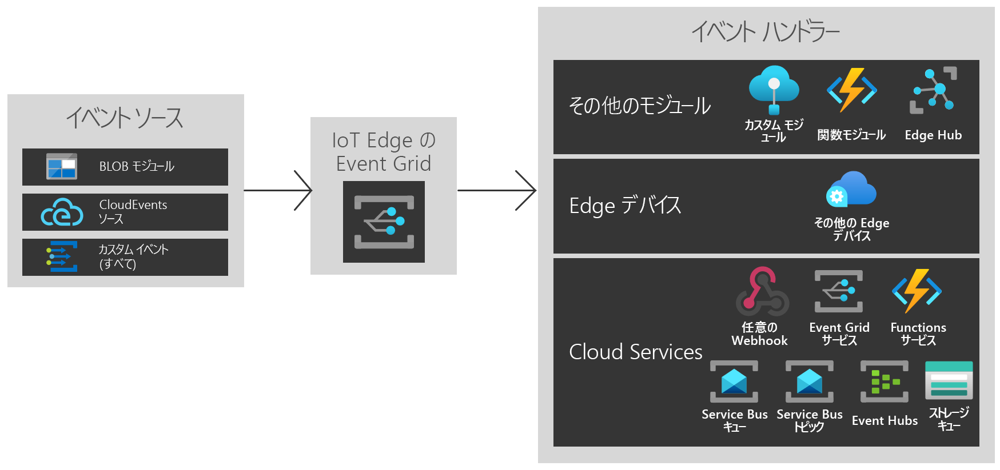

# Azure IoT Edge の Azure Event Grid とは
IoT Edge の Event Grid は、エッジに Azure Event Grid の力と柔軟性をもたらします。 トピックを作成し、イベントを発行して、複数の送信先をサブスクライブします。送信先が同じデバイス上のモジュールか、他のエッジ デバイスか、クラウド内のサービスかは問いません。

クラウドと同様に、IoT Edge モジュールの Event Grid は、大規模なイベントのルーティング、フィルター処理、および信頼性の高い配信を行います。 文字列、数値、およびブール値による高度なフィルターを使用してイベントをフィルター処理し、さまざまなイベント ハンドラーに関連するイベントのみを送信します。 再試行ロジックにより、送信先が発行時に使用できない場合でも、イベントが到着することを保証します。 これにより、IoT Edge の Event Grid を強力なストア アンド フォワード メカニズムとして使用できるようになります。

IoT Edge の Event Grid では、CloudEvents v1.0 とカスタム イベント スキーマの両方がサポートされます。 また、相互運用を容易にするために、クラウドの Event Grid と同じ発行とサブスクライブのセマンティクスもサポートしています。

この記事では、IoT Edge の Azure Event Grid の概要を示します。 エッジでこのモジュールを使用する手順の詳細については、[ローカルでイベントを発行およびサブスクライブする方法に関する記事](pub-sub-events-webhook-local.md)を参照してください。 

このイメージは、IoT Edge の Event Grid を使用するいくつかの方法を示していますが、サポートされている機能の包括的な一覧ではありません。

## IoT Edge の Event Grid を使用する局面

Event Grid on IoT Edge は、エッジとクラウドとの間に、使いやすく信頼性の高いイベント モデルを実現します。

IoT Edge の Event Grid は、Azure クラウド サービスと同等のランタイム領域を使用して構築されているので、必要なときに同じイベントと API 呼び出しを使用できます。 クラウド、エッジ、またはその 2 者の間のどれで pub/sub を実行する場合でも、IoT Edge の Event Grid は 1 つの中心ソリューションになることができます。

IoT Edge の Event Grid を使用すると、モジュール間で単純なワークフローをトリガーできます。 たとえば、トピックを作成し、ストレージ モジュールからトピックに「storage blob created」イベントを発行します。 1 つまたは複数の関数またはカスタム モジュールがこのトピックをサブスクライブできるようになっています。

エッジ デバイス間で機能を拡張します。 Blob モジュール イベントを発行しており、近くにある複数のエッジ デバイスの計算能力を使用したい場合は、クロスデバイス サブスクリプションを作成します。

最後に、クラウドに接続します。 Blob モジュール イベントを定期的にクラウドに同期させる場合は、クラウドで使用可能な大規模コンピューティング能力を使用します。または、処理済みのデータを送信し、追加のクラウド サービス サブスクリプションを作成します。

IoT Edge の Event Grid は、柔軟で信頼性の高い分離されたイベント アーキテクチャを提供します。

## イベント ソース

クラウドの場合と同様に、IoT Edge の Event Grid を使用すると、モジュール間の直接的な統合によって、イベント ドリブン アーキテクチャを構築できます。 現時点では、以下からのイベントを IoT Edge の Event Grid に送信できます。

* IoT Edge 上の Azure Blob Storage
* CloudEvents ソース
* HTTP POST を使用したカスタム モジュールおよびコンテナー

## イベント ハンドラー

IoT Edge の Event Grid は、任意の場所にイベントを送信するように構築されています。 現時点では、次の格納先がサポートされています。

* IoT Hub、関数、カスタム モジュールを含む他のモジュール
* 他のエッジ デバイス
* WebHook
* Azure Event Grid クラウド サービス
* Event Hubs
* Service Bus キュー
* Service Bus トピック
* Storage キュー

## サポートされている環境
現時点では、Windows 64 ビット、Linux 64 ビット、および ARM 32 ビット環境がサポートされています。

## 概念

Azure Event Grid には、作業開始にあたり理解する必要がある、5 つの概念があります。

* **イベント** — 発生内容
* **イベント ソース** — イベントの発生元
* **トピック** — 発行元がイベントを送信するエンドポイント
* **イベント サブスクリプション** — イベントを (ときには複数のハンドラーに) ルーティングするエンドポイントまたは組み込みメカニズム。 サブスクリプションは、受信イベントをインテリジェントにフィルター処理するために、ハンドラーによっても使用されます。
* **イベント ハンドラー** — イベントに反応するアプリまたはサービス

## コスト

パブリック プレビュー期間中は、IoT Edge の Event Grid は無料です。

## 発行
IoT Edge の Event Grid の使用に関する問題は、[https://github.com/Azure/event-grid-iot-edge/issues](https://github.com/Azure/event-grid-iot-edge/issues) で報告します。

## 次のステップ

* [ローカルでイベントを発行してサブスクライブする](pub-sub-events-webhook-local.md)
* [クラウドでイベントを発行してサブスクライブする](pub-sub-events-webhook-cloud.md)
* [イベントを Event Grid クラウドに転送する](forward-events-event-grid-cloud.md)
* [イベントを IoTHub に転送する](forward-events-iothub.md)
* [Blob Storage のイベントにローカルで対応する](react-blob-storage-events-locally.md)